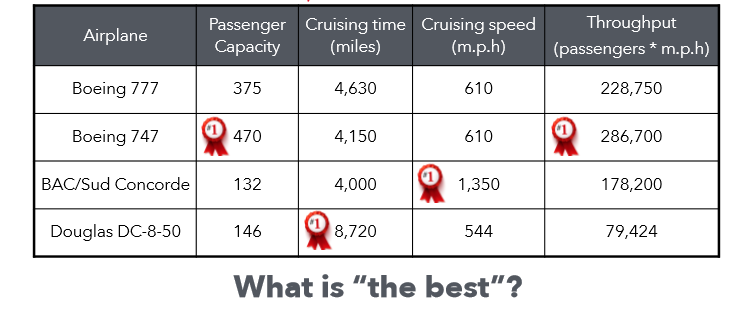
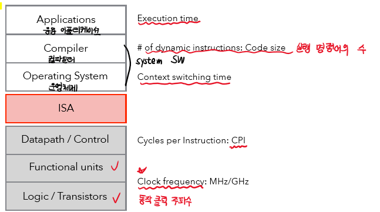
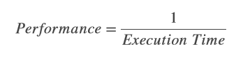
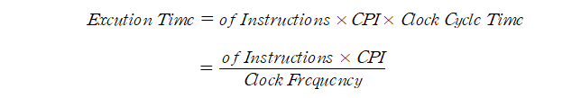
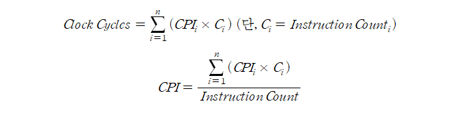
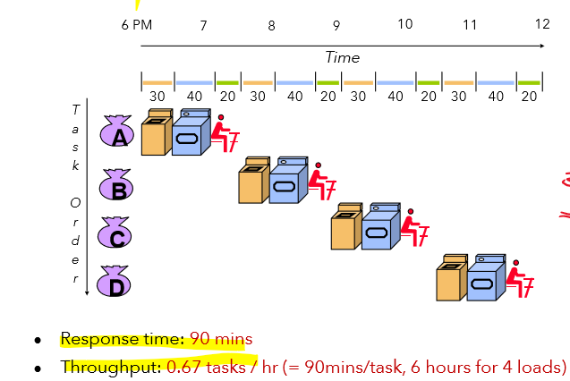
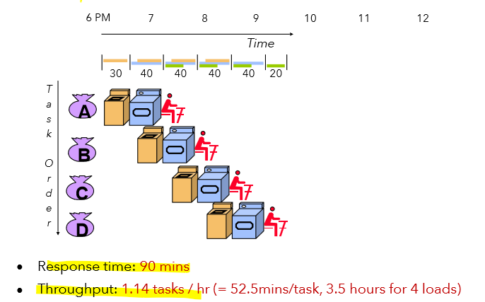
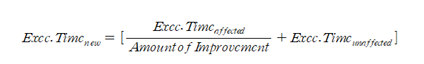
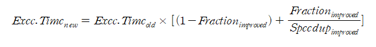

# Computer Architecture Overview

 

## Performance Metrics

 

컴퓨터 성능을 측정하는 것에 있어, 다양한 지표가 존재한다. 성능을 어떻게 정의내리느냐에 따라 차이가 나타나기도 한다. 컴퓨터 성능의 정의에 관한 것을 살펴보면,

 

> There are many ways to define something as "**the best**"  

 

즉, 어떠한 기준을 잡느냐에 따라 최고의 성능을 낸다고 판단할 수 있다는 의미이다.

 

</img>

 

항공기의 예시로, 승객 수용량에 따라, 비행 시간에 따라, 속도에 따라, throughput에 따라, 여러 기준에 따라 성능이 최고인 것이 판가름 나는 것과 동일하게 컴퓨터의 성능 또한 마찬가지이다. 

 

컴퓨터의 경우 프로세서 성능이 뛰어난 것을 기준으로 잡는지 혹은 메모리 크기를 기준으로 잡는지 **각기 다르게 성능을 평가**할 수 있다. 무조건 최고로 하면 되지 않느냐고 물어볼 수 있지만, **가격과 성능을 생각한 절충안을 고려**해야 한다.

 

성능을 평가하는 것은 매우 중요한 일이다. 컴퓨터를 구매하는 고객에게도 중요하고, 새로운 기술을 개발하여 전작과 성능을 비교하는 개발자, 소프트웨어를 개발하는 개발자 등 많은 사람이 필요로 한다. 이렇게 성능을 평가하는 것에 있어서 여러 가지 지표가 있다.

 

</img>

 

아래의 하드웨어 영역에서 위의 소프트웨어 영역까지 여러 가지 지표가 있는데 ISA를 설명하기 이전이기 때문에 하드웨어 부분의 지표에 관하여 먼저 설명한다. 여기 나온 지표들은 보통 **시간과 관련**이 있다. **시간이 짧게 소요되면 더 빠르게 실행할 수 있고 성능이 좋다는 것으로 이해**한다.

  

## CPU execution time

 

**Wall-clock time**이란, 특정한 작업을 수행하는데 소요된 실제 시간이다. 하지만 이는 성능 평가에 적합하지 않는데, 그 이유로는 **CPU execution time** **이외에 다른 프로그램들도 포함하기 때문에 우리가 원하는 특정 작업에 대한 성능 평가가 어렵기 때문**이다.

 

**CPU execution time**은 특정한 작업을 할 때 CPU가 소요한 시간을 의미하고 Wall-clock time과는 다르게 **불필요한 작업을 배제해서 우리가 원하는 특정 작업에 대한 성능 평가를 정확하게 수행**할 수 있다. CPU 성능은 실행시간과 밀접한 연관이 있다. 실행시간이 짧다는 것이 성능이 좋다는 것이므로 아래와 같은 식이 나온다.

 

</img>

 

CPU execution time을 알기 위해 **CPU Clock**을 알아야 한다. CPU Clock은 CPU에서 0과 1의 전기적인 신호를 보내는 신호인데, 0 -> 1 -> 0에서 0 -> 1 한 번의 사이클이 바로 **Clock cycle**이다. 하나의 상승 에지에서 다음의 상승 에지까지 걸리는 시간을 정확하게는 **Clock cycle time**이라고 한다. Clock frequency는 Clock cycle time 역수이다. 클록을 사용하는 이유는, **하드웨어에서 동기화할 수 있는 기준신호를 준다면 회로 내부의 다른 회로들이 클록에 맞추어 동기화를 하여 더 뛰어난 성능을 내기 때문**이다.

 

즉, 빠르게 작동하여 실행시간이 짧아지면 성능이 좋아진다는 뜻이다. 그러면 클록을 매우 빠르게 하면 성능이 좋아지기야 하겠지만 다른 회로들이 클록의 신호를 못 따라가게 된다. 이러한 이유 때문에 최대 출력 주파수가 존재하는 것이다. 조합회로의 내부에 여러 개의 경로 중 가장 긴 경로를 critical path라고 하는데 이것이 clock cycle time을 결정한다. 따라서, 아래와 같은 실행시간 식이 나오게 된다.

 

</img>

 

그러나, 실행시간을 가지고 성능 평가를 하는 것은 최대 출력 주파수와 클럭 주파수의 관계 때문에 부족함이 있다. 예를 들어, 노트북이 돌아가면서 우웅~ 소리를 내며 발열이 심해지면, 최대 출력 주파수보다 좀 낮게 동작 클럭 주파수를 설정해서 온도를 조절하는 경우가 있다. 그렇기 때문에 항상 일정한 값을 가지는 것이 아니라 실행시간이라고 딱 말하기에는 부족한 부분이 있다. 그래서 새로운 지표를 제시한 것이 바로 **CPI**이다.

  

## CPI – Cycles Per Instruction

 

**CPI**는 명령어 하나를 수행하는데 필요한 클록 사이클의 수를 뜻한다. ( **IPC**는 하나의 클록 사이클이 수행할 수 있는 명령어의 수를 뜻한다. ) CPI에서 클록 사이클의 수는 평균값을 사용한다. CPI에도 여러 가지 단점이 있는데, 프로세서에 의해서만 결정되는 것이 아니라 메모리, 버스 등을 신경 쓰는 것이고 평균값을 사용하는 것에 있어서 생기는 왜곡 등이 있다.

 

성능을 증가시키려면 클록 주파수를 늘려서 ( 클록 사이클 시간을 줄여서 ) 하는 방법이 있고 CPI 수를 줄이는 ( 명령어 수를 줄이는 ) 방법이 있다. 그래서 아래와 같은 식이 나온다.

 

</img>

 

위에서 언급한 CPI의 단점 중 평균값을 사용한다는 것이 있었다. 이게 무슨 말이냐 하면 명령어 연산에서 산술연산과 논리연산 등 여러 가지 연산이 있는데 이 **연산마다 처리 속도가 달라서 평균을 사용하면 왜곡이 생기는 것**이다. 이를 해결하는 방법이 각각의 명령어에 계산을 수행하는 **instruction mix** 방법이다.

 

</img>

  

## MIPS – Million Instructions Per Second, MFLOPS

 

다음으로 컴퓨터 성능에 관련된 지표로는 **MIPS**이다. MIPS 이전에 GIPS가 있었는데, GIPS는 성능이 좋아질수록 값이 작아져서 직관적이지 못해 MIPS로 대체되었다. (값이 크면 성능이 좋다는 것이 아무래도 직관적이니까) MIPS는 성능이 좋을수록 값이 커져서 직관적이다. 하지만 이 역시 **명령어 수나 프로그램 간 다양성 때문에 문제점이 있다**.

 

또다른 지표인 **MFLOPS**는 Floating-point 관련 지표이다.

  

## 컴퓨터 성능 측정 방법

 

지표가 아닌 **성능을 측정하는 방법**에 보통 쓰이는 것에 **Response time**과 **Throughput**이 있다. 일의 시작부터 끝까지 걸리는 시간이 응답시간이고 주어진 시간 안에 얼마나 많은 일을 수행하냐는 게 Throughput이다. Throughput을 조금 더 간단하게 설명하면 단위 시간 당 일 처리량이다.

 

Response time과 Throughput을 알아볼 때 **순차적인 처리 방법** **Sequential**과 **공장에서 찍어내는 듯한 Pipelined 방법**이 있다. 순차적으로 일을 처리하면 놀고 있는 자원이 생겨서 throughput이 낮아진다. 놀고 있는 자원이 발생하지 않게 Pipelined 방식으로 하면 총 시간이 단축되면서 throughput이 높아진다.

 

</img>

 

</img>

 

마지막으로, 위와 같은 것을 컴퓨터에서 측정할 때 **Benchmark**를 이용한다. 측정하고자 원하는 성능을 타겟팅하여 벤치마크를 이용한다. 어떤 것을 측정할지 확실하게 정하고 벤치마크 프로그램을 이해하며 다양하고 적절한 지표를 사용하여 올바르게 이용해야 한다.

  

## Amdahl’s law

 

**암달의 법칙**(Amdahl's law)은 **암달의 저주**로도 불리며 컴퓨터 시스템의 일부를 개선할 때 **전체적으로** 얼마만큼의 최대 성능 향상이 있는지 계산하는 데 사용된다. 즉, 실행시간을 계산할 때 전체적인 시간에서 **영향을 받은 시간**과 **영향을 받지 않은 시간**을 나누어서 이해해야 한다는 것이다.

 

</img>

 

</img>

  

## 마지막 이야기

 

현실에서 기술의 발달은 공학적인 관점 말고 **상업적인 관점**에서도 매우 중요하다.  처음에 나온 혁신적인 제품은 가격이 매우 비싸지만 생산 공정이 발달하면서 가격이 점점 싸지기도 하고 시장과의 이해관계도 맞아야 한다.

 

현재, 나노 공정에서 TSMC사와 삼성전자가 힘 겨루기를 하고 있는데 만약 생산 공정에서 1nm 이하의 영역으로 가게 되면 Quantum 영역으로 가기 때문에 우리가 알던 기존의 상식이 모두 깨질 수도 있다.

 

하지만, 아직 그러한 시대가 완벽하게 도래한 것은 아니기도 하고 과거의 역사를 잊지 않고 그를 알아야 더 나아갈 수 있기 때문에 성능에 관한 여러 지표들, 측정에 관한 방법들을 한 번 쯤은 알아야 할 필요가 있다.