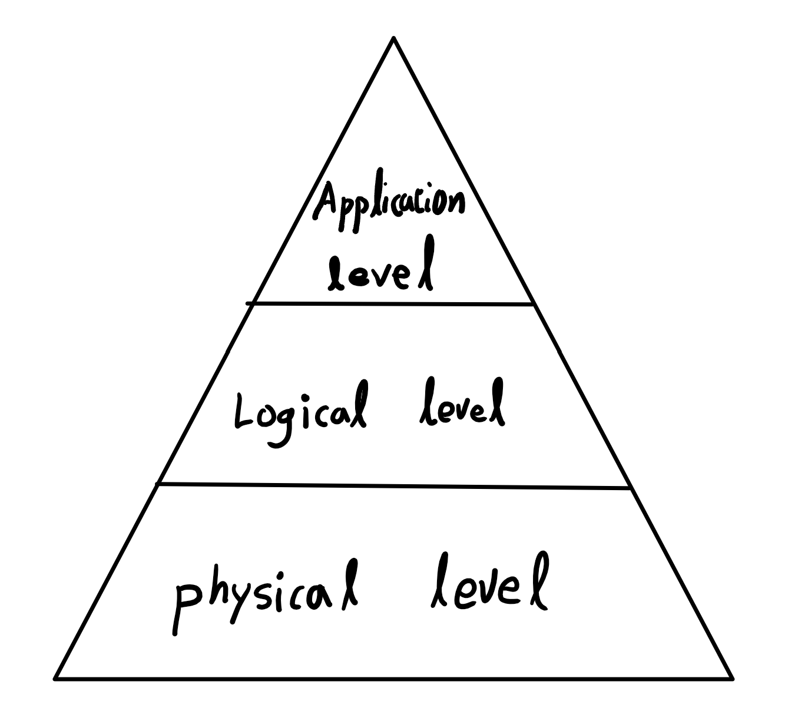
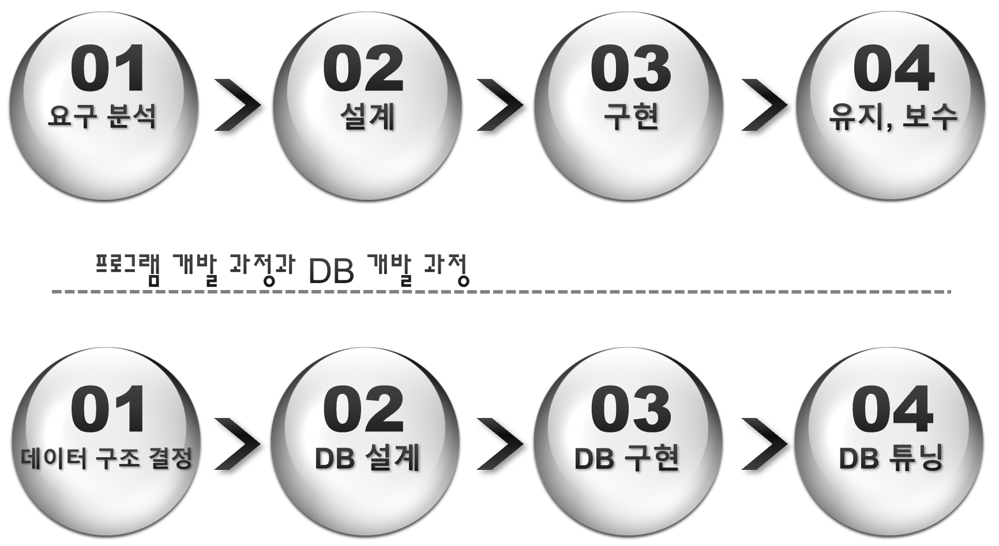
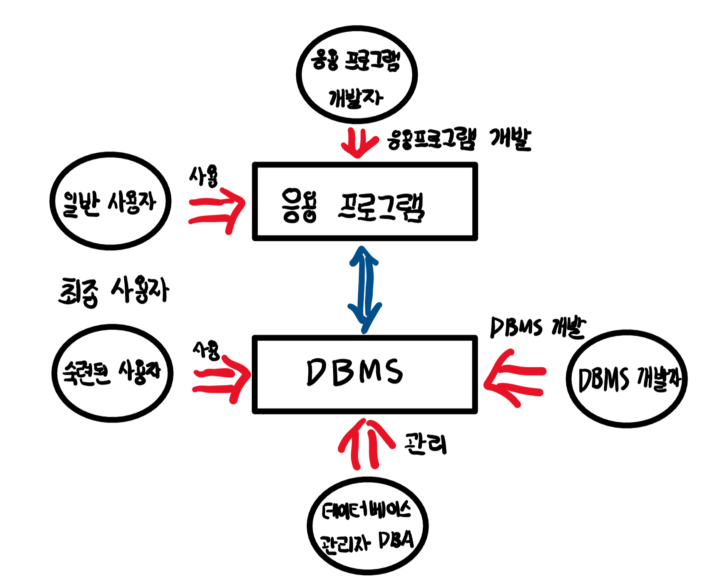
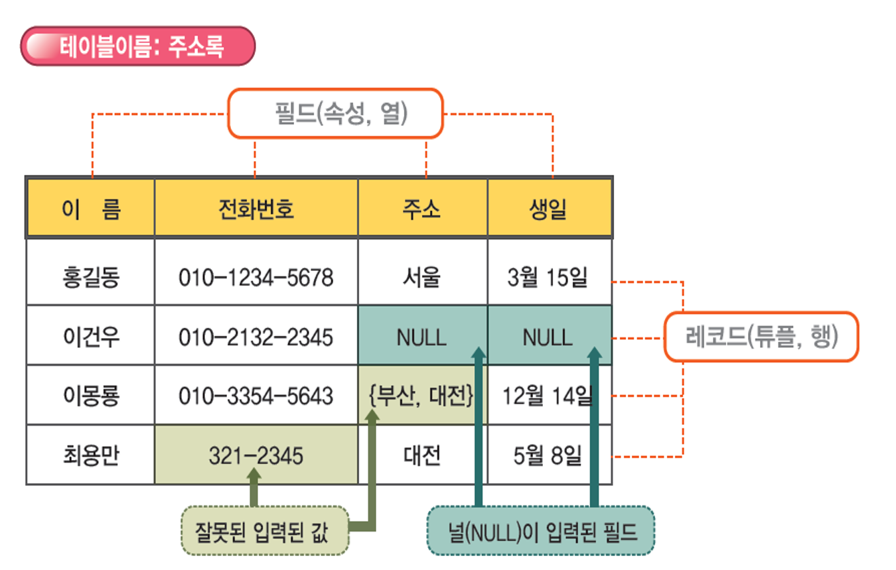
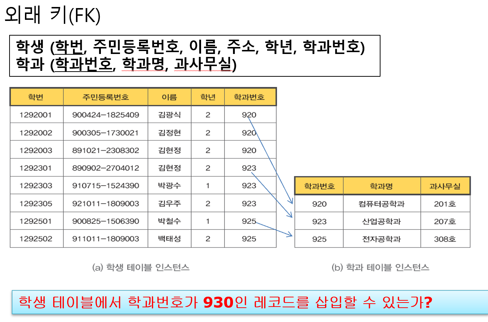
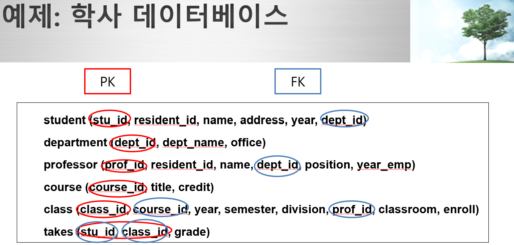
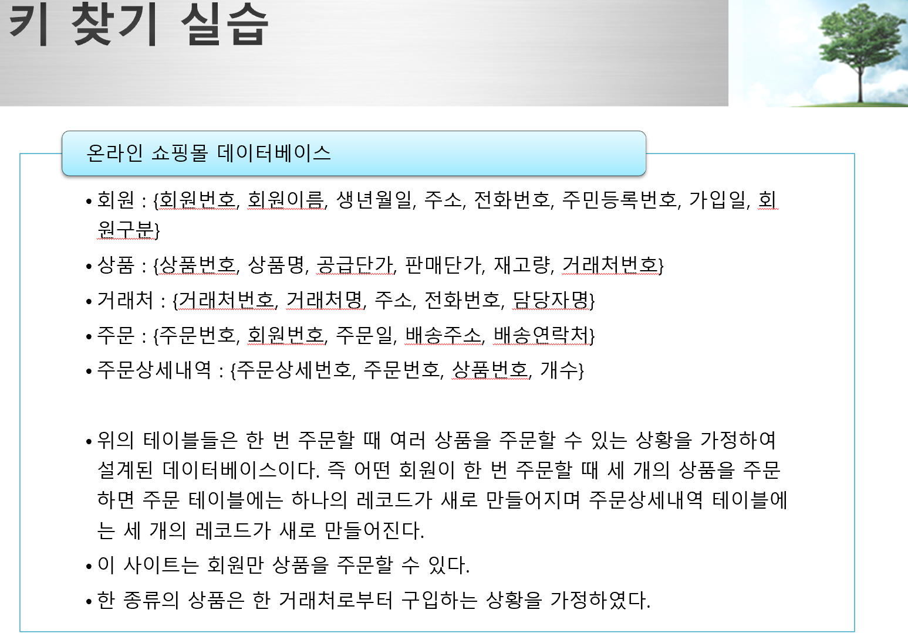

# 2022.03.15(화) - 1강

 

## Database basic

  

### Database란 무엇인가 ?

 

Database는 자료(데이터)를 많이 모아둔 것을 의미한다. Database의 주된 관심사는 아주 많은 데이터를 얼마나 효율적으로 처리하는 가를 의미하는데, 이때 효율에는 **시간효율**과 **공간효율**이 있다.

 

> 알고리즘에서 자주 사용하는 용어인데, 시간효율은 주어진 시간이 무한하지 않기  때문에, 얼마나 시간을 단축시켜서 효율적으로 사용함에 있고, 공간효율은 같은 공간을 사용함(ex. 컴퓨터의 메모리)에 있어서 공간을 작게 사용하느냐에 따른다.

  

### DBMS란 무엇인가 ?

 

DBMS(Database Management System)은 database를 수월하게 관리하기 위하여 Application program 레벨에서 구현해낸 것이다. Database가 마치 저장되어 있는 것처럼 보여주는 프로그램이다. 따라서, DBMS는 database의 종류가 아니라 어플리케이션 프로그램이다. 유명한 프로그램으로는 오라클db, Mysql, MS-SQL, Access, 큐브리드, 멀티베이스 등이 있다.

  

### Database와 DBMS

 

</img>

 

    1. Physical Level
        
    물리적인 단계로, 실제로 OS에서 데이터를 관리하는 형태이다. 
    File System을 생각하면 된다.

    2. Logical Level

    사용자에게 DB와 같은 형태를 보여주고 데이터는 파일 형태로 관리하는 단계이다. 대표적으로 DBMS를 생각하면 된다.

    3. Application Level (View level)

    SQL 언어를 이용하여 데이터를 검색, 입력, 수정, 삭제 등과 같은 작업을 하여 database를 제어한다. 이러한 행위를 통해 사용자가 database를 다루고 있다고 생각하게 한다.

  

## 프로그램 개발 과정과 DB 개발 과정

 

프로그램을 개발하는 과정과 DB 개발하는 과정에 있어서 폭포수 모델을 생각하여 살펴보겠다.

 

</img>

 

01. 요구 분석
    - 프로그램이 원하는 바가 무엇인지
    - 데이터 구조 결정

 

02. 설계
    - 프로그램을 설계
    - DB 설계

 

03. 구현
    - 코딩해서 프로그램 구현
    - DB 구현

 

04. 유지, 보수
    - 프로그램이 지속되도록 유지, 보수
    - DB 튜닝

  

## File System의 단점들과 DB

 

파일 시스템은 파일(데이터의 모임)을 저장 장치에 저장하고 사용하기 위한 일종의 규칙이나 체계이다. 파일의 기본적인 구성요소는 순차적인 레코드들이며, 레코드는 파일을 다룰 때 실제로 읽고 쓰는 단위로서 사용되는 데이터 단위를 의미한다.

 

파일 시스템에서는 파일에 접근하는 방식이 응용 프로그램 내에 표현되므로 응용 프로그램과 데이터 간의 의존관계가 존재하게 되어 데이터의 구조, 접근 방법이 변경되면 기존의 프로그램과 데이터를 함께 변경해야만 한다.

 

즉, 데이터 정의가 응용 프로그램에 내포되어 있다는 의미이다. 또, 프로그램에서 데이터를 접근하고 조작하는 것 이외에 별도의 제어가 없다는 것이 있다. 이러한 요인으로 인해 여러 단점을 발생시킨다.

[ 출처 : [추가적인 참고 자료](https://blog.naver.com/qbxlvnf11/221127762091) ]

 

1. Data Redundancy(데이터 중복 문제), 이로 인한 Data inconsistency(데이터 불일치 문제)    

    File system에서는 동일한 파일을 분배하여 여러 곳에서 사용하게 되었을 때, 각자 그 파일을 수정하게 되면 동일한 데이터가 다 다르게 표시되는 문제가 발생

     

    병행 제어에서 데이터 불일치 문제가 발생할 수 있음. (ex. 예약 시스템) 해결 방법으로는 Lock을 걸어버리는 것이다. 파일에 Lock을 걸어버리는 방법은 읽기 전용으로만 열리게 하는 것이다.

     

    파일 단위로 Lock을 걸어버리면 전체에 Lock이 걸리는 것이니까 조금 불편할 수 있다. 이것을 DBMS는 테이블 단위, 레코드 단위로 Lock을 걸어버릴 수 있다. 그렇기에 효율적으로 파일에 관한 작업이 가능해서 File System 보다 DBMS가 훨씬 낫다.

 

2. Data Processing   

    File system input/output을 생각해보면 파일의 위치나 고려해야할 것이 많지만, Database는 SQL 언어만 알고 있으면 된다. 따라서 DB가 더 낫다.

 

3. Data integrity (데이터 무결성)   

    File System은 데이터가 잘못되어서 작업을 못하게 막는 행위는 프로그램 단위로 이루어진다. 파일 내의 데이터가 만족시켜야 하는 무결성 제약조건들을 명시하려면 프로그래머가 직접 프로그래밍 언어를 사용하여 일일이 프로그램에 표현해야 하므로 데이터 무결성을 유지하기가 어려움. 그러나, Database는 제약조건을 걸어서 잘못된 데이터가 들어가는 것을 막아버린다. 제약조건에 속성을 줄 수도 있다.

 

4. Atomicity (원자성)   

    더이상 일을 쪼개지 않는 것이다. Database에서는 트랜잭션(transaction)의 개념을 사용하여 atomicity를 유지한다. 하나의 트랜잭션으로 묶어 놓으면 데이터 전송과정에 있어서 그 데이터는 모두 전송되거나 모두 취소되거나 둘 중 하나이다.

     

    예를 들어, 계좌 이체, 좌석 변경과 같이 처리 작업은 여러 가지이지만 일은 하나인 경우를 의미한다.

     

5. Concurrency Control (동시 병행 제어)   

    동시에 여러 가지 일이 하나의 데이터에 대해 이루어 질 때, 데이터 불일치가 발생할 가능성이 있다. DBMS가 파일에 Lock을 걸어서 이를 막는다.

     

6. Security (보안)   

    파일 시스템은 파일 단위로만 보안을 설정하지만, database는 좀 더 나은 체계의 보안을 제공한다.

  

## Datebase와 User

 

</img>

 

- 응용 프로그램 개발자
- 최종 사용자 (일반 사용자)
- DBMS 개발자
- 데이터베이스 관리자(DBA)
- 최종 사용자 (숙련된 사용자), SQL 같은 언어로 데이터 직접 관리하는 사람

  

## 데이터 모델이란?

 

데이터는 실제 세계(real world)에 존재하는 것 들이다. 이렇게 실제 세계에 존재하는 것들을 컴퓨터에 집어놓도록 여러 값을 표현할 수 있도록 추상화 하여야 한다. 이때, 추상화를 쉽게 하기 위한 **일종의 틀을 데이터 모델**이라고 한다.

 

> 즉, 데이터 모델은 실세계에 존재하는 여러 것들을 컴퓨터 내부에서 데이터로 만들기 위한 하나의 기준, 틀이라고 생각하면 된다.

  

## 관계형 데이터 모델

 

- 관계형 데이터 모델은 테이블 형식을 이용하여 데이터들을 정의하고 설명한 모델
- 실세계의 데이터를 직관적으로 이해하도록 기술하는 간단한 방식 제공 
- 테이블을 릴레이션(relation)이라고도 부름

 

| 이름  | 전화번호 | 주소 |
| ----- | ------- | ---- |
| 신재윤 | 010-1234-4567 | 부산 광역시 |
| 홍길동 | 010-1111-2222 | 서울 특별시 |
| 이순신 | 010-5678-1234 | 경남 김해시 |

</img>

 

### 행과 열

 

- 테이블(릴레이션)의 각 행을 레코드(record), 튜플(tuple)이라고 한다. 각각의 개체를 가리킨다.

- 열은 필드(field), 속성(attribute)이다. 개체의 속성을 의미한다.

 

### 도메인(domain)

 

- 도메인(domain)은 각 필드에 입력 가능한 값들의 범위, 속성을 의미한다. 즉, 각 필드가 가질 수 있는 모든 값들의 집합이다.

- 이를 정의하는 것에 있어 가장 기본적인 방법은 **자료형**이다.

- 도메인에 들어가는 값은 원자 값이어야 한다.

- atomic 하지 않은 data type은 **Complex type**이라고 한다.

- 관계형 데이터 모델에서는 complex type을 사용할 수 없지만, 객체형 데이터 모델에서는 사용할 수 있다.

- Complex type에는 구조체, 컬렉션 타입 set(집합), list(리스트), array(배열), bag 등이 존재한다.

 

### 널(Null)

 

- 특정 필드에 대한 값을 알지 못하거나 아직 정해지지 않아 입력하지 못한 경우의 필드의 값

- 널(Null)은 아무 것도 없는 것이다. 널로 지정된 필드는 어떤 값과 비교해도 False를 반환한다.

- 0이나 공백 문자와는 다른 것이다.

 

### 테이블 스키마(schema), 인스턴스(instance)

 

- 테이블 스키마(table shcema)는 데이터의 구조, 뼈대를 뜻한다. 테이블 정의에 따라 만들어진 데이터 구조이고, **속성의 집합**이다. 예시로는 "신입생(학번, 주민등록번호, 이름, 주소, 학과명)" 이런 식이다.

- 테이블 인스턴스(table instance)는 실제 데이터가 들어와서 표현된 테이블이다. 테이블 인스턴스는 보통 **레코드의 집합**이라고 한다.

- 테이블 스키마는 처음에 설계를 제대로 하면 바꿀 일이 거의 없지만, 테이블 인스턴스는 일의 처리(레코드의 삽입/삭제/수정)에 따라 수시로 바뀐다.

 

> 테이블 인스턴스는 레코드들의 "집합"이기 때문에 중복된 레코드가 존재하지 않는다. 또, 레코드들의 "집합"이니까 순서에 의미가 없다. 첫 번째 레코드, 두 번째 레코드라는 말은 잘못된 것이다. 

 

> 추가로 레코드 내의 필드의 순서도 의미가 없다. 테이블 스키마는 필드들의 집합으로 표현되는데 첫 번째 필드, 두 번째 필드라는 말은 잘못된 것이다.

 

## 키(Keys)

 

DBMS에서 가장 많이 사용되는 기능은 `검색`이다. 우리가 검색을 하기 위해서는 `식별`부터 먼저 해야한다. 레코드 간의 순서에 의미가 없으므로, 레코드를 구분하려면, 식별하려면 식별하기 위한 어떠한 값이 있어야 한다.

 

이 식별하기 위한 어떤 값이 바로 키(keys)이다. 이때, 레코드 안에 실제로 존재하는 데이터를 값으로 채택한다. 값 하나가 아닌 집합이 될 수도 있다.

 

ppt설명) 
- 필드들의 일부로 각 레코드들을 유일하게 식별해낼 수 있는 식별자(identifier)
- 일반적으로 하나의 필드를 지정하여 키로 지정하나, 여러 개의 필드들로 키를 구성할 수 도 있음
- 두 개 이상의 필드로 구성된 키를 복합 키(composite key)라고 함

 

> 키(keys)는 식별 등 특별한 목적을 위해 사용하는 **속성의 집합**이다.

 

키에는 슈퍼 키(SK), 후보 키(CK), 기본 키(PK), 외래 키(FK)가 있다. 

 

- 슈퍼 키(SK)는 개체 집합에서 어떤 개체를 **유일**하게 가리킬(식별할) 수 있는 하나 이상 속성의 집합. 이것만 보고 레코드를 특정할 수 있다. 

- 후보 키(CK)는 속성 하나를 빼면 슈퍼 키가 될 수 없는 경우이다. 후보 키이기만 하면 무조건 슈퍼키 이다. 따라서, 미니멀 슈퍼키라고도 하는데 **식별성**만 가지면 슈퍼 키이고, **최소성**까지 가지면 후보키이다. 후보키는 기본키가 되기 위한 후보를 의미한다.

- 기본 키(PK)는 후보 키 중에 DB 설계자가 생각 했을 때 가장 효율적인 것을 기본 키로 선택한다. 기본 키는 null이 될 수 없다.

- 외래 키(FK)는 다른 테이블에서 일차 키인 속성의 집합이 주어진 테이블에 있을 때, 이 속성의 집합을 주어진 테이블에서 외래 키라고 한다. 외래 키는 null이 될 수는 있다. 외래 키의 첫 번째 역할은 참조하는 역할을 해서 참조 키 라고도 한다. 이 녀석의 값의 속성을 이용해서 다른 테이블의 값을 참조할 수 있다. 외래 키의 두번째 역할은 테이블과 테이블 간의 관계를 나타낸다.

 

- 테이블을 만드는 과정에서 상위 테이블을 먼저 만들어야 한다. 상위 테이블과 하위 테이블을 정하는 기준은 공통속성이 기본 키인 것이 상위 테이블, 외래 키인 것이 하위 테이블이다. 예시로는 학과 테이블이 상위 테이블, 학생 테이블이 하위 테이블이 있다.

 

### 예시 (학생 테이블)

 

    학생(학번, 이름, 주민등록번호, 휴대폰번호, 학과번호)

 

1. 슈퍼 키 : {학번}, {주민등록번호}, {학번, 이름}, {학번, 주민등록번호} 등 그러나, 휴대폰 번호는 슈퍼 키가 될 수 없다. 휴대폰 번호는 NULL 값을 가질 수 있어서 중복이 될 수 있으니까. 슈퍼 키가 될 수 있냐 없냐는 상황에 따라 결정된다.

 

2. 후보 키 : {학번} 슈퍼 키에서 학번을 빼버리면 후보 키가 아닌가? 아니다. 후보 키가 맞다. 여기에서 알 수 있는 사실은 속성이 1개인 슈퍼 키는 무조건 후보 키가 된다. {학번, 이름} 슈퍼 키에서 속성 하나씩 빼보겠다. {학번}, {이름} 두 개로 나뉘는데 이게 후보 키가 안되는 이유는 {학번} 속성 때문이다. {학번}은 슈퍼 키가 될 수 있기 떄문이다. {학번, 주민등록번호} 또한 마찬가지이다. {학번}, {주민등록번호}의 경우 속성을 뺐는데도 슈퍼 키가 될 수 있기 때문에 후보키가 될 수 없다. **결과적으로 저 4개 중에 후보키는 {학번}, {주민등록번호}** 두 개 이다.

 

    {학번, 이름}이 후보 키가 아닌 이유는, 이미 {학번} 만으로 슈퍼 키인데, 쓸데없이 이름이 추가로 붙어서이다. 다시 말하지만 후보 키는 미니멀 슈퍼 키이다.

 

3. 기본 키 : {학번}, {주민등록번호} 둘 다 가능하다. 교수님은 여기서 {학번}을 기본 키로 선택하셨다.

 

4. 외래 키 : 여기서는 {학과번호}가 된다. 다른 무슨 학과 테이블이 있을 확률이 높다. 거기에서 {학과번호}는 아마 기본 키 일 것이다.

 

### 예시 (수강 테이블)

 

    수강 테이블(학번, 과목번호, 학점)

- {학번}은 SK 아니다. 한 학기에 같은 학생이 여러 수업을 들을 수 있으니까.
- {과목번호}는 SK 아니다. 과목번호가 SK이면 한 과목을 하나의 학생만 들을 수 있는 경우를 뜻한다.
- {학점}은 당연히 SK 아니다. 
- {학번, 과목번호}는 SK이다. 학번도 중복될 수 있고 과목번호도 중복될 수 있지만, 둘 다 중복되는 값은 들어올 수 없으니까. 그러나, 이번학기로만 제한하는 것이 아니면 SK가 안된다. 재수강의 경우도 있으니까. 만약 전체학기로 바꾼다면 {학년, 학기, 학번, 과목번호} 이겠지. 근데 이건 너무 복잡한데 ..
- {학번, 과목번호}는 후보 키도 된다. 속성 하나라도 때면 슈퍼 키가 될 수 없으니까.
- {학번}은 왜래 키이다. 학생 테이블을 참조하고 학생 테이블의 일차 키, 기본 키 이니까.
- 일차 키는 무조건 하나 이하이다. 따라서, 수강 테이블에서는 {학번, 과목번호} 하나만 일차 키 이다.
- 외래키는 한 테이블에 여러 개 있는 경우가 많다. 여기서는 {학번}, {과목번호}

 

왜 모든 테이블 인스턴스는 슈퍼키를 `가져야 한다`가 아니라 `가진다` 일까? 왜냐하면, 테이블 인스턴스는 중복된 레코드가 있을 수 없으니까, 같은 레코드는 들어오지 않을 것이다. 따라서, 전체 속성 집합은 똑같은게 들어올 수 없으니까 슈퍼 키가 되기 떄문이다.

 

</img>

 

학생(학번, 주번, 이름, 주소, 학년, 학과번호) , 학과 (학과번호, 학과명, 과사무실) 두 개의 테이블이 있다고 하자. 만약에 학생 테이블에 학과 테이블에 없는 학과인 학생을 추가하려면 어떻게 될까? **참조 무결성이 깨지게 된다.**

 

참조 무결성이 꺠지는 경우는 0개 아니면 2개 이상이다. 2개 이상이 안되는 이유는 왜래 키의 정의에서 알 수 있다. 다른 테이블의 기본 키가 되어야 하니까.

 

## 관계형 데이터베이스

 

관계형 데이터 모델에 기반하여, 하나 이상의 테이블로 실세계를 표현한 데이터 베이스이다. 테이블들을 컴퓨터의 기억 장치에 어떠한 방법으로 저장할 것인가에 대한 물리적인 구조까지 정의한 것은 아니다. 우리는 테이블들만 잘 만들면 된다.

 

</img>

 

</img>

 

- 외래키가 없으면 최상위 테이블이다.
- 온라인 쇼핑몰 데이터베이스 문제에서 회원과 거래처 테이블이 최상위 테이블이다. 그 밑에 상품, 주문(외래키 1개) 그다음 주문상세내역(외래키 2개)이 최하위이다.