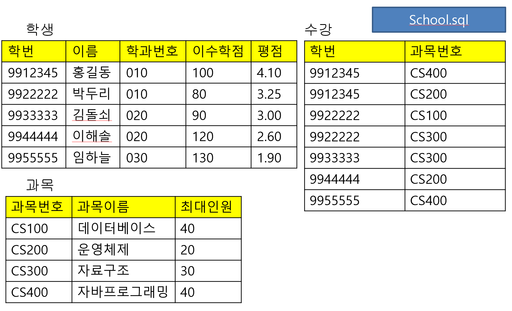
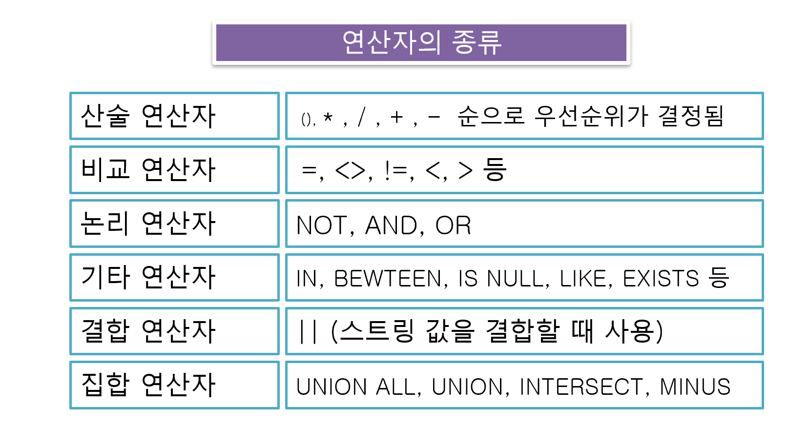
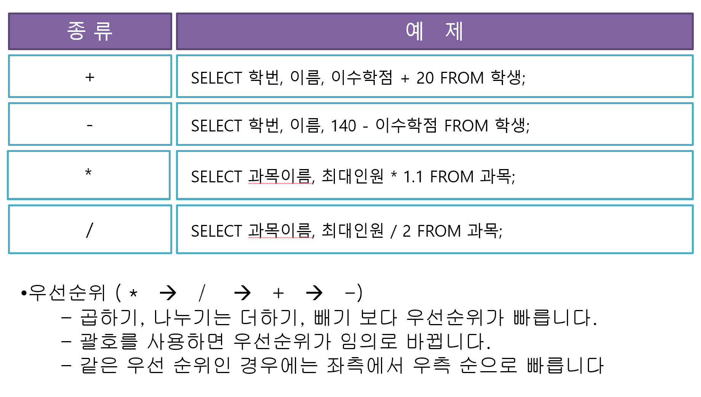

# 2022.03.22(화) - 2강

<br>

## 오라클 데이터베이스

<br>

Intro

- 오라클 데이터베이스 : 현재 가장 많이 사용되고 있는 DBMS

- 설치 시에 서버 관리를 위한 웹 서버가 같이 설치된다.

<br>

설치과정
    
    1. 교수님께서 올려주신 파일 (Oracle express 10.2 버전)
    2. 설치 후 데이터베이스 폴더 이용 홈페이지 접속
    3. 아이디는 system 비밀번호는 설치할 때 입력한 것
    4. 관리의 우측 화살표 -> 데이터베이스 사용자 생성
    5. 이때 사용자 비밀번호는 특수문자 안들어가는 것이 좋음.

<br>

**실습과정**

<br>

1. C 드라이브에 sql 폴더 생성, 실습 파일 sql 폴더로 이동

2. cmd로 sql 폴더로 이동

3. `sqlplus` 입력하여 sql 모드 시작

4. 아까 생성한 데이터베이스 사용자 정보 입력

5. `@school` 입력하여 파일 불러오기

6. `select table_name from user_tables;`

7. `desc 학생` 하여 학생 테이블의 구조 살펴보기

8. `select * from 학생;` 하여 학생 테이블의 데이터 조회하기

<br>

    메모장을 이용하여 sql 파일 만들 때, 인코딩 형식을 ANSI로
    변경하고 파일 형식을 모든 파일로 변경한 이후 확장자를
    .sql로 해주면 sql 파일이 깨지지 않고 잘 보인다.

<br><br>

## Select 문의 구조

<br>

select 문은 테이블 혹은 테이블들로 부터 내가 원하는 특정 데이터를 조회하기 위함이다.

<br>

```sql
Select 속성1, 속성2, ...
From 테이블1, 테이블2, ...
Where 조건1 (and/or) 조건2 (and/or) ... ;

# Where 절은 조건에 부합하는 것만 실행
```

<br>

<p align="center"></img></p>

<br>

테이블이 여러 개인 경우 관계대수 형태로 표현한 [카티션 곱](https://blog.naver.com/PostView.nhn?isHttpsRedirect=true&blogId=jinsol1&logNo=100024671562)을 이용한다. 예를 들어, 학생 테이블과 수강 테이블을 카티션 곱 한다고 하면, 학번은 중복되니까 학생-학번, 수강-학번으로 구분하며, 각각의 레코드들을 전부 대응한다. 7개의 속성이 만들어지고 레코드는 35개가 만들어지는 것이다.

<br>

수강 테이블에서 레코드를 선택하기 위하여 `select 학번 from 수강 where 과목번호 = 'cs100' and 과목번호 = 'cs300';` 코드를 입력하였다고 하자. 레코드가 선택이 될까?

<br>

절대 선택되지 않는다. 그 이유는 각 튜플들을 하나 하나씩 where 절에 넣기 때문에 cs100이면서 cs300을 동시에 만족하는 레코드는 존재하지 않기 때문이다.

<br><br>

### Select문 처리 과정

<br>

1. 테이블들의 카티션 곱을 구한다. tm
2. ㅁㄴㅇ


<br><br>

## 조건문 만드는 과정

<br>

기본적으로 sql에서 어떠한 연산이든 `속성 (연산자) 값`의 순서를 가져야 한다. 속성이 무조건 먼저 와야한다. 값이 먼저 오면 오류가 난다.

<br>

- 숫자 데이터 : `속성 (=, <, >, <=, >=, <>) 값`
- 문자 데이터 : `=` 또는 `Like`(패턴 검색할 때)
- 논리 연산자 : `and`, `or`, `not`

주소 = "부산%"는 잘못된 것이다. 패턴을 검색하는 과정에서는 Like 써야한다.

<br><br>

### 연산자의 종류

<br>

<p align="center"></img></p>

<br>

- 기타 연산자의 `IN`은 뒤의 것이 집합이라고 알려주는 것이다.
- 기타 연산자의 `BEWTEEN`은 `BEWTEEN A AND B` 형태로 사용
- 기타 연산자의 `IS NULL`은 특정 속성의 레코드 현재 값이 NULL인 것을 찾아라.
- 기타 연산자의 `EXISTS`는 중첩쿼리에서 주로 사용하는 것이다.

<br>

- 결합 연산자도 사실 Where 절에서 보다는 Select 절에서 주로 사용한다. 문자열을 조금 더 다채롭게 표현할 수 있는 것이다.

```sql
select 학번 || '의 이수학점은' || 이수학점 from 학생;

[출력결과]
학번||'의이수학점은'||이수학점
----------------------------------
9912345의 이수학점은100
9922222의 이수학점은80
9933333의 이수학점은90
9944444의 이수학점은120
9955555의 이수학점은130
```

<br>

<p align="center"></img></p>

<br>

계산쿼리는 각각의 레코드를 계산하고 선택쿼리는 선택된 레코드 모드를 계산한다.

<br><br>

## Select 문에 사용되는 키워드

<br>

- 중복된 튜플 관련
    `distinct`는 중복된 튜플을 한번만 표시하는 것이고 `all`은 중복되어도 표시하라는 의미이다. default 값으로 all이 설정되어 있다.

```sql
Select 학번 from 수강;
Select distinct 학번 from 수강;
Select all 학번 from 수강;
```

```sql
select 학번 from 수강;

학번
------------
9912345
9912345
9922222
9922222
9933333
9944444
9955555

select distinct 학번 from 수강;

학번
--------------
9933333
9944444
9955555
9922222
9912345
```

<br>

`select 이름, 140-이수학점 as 남은이수학점 from 학생` as는 별명 지어주는 역할

<br>

자연조인은 여러 개의 테이블을 조합하는데 이때, 의미 있는 레코드만 남기는 것이다. 예를 들어, School.sql 에서 학생 테이블의 1번 레코드와 수강 테이블의 7번 레코드를 조합하면 의미 있는 데이터인가? 홍길동의 과목이랑 임하늘의 과목이 연관은 없으니까. 그러면 학생 테이블의 1번 레코드와 수강 테이블의 1번 레코드는 의미있는가? 의미 있다. 그런 것만 남기는 것이다.

<br>

학생 테이블과 수강 테이블은 자연 조인 가능, 학생 테이블과 과목 테이블은 불가, 수강 테이블과 과목 테이블은 가능. 즉, 이것을 보고 자연 조인이 되려면 **공통 속성이 존재해야 한다는 것**을 파악할 수 있다.

<br>

절대적이라고 할 수는 없지만, 자연 조인이 되는 테이블이 보면 공통적인 것이 한 쪽에서는 일차키, 다른 쪽에서는 외래키인 경우가 대다수이다. 이때 일차키로 사용하는 쪽을 상위 테이블, 외래키로 사용하는 쪽을 하위 테이블이라고 한다.

<br>

자연조인을 빨리 구하는 법과 정석으로 구하는 법이 있다. 빨리 구하려면 눈으로 슥슥하고 그 사이에 상위 테이블의 속성 집어넣기. 정석은 ppt

<br>

`select * from 학생 natural join 수강;` 자연조인만 구하려면 이렇게 하면 되는데 원하는 특정 속성을 고르기 어렵다.

```sql
# *는 모든 속성

SQL> select 학생.*, 수강.과목번호
  2  from 학생, 수강
  3  where 학생.학번 = 수강.학번;
```