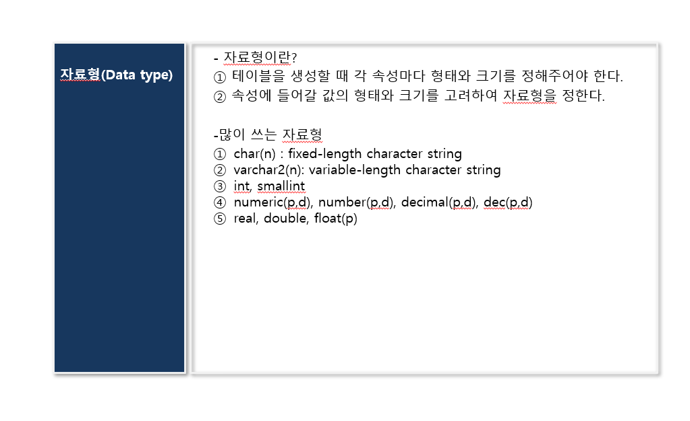
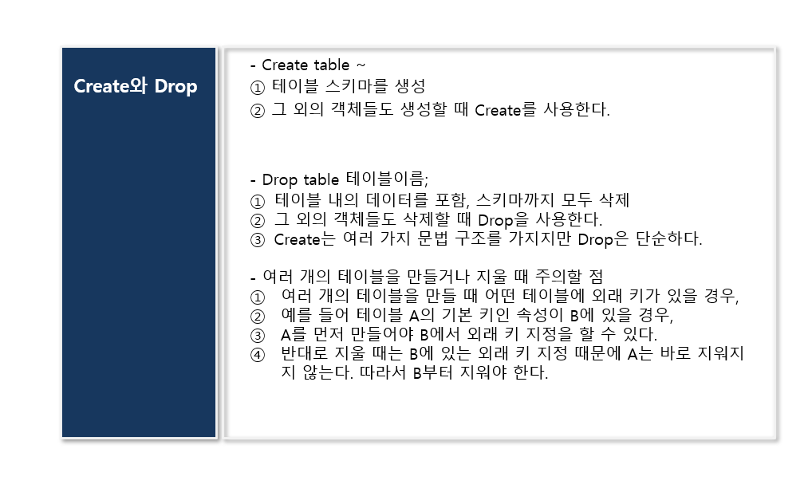
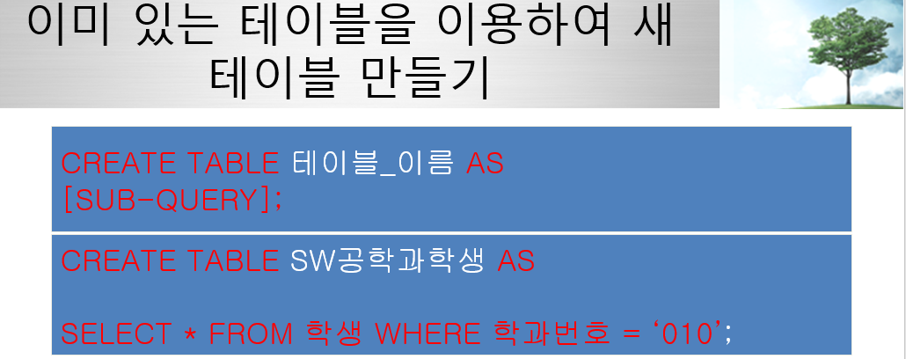
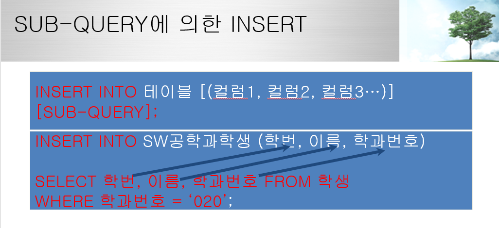

# 2022.03.29(화) - 3강

<br>

## SQL문의 분류

<br>

-   DDL : Data Definition Language
    -   Create문 : 테이블 및 각종 객체를 새로 생성
    -   Drop문 : 테이블 및 각종 객체를 제거
    -   After문 : 테이블 및 각종 객체의 구조를 바꿈
-   DML : Data Manipulation Language
    -   Insert문 : 새로운 레코드 삽입
    -   Delete문 : 레코드 삭제
    -   Update문 : 레코드 내의 특정 값을 변경
-   DCL : Data Control Lanaguage
-   DQL : Data Query Language

<br>

    Select문은 DQL이라고 하기도 하지만, 일반적으로는 DML에 들어간다고 생각하자.

<br><br>

### SQL문 - Data type

<br>

<p align="center"></img></p>

(n)의 n은 바이트를 의미한다. 보통 영문자는 1바이트, 한글은 3바이트이다. 고정된 문자형은 char로 바뀔 수 있는 문자형은 varchar2를 이용한다.

<br><br>

### SQL문 - Create, Drop

<br>

<p align="center"></img></p>

<br>

생성은 상위 테이블 -> 하위 테이블, 삭제는 하위 테이블 -> 상위 테이블 순서로 한다. **Drop 할 때 하위 테이블의 외래 키 지정으로 인하여 상위 테이블을 먼저 삭제할 수 없다.**

<br>

```sql
create table 테이블이름 (속성1 자료형1, 속성2 자료형2, 속성3 자료형3,
                        primary key (속성1 자료형1),
                        foreign key (속성2 자료형2) references 테이블이름2);
```

<br>

```sql
create table 학생 (
	학번 varchar2(7),
	이름 varchar2(20),
	학과번호 varchar2(3),
        이수학점 int,
	평점 float,
	primary key (학번)
);
```

<br>

학생 테이블의 자료형에 동명의 속성을 가지는 다른 테이블을 만들려고 하면 `desc 학생;`을 이용하여 학생 테이블의 자료형을 먼저 확인하고 만드는 것이 좋다. 추가로, **공통 속성의 자료형은 똑같아야 한다.**

<br>

```sql
desc 학생;

create table 1반학생평점 (학번 varchar2(7),
                         이름 varchar2(20),
                         평점 float,
                        primary key(학번));
```

<br>

<p align="center"></img></p>

<br>

**SUB-QUERY문**을 이용하여 이미 있는 테이블을 이용해서 새 테이블을 만드는 방식이 있다. 만약 학생 테이블을 이용해서 2반학생평점 테이블을 만든다고 해보자. 이 경우 별도의 `(속성 자료형)` 형태를 적지 않아도 학생 테이블을 기반으로 만들어진다.

```sql
create table 2반학생평점 as select 학번, 이름, 평점 from 학생;
```

<br><br>

### SQL문 - Insert, Update, Delete

<br>

-   Insert문, Null

```sql
Insert into 테이블이름 (속성1, 속성2, 속성3) values (값1, 값2, 값3);

Insert into 학생 values ('9966666', '이순신', null, 0, 0);
Insert into 학생 (이름, 학번, 평점, 이수학점) values ('이순신', '9966666', 0, 0);
```

<br>

Insert문은 **한 행 전체**를 다 추가하는 것이다. 마찬가지로 Delete문 역시 한 행 전체를 제거하는 것이다. 만약에, 어떤 행에 NULL값이 있어서, 거기 값을 추가하고 싶다고 하면 Insert를 쓰는게 아니라 Update를 사용해야 한다.

<br>

-   속성 이름을 지정하지 않으면 create table 할 때 설정했던 속성의 순서대로 값들만 지정
-   속성 이름을 지정하는 경우, 지정되지 않은 속성에는 null이 들어간다.
-   값을 모르는 경우 일부로 null 값을 넣을 수 있다.

<br>

    Null의 경우 주의하여야 한다. 속성의 값이 Null 이라면
    비교 연산을 할 때 Null로 비교해줘야 한다.
    Null을 찾기 위해서는 is null을 사용해야 한다.

    Select * from 학생 where 학과번호 = ‘010‘; -> False
    Select * from 학생 where 학과번호 != ‘010‘; -> False
    Select * from 학생 where 학과번호 is null;  -> True

<br>

-   Update문, Delete문

<br>

```sql
Update 테이블이름 set 속성1 = 값1, 속성2 = 값2 where 조건1;

Update 학생 set 학과번호 = '030' where 학번 = '9966666';
Update 학생 set 이수학점 = 이수학점 + 20;

Delete from 테이블이름 where 조건1;

Delete from 학생 where 학번 = '9966666';
```

<br>

update는 입력된 **레코드의 빈 속성에 값**을 넣거나 **속성 하나의 값**을 삭제한다.

<br>

update나 delete를 사용할때는 **where절을 조심해서 사용**하자. 조건을 제대로 설정 안하면 **모든 레코드를 날리거나 업데이트 해버릴 수 있기 때문이다.** 참고로, `Drop`은 테이블 관련 명령어라서 스키마까지 삭제해버리지만 `Delete`는 레코드만 날린다.

<br>

<p align="center"></img></p>

<br>

insert into 또한 create table에서 `SUB-QUERY`를 이용하여 이미 있는 테이블을 이용해서 테이블을 생성했던 것처럼 SUB-QUERY를 이용할 수 있다.

-   일반적인 insert into와 달리 `VALUES`절을 사용하지 않음
-   Insert 절에 명시된 속성의 수가 SUB-QUERY에 사용된 속성과 수, 데이터 타입이 일치해야함
-   SUB-QUERY가 리턴하는 레코드 수 만큼 입력됨

<br><br>

### SQL문 - Union, Intersect, Minus

<br>

-   Union (합집합)

    <br> 두 개의 select문의 결과 **속성** 집합이 같을 때, 두 결과 집합에 대해 합집합이 가능.
    이 때 사용하는 키워드가 Union
    Union all 키워드를 쓰면 중복되는 데이터를 중복되는 횟수만큼 보여준다.

```sql
select 학번, 이름 from 학생 where 학과번호 = '010' union
select 학번, 이름 from 학생 where 이수학점 >= 100;

select 학번, 이름 from 학생 where 학과번호 = '010' or 이수학점 >= 100;
```

<br>

-   Intersect (교집합)

    <br> 두 개의 select문의 결과 **속성** 집합이 같을 때, 두 결과 집합에 대해 교집합이 가능.
    이 때 사용하는 키워드가 Intersect

```sql
select 학번, 이름 from 학생 where 학과번호 = '010' intersect
select 학번,이름 from 학생 where 이수학점 >= 100;

select 학번, 이름 from 학생 where 학과번호 = '010' and 이수학점 >= 100;
```

intersect를 이용한 예시를 소개하면, `shop2.sql` 테이블을 이용하겠다. <br>

-   주문 테이블에서 2017년 1월 2일과 1월 3일에 모두 주문한 회원의 회원번호를 구하시오.
-   intersect를 이용한 결과, 중첩 쿼리를 이용한 결과

```sql
// intersect
select 회원번호 from 주문 where 주문일 = '2017-01-02' intersect
select 회원번호 from 주문 where 주문일 = '2017-01-03';

// 중첩쿼리
select 회원번호 from 주문 where 주문일 = '2017-01-02' and
회원번호 in (select 회원번호 from 주문 where 주문일 = '2017-01-03');
```

<br>

-   Minus (차집합)

    <br> 두 개의 select문의 결과 **속성** 집합이 같을 때, 두 결과 집합에 대해 차집합이 가능.
    이 때 사용하는 키워드가 Minus

```sql
select 학번, 이름 from 학생 where 학과번호 = '010' minus
select 학번,이름 from 학생 where 이수학점 >= 100;

select 학번, 이름 from 학생 where 학과번호 = '010' and 이수학점 < 100;
```

<br>

-   집합을 사용했을 때 좋은 예시)
-   학과번호가 `020`인 학생 중에 과목번호 `cs300`인 과목을 수강하는 학생의 학번을 찾으시오.

```sql
// 자연조인도 해야하고, 테이블.속성으로 정확하게 명시하여야 함
select 학생.학번 from 학생, 수강 where 학생.학번 = 수강.학번
and 수강.과목번호 = 'cs300' and 학생.학과번호 = '020';

// 집합 사용하면 훨씬 간결하게 !
select 학번 from 학생 where 학과번호 = '020' intersect
select 학번 from 수강 where 과목번호 = 'cs300';
```

<br><br>

### SQL문 - 통계 함수

<br>

1차 키로 지정되면서 자연스럽게 not null로 된다.

<br>

통계 함수랑 일반적인 속성은 함께 사용할 수 없지만, **group by**를 사용하면 그룹의 기준이 되는 속성만 같이 사용할 수 있다.

<br>

**통계 함수 처리를 한 것에 where 조건을 붙히기는 힘들다. 예를 들어, count()를 써서 만들었다는 것은 여러 레코드를 가져와서 어떤 처리를 하고 결과가 나온 것인데 where는 각각 레코드를 건드는 것이니까. 이럴 때는 having을 쓴다.**

<br>

대표적인 통계 함수

-   sum : 그 속성의 합계를 구한다.
-   count : 튜플의 수를 구한다.
-   avg : 그 속성의 평균값을 구한다.
-   min : 그 속성의 최솟값을 구한다.
-   max : 그 속성의 최댓값을 구한다.

<hr>

-   Count

    <br> 예시) 학생들이 수강 신청한 내역의 개수를 보여주는 SQL문

```sql
// 학번이 '9912345'인 학생이 몇 과목을 신청했는지 구해라

Select count(*) as 수강신청건수 from 수강 where 학번 = '9912345';


```

<br>

튜플 변수를 사용한다는 것의 의미는 한 테이블을 마치 두 개의 테이블로 보이도록 표시하는 것이다. 그렇게 두 개의 테이블을 카디션 곱을 해버리는 것이다. 그러면 원래 테이블의 속성의 개수의 2배가 되어버리는 것이니까, 속성 2개를 같이 사용할 수 있게 되는 것이다. 그렇게 테이블을 만들어 비교 구문을 이용하는 것이다.

<br>
