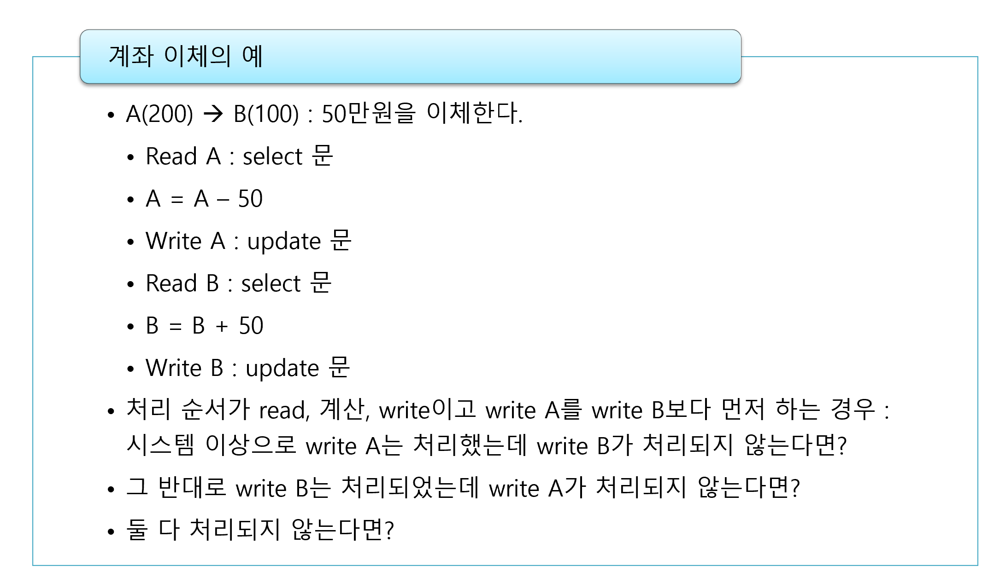
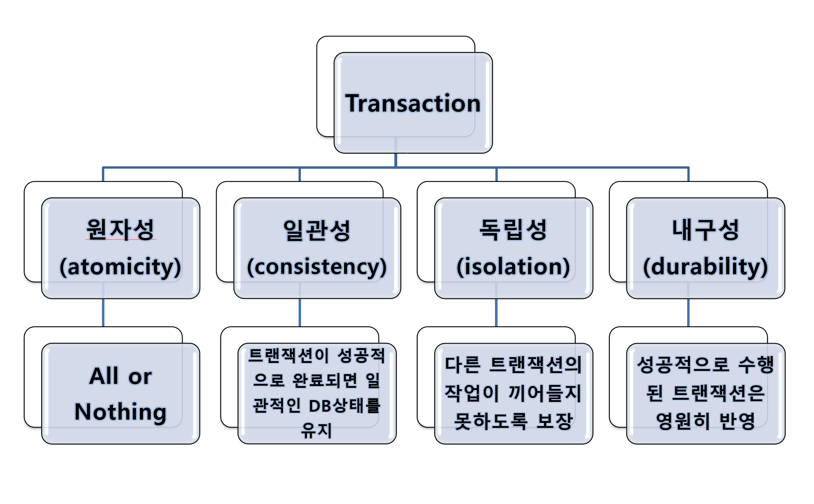
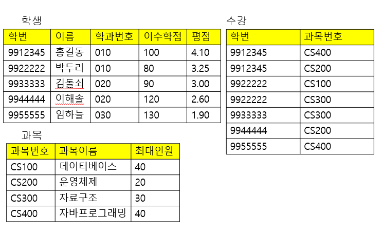
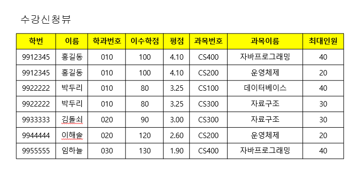

# 2022.04.05(화) - 4강

<br>

## 트랜잭션(Transaction)

<br>

트랜잭션이란, 자료 항목을 읽고 또한 때로는 값을 고치기도 하는 프로그램 처리(수행)단위이다. 예를 들어, 여러 개의 sql문이 하나의 트랜잭션으로 엮여서 전부 실행되거나 실행되지 않거나 하는 방식이다.

<br>

    트랜잭션 시작

    select …
    select …
    insert …
    delete …
    select …
    delete …

    트랜잭션 끝

<br>

<p align="center"></img></p>

<br>

트랜잭션의 대표적인 예시로는 계좌이체가 있다. 돈이 들어오고 빠져나가는 것이 동시에 처리되면 문제가 있을 것이다. 하나의 작업 단위로 이루어져야 한다.

<br>

## 트랜잭션의 네 가지 특성 : ACID

<br>

<p align="center"></img></p>

<br>

-   A(Atomicity) : 원자성으로, 분해가 불가능한 최소의 단위인 원자로 움직인다는 이야기이다. All or Nothing

-   C(Consistency) : 지속성으로,

-   I(Isolation) : 다른 트랜잭션의 영향을 받아서는 안된다. 병렬제어에서도 직렬적으로 순서대로 처리되는 것처럼 되어야 한다.

-   D(Durability)

<br>

따로 트랜잭션을 시작하는 명령어는 없고, 첫 번째 SQL문이 실행되는 순간 그때부터 트랜잭션이 실행되는 것으로 이해한다. 하나의 트랜잭션을 완료하는 명령어인 `commit` 혹은 `rollback` 혹은 `접속을 끊었을 때` 이때가 하나의 트랜잭션이 끝나는 순간이다. 묵시적으로 시작한다는 것이 따로 시작하는 명령어가 없다는 의미이다.

<br>

-   commit : 현재의 트랜잭션을 데이터베이스에 반영시킨 뒤, 새 트랜잭션을 시작한다.
-   rollback : 현재의 트랜잭션을 취소한 뒤, 새 트랜잭션을 시작한다.

<br><br>

## 뷰(View, Virtual Relation)

<br>

Virtual Relation은 테이블이 아닌데 **테이블처럼 보이게 하는 것**이다. View를 이용하면 테이블처럼 사용할 수 있다.

<br>

Logical Level에서는 학과 테이블, 수강 테이블, 학생 테이블 등 논리적으로 테이블이 나뉘어져서 제공이 되는데 이러한 것을 사용자 편의상 보기 좋게 View로 제공한다.

<br>

View를 지원하는 방법에는 두 가지가 있다.

1. View의 정의만 지정하는 방법
2. View를 미리 계산하여 결과를 저장해 두는 방법

단, 여기서 2번 방법은 미리 계산하여 결과를 저장하니까 **바탕 테이블이 자주 바뀌는 경우에는 사용하면 안된다.**

<br>

-   View update : 뷰에 있는 레코드를 수정하거나 새로운 레코드를 삽입하거나 레코드를 삭제하면 바탕 테이블에 반영되어야 한다.

<br>

-   View update anomaly : 뷰 갱신 이상 현상으로, 뷰를 고칠 때 바탕 테이블에 있는 레코드에 이상을 일으키는 경우이다. 특히, 둘 이상의 테이블 연산 결과를 바탕으로 한 뷰의 데이터 변동이 있을 때, 충돌을 일으키는 경우가 많다. 그래서 DBMS는 보통 둘 이상의 테이블의 연산으로 만들어진 뷰의 갱신 자체를 허락하지 않는 경우가 많다.

<br>

```sql
// 뷰 정의하기
create view 뷰_이름 as select ~ ;

// 뷰 삭제하기
drop view 뷰_이름;
```

<br>

## View를 이용한 문제 해결

<br>

view를 이용하면 복잡한 sql문을 쉽게 만들 수 있다. **일부 조건을 이용하여 view를 만들고 나머지 조건을 view에 적용한다.**

<br>

<p align="center"></img></p>

<br>

```sql
// 수강 신청 과목이 두 과목 이상인 학생의 학번, 이름, 과목이름을 보여주는 SQL문

// 학번
select 학번 from 수강 group by 학번
having count(과목번호) >= 2;

// 학번, 이름
select 학번, 이름 from 학생
where 학번 in (select 학번 from 수강 group by 학번
having count(과목번호) >= 2);

// 학번, 이름, 과목이름은?
```

<br>

앞의 예제에서 학번, 이름, 과목이름까지 표시하려면 고려해야 할 것이 자연조인, group by, having, 중첩 sql문 등 너무 많다. 따라서 자연 조인에 관한 결과를 view로 만들고 적용하면 쉽게 접근할 수 있다.

<br>

```sql
// view 생성
create view 수강신청뷰 as
select 학생.*, 과목.* from 학생, 수강, 과목
where 학생.학번 = 수강.학번
and 과목.과목번호 = 수강.과목번호;
```

<br>

<p align="center"></img></p>

<br>

```sql
select 학번, 이름, 과목이름 from 수강신청뷰
where 학번 in (select 학번 from 수강 group by 학번
having count(과목번호) >= 2);
```

<br>

view 객체 생성되는 것을 원하지 않는다면, with문을 이용한다.

<br>

```sql
with 수강신청뷰 as (select 학생.*, 과목.* from 학생, 수강, 과목
where 학생.학번 = 수강.학번
and 과목.과목번호 = 수강.과목번호)
select 학번, 이름, 과목이름 from 수강신청뷰
where 학번 in (select 학번 from 수강 group by 학번
having count(과목번호) >= 2);
```
