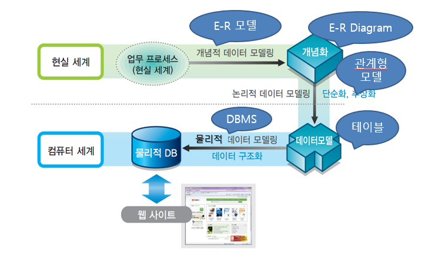
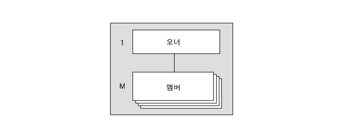
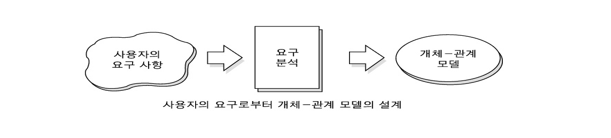
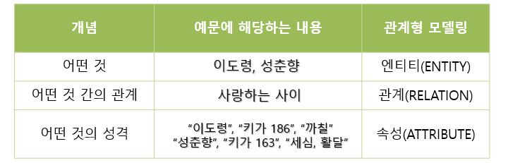
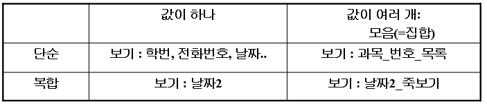
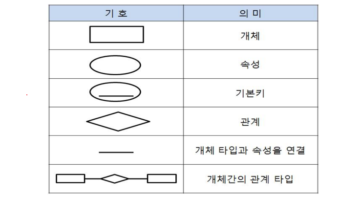
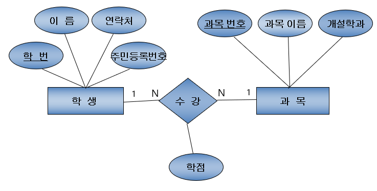
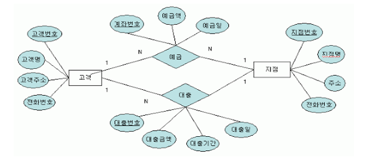

# 2022.05.10(화) - 9주차

<br>

5주차, 6주차, 7주차 수업은 PL/SQL 문법을 진행했으므로, 따로 TIL 작성을 하지는 않음. 추가로 8주차는 시험을 진행했기에 9주차부터 다시 작성을 시작한다. **데이터베이스 전체 설계 과정**에 관한 이야기이다.

<br>

## 데이터 모델

<br>

-   데이터 : 실제 세계의 여러 가지 자료들을 추상화한 것, 데이터를 추상화하는 방법에 관하여 의문 가지기
-   데이터 모델
    -   데이터 구조를 결정하기 위한 방법론
    -   데이터 구조를 만들 때 사용하도록 만들어 놓은 틀

<br>

-   데이터 모델링 과정

<p align="center"></img></p>

<br>

1. 현실 세계의 업무 프로세스를 개념적으로 모델링 한다. (E-R모델)
2. 개념화한 다이어그램을 **E-R Diagram, ERD**라고 한다.
3. ER 다이어그램을 **논리적**으로 모델링하여 데이터 모델, 테이블을 만든다.
4. DBMS가 데이터 모델을 가지고 물리적 DB에 **물리적** 데이터 모델링 한다.
5. 물리적 DB가 웹사이트와 상호작용 한다.

<br>

## 여러 가지 데이터 모델

<br>

주로 사용하게 될 데이터 모델은 E-R(Entity Relation) 모델이지만, 계층 데이터 모델과 네트워크 데이터 모델 같은 다른 데이터 모델도 존재한다.

<br>

**계층 데이터 모델 (hierarchical data model)**

<br>

<p align="center"></img></p>

<br>

데이터베이스의 논리적 구조가 트리(tree) 형태로 표현되며 E-R 모델의 개체를 레코드로 표현한 형태이다.

<br>

장점 : 계층 데이터 모델은 1:n의 관계를 가지는 대용량 데이터베이스 처리에 매우 강력하다. 주어진 기능 내에서 찾고자 하는 데이터 항목을 빠르게 찾을 수 있다.

<br>

단점 : 사용자의 측면에서 볼 때 데이터가 저장된 물리적 구조에 대한 지식을 가지고 있어야 하는 것이 단점이다. 그래서 접근에 유연성이 부족하다. 데이터 간의 모든 관계가 데이터베이스를 처음에 설계할 때 정해야만 하기 때문이다. 또한, 계층형 모델은 **1:n의 기준에 맞지 않는 일반적인 관계는 구현하기가 매우 어렵다**는 큰 단점이 있다.

<br>

**네트워크 데이터 모델(network data model)**

<br>

<p align="center"></img></p>

<br>

제한적인 트리 구조가 아닌 그래프 형태를 기반으로 하여 데이터를 표현한다. 현실세계의 데이터 구조를 표현하기 위한 필요성에 의하여 만들어지게 되었다. 데이터 구조는 관계(relationship)를 나타내는 집합(set)을 기반으로 하며, 집합을 구성하는 요소들은 명시적 링크를 사용하여 오너(owner)와 멤버(member) 레코드 형으로 관계를 표현한다.

<br>

장점 : 한 멤버가 여러 개의 집합에 속할 수 있기 때문에 다대다(N:M)의 관계가 계층형 모델에 비하여 쉽게 구현이 가능하다. 데이터에 대한 접근도 용이하다.

<br>

단점 : 사용자가 데이터가 저장된 물리적인 구조에 대한 정보를 가지고 있어야 하고, 원하는 데이터를 얻기 위해서는 접근 경로를 항해해야 하는 항해 시스템이다. 또한, 데이터베이스의 구조를 변경하면 이 구조를 참조한 모든 응용 프로그램에 대해 수정해야 한다는 치명적인 단점이 있다.

<br>

## 개체 관계 모델(E-R Model)

<br>

<p align="center"></img></p>

<br>

현실 세계의 많은 데이터 중에서 관심의 대상이 되는 데이터를 언어보다 조금 더 형식화된 다이어그램을 사용하여 표현한 것이다. 1976년 Chen에 의해 제안되었다.

<br>

-   데이터에 대해 관리자, 사용자, 프로그래머들이 서로 다르게 인식되고 있는 뷰들을 하나로 통합할 수 있는 단일화된 설계안을 만들기 위해서 사용한다.
-   서로 다른 뷰들을 충족시킬 수 있는 데이터 처리와 제약조건 등의 요구사항 들을 정의하기 위해 사용한다.

<br>

**개체(Entity), 관계(Relation), 속성(Attribute)**

-   업무가 관여하는 어떤 것 (Entity)
-   업무가 관여하는 어떤 것 간의 관계 (Relation)
-   어떤 것이 가지는 성격 (Attribute)

<br>

```
[예문]
이도령과 성춘향이 있고 둘은 사랑하는 사이다.
이도령은 키가 186이고 성격이 까칠하고, 성충햔은
키가 163이고 세심하고 활달한 성격이다.
```

<p align="center"></img></p>

<br>

**개체-관계 (Entity-Relationship) 모델의 구성 요소**

<br>

-   개체 (Entity)
    -   실제 세상에 존재하는 객체들
    -   물리적으로 존재하기도 하고 개념적으로 존재하는 것들도 표현 가능
-   개체 집합
    -   같은 종류의 개체들을 모아놓은 것
    -   ex) 학생 개체 집합, 교수 개체 집합, 과목 개체 집합
    -   E-R Diagram에서는 **개체 집합을 직사각형**으로 표시
-   속성
    -   개체를 구성하거나 개체의 특징을 나타내는 여러 가지 요소들
    -   개체는 속성의 집합으로 표현한다.
    -   E-R Diagram에서는 **속성을 원 모양**으로 표시
-   도메인
    -   속성이 가질 수 있는 값의 범위
    -   ex) 학생 개체 집합의 이름이라는 속성은 한글 문자 5개 이하로 표현, 성적 개체 집합의 중간고사 점수 속성은 0이상 100이하의 정수
-   관계
    -   개체 사이의 연관성을 나타내는 요소, 보통 술어
    -   **Mapping Cardinality**가 존재한다.
-   관계 집합
    -   같은 형태의 관계들을 모아놓은 것
    -   E-R Diagram에서는 **관계 집합을 마름모 모양**으로 표시

<br>

**속성에 들어오는 값의 형태**

-   두 가지 기준을 가진다.
-   값이 하나인가? 아니면 여러 개인가?
-   값이 단순한가? 구조를 가지고 있는가?

<br>

<p align="center"></img></p>

<br>

**사상 크기 (Mapping Cardinality)**

-   관계 집합의 양 쪽에 있는 개체 집합 사이의 정수 비율
-   1:1, 1:N, M:1, M:N
-   주어진 조건에 따라 결정

<br>

**사상 크기의 예시 : 수강신청**

1. 어떤 학교는 엘리트 전문 학교로 수업 하나당 한 명의 학생만 수강 신청을 할 수 있고, 한 학생은 한 과목만 수강할 수 있다. `-> 학생 : 과목 = 1 : 1`
2. 어떤 학교는 1:1 과외 전문 학교로 모든 수업은 1:1 과외 형식으로 진행된다. 각 학생은 여러 과목을 수강할 수 있다. `-> 학생 : 과목 = 1 : N`
3. 어떤 학교는 집중 교육 전문 학교로 모든 학생은 한 과목만 수강할 수 있다. 각 수업에는 여러 명의 학생이 들어올 수 있다. `-> 학생 : 과목 = M : N`
4. 일반적으로 대학교에서는 한 학생이 여러 과목을 수강할 수 있고 한 과목에 여러 명의 학생이 들어온다. `-> 학생 : 과목 = M : N`

<br>

## E-R Diagram

<br>

-   E-R Diagram 표준 도형

<p align="center"></img></p>

<br>

<p align="center"></img></p>

사상 크기의 예시 수강신청에서 조건 4번을 E-R Diagram으로 그린 것

<br>

-   E-R Diagram 예제
    -   어떤 상황인지 해석해보기
    -   개체 집합에 어떤 것이 있는 지
    -   관계 집합의 의미
    -   사상 크기에 따른 의미

<p align="center"></img></p>

<br>

    현재 고객이 은행 지점을 통해 예금, 대출을 하는 상황같음
    개체 집합에는 고객, 지점
    관계 집합은 예금과 대출이니 그 행위, 술어
    나머지 동그라미들은 각 개체의 속성들

    고객 1명이 여러 예금과 대출을 받을 수 있으니까
    각각 1:N의 관계

    지점 1개에 여러 예금과 대출 요청이 올 수 있으니까
    각각 M:1의 관계

<br>

## 매핑 룰 (Mapping Rule)

<br>

-   Mapping Rule이란, E-R 모델링 (개념적 데이터 모델링)의 결과물인 E-R Diagram을 이용하여 관계형 모델링(논리적 데이터 모델링)을 위해 테이블로 변환하는 과정이다.
-   사상 크기에 따라 테이블 개수가 정해진다. (불필요한 중복을 방지한다)

<br>

-   Mapping Rule
    -   **1:1 - 1개 혹은 2개의 테이블** (상황에 따라 결정), 두 테이블로 나눌 경우에는 기본 키가 같은 경우가 많다. 이 말은 두 테이블의 공통 속성이 기본 키라는 말이다. 이 경우 공통 속성은 서로가 서로의 외래키가 되는데 실제 설정은 하나만 한다.
    -   **1:N - 2개 테이블**, 두 개의 개체 집합으로 각각 테이블을 만든다. **1의 기본키가 N의 외래 키가 된다.**
    -   **M:N - 3개 테이블**, 두 개의 개체 집합을 테이블을 만들고 관계 집합에 해당하는 테이블을 만든다. **각 개체 집합으로 만든 테이블의 기본 키가 관계 집합으로 만든 테이블의 외래 키가 된다.**

<br>

-   Mapping Rule을 이용하여 테이블을 만들면 **논리적 데이터 모델링까지 끝난 것?**
    -   꽤 괜찮은 결과가 나온다.
    -   하지만 불필요한 중복이 완전히 배제되었다고 말하기 힘들다.
    -   따라서, 매핑 룰을 이용하여 테이블을 만든 후에도 논리적 데이터 모델링 (정규형에 따른 정규화) 과정을 거쳐야한다.

<br>

    예) 한 번에 여러 개의 물건을 주문할 수 있는 쇼핑몰 데이터베이스

    - 회원 개체와 상품 개체 사이의 관계인
      주문과 상품 사이에 M:N 관계가 되어
      주문의 속성에 해당하는 배송주소, 배송일, 배송 연락처
      등의 정보가 불필요하게 중복될 수 있다.

<br>

**1:1 관계 예시**

-   학생명단 : 생활기록부 = 1 : 1
    -   학생명단 = {학번, 이름, 성별, 생년월일, 휴대폰번호, 주소, 우편번호}, PK = {학번}
    -   생활기록부 = {학번, 취미, 특기, 통학수단, 음주, 흡연}, PK = {학번}, FK = {학번}
-   하나의 테이블로 만들어도 되지만, 편의상 두 개의 테이블로 나눈 경우
-   학생 테이블의 {학번}을 외래 키로 잡을 수도 있다. 하지만 **두 테이블의 {학번}을 모두 외래 키로 설정할 수는 없다. 이렇게 되면 참조 무결성에 의해 데이터 입력에 문제가 생긴다.**

<br>

**사상 크기에 따른 관계(테이블) 개수**

<br>

데이터가 쓸데없이 중복되어서는 안 된다는 것을 항상 생각하자.

<br>

-   **조건 1 - 학생 : 과목 = 1:1 인 경우**

```
1. 학생_과목 = {학번, 이름, 주민등록번호, 연락처, 과목번호, 과목이름, 개설학과, 학점}
   PK = {학번}, 이때, {과목번호}도 후보 키 이다.

2. 학생 = {학번, 이름, 주민등록번호, 연락처}, PK = {학번}
   과목 = {과목번호, 과목이름, 개설학과, 학점, 학번}, PK = {과목번호}, FK = {학번}

3. 학생 = {학번, 이름, 주민등록번호, 연락처, 과목번호}, PK = {학번}, FK = {과목번호}
   과목 = {과목번호, 과목이름, 개설학과, 학점}, PK = {과목번호}
```

<br>

-   **조건 2 - 학생 : 과목 = 1 : N 인 경우**

```
학생 = {학번, 이름, 주민등록번호, 연락처}, PK = {학번}
과목 = {과목번호, 과목이름, 개설학과, 학점, 학번}, PK = {과목번호}, FK = {학번}
```

<br>

-   **조건 3 - 학생 : 과목 = M : 1 인 경우**

```
학생 = {학번, 이름, 주민등록번호, 연락처, 과목번호, 학점}, PK = {학번}, FK = {과목번호}
과목 = {과목번호, 과목이름, 개설학과}, PK = {과목번호}
```

<br>

-   **조건 4 - 학생 : 과목 = M : N 인 경우**

```
학생 = {학번, 이름, 주민등록번호, 연락처}, PK = {학번}
과목 = {과목번호, 과목이름, 개설학과}, PK = {과목번호}
수강 = {학번, 과목번호, 학점}, PK = {학번, 과목번호}, FK = {학번}, FK = {과목번호}
```

<br>

-   조건2에서 학점은 과목 테이블에 위치, 한 학생이 여러 과목 들으니까 학점이 여러개
-   조건3에서 학점은 학생 테이블에 위치, 한 과목은 여러 학생이 들으니까 학점이 여러개
-   조건4에서 학점은 수강 테이블에 위치, 한 학생은 여러 과목 들으니까 학점이 여러개, 한 과목은 여러 학생이 들으니까 학점이 여러개 따라서, 한 학생이 한 과목 수강할 때마다 하나씩 생기니까

<br>
