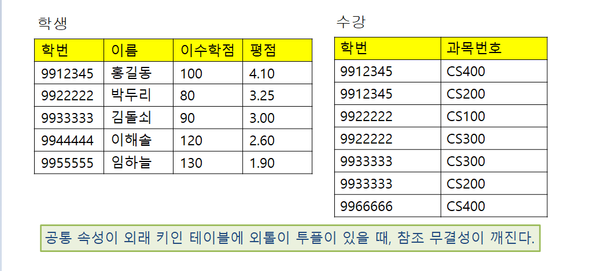
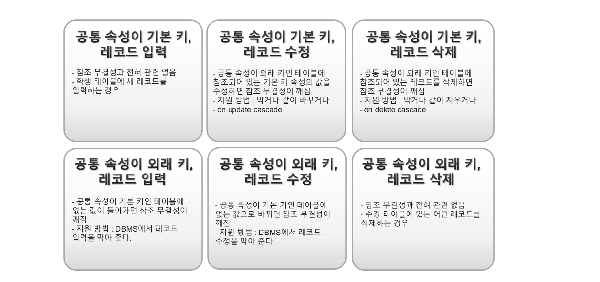

# 2022.05.10(화) - 10주차

<br>

## 제약 조건

<br>

1. 데이터 무결성을 지키기 위해 데이터베이스에 들어갈 데이터에 대해 일정한 조건을 주는 것
2. 종류 - 도메인 제약, 기본 키 제약, 참조 무결성, 함수적 종속 등등
3. 제약 조건을 지정하기 위한 SQL 구문이 존재
4. 특히 잘 이해해야 할 제약 조건 - **함수적 종속**, SQL문이 없기 때문

<br>

## 도메인 제약

<br>

기본적인 형태

-   도메인 제약은 속성에 들어올 수 있는 값의 범위가 정해져있다는 의미
-   가장 기본적인 형태 : 자료형을 이용하여 정의하는 것
-   관련 SQL문 : Create문에서 속성 이름 뒤에 자료형을 넣는 것
    ex) `이름 char(10)`

좀 더 제약된 형태

-   자료형만으로 표현되지 않는 조건
-   예를 들어 점수 속성이 0이상 100이하인 정수일 때, int 만으로 표현 불가
-   관련 SQL문 : `속성_이름 자료형 check(조건문),`
    ex) `이수학점 int check (이수학점 >= 0)`

기본 값

-   제약 조건이라기보다 어떤 속성에 특정 데이터가 매우 자주 들어갈 때, 그 값을 기본값으로 지정
-   입력을 편하게 도와주는 의미
-   관련 SQL문 : `속성_이름 자료형 default 값,`
    ex) `이수학점 int default 0`

<br>

```sql
// check 예시

create table 성적 (
    학번 char(7),
    중간고사 int check (중간고사 between 0 and 100),
    primary key (학번)
);

insert into 성적 values ('9912345', 120);

// 오라클에서는 가능, mysql은 지원X
```

```sql
// default 예시

create table 학생 (
    학번 char(7),
    이수학점 int default 0,
    primary key (학번)
);

insert into 학생 (학번) values ('9912345');

select * from 학생;
```

<br>

## 필수 속성

<br>

-   값이 반드시 들어가야 하는 속성을 의미
-   **레코드를 삽입할 때 이 속성에 값을 집어넣지 않으면 에러가 발생**
-   관련 SQL문 : `Not null`
    ex) `create table 학생(학번 char(7) not null, ... )`

<br>

## 기본 키 제약, 후보 키 제약

<br>

**기본 키 제약**(개체 무결성)은 기본 키로 설정한 속성 집합에는 null이 들어갈 수 없고, 이미 존재하는 값도 들어갈 수 없다는 의미이다.

-   관련 SQL문 : `primary key (속성_이름)`

**후보 키 제약**은 후보 키를 선정하는 것은 큰 의미가 없고, 중복 방지의 의미만 있다. 그래서 DBMS들은 중복을 방지하는 의미의 키워드를 지원한다.

-   관련 SQL문 : `속성_이름 자료형 unique, ...`

**키 제약**은 모든 릴레이션은 하나 이상의 키를 가진다. 이때, 가져야 한다는 의미가 아니다.

<br>

## 참조 무결성

<br>

1. 참조 무결성은 다른 말로 **외래 키 제약**, 다른 테이블 보는거를 말함
2. 외래 키 설정을 하게 되면 DBMS는 참조 무결성을 지원한다.
3. 관련 SQL문 : `foreign key (속성_이름) references 참조할테이블(기본키),`
4. 옵션 : On delete cascade, on update cascade

<br>

외톨이 투플

1. 외톨이 투플 : 자연 조인 연산을 할 때 짝이 없어서 나타나지 않는 투플
2. 외톨이 투플이 없으면, 참조 무결성은 유지, 외톨이 투플이 있으면, 참조 무결성이 깨질 수 있음
3. Outer join : 외톨이 투플도 표시하는 자연 조인
4. 참조 무결성이 깨지는 경우가 어떤 경우일까

<br>

<p align="center"></img></p>

공통 속성이 학번인데, 학생 테이블에서는 학번이 PK, 수강 테이블에서는 학번이 FK이다. 공통속성이 PK니까 학생 테이블이 상위, 공통속성이 FK니까 수강 테이블이 하위이다.

<br>

학생 테이블의 학번 9944444, 9955555 두 레코드는 수강 테이블에 보이지 않는다. 이 두 투플은 외톨이 투플이지만 문제가 없다. 아직 수강신청 안한 학생일 뿐이다. 수강 테이블의 학번 9966666를 보면 학생 테이블에 없어서 외톨이 투플이다. 얘는 문제가 되는 것을 확인할 수 있다. 9966666인 학생이 없는데 어떻게 수강 신청을 했을까? 참조 무결성이 깨지는 것.

<br>

**근데, 우리는 하위 테이블에 외톨이 투플이 생기지 않도록 하는 것을 신경쓸 필요 없다. 외래키만 정확하게 지켜주면 DBMS가 알아서 해준다.**

<br>

## 자료 값이 바뀔 때, 참조 무결성 유지

<br>

<p align="center"></img></p>

-   테이블을 만든 상태에서는 당연히 참조 무결성 유지, 아직 레코드가 없으니까
-   **하위 테이블에 외톨이 투플이 생기지 않도록 하자**
-   (공통 속성이 기본 키, 레코드 입력) (공통 속성이 외래 키, 레코드 삭제) 이 두개는 참조 무결성과 전혀 관련이 없다. 전자는 학생이 수강신청 늦게 한 경우, 후자는 연쇄적 삭제 가장 아래단계니까 올바름

<br>

## 함수적 종속

<br>

**함수적 종속 의미**

-   정규형의 이론적인 바탕을 제공 : 관계형 데이터베이스 설계는 정규화 과정을 거친다.
-   가장 많이 쓰는 정규형인 BCNF와 3NF의 정의에 쓰인다.
-   **수퍼키 개념을 일반화한 것이다 = 수퍼키는 함수적 종속 개념의 특수한 경우이다**

<br>

**함수적 종속 활용**

-   함수적 종속의 의미를 이해, 이용한 정규형의 정의를 이해
-   데이터베이스 설계할 때 정규형에 맞는지 살펴보기
-   맞지 않으면 정규화를 통해 정규형에 맞게 설계를 수정

<br>

**수퍼 키의 정의**

-   관계형 스키마 R이 있고, 그 스키마에 따라 인스턴스 r이 있고, 그리고 스키마 R의 속성 가운데 일부로 이루어진 부분집합 K가 있을 때, 만일 인스턴스 r에 있는 모든 투플의 짝 t1과 t2에 대하여, **t1과 t2가 같지 않을 때 t1.K과 t2.K도 같지 않다면** K는 스키마 R의 수퍼 키이다.
-   스키마 R은 **테이블의 전체 속성 집합**을 의미한다.
-   인스턴스 r은 **테이블의 전체 레코드 집합**을 의미한다.
-   집합 K는 R의 부분집합, **테이블의 일부 속성 집합**을 의미한다.

<br>

    [쉽게 해석]

    눈 감고 아무 레코드를 골라서 t1, t2라고 했다고 하자.
    우연히 뽑은 t1과 t2가 같을 수도 있는데, 수퍼 키는
    이 두 개가 절대 같지 않다는 말이다.

    두 개의 투플을 골랐는데 이 두 개가 다르다면,
    이것의 K와 이것의 K도 다르다는 의미이다.

<br>

**함수적 종속의 정의**

-   함수적 종속(Functional Defendency) a, b는 속성의 집합이라고 하자. 만약 테이블의 인스턴스 r에 있는 **모든 투플의 짝 t1, t2**에 대하여 **t1.a = t2.a이면, t1.b = t2.b**라면, 그 스키마에 **함수적 종속 a->b가 있다**고 한다. 이때 보통 알파를 **결정자**라고 한다.

<br>

**수퍼 키의 재정의**

-   주어진 스키마 R이 있고, R에 있는 속성의 부분 집합 K가 있을때, 만일 함수적 종속 **K -> R**이 있으면, K는 수퍼키라고 한다. **이 말은 K가 정해지면 모든 속성이 다 정해질 때 K가 수퍼키라는 의미이다.**
-   ex) 학생 레코드들이 있을 때 학번이 정해지면 학생이 정해지는 경우

<br>

    수퍼 키가 함수적 종속의 특별한 경우인 이유는
    함수적 종속의 a -> b에서 b는 속성 전체 집합인 R이
    아니어도 된다.

    근데, 이때 b가 만약 속성 전체 집합인 R이라면
    a가 수퍼 키가 되는 것이다.

<br>

**주의할 점**

1. DBMS는 함수적 종속을 지원하는가?
   DBMS가 지원한다는 말은 레코드가 들어올 때마다 a->b를 확인한다는 의미
   하지만 이럴 필요가 없다. 함수적 종속은 있을 것만 있어야 한다.
   쓸데없는 함수적 종속은 없어야 한다는 것이 정규형이다.

    - BCNF 정규형을 따르는 스키마의 경우
    - 그 외에 함수적 종속을 지원할 필요가 있을 때

2. 지원한다면,

    - 테이블 인스턴스를 제한하거나
    - 함수적 종속을 지키는지 확인가능

3. 현재 인스턴스만 보고 판단할 수 있는가?

<br>

**Trival FD (뜻이 없는 함수적 종속)**

-   이 함수적 종속은 있는게 너무 당연해서 앞으로 신경쓰지 않겠다는 것이다.
    쉽게 말해서 **b가 a의 부분집합일 때 a -> b를 뜻이 없는 함수적 종속이라고 한다.**
-   ex) 학생 테이블에서 학번이 정해지면 이름이 정해진다. `{학번} -> {이름}` 이름이 학번의 부분집합이 아니기 때문에 이 경우는 뜻이 있는 함수적 종속이다. non trivial FD
-   ex) 그런데, `{학번} -> {학번}` 학번이 정해지면 학번이 정해지는 것은 너무 당연한 말이다. 이것이 뜻이 없는 함수적 종속이다.
-   ex) `{학번, 이름} -> {학번}` 이것도 마찬가지. 너무 당연한 말이다. 따질 필요가 없다.

<br>

## 함수적 종속 집합의 울타리

<br>

우리가 정규형을 따지기 위해서는 테이블에 있는 모든 함수적 종속 집합에 대해서 정규형을 따지게 되어있다. 하지만, 실제로 테이블 하나를 만들면 함수적 종속은 무수히 많이 만들어진다. 왜냐하면 뜻 없는 함수적 종속이 있기 때문이다. 그래서 **어떤 테이블에 포함된 모든 함수적 종속의 집합을 울타리**라고 본다.

<br>

SFD (a set of FDs)가 주어질 때

-   SFD에 포함되어 있지 않지만, 유효한 함수적 종속 집합들을 이끌어낼 수 있다.
-   그렇게 이끌어낼 수 있는 함수적 종속들은 묵시적으로 SFD에 포함되어 있다고 생각
-   **Closure of a SFD(SFD+) : 가능한 모든 함수적 종속들의 집합**

<br>

## 규범적 덮개

<br>

-   규범적 덮개란, 일종의 **표준 SFD**라고 생각하면 된다.
-   ex) 학생 테이블의 SFD는 `{FD1 : {학번} -> {이름, 이수학점, 평점}}`으로 표현 가능
-   ex) 혹은 `{ FD1 : {학번} -> {이름}, FD2 : {학번} -> {이수학점}, FD3 : {학범} -> {평점}}`으로 표현 가능

<br>

**군더더기 속성**

-   주어진 함수적 종속 집합에서 어떤 함수적 종속의 왼쪽 또는 오른쪽에 있는 속성 집합에서 어떤 속성을 빼더라도 SFD+가 바뀌지 않을 때, 그 속성을 군더더기 속성이라고 한다.
-   ex) 학생 테이블에서 `\{\{학번} -> {학번, 이름, 이수학점, 평점\}\}`으로 나타낼 경우, 오른쪽 속성 집합에 있는 학번은 군더더기 속성, trival FD (뜻이 없는 함수적 종속)이니까.

<br>

**규범적 덮개**

-   주어진 SFD에 대한 **규범적 덮개 (SFDc)** 는 아래 조건을 만족해야 한다.
    -   `SFD+ = (SFDc)+`이다.
        규범적 덮개에 있는 것만으로 테이블 전체 함수적 종속 집합을 나타낼 수 있다는 의미이다.
    -   SFDc에 있는 어떤 함수적 종속에도 군더더기 속성이 없다.
    -   SFDc에 있는 모든 함수적 종속의 왼쪽은 유일하다. 왼쪽에 똑같은게 두 개 있으면 안된다는 말.

<br>

**규범적 덮개 만드는 과정**

1. 기본 키 찾고, **기본 키 -> 나머지 속성 집합**으로 이루어진 함수적 종속을 만든다. 이것을 **FD1**이라고 한다.
2. 기본 키의 **진부분집합이 왼쪽**인 함수적 종속을 찾고, FD1에서 군더더기 속성을 제거한다.
3. **나머지 속성 집합**의 진부분집합이 왼쪽인 함수적 종속을 찾고, FD1에서 군더더기 속성을 제거한다.

<br>

    예시) 수강신청 DB
    - 일반적인 대학교에서의 수강 신청 관련 DB 설계
    - 학생_수강_과목 = {학번, 이름, 과목번호, 과목이름,
      연락처, 성적등급}, PK = {학번, 과목번호}
    - 뜻이 있는 함수적 종속들을 찾아보자
    - 규범적 덮개 형태로 정리해보자

<br>

-   FD1 : {학번, 과목번호} -> {이름, 과목이름, 연락처, 성적등급}
-   FD2 : {학번} -> {이름, 연락처}
-   FD1' : {학번, 과목번호} -> {과목이름, 성적등급}
-   FD3 : {과목번호} -> {과목이름}
-   FD1'' : {학번, 과목번호} -> {성적등급}
-   규범적 덮개 SFDc는 FD1'', FD2, FD3
