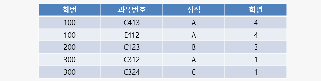
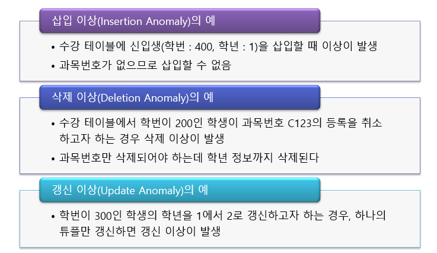

# 2022.05.24(화) - 11주차

 

## 전통적인 관계형 모델

 

    1970년대 - 관계형 모델 등장
    1976년대 - 개체 관계형 모델 등장

 

복습의 차원에서 보면 전체 데이터 설계 과정은 **개념적 설계 -> 논리적 설계 -> 물리적 설계**의 순서로 이루어졌었다. **개념적 설계**의 과정에서 쓰이는 것이 개체 관계형 모델이다.

 

1. 개체 관계형 모델을 이용하여 개념적 설계를 하여 결과물인 ERD를 얻는다.
2. ERD를 매핑룰을 이용하여 테이블을 만들고 정규화(제3정규형 혹은 BCNF)를 진행하여 논리적 설계를 한다.
3. 최종적인 결과물로 물리적 설계를 진행한다.

 

수업에서는 정규화에 관한 이론까지 설명하고, 직접적인 물리적 설계는 하지 않는다.

위를 다시 보면, 개체 관계형 모델이 1976년 대에 등장했으니까 그것이 등장하기 이전에 사용하던 모델이 **전통적인 관계형 모델**이다. 그때 당시에 데이터베이스를 설계하던 과정을 살펴보겠다.

 

1. 필요한 모든 속성들을 모아서 큰 테이블 1개를 만든다. (ex. R 테이블)
2. 이 전체 테이블이 1NF(제1정규형)을 만족하는지 확인한다. 1NF를 만족하지 않는 테이블이라면 정규화하고 만족한다면 다음 단계로 넘어간다. 정규화는 테이블을 쪼개는(분해하는) 행위로 이해한다.
3. 이 전체 테이블이 2NF(제2정규형)을 만족하는지 확인한다. 2NF를 만족하지 않는 테이블이라면 정규화하고 만족한다면 다음 단계로 넘어간다.
4. 이 전체 테이블이 3NF(제3정규형)을 만족하는지 확인한다. 3NF를 만족하지 않는 테이블이라면 정규화하고 만족한다면 다음 단계로 넘어간다.
5. 이 전체 테이블이 BCNF를 만족하는지 확인한다. BCNF를 만족하지 않는 테이블이라면 정규화하고 만족한다면 다음 단계로 넘어간다.
6. 이 전체 테이블이 4NF(제4정규형)을 만족하는지 확인한다. 4NF를 만족하지 않는 테이블이라면 정규화하고 만족한다면 다음 단계로 넘어간다.
7. 이 전체 테이블이 5NF(제5정규형)을 만족하는지 확인한다. 5NF를 만족하지 않는 테이블이라면 정규화하고 만족한다면 다음 단계로 넘어간다.

 

사실, 제5정규형까지 반드시 넘어가야하는 것은 아니고 보통 BCNF까지만 확인하는 경우가 많다.

 

## 이상 (Anomaly)

 

말 그대로 이상하다는 의미이다. 테이블을 조작할 때 문제가 생긴다는 의미이다.

 

-   테이블에서 일부 속성들의 **종속**으로 인해 불필요한 데이터의 **중복**이 발생하고 이 중복으로 인해 테이블 조작시 문제가 발생하는 현상이다. (여기서 종속이란, 이전 시간의 함수적 종속 FD가 불필요한 종속일 경우를 의미한다.)

 

-   종류
    -   삽입 이상(Insertion Anomaly)
    -   삭제 이상(Deletion Anomaly)
    -   갱신 이상(Update Anomaly)

 

-   예제 테이블 : 수강

</img>

 

예제를 보면, 학번, 과목번호, 성적까지는 괜찮다. 그러나, 학년 때문에 문제가 생긴다. 실세계에서 학번을 보면 학년이 정해진다. 예제에서는 기본키(PK)가 (학번, 과목번호)인데, 기본키가 아닌 (학번) 하나만으로 정해지는 것이 있기 때문에 문제가 발생하는 것이다.

 

</img>

