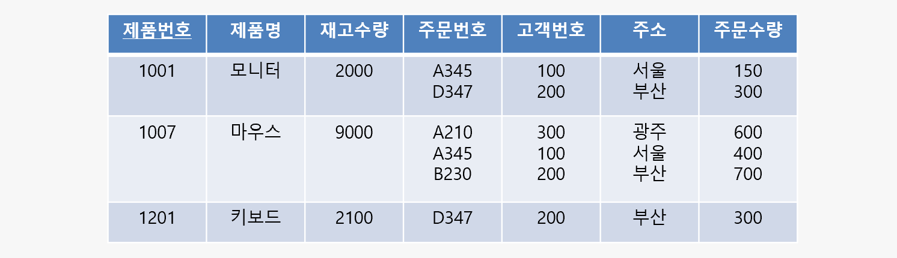
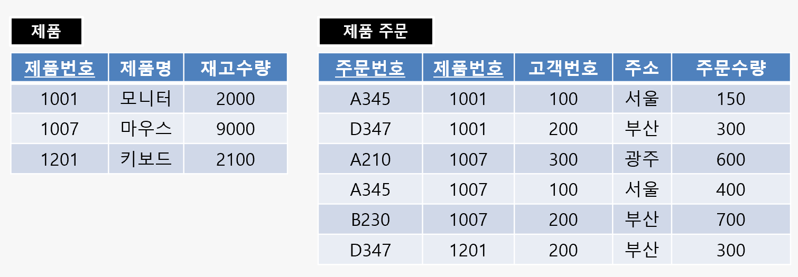
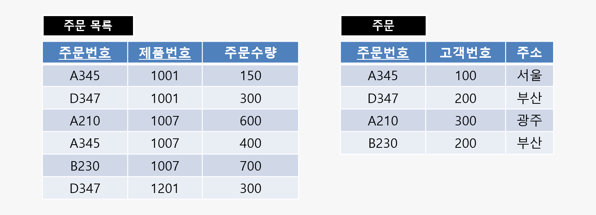
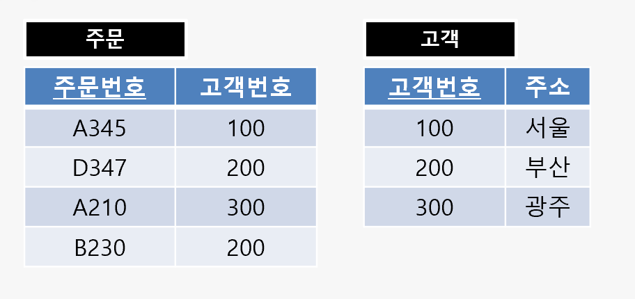
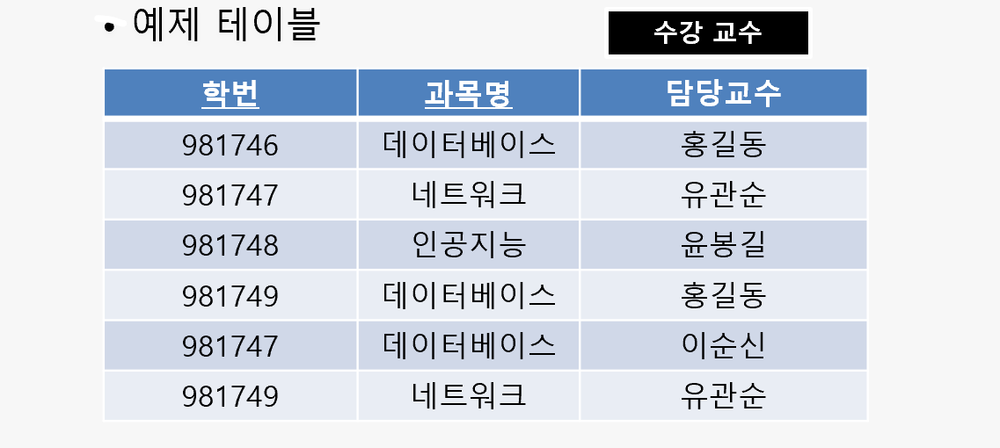
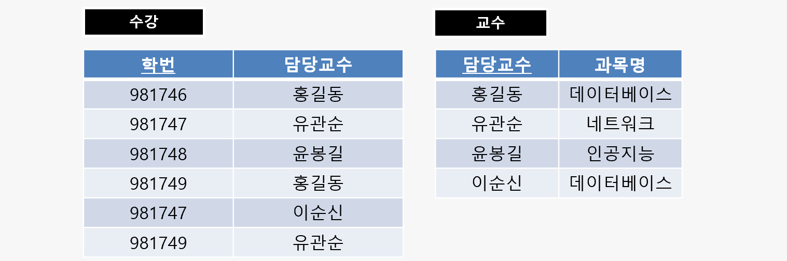

# 2022.05.24(화) - 11주차

 

## 전통적인 관계형 모델

 

    1970년대 - 관계형 모델 등장
    1976년대 - 개체 관계형 모델 등장

 

복습의 차원에서 보면 전체 데이터 설계 과정은 **개념적 설계 -> 논리적 설계 -> 물리적 설계**의 순서로 이루어졌었다. **개념적 설계**의 과정에서 쓰이는 것이 개체 관계형 모델이다.

 

1. 개체 관계형 모델을 이용하여 개념적 설계를 하여 결과물인 ERD를 얻는다.
2. ERD를 매핑룰을 이용하여 테이블을 만들고 정규화(제3정규형 혹은 BCNF)를 진행하여 논리적 설계를 한다.
3. 최종적인 결과물로 물리적 설계를 진행한다.

 

수업에서는 정규화에 관한 이론까지 설명하고, 직접적인 물리적 설계는 하지 않는다.

위를 다시 보면, 개체 관계형 모델이 1976년 대에 등장했으니까 그것이 등장하기 이전에 사용하던 모델이 **전통적인 관계형 모델**이다. 그때 당시에 데이터베이스를 설계하던 과정을 살펴보겠다.

 

1. 필요한 모든 속성들을 모아서 큰 테이블 1개를 만든다. (ex. R 테이블)
2. 이 전체 테이블이 1NF(제1정규형)을 만족하는지 확인한다. 1NF를 만족하지 않는 테이블이라면 정규화하고 만족한다면 다음 단계로 넘어간다. 정규화는 테이블을 쪼개는(분해하는) 행위로 이해한다.
3. 이 전체 테이블이 2NF(제2정규형)을 만족하는지 확인한다. 2NF를 만족하지 않는 테이블이라면 정규화하고 만족한다면 다음 단계로 넘어간다.
4. 이 전체 테이블이 3NF(제3정규형)을 만족하는지 확인한다. 3NF를 만족하지 않는 테이블이라면 정규화하고 만족한다면 다음 단계로 넘어간다.
5. 이 전체 테이블이 BCNF를 만족하는지 확인한다. BCNF를 만족하지 않는 테이블이라면 정규화하고 만족한다면 다음 단계로 넘어간다.
6. 이 전체 테이블이 4NF(제4정규형)을 만족하는지 확인한다. 4NF를 만족하지 않는 테이블이라면 정규화하고 만족한다면 다음 단계로 넘어간다.
7. 이 전체 테이블이 5NF(제5정규형)을 만족하는지 확인한다. 5NF를 만족하지 않는 테이블이라면 정규화하고 만족한다면 다음 단계로 넘어간다.

 

사실, 제5정규형까지 반드시 넘어가야하는 것은 아니고 보통 BCNF까지만 확인하는 경우가 많다.

 

## 이상 (Anomaly)

 

말 그대로 이상하다는 의미이다. 테이블을 조작할 때 문제가 생긴다는 의미이다.

 

-   테이블에서 일부 속성들의 **종속**으로 인해 불필요한 데이터의 **중복**이 발생하고 이 중복으로 인해 테이블 조작시 문제가 발생하는 현상이다. (여기서 종속이란, 이전 시간의 함수적 종속 FD가 불필요한 종속일 경우를 의미한다.)

 

-   종류
    -   삽입 이상(Insertion Anomaly)
    -   삭제 이상(Deletion Anomaly)
    -   갱신 이상(Update Anomaly)

 

-   예제 테이블 : 수강

</img>

 

예제를 보면, 학번, 과목번호, 성적까지는 괜찮다. 그러나, 학년 때문에 문제가 생긴다. 실세계에서 학번을 보면 학년이 정해진다. 예제에서는 기본키(PK)가 (학번, 과목번호)인데, 기본키가 아닌 (학번) 하나만으로 정해지는 것이 있기 때문에 문제가 발생하는 것이다.

 

</img>

 

- 신입생의 경우 입학만 결정되었고 아직 수강신청을 하지 않은 상태일 때 과목번호를 모르는 상태이다. **하지만, 과목번호는 PK의 일부니까 반드시 필요하다. 왜냐하면 기본키는 NULL이 될 수 없기 때문이다.** 따라서, 삽입 이상이 발생할 것이다.
- 위의 예시인 수강 테이블 하나로 학생의 정보, 수강 정보 등을 모두 파악하고 있다. 그래서, 삭제 이상의 예로 삭제를 진행해보면, 학년 정보까지 삭제가 되어 마치 퇴학시키는 것처럼 보인다.
- 학번이 300인 학생이 여러 과목을 수강하여 여러 튜플이 있을 수 있다. 이때, 하나의 튜플만 갱신하여 갱신 이상이 발생하는 경우가 있다.

 

## 정규형과 정규화

 

**정규화**는 테이블의 속성들이 상호 종속적인 관계를 갖는 특성을 이용하여 테이블을 **무손실 분해**하는 과정으로, 정규화의 목적은 가능한 한 중복을 제거하여 삽입, 갱신, 삭제 이상의 발생 가능성을 줄이는 것이다.

    무손실 분해는 그냥 테이블을 나눈다.
    테이블을 쪼갠다는 개념으로 이해하자.

 

- 정규형
    - 1NF (First Normal Form) : 제 1정규형
    - 2NF (Second Normal Form) : 제 2정규형
    - 3NF (Third Normal Form) : 제 3정규형
    - BCNF (Boyce and Codd Normal Form) : 강한 제3정규형
    - 4NF (Fourth Normal Form) : 제 4정규형
    - 5NF (Fifth Normal Form) : 제 5정규형

포함 관계라고 생각하면 되는데, 제 1정규형이 제일 넓은 범위이다. 즉, 어떤 데이터베이스가 5NF를 만족한다고 하면 그 데이터베이스는 앞의 모든 정규형들을 만족한다.

    1도 2부 3이 보결 << 이렇게 암기
    1정규형은 도메인이 원자
    2정규형은 부분 함수적 종속 제거
    3정규형은 이행적 함수족 정속 제거
    BCNF는 결정자! 이렇게 외운다.

 

- 예제 테이블 : 주문 목록

</img>

 

## 제 1정규형 (First Normal Form)

 

테이블 R에 속한 모든 속성의 **도메인이 원자 값**만으로 되어 있는 정규형을 제 1정규형이라 한다. 이 말은 모든 속성에 들어갈 값은 **딱 하나의 값**이 들어가야 하고 심플한 값이 들어가야 한다는 의미이다. 즉, 구조체나 집합 같은 값이 들어갈 수 없다는 의미이고 여러 개의 값이 들어갈 수 없다는 의미이다.

 

주문 목록 예시를 보면, 주문번호, 고객번호 등 도메인이 여러 값을 가지므로 1NF를 만족하지 못한다. 따라서, 만족하도록 무손실 분해해야한다. 여기서는 제 1정규형을 만족하도록 제 1정규화를 한다.

 

    제1정규화 원리 : 함수적 종속 PK -> A이 있고,
    B는 PK와 A를 제외한 속성들의 집합일 때,
    PK와 A로 이루어진 테이블과
    PK와 B로 이루어진 테이블로 분해한다.

 

예시의 경우, 주문번호도 중복될 수 있고 제품번호도 중복될 수 있지만, 주문번호와 제품번호의 집합은 중복되지 않는다. 따라서, {주문번호, 제품번호}를 PK로 한다.

 

</img>

 

## 제 2정규형 (Second Normal Form)

 

테이블 R이 제1정규형이고, 기본 키가 아닌 모든 속성이 기본 키에 대하여 완전 함수적 종속을 만족하는 정규형, 따라서 **부분 함수적 종속을 완전히 제거**해야 한다.

 

여기에서, 완전 함수적 종속과 부분 함수적 종속의 차이를 살펴보겠다.
- 완전 함수적 종속 
  - FD1 : PK -> { }, 기본키가 왼쪽인 함수적 종속
- 부분 함수적 종속
  - FD2 : O -> { }, 왼쪽이 기본키의 진부분 집합인 경우, 기본키일 수는 없다.

 

예를 들어, PK가 `{a, b}`라고 하자. `{a, b} -> { }`의 형태는 완전 함수적 종속이고 `{a} -> { }` 혹은 `{b} -> { }`의 형태는 부분 함수적 종속이다. 따라서, 제2정규형은 이러한 부분 함수적 종속을 없애는 과정이다.

 

- 제품 테이블의 경우 `{제품번호} -> {제품명, 재고수량}`의 경우 PK가 {제품번호}로 단일 속성이니까 부분 함수적 종속이 없을 수 밖에 없다. 따라서, 제2정규형에 있다.

 

- 제품 주문 테이블의 경우 함수적 종속을 살펴보면,
    - FD1 : `{주문번호, 제품번호} -> {고객번호, 주소, 주문수량}`
    - FD2 : `{주문번호} -> {고객번호, 주소}`
    - FD3 : `{고객번호} -> {주소}`

 

- 이를 정확하게 규범적 덮개 형태로 나타내면,
    - FD1 : `{주문번호, 제품번호} -> {주문수량}`
    - FD2 : `{주문번호} -> {고객번호}`
    - FD3 : `{고객번호} -> {주소}`

 

- FD3을 살펴보면 `{고객번호}`는 기본키 `{주문번호, 제품번호}`의 진부분 집합이 아니기 때문에 제2정규형과는 상관이 없다.
- FD1을 살펴보면 `{주문번호, 제품번호}` 니까 기본키라서 완전 함수적 종속이다.
- FD2를 살펴보면 `{주문번호}`는 기본키의 진부분집합이다. 따라서, 부분 함수적 종속이니까 제2정규형이 아니라서 무손실 분해 해야 한다.

 

    제2정규화 원리 : 부분 함수적 종속 A->B가 있고,
    C는 A와 B를 제외한 속성들의 집합일 때,
    A와 B로 이루어진 테이블과
    A와 C로 이루어진 테이블로 분해한다.

 

</img>

 

## 제 3정규형 (Third Normal Form)

 

테이블 R이 제2정규형이고, 기본키가 아닌 모든 속성이 기본키에 대하여 이행적 함수적 종속을 만족하지 않는 정규형, 따라서 **이행적 함수적 종속을 완전히 제거해야 한다.**

 

- 이행적 함수적 종속
    - `A -> B`이고, `B -> C` 일 때 `A -> C`를 만족하는 함수적 종속이다.

 

현재, 제2정규화까지 마친 테이블은 `제품, 주문 목록, 주문`까지 분해됐다.

 

- 제품 테이블의 함수적 종속
    - `{제품번호} -> {제품명, 재고수량}`

 

- 주문 목록 테이블의 함수적 종속
    - `{주문번호, 제품번호} -> {주문수량}`

 

- 주문 테이블의 함수적 종속
    - FD1 : `{주문번호} -> {고객번호, 주소}`
    - FD2 : `{고객번호} -> {주소}`

 

- `{주문번호} -> {고객번호}`이고 `{고객번호} -> {주소}`이므로 이행적 함수적 종속이 존재하므로, 제3정규화를 진행하여야 한다.

 

    제3정규화 원리 : 모든 함수적 종속에서 불필요한
    속성을 제거한다. 이후, 각각의 함수적 종속들로
    이루어진 릴레이션을 만든다.

    만약 원래 릴레이션의 후보 키를 포함하는
    릴레이션이 없으면 후보키로 이루어진
    릴레이션을 만든다.

 

- 불필요한 속성이 제거된 함수적 종속들
    - FD1 : `{주문번호} -> {고객번호}`
    - FD2 : `{고객번호} -> {주소}`

 

</img>

 

## BCNF (Boyce and Codd Normal Form)

 

- 테이블 R에서 모든 결정자가 후보키인 정규형, 즉, **왼쪽이 모두 후보키**
- 불필요한 속성이 없는 모든 함수적 종속의 왼쪽이 모두 후보키
- 제3정규형에 후보키가 여러 개 존재하고 후보키들이 서로 중첩되어 나타나는 경우 적용 가능

    결정자란, 어떤 속성의 값이 다른 속성의 값을
    고유하게 결정할 수 있는 경우이다.
    예를 들어, A가 B를 결정하는 결정자라고 하면
    A -> B로 표현한다.

 

</img>

 

예시를 보면, 데이터베이스를 담당하는 교수가 홍길동도 있고 이순신도 있다. 학생들은 둘 중에 하나만 선택해서 들을 수 있다. 따라서, 여기에서 `{학번, 과목명}`이 기본키가 되는 것이다. 또 하나의 조건은 담당교수 한 명은 하나의 과목만 맡을 수 있다.

 

- 예제 테이블에 존재하는 함수적 종속
    - FD1 : `{학번, 과목명} -> {담당교수}`
    - FD2 : `{담당교수} -> {과목명}`

 

- `{학번, 과목명} -> {담당교수}` 이고 `{담당교수} -> {과목명}`을 보고 `{학번, 과목명} -> {과목명}`이 되니까 이행적 함수적 종속을 위배해서 제3정규형이 없냐고 할 수도 있지만, `{학번, 과목명} -> {과목명}`은 뜻 없는 함수적 종속이라서 이행적 함수적 종속이 없는 것이다. 따라서, 위 예제는 제3정규형이 있다.

 

- FD1의 왼쪽은 기본키니까 후보키가 맞다.

 

- 그러나, FD2의 왼쪽은 담당교수는 동일한 교수가 여러번 나타나니까 슈퍼키가 아니면서 후보키도 아니다. 따라서, 제3정규형은 있지만 BCNF는 없는 경우이다.

 

    BCNF(보이스-카드) 정규화 원리 : BCNF 규칙에
    어긋나는 함수적 종속의 왼쪽을 A, 오른쪽을 B,
    나머지 속성 집합을 C라고 할 때,
    A와 B로 이루어진 릴레이션과
    A와 C로 이루어진 릴레이션으로 분해한다.

 

BCNF 규칙에 어긋나는 함수적 종속의 왼쪽이 담당교수, 오른쪽이 과목명 이니까 담당교수를 A라 하고 과목명을 B라 한다. 그러면 학번이 자연스레 C가 된다.

 

</img>

 

그런데, 결과를 보면 FD1이 그냥 사라진 것을 볼 수 있다. 이는 BCNF 정규형은 **함수적 종속을 유지하는 것을 보장 못한다**는 의미이다.

 

## 그 외의 정규형

 

- 제4정규형 : 테이블 R에 다중값 종속(MVD : Multi Valued Dependency) A->B가 존재할 경우 R의 모든 속성이 A에 함수적 종속 관계를 만족하는 정규형

 

- 제5정규형 : 테이블 R의 모든 조인 종속(JD)이 R의 후보키를 통해서만 성립되는 정규형

 

- 역정규화(Denormalization) : 정규화로 분해가 너무 많이 되어서 조인이 너무 많이 필요해서 성능이 떨어진다면 오히려테이블을 다시 합치는 게 나은데 이것을 역정규화라고 한다.

 

## 역정규화

 

- 시스템의 성능 향상, 개발 및 운영의 편의성 등을 위해 정규화된 데이터 모델을 통합, 중복, 분리하는 과정이다. **의도적으로 정규화 원칙을 위배하는 행위이다.**

 

- 역정규화를 수행하면 시스템 성능이 향상되고 관리 효율성은 증가하지만 데이터의 일관성 및 정합성이 저해될 수 있다.

 

- 과도한 역정규화는 오히려 성능을 저하시킬 수도 있다.

 

- 역정규화를 위해서는 사전에 시스템의 목적을 데이터 일관성, 무결성을 우선으로 할지, DB의 성능과 단순화를 우선으로 할지 정해야 한다.

 

- 방법 : 테이블 통합, 테이블 분할, 중복 테이블 추가, 중복 속성 추가

  

### 테이블 통합

 

두 개의 테이블을 조인하는 경우가 많을 때, 그냥 통합하는 것이다. 예시로 두 개의 테이블을 이용하여 항상 조회를 수행하는 경우가 있다.

 

- 종류 : 1:1 관계 테이블 통합, 1:N 관계 테이블 통합, 슈퍼타입/서브타입 테이블 통합 (슈퍼타입과 서브타입은 부모-자식 클래스 같은 개념이다.)

 

- 고려 사항
    - 데이터 검색은 간편하지만 레코드 증가로 처리량 증가
    - 입력, 수정, 삭제 규칙이 복잡해질 수 있다. -> 이상 발생 가능성 증가
    - Not null, Default, Check 등의 제약 조건 설계가 어렵다.

 

### 테이블 분할

 

테이블을 수직, 혹은 수평으로 분할하는 것이다.

 

- 수평 분할 : 레코드를 기준으로 테이블을 분할, 레코드 별로 사용 빈도 차이가 큰 경우

 

- 수직 분할 : 속성을 기준으로 테이블을 분할, 속성이 너무 많은 경우
    - 갱신 위주의 속성 분할 : 데이터 갱싱할 때 레코드 잠금, 갱신이 자주 일어나는 속성을 분할
    - 자주 조회되는 속성 분할 : 자주 조회되는 속성이 극히 일부일 때
    - 크기가 큰 속성 분할 : 이미지 혹은 2GB 이상의 텍스트 형식 등
    - 보안을 적용해야 하는 속성 분할 : 특정 속성에 대해서만 보안을 적용

 

- 분할 시 고려사항
    - 기본키의 유일성 관리가 어려워진다.
    - 데이터 양이 적거나 사용 빈도가 낮으면 굳이 분리해야 할까?
    - 수행 속도가 느려질 수도 있다.
    - 데이터 검색에 중점을 두고 분할할 것

 

### 중복 테이블 추가

 

여러 테이블에서 데이터를 추출해서 사용해야 하거나 다른 서버에 저장된 테이블을 이용해야 하는 경우 중복 테이블을 추가하여 작업 효율 향상 가능하다.

 

- 중복 테이블을 추가하는 경우
    - 정규화로 인한 수행 속도 감소
    - 많은 범위의 데이터를 자주 처리
    - 특정 범위의 데이터만 자주 처리
    - 처리 범위를 줄이지 않고는 수행 속도를 개선할 수 없는 경우

 

- 추가하는 방법
    - 집계 테이블 : 집계를 위한 테이블 + 원본 테이블에 트리거
    - 진행 테이블 : 이력 관리, 백업
    - 특정 부분만을 포함하는 테이블

 

### 중복 속성 추가

 

조인해서 데이터를 처리할 때 조회 경로의 단축을 위해 자주 사용하는 속성을 추가하는 것이다.

 

- 중복 속성을 추가하는 경우
    - 조인이 자주 발생하는 속성
    - 접근 경로가 복잡한 속성
    - 액세스의 조건으로 자주 사용되는 속성
    - 기본키의 형태가 적절하지 않거나 여러 개의 속성으로 이루어진 경우

 

- 고려사항
    - 테이블 중복과 속성의 중복을 고려
    - 데이터 일관성 및 무결성에 유의
    - SQL 그룹 합수를 이용하여 처리할 수 있을 지
    - 저장공간이 지나치게 낭비되는 것은 아닐지