# 2022.05.31(화) - 12주차

<br>

11주차 내용을 복습하며 말하겠다. 데이터베이스 설계형 방식에는 크게 두 가지가 있다. 전통적인 데이터베이스 설계 방식과 개체형 관계형 모델을 이용한 새로운 데이터베이스 설계 방식이 있다. 11주차에서는 전통적인 데이터베이스 설계 방식을 공부했었다.

<br>

관계형 모델을 이용한 전통적인 데이터베이스 설계 방식

1. 모든 속성을 모으고 하나의 테이블로 만든다. 그리고 기본키를 찾는다.
2. 규범적 덮개 SFD를 찾는다.
3. 그 이후 1NF -> 2NF -> 3NF -> BCNF와 같은 식으로 테이블을 분해한다.
4. 필요하다면 역정규화를 진행한다.

<br>

하지만, 전통적인 방식은 모든 속성을 하나로 모으기 때문에 기본키를 찾는 과정부터가 복잡하고 어렵다. 규범적 덮개 찾기도 힘들다. 그래서 추천하는 방식은 전통적인 방식보다 새로운 방식이다.

<br><br>

## 새로운 관계형 DB 설계 과정

<br>

<p align="center">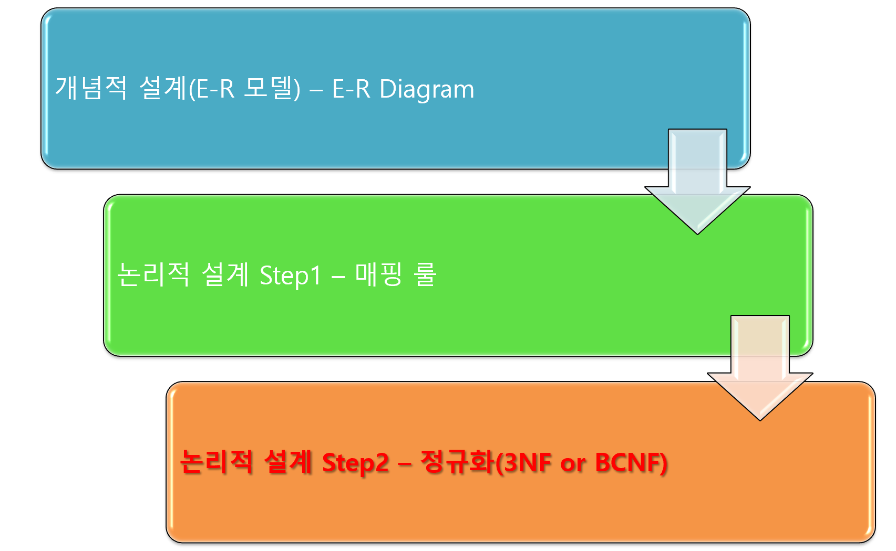</img></p>

<br>

**목표**

1. 관계형 DB는 다양하게 설계될 가능성이 있다. 어떤 DB가 제대로 설계된 DB인지 판단할 필요는 있다.
2. 판단 기준 - 상황에 따라 정말 다양한 목적과 그에 따른 판단 기준들이 나온다.
3. 관계형 DB의 목표 : **불필요한 데이터의 중복을 막는다.**
4. 함수적 종속을 활용하여 정규형을 정의하여 그 형에 맞게 설계한다.

<br>

**데이터베이스의 좋은 설계와 나쁜 설계 예시**

<br>

```
설계 1

학생 = {학번, 이름, 주소}, PK = {학번}
수강 = {학번, 과목번호, 성적}, PK = {학번, 과목번호}, FK = {학번}

중복되는 데이터는 어떤 것인가?
```

```
설계 2

학생_수강 = {학번, 과목번호, 이름, 주소, 성적},
PK = {학번, 과목번호}

중복되는 데이터는 어떤 것인가?
```

<br>

즉, 설계 1은 테이블 2개로 나눠서 저장한 형태이고 설계 2는 테이블 1개로 저장한 형태이다. 얼핏보면, 설계1이 속성이 6개이고 학번 속성이 중복되는 것을 보고 설계1보다 설계2가 좋은 설계라고 생각할 수 있지만 그렇지 않다.

<br>

사실, 설계1에서 학번이 중복되는 것은 불필요한 중복이 아니라 **필요한 중복**이다. 그리고 설계2에서도 중복되는 데이터가 있다. 그 전에 예시를 통한 간단한 설명을 하겠다.

<br>

만약, 1000명의 학생이 있고 학생 한 명당 6개의 수강신청을 한다고 하자.

<br>

설계1에서는 `학생 테이블의 레코드가 1000개`, `수강 테이블의 레코드가 6000개` 일 것이다. 학생 테이블의 속성이 3개니까 1000명의 학생을 표현하기 위해 저장해야 할 값은 `1000 * 3 = 3000`이다. 수강 테이블의 속성이 3개니까 6000개의 수강 내역을 저장하려면 `6000 * 3 = 18000`이다. 그렇다면, 1000명의 학생이 6000건의 수강 내역을 저장하기 위해서 학번은 `3000 + 18000 = 21000개` 필요할 것이다.

<br>

설계2에서는 6000건의 수강 내역을 표시하기 위해 `6000개의 레코드`가 필요하다. 속성이 5개니까 `6000 * 5 = 30000개`이다. 

<br>

설계1이나 설계2나 표현하고자 하는 데이터는 `1000명의 학생이 6000건의 수강신청을 한 것`으로 동일하다. 그런데, 거기에 `필요한 값의 양`이 설계1은 21000개, 설계2는 30000개 이다. 이 말은 **설계2에서 불필요한 중복이 발생하고 있다**는 의미이다.

<br>

1명의 학생이 6개의 수강신청을 모두 했다고 하자. 설계1에서는 `학생테이블에서 학번이 1번 나오고 수강 테이블에서 학번이 6번` 나올 것이다. 이름과 주소는 학생 테이블에서 한 번만 나오고 수강 테이블에서는 나오지 않을 것이다. **그러나** 설계2에서는 학번이 6번 나오더라도 `이름과 주소가 불필요하게 6번씩 반복`되어 나올 것이다. 즉, 설계1은 필요한 중복, 설계2는 불필요한 중복이다.

<br>

    불필요한 중복의 문제점
    1. 디스크 공간을 낭비
    2. Update가 아주 복잡해짐

<br>

    불필요한 중복이 생겼을 때의 해결책

      1. 스키마 나누기(Decomposition)

      2. Decomposition 할 때의 고려사항
       - 가짜 튜플을 만들지 않게 나누기(필수)
       - 함수적 종속을 유지하는 나누기(선택)

    가짜 튜플은 나뉜 두 테이블을 자연조인 했을 때 나온
    결과 테이블에 나누기 전에 있던 테이블에는 없던
    튜플이 나오는 경우 이 튜플을 가짜 튜플이라 한다.

<br>

참고로 말할 것이 스키마를 나눈다고 해서 새로운 함수적 종속이 생기지는 않는다. 스키마를 나눈다고 해서 새로운 속성이 추가되는 것은 아니기 때문이다. 만약, 새로운 함수적 종속을 발견한다면 새로 생긴 것이 아니라 이전에 발견하지 못한 것이다.

<br>

함수적 종속을 유지하는 나누기는 나중에 말할 것이지만, 3NF는 함수적 종속을 유지하는 것을 보장하고 BCNF는 함수적 종속을 유지한다는 보장할 수 없다.

<br>

<p align="center">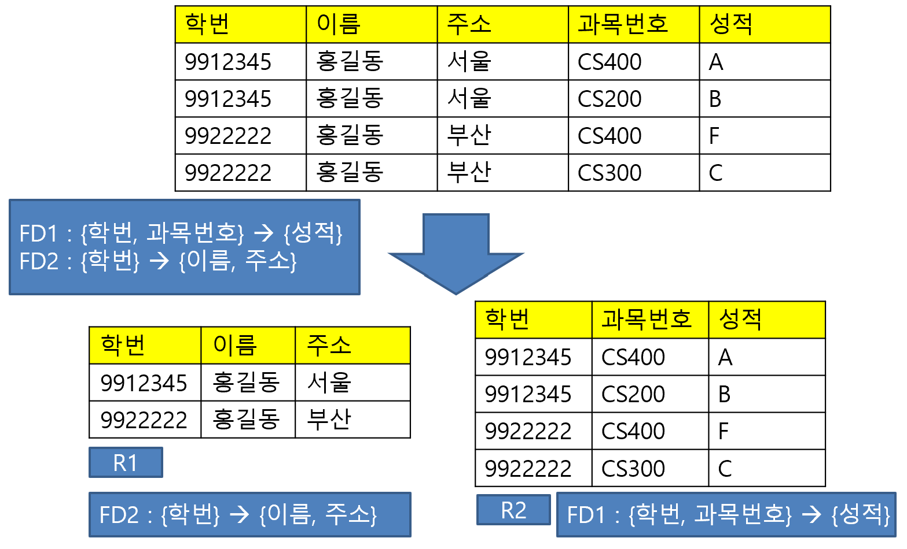</img></p>

<br>

위의 것이 설계1이고 아래의 것이 설계2이다. 설계1을 보면 `2명의 학생 4건의 수강신청을 표현하는데 필요한 값이 20개`인 것을 확인할 수 있다. 설계2를 보면 `2명의 학생 4건의 수강신청을 표현하는데 필요한 값이 18개`인 것을 확인할 수 있다. 튜플과 속성의 수가 작으니까 차이가 작아보이지만, 나중에는 차이가 커질 수 있는 것을 추측가능하다.

<br>

또, 예제에서 설계1의 함수적 종속 FD1과 FD2가 설계2에 그대로 계승되는 것으로 보아 함수적 종속이 유지된다는 것을 알 수 있다. 설계1을 학번 스키마를 기준으로 나눠서 설계2가 된 것이다.

<br>

<p align="center">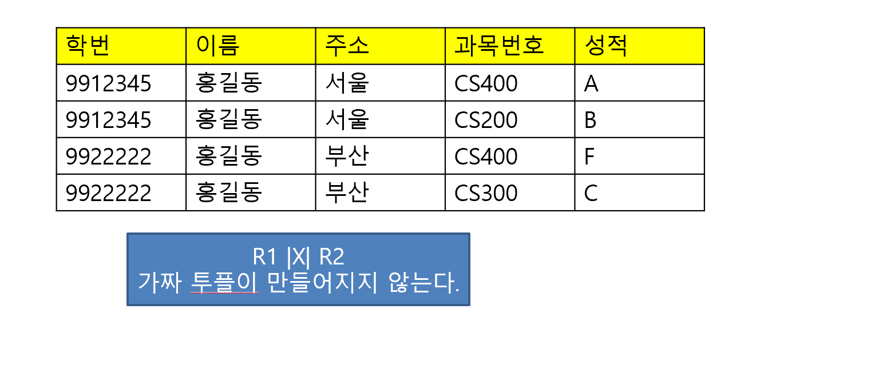</img></p>

<br>

이는 설계2의 테이블 2개를 자연조인해보면 가짜 튜플이 만들어지지 않는 것을 알 수 있다.

<br>

<p align="center">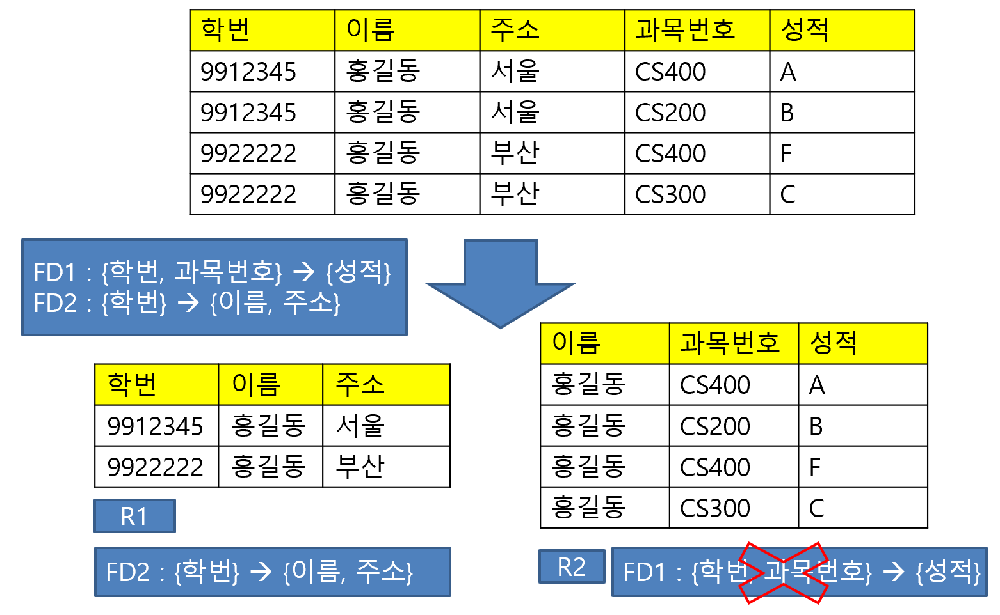</img></p>

<br>

그러나, 만약 위와는 다르게 학번이 아닌 이름 스키마를 기준으로 나눈다면 어떻게 될까? 이 예제에서는 공교롭게도 이름이 홍길동으로 동일하다. 그래서 FD2는 R1으로 계승이 되지만, FD1은 R2로 계승이 되지 않는다. 왜냐하면 FD1의 `{학번, 과목번호} -> {성적}`을 보고 R2를 보면 뭐 알 방법이 없다. 이름과 과목번호가 정해진다고 성적이 정해지지 않는다.

<br>

<p align="center">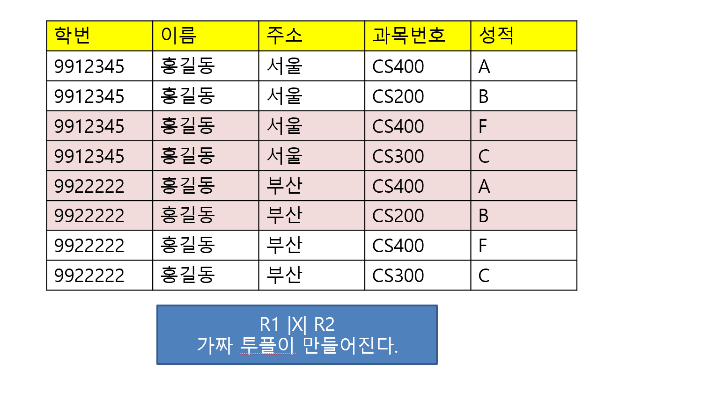</img></p>

<br>

더 확인해보려고 R1과 R2를 자연조인해보면, 이름이 공통속성이 되기 때문에 빨갛게 표현된 가짜 튜플이 만들어진다. 이렇게 잘못된 나누기를 하면 잘못된 결과가 나올 수 있다는 의미이다. 어느 때는 3NF로 하고 어느 때는 BCNF로 해라는 그런 의미가 아니다.

<br>

## 새로운 설계에 BCNF 적용

<br>

- 정규형에 대하여 복습해보면, 관계형 DB의 정규형은 관계형 DB의 형태를 정의해놓은 것이다. 즉, **관계형 DB가 이러이러한 형태의 모습이면 좋겠다**정도로 받아들이면 된다.
- 정규형은 함수적 종속을 이용해서 정의하며 정규형에 맞지 않는 스키마는 Decomposition을 이용해서 정규형에 맞게 고치는 정규화 과정을 거친다.
- 제 1정규형(1NF)는 관계형 DB의 정의이다. "모든 속성은 simple하고 single-valued이다."라는 것이다. 즉, 1NF를 만족하지 못하면 관계형 DB로 인정받지 못한다는 의미이다.
- 어떤 데이터베이스 스키마에 속한 모든 테이블 스키마가 어떤 정규형에 속할 때, 그 데이터베이스 스키마는 그 정규형에 있다고 한다.

<br>

앞의 전통적인 DB 설계 방식은 1NF부터 순차적으로 진행했다면, 새로운 DB 설계 방식은 E-R로 만들고 매핑룰을 이용하여 결과물인 최종적인 테이블을 바로 BCNF나 3NF로 정규화 하는 것이다. 매핑룰을 적용하면 1NF는 자연스럽게 만족하는 것이고 BCNF나 3NF를 해서 만족한다면 자연스레 2NF도 만족하기 때문이다.

<br>

<p align="center">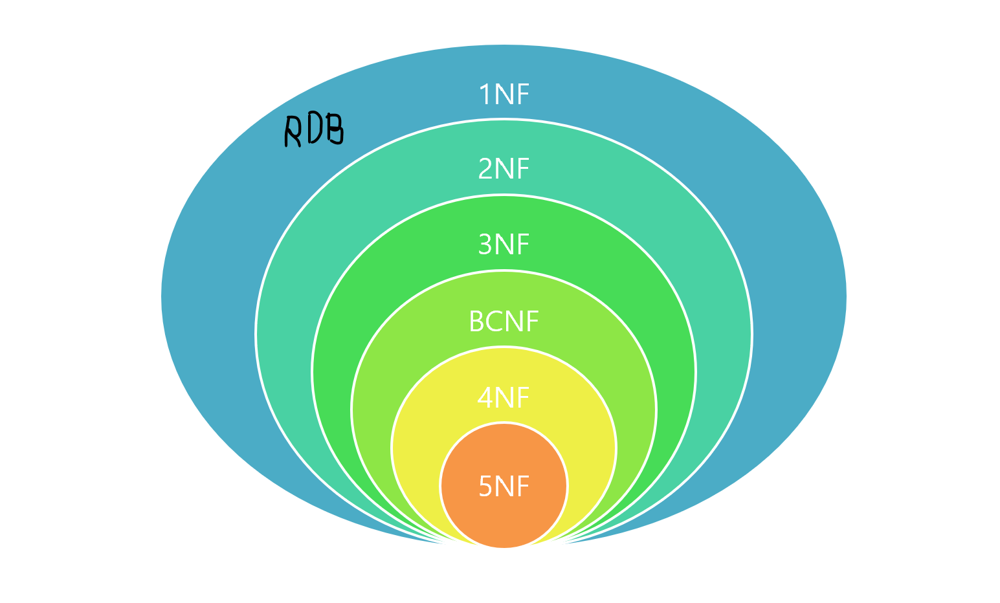</img></p>

<br>

**BCNF 정의**

<br>

`F+`에 있는, `a -> b` 형태로 된 모든 함수적 종속 (FD) 각각에 대하여, 다음 조건 가운데 하나라도 만족하면, 주어진 함수적 종속의 집합 F에 관하여 스키마 R은 BCNF에 속한다.

    여기서 F+에서 + 기호는 함수적 종속의 울타리이다.
    어떤 테이블 스키마가 있다고 했을 때,
    이 테이블 안에 있는 모든 FD에 대해서~ 라는 의미

<br>

1. `a -> b`가 뜻 없는 (trivial) 함수적 종속
2. `a`가 스키마 R의 슈퍼키(super key)

<br>

예를 들어, 어떤 스키마 R이 있다고 하자. 이 R의 수많은 함수적 종속이 있다고 하면 이걸 다 검사해야할까? 이것은 매우 힘들 것이다. 그래서 규범적 덮개 SFD를 만들어서 여기에 있는 함수적 종속만 검사하는 것이다. 이만 확인해도 BCNF가 있는지 알 수 있다. 

<br>

만약, 스키마 R의 규범적 덮개 SFD를 봤을 때 FD1, FD2, FD3가 있다고 하자. 각각의 FD가 1번 조건과 2번 조건 둘 중의 하나를 만족한다고 하면 스키마 R은 BCNF에 있다는 것이다. 만약 **하나라도 만족하지 못한다면 스키마 R은 BCNF에 없다.**

<br>

그런데 잘 생각해보면, 실제로 규범적 덮개 SFD를 잘 만들었다면, 뜻 없는 함수적 종속일 리 없다. 따라서 실질적으로 신경 쓸 조건은 2번 조건인 왼쪽이 슈퍼키인가 이다.

<br>

<p align="center">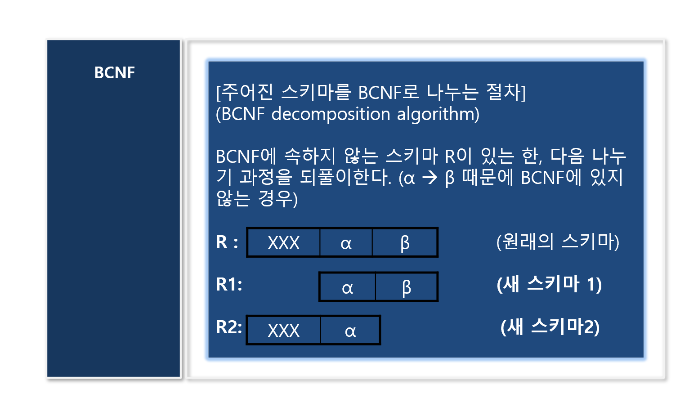</img></p>

<br>

어떤 스키마 R이 BCNF에 속하지 않는 예시이다. 속하지 않으면 나누면 된다. BCNF는 두 개로 나눈다. (R을 R1과 R2로) 그래서, 나누기의 기준이 되는 `기준 FD : a -> b`가 있다. 이는 `R1은 a와 b로 이루어진 스키마`, `R2는 a와 나머지로 이루어진 스키마` 이렇게 두 개로 나뉜다.

<br>

BCNF를 어기는 함수적 종속이니까 이 말은 원래의 스키마 `R: a -> b`에서 a는 `a는 R의 슈퍼키가 아니다`라는 의미이다. 여기서 R1과 R2로 나누면 `기존의 FD가 R1으로 계승된다.` 즉, R1에서 `a -> b`, `a -> a 이건 뜻 없는 함수적 종속`이니까 **a가 정해지면 b가 정해진다**는 의미이다. R1에서 a가 정해지면 R1이 전체가 정해지는 것이니까 `왼쪽인 a가 슈퍼키가 되는 것`이다.

<br>

이해가 쉽게 설명해보면, R에서 `FD1 : a -> b`가 있다고 하자. 여기서 a는 R의 슈퍼키가 아니어서 BCNF에 없었다. 그래서 BCNF가 있도록 `R을 R1과 R2로` 나누기로 했다. R1은 a와 b로 이루어진 스키마라고 치면 FD1은 R1으로 바로 계승된다. 결과적으로 `R1에서 a가 정해지면 a와 b 모두 정해지니까 a가 슈퍼키가 되어서 FD1은 BCNF를 만족하게 된다.`

<br>

## BCNF 나누기 알고리즘 특징

<br>

1. 가짜 튜플을 만들지 않는 나누기이다.
2. 함수적 종속을 유지한다는 보장은 없다.
3. 한 번의 나누기 과정에서 두 개의 스키마로 나누어진다.
4. 나누기 한 번으로 끝난다는 보장이 없다.
5. 모든 테이블 스키마가 BCNF에 있을 때까지 나누어야 한다.

<br>

## BCNF 연습

<br>

<p align="center">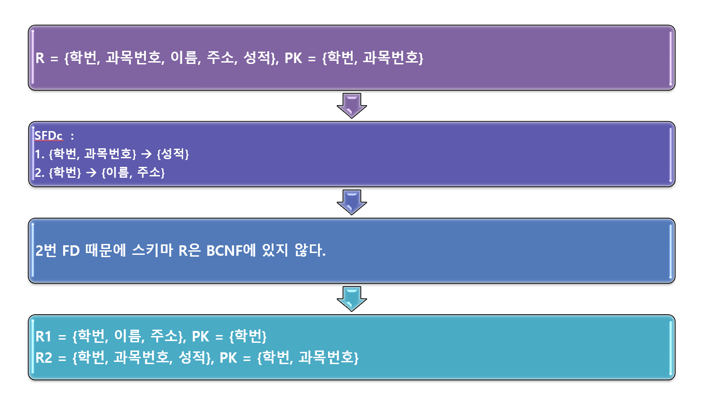</img></p>

<br>

- 학번이 여러번 나올 수 있으니까 규범적 덮개 SFD에서 2번째는 {학번}이 슈퍼키가 아니므로 조건을 위배하여 스키마 R은 BCNF에 있지 않게 된다.

<br>

- 따라서 나누기를 하면 기준 FD가 2번 FD가 되니까 `{학번}이 a`이고 `{이름, 주소}가 b`가 된다.

<br>

- 나누기를 진행해보면 `a와 b로 이루어진 R1`과 `a와 나머지로 이루어진 R2`로 나뉘게 된다. 그리고 R1은 FD2를 계승받고 R2는 FD1을 계승받는다.

<br>

- 다시 BCNF에 있는지 검사를 하기 위하여 R1의 FD2를 검사해보면 FD2의 {학번}이 이제는 슈퍼키가 되었으니까 R1은 BCNF에 있다.

<br>

- R2를 보면 FD1의 a가 {학번, 과목번호}니까 이것도 슈퍼키가 되면서 R2에도 BCNF가 있다.

<br>

<p align="center">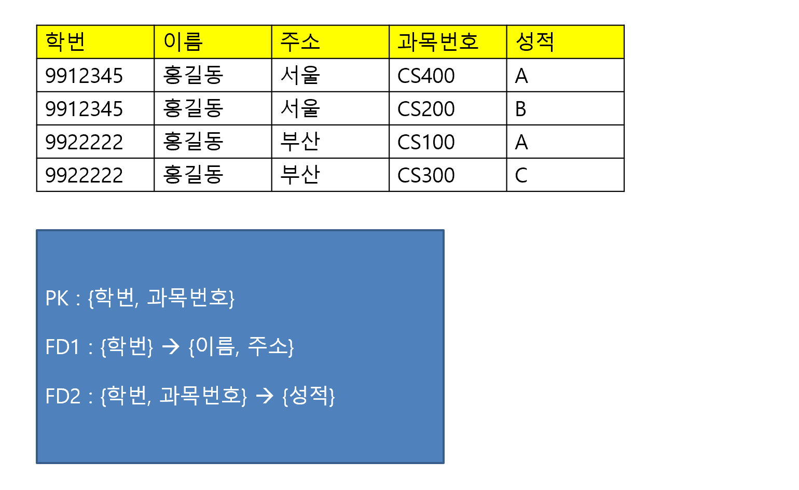</img></p>

<br>

<p align="center">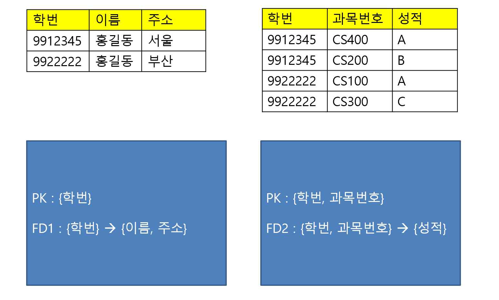</img></p>

<br>

## 새로운 설계에 3NF 적용

<br>

**3NF 정의**

<br>

`F+`에 있는, `a -> b` 형태로 된 모든 함수적 종속 (FD) 각각에 대하여, 다음 조건 가운데 하나라도 만족하면, 주어진 함수적 종속의 집합 F에 관하여 스키마 R은 3NF에 속한다.

    여기서 F+에서 + 기호는 함수적 종속의 울타리이다.
    어떤 테이블 스키마가 있다고 했을 때,
    이 테이블 안에 있는 모든 FD에 대해서~ 라는 의미

<br>

1. `a -> b`가 뜻 없는 (trivial) 함수적 종속
2. `a`가 스키마 R의 슈퍼키(super key)
3. `b`가 후보 키의 일부

<br>

예를 들어, 어떤 스키마 R이 있다고 하자. 이 R의 수많은 함수적 종속이 있다고 하면 이걸 다 검사해야할까? 이것은 매우 힘들 것이다. 그래서 규범적 덮개 SFD를 만들어서 여기에 있는 함수적 종속만 검사하는 것이다. 이만 확인해도 3NF가 있는지 알 수 있다. 

<br>

만약, 스키마 R의 규범적 덮개 SFD를 봤을 때 FD1, FD2, FD3가 있다고 하자. 각각의 FD가 1번 조건, 2번 조건, 3번 조건 셋 중의 하나를 만족한다고 하면 스키마 R은 BCNF에 있다는 것이다. 만약 **하나라도 만족하지 못한다면 스키마 R은 3NF에 없다.**

<br>

여기에서 BCNF 보다 1개 더 늘었으니까 3NF가 더 엄격한 것 아니냐고 할 수 있는데 아니다. 한마디로 **허용 조건이 1개 더 늘어난 것**이다.

<br><br>

## 3NF 나누기 알고리즘

<br>

**주어진 스키마를 3NF로 나누는 절차 (3NF Decomposition Algorithm)**

<br>

BCNF에서는 기준 FD를 잡아서 `a, b`와 `a와 나머지`로 나눴다. 3NF는 BCNF 나누기 알고리즘은 다르다. 3NF에 속하지 않는 스키마 R에 대해 다음 나누기 과정을 수행한다.

<br>

- 규범적 덮개 SFDc에 있는 형태의 모든 함수적 종속 각각에 대하여,
1. 만일 ab로 이루어진 스키마가 이미 결과에 들어가 있지 않으면, ab로 이루어진 스키마를 결과에 더한다.
2. R의 후보 키로 된 스키마가 이미 결과에 들어가 있지 않으면, 후보 키로 된 스키마를 결과에 넣는다.
3. 위의 1번과 2번에서 만들어진 스키마의 집합이 3NF로 나눈 결과이다.

<br>

3NF는 BCNF처럼 기준 FD를 잡을 필요 없이 **규범적 덮개**를 기준으로 나누게 된다. 

<br>

1단계를 간단하게 설명하면, 규범적 덮개 SFDc 안에 있는 함수적 종속 FD 각각에 대해서 `a와 b`로 이루어진 스키마를 만든다는 것이다. 단, 만약 이미 앞서 만든 R2 스키마에서 이미 R3 속성 집합을 모두 포함하고 있다면, FD3은 굳이 R3 스키마로 만들 필요가 없다는 말이다. 반대로, R3에서 R2의 모든 속성집합을 포함하고 있다면 R2를 지우면 된다.

<br>

2단계를 설명해보면, 현재 R이 3NF를 만족하지 않아서 나누고 있는데, 원래 스키마 R에 PK, CK 이런 것들이 나눈 R들에 포함되어 있어야하는데 없는 경우가 있다. 예를 들어, R의 PK가 R3에 포함되어 있다면 상관없이 2단계는 종료다. 하지만, R의 CK를 포함하는 것이 R3에 없다면 후보 키로 된 스키마를 R3에 포함하라는 것이다.

<br>

## 3NF 나누기 알고리즘 특징

<br>

1. 가짜 튜플을 만들지 않는 나누기이다.
2. 함수적 종속을 유지하는 나누기이다.
3. 한 번의 나누기 과정에서 두 개 이상의 스키마로 나누어진다.
4. 나누기 한 번으로 끝난다.
5. 한 번만 나누기를 잘하면 나뉘어진 스키마들을 3NF에 있음을 보장한다.

<br>

## 3NF 연습

<br>

<p align="center">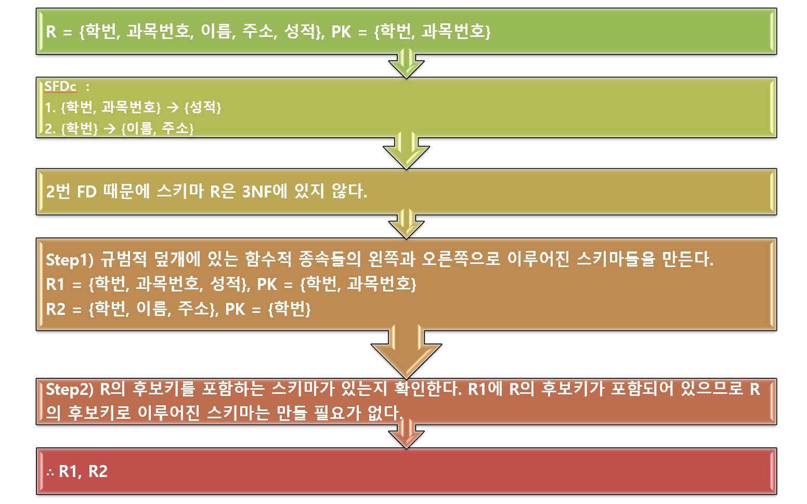</img></p>

<br>

FD2를 보면 `{학번}, 즉, a도 슈퍼키가 아니고` 다음으로 `{이름, 주소}, 즉, b도 후보키가 아니므로` 현재 3NF를 위배한다.

<br>

<p align="center">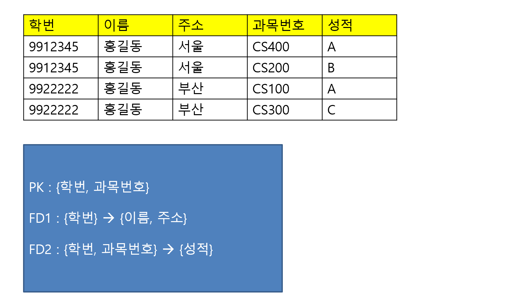</img></p>

<br>

<p align="center">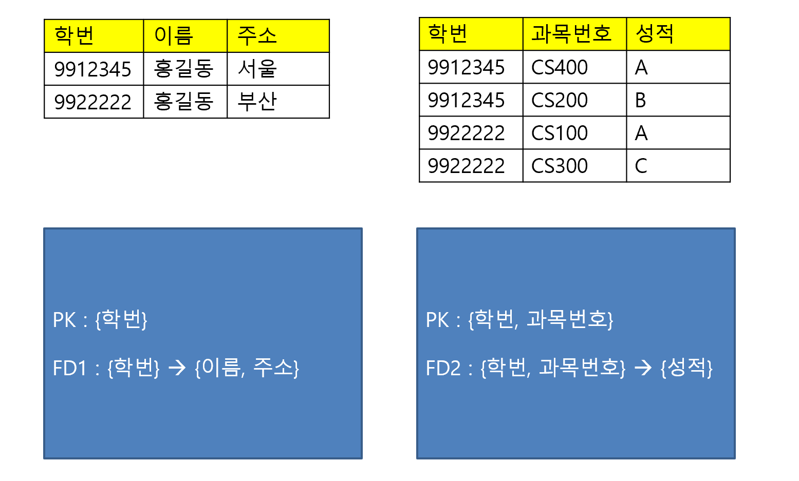</img></p>