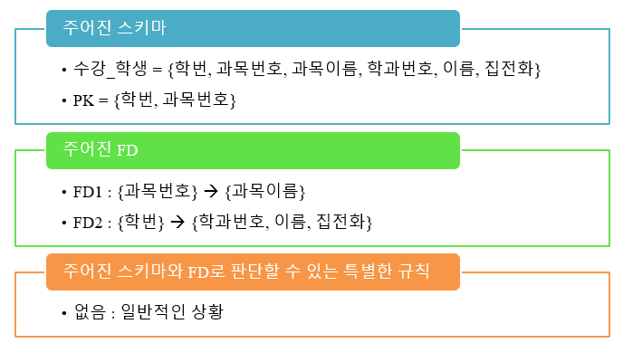
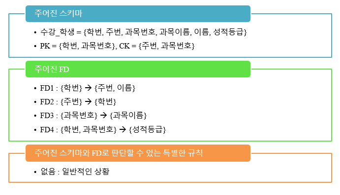
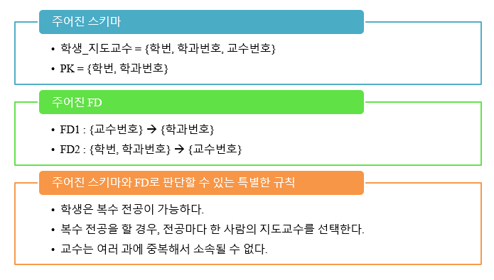
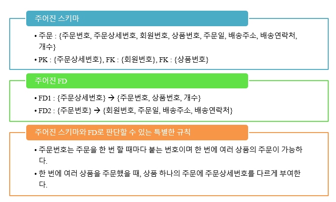
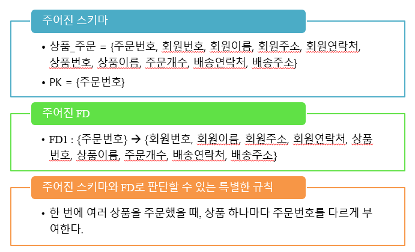
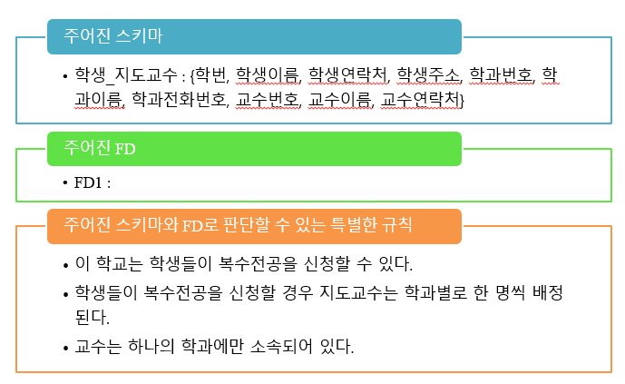

# 2022.06.07(화) - 13주차

 

## 설계 실습 1번

 

</img>

 

### BCNF 풀이

 

-   **BCNF 위배 확인**

1. 뜻 없는 함수적 종속
2. a가 슈퍼키

 

1번 단계, SFDc 형태로 정리되어 있으니까 1번 조건은 만족, a가 슈퍼키인지만 확인  
2번 단계, FD1의 a인 `{과목번호}`는 중복해서 나올 수 있으니까 슈퍼키가 아니다. 따라서, 여러 FD 중 하나라도 위배되면 BCNF가 없으니까 이 문제는 BCNF가 없다.   

결과적으로, **규범적 덮개에 속한 FD1이 BCNF 조건을 만족하지 않으니까 주어진 스키마 수강\_학생은 BCNF가 없다.** 참고로, FD1이 BCNF에 속하지 않는 것이 아니다. 함수적 종속은 정규형에 속한다 안속한다의 개념에 해당하지 않는다. 주어인 스키마가 정규형에 속하지 않는다고 올바로 답안을 작성하자.

 

-   **BCNF 나누기**

1. 기준 FD를 정하기
2. R1은 기준 FD의 a와 b로
3. R2는 기준 FD의 a와 나머지로
4. 나눠서 나온 결과 스키마를 가지고 다시 BCNF

 

1번 단계, `FD1 : {과목번호} -> {과목이름}`을 기준 FD로 삼는다.  
2번 단계, `R1 : {과목번호, 과목이름}`  
3번 단계, `R2 : {학번, 과목번호, 학과번호, 이름, 집전화}`  
4번 단계, `R1 : {과목번호, 과목이름}`으로 `FD1 : {과목번호} -> {과목이름}`이 계승되었다. R에서는 {과목번호}가 슈퍼키가 되지 않았지만, R1에서는 {과목번호}가 기본키(PK)가 되었으니까 이제는 BCNF가 성립한다. 다음으로 `R2 : {학번, 과목번호, 학과번호, 이름, 집전화}`를 살펴보면 여전히 기본키가 `{학번, 과목번호}`이니까 `FD2 : {학번} -> {학과번호, 이름, 집전화}`가 계승되지 않았다. `{학번}`이 아직 슈퍼키가 아니다. 만약, {학번}이 슈퍼키라면 {학번, 과목번호}가 기본키가 될 수 없으니까. 그래서 R2가 BCNF를 위배하니까 다시 나눈다.   

5번 단계 - 1, `FD2 : {학번} -> {학과번호, 이름, 집전화}`를 기준 FD로 삼는다.  
5번 단계 - 2, `R21 : {학번, 학과번호, 이름, 집전화}`  
5번 단계 - 3, `R22 : {학번, 과목번호}`  
5번 단계 - 4, `R21 : {학번, 학과번호, 이름, 집전화}`으로 `FD2 : {학번} -> {학과번호, 이름, 집전화}`가 계승되었다. `R22 : {학번, 과목번호}`는 PK가 {학번, 과목번호}니까 뜻 없는 함수적 종속 말고는 더이상 살펴볼 필요가 없다. 따라서, 결과적으로 모두 성립

 

결과적으로 `R1, R21, R22` 3개의 스키마로 나누어진다.

 

### 3NF 풀이

 

-   **3NF 위배 확인**

1. 뜻 없는 함수적 종속
2. a가 슈퍼키
3. b가 후보키의 일부

 

1번 단계, SFDc 형태로 정리되어 있으니까 1번 조건은 만족, 다음 단계 확인  
2번 단계, FD1의 a인 `{과목번호}`는 중복해서 나올 수 있으니까 슈퍼키가 아니다. 또, FD1의 b인 `{과목이름}`도 후보키의 일부가 아니다. 주어진 스키마의 `PK = {학번, 과목번호}` 이니까.  

 

결과적으로, 규범적 덮개에 속한 FD1의 a가 슈퍼키가 아니고 b가 후보키의 일부가 아니기 때문에 스키마 수강\_학생은 제3정규형에 있지 않다.

 

-   **3NF 나누기**

1. SFDc에 있는 FD 들의 a와 b로 이루어진 스키마 만들기
2. 원래 스키마의 후보키가 1번 단계에서 만들어진 결과에 존재하는지 확인하고 없으면 추가

 

1번 단계, `R1 : {과목번호, 과목이름}`, `R2 : {학번, 학과번호, 이름, 집전화}`  
2번 단계, 원래 스키마의 후보키 `{학번, 과목번호}`가 모두 속하는 경우가 R1과 R2에 없다. 따라서, 후보 키로 이루어진 스키마 `R3 : {학번, 과목번호}`를 추가   

 

결과적으로 `R1, R2, R3` 3개의 스키마로 나누어진다.

 

## 설계 실습 2번

 

</img>

 

이 예제는 후보키가 `{학번, 과목번호}`, `{주번, 과목번호}` 두 경우가 있었는데 {학번, 과목번호}를 기본키로 선택한 예제이다.

 

### BCNF 풀이

 

-   **BCNF 위배 확인**

1. 뜻 없는 함수적 종속
2. a가 슈퍼키

 

1번 단계, SFDc 형태로 정리되어 있으니까 1번 조건은 만족, a가 슈퍼키인지만 확인  
2번 단계, FD1의 a인 `{학번}`은 중복해서 나올 수 있으니까 슈퍼키가 아니다. 따라서, 여러 FD 중 하나라도 위배되면 BCNF가 없으니까 이 문제는 BCNF가 없다.   

결과적으로, **규범적 덮개에 속한 FD1이 BCNF 조건을 만족하지 않으니까 주어진 스키마 수강\_학생은 BCNF가 없다.**

 

-   **BCNF 나누기**

1. 기준 FD를 정하기
2. R1은 기준 FD의 a와 b로
3. R2는 기준 FD의 a와 나머지로
4. 나눠서 나온 결과 스키마를 가지고 다시 BCNF

 

1번 단계, `FD1 : {학번} -> {주번, 이름}`을 기준 FD로 삼는다.  
2번 단계, `R1 : {학번, 주번, 이름}`  
3번 단계, `R2 : {학번, 과목번호, 과목이름, 성적등급}`  
4번 단계, `R1 : {학번, 주번, 이름}`으로 `FD1 : {학번} -> {주번, 이름}과 FD2 : {주번} -> {학번}`이 계승되었다. R에서는 {과목번호}가 슈퍼키가 되지 않았지만, R1에서는 {과목번호}가 기본키(PK)가 되었으니까 이제는 BCNF가 성립한다. 다음으로 `R2 : {학번, 과목번호, 과목이름, 성적등급}`를 살펴보면 `FD3 : {과목번호} -> {과목이름}과 FD4 : {학번, 과목번호} -> {성적등급}`이 계승되었다. R1과 R2가 BCNF에 속하는지 살펴보겠다.

 

현재 R1의 경우 PK가 {학번}, CK가 {주번}이다. FD1의 a는 {학번}이니까 슈퍼키가 맞다. 다음으로 FD2의 a는 {주번}이니까 이것도 슈퍼키가 맞다. 따라서, R1의 규범적 덮개에 존재하는 모든 FD1과 FD2는 슈퍼키이므로 R1은 BCNF에 속한다.

 

다음으로 R2의 경우 PK가 {학번, 과목번호}이다. FD3의 a는 {과목번호}인데 R2에서 슈퍼키가 될 수 없으니까 다시 BCNF를 위배한다.

 

5번 단계 - 1, `FD3 : {과목번호} -> {과목이름}`를 기준 FD로 삼는다.  
5번 단계 - 2, `R21 : {과목번호, 과목이름}`  
5번 단계 - 3, `R22 : {과목번호, 학번, 성적등급}`  
5번 단계 - 4, `R21 : {과목번호, 과목이름}`으로 `FD3 : {과목번호} -> {과목이름}`가 계승되었다. `R22 : {과목번호, 학번, 성적등급}`으로 `FD4 : {학번, 과목번호} -> {성적등급}`가 계승되었다. 각각 성립하는 것을 확인할 수 있으니까 BCNF를 만족한다.

 

결과적으로 `R1, R21, R22` 3개의 스키마로 나누어진다.

 

### 3NF 풀이

 

-   **3NF 위배 확인**

1. 뜻 없는 함수적 종속
2. a가 슈퍼키
3. b가 후보키의 일부

 

1번 단계, SFDc 형태로 정리되어 있으니까 1번 조건은 만족, 다음 단계 확인  
2번 단계, FD1의 a인 `{학번}`은 중복해서 나올 수 있으니까 슈퍼키가 아니다. 또, FD1의 b인 `{주번, 이름}`도 후보키의 일부가 아니다. {주번}은 후보키의 일부이지만 {이름}이 아니니까.  

 

결과적으로, 규범적 덮개에 속한 FD1의 a가 슈퍼키가 아니고 b가 후보키의 일부가 아니기 때문에 스키마 수강\_학생은 제3정규형에 있지 않다.

 

-   **3NF 나누기**

1. SFDc에 있는 FD 들의 a와 b로 이루어진 스키마 만들기
2. 원래 스키마의 후보키가 1번 단계에서 만들어진 결과에 존재하는지 확인하고 없으면 추가

 

1번 단계, `R1 : {학번, 주번, 이름}`, `R2 : {주번, 학번}` 근데 이미 {주번, 학번}을 R1 스키마에서 포함하고 있으니까 FD2를 이용한 스키마를 만들 필요는 없다. `R3 : {과목번호, 과목이름}`, `R4 : {학번, 과목번호, 성적등급}`  
2번 단계, 원래 스키마의 후보키 `{학번, 과목번호}`가 모두 속하는 경우가 R4에 있다. 따라서, 후보 키로 이루어진 스키마를 추가할 필요가 없다. {주번, 과목번호}를 포함하는 스키마는 없지만 상관없다. 모든 후보키를 포함할 필요는 없다.   

 

결과적으로 `R1, R3, R4` 3개의 스키마로 나누어진다.

 

## 설계 실습 3번

 

</img>

 

복수전공 때문에 학번이 중복될 수 있구나라는 것을 인지하고 문제를 풀자. 그리고 `{학번, 교수번호}`도 후보키가 될 수 있다. 왜냐하면 복수전공이라고 해도 교수번호가 여러 개 나올 수 있지만 {학번, 교수번호} 똑같은 조합이 나올 리는 없으니까.

 

### BCNF 풀이

 

-   **BCNF 위배 확인**

1. 뜻 없는 함수적 종속
2. a가 슈퍼키

 

1번 단계, SFDc 형태로 정리되어 있으니까 1번 조건은 만족, a가 슈퍼키인지만 확인  
2번 단계, FD1의 a인 `{교수번호}`는 한 교수가 여러 학생을 지도해서 즉, 중복해서 나올 수 있으니까 슈퍼키가 아니다. 따라서, 여러 FD 중 하나라도 위배되면 BCNF가 없으니까 이 문제는 BCNF가 없다.   

결과적으로, **규범적 덮개에 속한 FD1이 BCNF 조건을 만족하지 않으니까 주어진 스키마 수강\_학생은 BCNF가 없다.**

 

-   **BCNF 나누기**

1. 기준 FD를 정하기
2. R1은 기준 FD의 a와 b로
3. R2는 기준 FD의 a와 나머지로
4. 나눠서 나온 결과 스키마를 가지고 다시 BCNF

 

1번 단계, `FD1 : {교수번호} -> {학과번호}`을 기준 FD로 삼는다.  
2번 단계, `R1 : {교수번호, 학과번호}`  
3번 단계, `R2 : {교수번호, 학번}`  
4번 단계, `R1 : {교수번호, 학과번호}`으로 `FD1 : {교수번호} -> {학과번호}`이 계승되었다. 그런데, 여기에서 `FD2 : {학번, 학과번호} -> {교수번호}`는 어디에도 계승되지 않는다. 세 개의 속성을 가지는 스키마가 없기 때문이다. 이것을 보고 **BCNF는 함수적 종속을 유지한다고 보장할 수 없다**는 것을 확인할 수 있다. R1은 만족하는게 보이고 R2는 뜻 없는 함수적 종속만 신경쓰면 되니까 BCNF에 속한다.

 

결과적으로 `R1, R2` 2개의 스키마로 나누어진다.

 

### 3NF 풀이

 

-   **3NF 위배 확인**

1. 뜻 없는 함수적 종속
2. a가 슈퍼키
3. b가 후보키의 일부

 

1번 단계, SFDc 형태로 정리되어 있으니까 1번 조건은 만족, 다음 단계 확인  
2번 단계, FD1의 a인 `{교수번호}`은 중복해서 나올 수 있으니까 슈퍼키가 아니다. 그런데 b인 `{학과번호}`는 후보키의 일부이다. FD2를 살펴보면 a인 `{학번, 학과번호}`는 슈퍼키이고 b인 `{교수번호}`는 후보키의 일부가 아니다. 어찌됐든 FD1, FD2 모두 3NF 조건을 만족하므로 주어진 스키마는 3NF가 있다.

 

결과적으로, 규범적 덮개에 속한 FD1과 FD2가 3NF의 조건을 만족하므로 스키마 학생\_지도교수는 제3정규형에 있다. 나눌 필요가 없다.

 

이번 예제와 같이 BCNF와 3NF의 결과가 다른 경우가 정말 간혹가다가 있다. 그렇다면, 둘 중 어떤 정규형을 선택해야할까? 상황마다 다른데 복수전공을 얼마나 하느냐에 따라 다르다. 만약, 어떤 학교에서는
학생들이 거의 복수전공을 하고 있다고 하면 불필요한 정보가 엄청 많아진다. 이런 경우 BCNF를 선택해서 쪼개는게 이득이고 복수전공 학생이 5% 미만 정도밖에 안된다고 하면 차라리 안쪼개고 3NF를 선택하는게 나을 수도 있다.

 

## 설계 실습 4번

 

</img>

 

주문상세번호가 PK인 이유는 예를 들어, 한 사람이 여러 개의 상품을 주문했다고 하자. 그러면 주문번호 1에 해당하는 주문상세번호가 1, 2, 3 이런식으로 나온다. 그러면 주문번호 1이 3번 반복되겠지. 그러한 이유로 주문상세번호가 PK가 된다.

 

이 문제는 간단하게 설명하고 넘어가겠다. BCNF를 먼저 보면 FD1의 a인 {주문상세번호}는 PK니까 BCNF 조건 만족, 반면 FD2의 a인 {주문번호}는 슈퍼키가 아니니까 BCNF 조건 위배. 따라서 나눠보면 `R1 : {주문번호, 회원번호, 주문일, 배송주소, 배송연락처}`와 `R2 : {주문번호, 주문상세번호, 상품번호, 개수}`가 만들어진다. R1은 FD2를 계승, R2는 FD1을 계승한다. 각각의 a가 슈퍼키가 맞으니까 BCNF의 결과 R1과 R2 두 개의 스키마가 나온다.

 

3NF로 보면 FD1의 a는 슈퍼키니까 만족, 그런데 FD2의 a가 슈퍼키가 아니고 b도 후보키의 일부가 아니라서 3NF 나누기를 해야한다. `R1 : {주문상세번호, 주문번호, 상품번호, 개수}`, `R2 : {주문번호, 회원번호, 주문일, 배송주소, 배송연락처}`이다. 후보키인 주문상세번호가 R1에 속하니까 추가할 필요 없다. 결과적으로 R1고 R2 두 개의 스키마가 나온다.

 

## 설계 실습 5번 SFDc 찾기

 

</img>

 

현재 주어진 FD를 보면 규범적 덮개 SFDc가 아니다. 11주차의 내용을 복습하며 SFDc로 만들어보자.

 

1. 기본키를 찾고 `{기본키} -> {나머지}`의 형태로 만든다.

`{주문번호} -> {회원번호, 회원이름, 회원주소, 회원연락처, 상품번호, 상품이름, 주문개수, 배송연락처, 배송주소}`

 

2. 기본키의 진부분집합이 왼쪽인 함수적 종속을 찾고 FD1에서 군더더기 속성을 제거

왼쪽의 결정자의 진부분집합을 왼쪽으로 하는 함수적 종속을 찾으라는 말인데 현재 `{주문번호}`는 속성 하나짜리 집합이니까 2단계는 통과

 

3. 오른쪽에서 결정자가 될 수 있는 것이 있느냐 찾아봐라

회원번호가 정해지면 회원이름, 회원주소, 회원연락처가 정해지겠다는 것을 알 수 있다.

-   `FD1 : {주문번호} -> {회원번호, 회원이름, 회원주소, 회원연락처, 상품번호, 상품이름, 주문개수, 배송연락처, 배송주소}`
-   `FD2 : {회원번호} -> {회원이름, 회원주소, 회원연락처}`

 

FD1의 군더더기를 제거한다. 단 회원번호는 남겨놔야한다. FD1의 회원번호와 FD2의 회원번호를 엮어서 만들 수 있기 때문이다.

-   `FD1 : {주문번호} -> {회원번호, 상품번호, 상품이름, 주문개수, 배송연락처, 배송주소}`
-   `FD2 : {회원번호} -> {회원이름, 회원주소, 회원연락처}`

 

상품번호가 정해지면 상품이름이 정해진다. FD3를 만들면서 FD1의 군더더기를 제거하면

-   `FD1 : {주문번호} -> {회원번호, 상품번호, 주문개수, 배송연락처, 배송주소}`
-   `FD2 : {회원번호} -> {회원이름, 회원주소, 회원연락처}`
-   `FD3 : {상품번호} -> {상품이름}`
-    

## 설계 실습 6번 SFDc 찾기

 

</img>

 

1. 기본키를 찾고 `{기본키} -> {나머지}`의 형태로 만든다.

먼저, 기본키를 찾아보면 복수전공 때문에 학번도 중복될 수 있으니까 학번은 PK가 될 수 없다. 하지만, {학번, 학과번호} 혹은 {학번, 교수번호}가 기본키가 될 수 있는 후보키이다.  

`FD1 : {학번, 학과번호} -> {학생이름, 학생연락처, 학생주소, 학과이름, 학과전화번호, 교수번호, 교수이름, 교수연락처}`

 

2. 기본키의 진부분집합이 왼쪽인 함수적 종속을 찾고 FD1에서 군더더기 속성을 제거

왼쪽의 진부분집합은 `{학번}, {학과번호}` 두 가지가 있다. 찾아보면  

-   `FD1 : {학번, 학과번호} -> {학생이름, 학생연락처, 학생주소, 학과이름, 학과전화번호, 교수번호, 교수이름, 교수연락처}`
-   `FD2 : {학번} -> {학생이름, 학생연락처, 학생주소}`
-   `FD3 : {학과번호} -> {학과이름, 학과전화번호}`

군더더기 속성을 지우고 나면  

-   `FD1 : {학번, 학과번호} -> {교수번호, 교수이름, 교수연락처}`
-   `FD2 : {학번} -> {학생이름, 학생연락처, 학생주소}`
-   `FD3 : {학과번호} -> {학과이름, 학과전화번호}`

 

3. 오른쪽에서 결정자가 될 수 있는 것이 있느냐 찾아봐라

교수번호를 알면 교수이름과 교수연락처를 알 수 있겠군. 그런데 문제의 특별한 규칙에서 **교수는 하나의 학과에만 소속되어 있다**고 했으니 교수번호를 알면 학과번호도 알게된다. 따라서 구해보면  

-   `FD1 : {학번, 학과번호} -> {교수번호}`
-   `FD2 : {학번} -> {학생이름, 학생연락처, 학생주소}`
-   `FD3 : {학과번호} -> {학과이름, 학과전화번호}`
-   `FD4 : {교수번호} -> {교수이름, 교수연락처, 학과번호}`

여기에서 {학번, 교수번호} -> {학과번호}는 FD1과 FD4로 유추할 수 있으니 따로 FD를 적을 필요는 없다.

 
