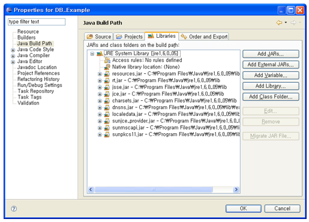
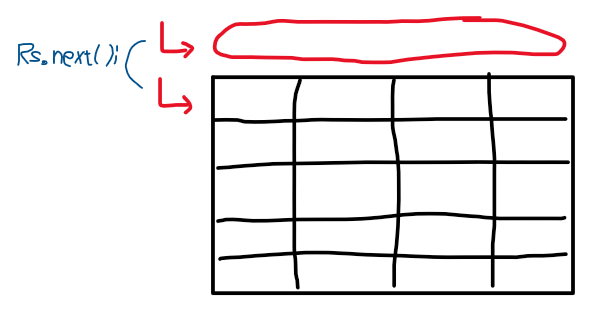
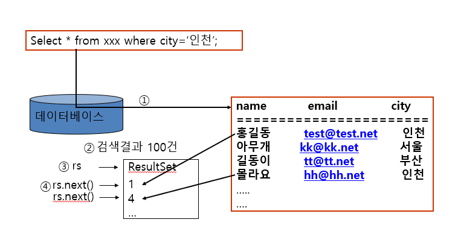
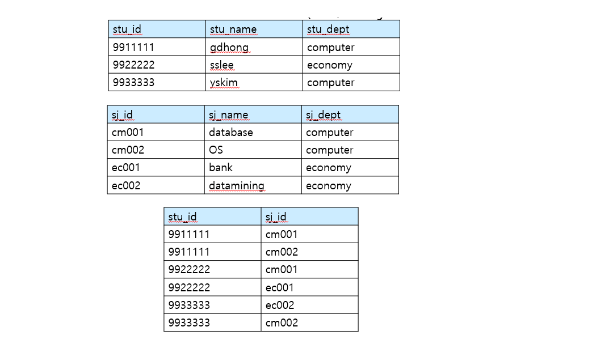
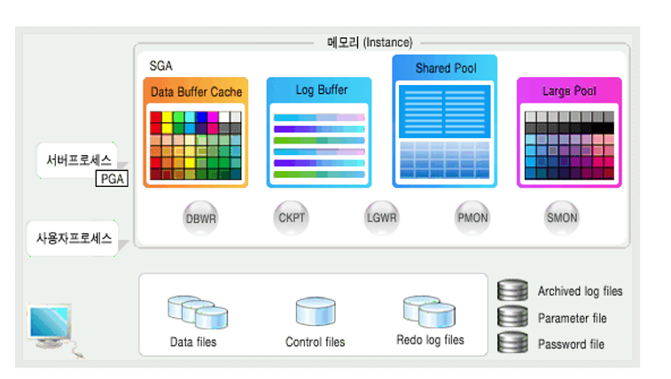
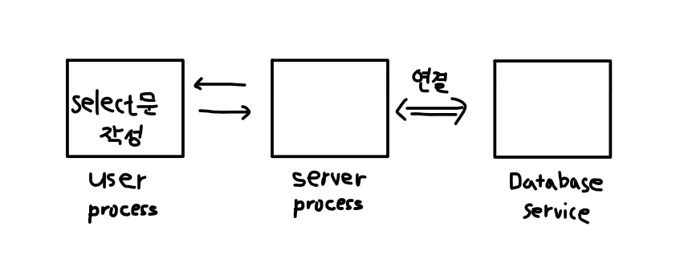
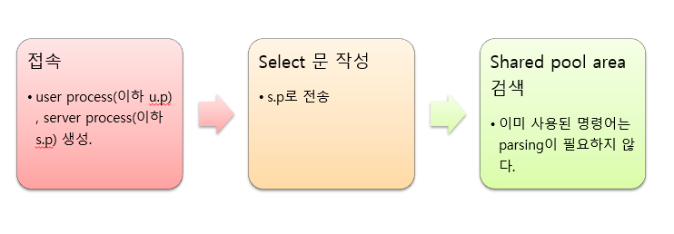
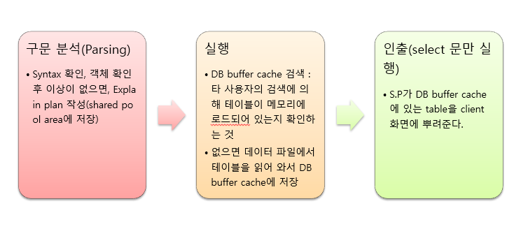
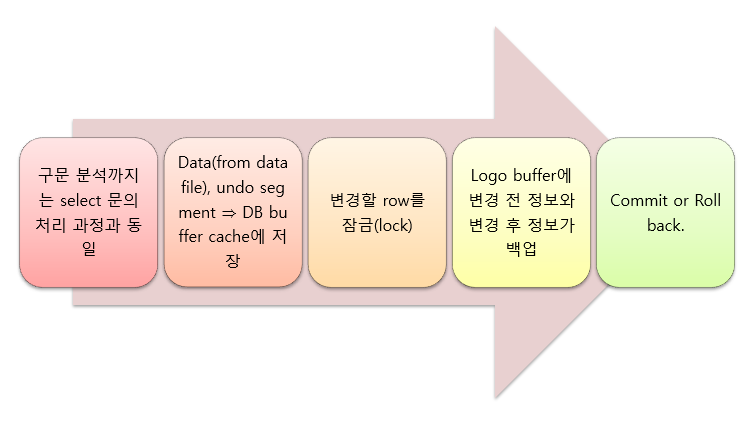
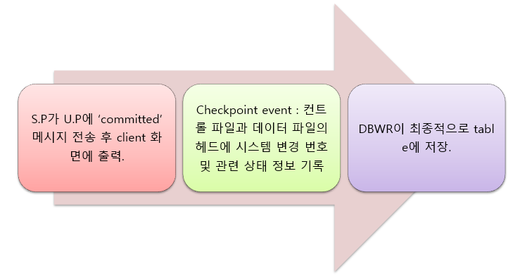

# 2022.06.14(화) - 14주차

<br>

## 프로그램과 DB 연동

<br>

여러 수많은 프로그래밍 언어와 여러 DBMS를 연동할 때마다 방법이 다르다면, 프로그램과 DB를 연동하기 힘들 것이다. 따라서, 언어마다 조금씩 다르겠지만, 원리 자체는 비슷하다.

<br>

1. 데이터베이스 연결을 담당하는 객체
2. SQL문 실행을 담당하는 객체 (statement)
3. 데이터를 받아주기 위한 객체 (cursor, ResultSet)

<br>

Java의 예를 들어, DB 연동을 위한 Java 클래스를 살펴보겠다.

<br>

-   `Java.sql.\*`
    -   DB에 access해서 쿼리를 처리하기 위한 API를 제공
    -   참조 [https://docs.oracle.com/javase/6/docs/api/]
-   `Oracle.sql.\*`, `Oracle.jdbc.driver.\*`
    -   Oracle 연동을 위한 connection 객체를 비롯한 각종 객체들을 제공

<br>

## Oracle 연동을 위한 설정

<br>

**드라이버 파일 설치**

-   드라이버 파일의 종류

    -   Classes12.zip (or jar) : 다양한 환경에서 오라클 연동을 지원하기 위한 드라이버
    -   ojdbc14.zip : 오라클 9i를 위한 JDBC 드라이버, 최근에 이것을 거의 사용
    -   이 파일 중 하나를 java 설치 폴더 안에 있는 jre/lib/ext/에 넣는다

-   Path 설정
    -   Linux의 경우, java_home으로 설정되어 있는 폴더의 jre/lib/ext를 사용하는 쉘 스크립트의 profile 폴더에 경로를 설정
    -   Windows의 경우, \[내 컴퓨터] - \[등록정보] - \[고급] - \[환경변수]를 열어서 CLASSPATH에 `C:jdk1.4\jre\lib\ext\ojdbc14.jar`를 추가한다.

<br>

## Eclipse에서 Oracle 연동 설정

<br>

<p align="center"></img></p>

<br>

이클립스를 사용해서 컴퓨터 전체가 아닌 프로젝트 마다 설정하는 방법도 있다. \[Project] - \[Properties] - \[Java Build Path] - \[Libraries] - \[Add External JARs] 가서 추가하면 된다.

<br>

<p align="center"></img></p>

<br>

오라클을 설치하면 \[C:\oraclexe\app\oracle\product\10.2.0\server\jdbc\lib] 이런식으로 경로에 `ojdbc14.jar`이 있다. 작업을 완료하면 프로젝트에 참조 라이브러리가 등록되어 있다.

<br>

## 데이터베이스 드라이버 로드

<br>

설정이 완료되었으면 데이터베이스 드라이버를 로드해야 사용할 수 있게 된다. 로드하기 위해서 두 가지 작업을 해야한다. **첫째로, Connection 객체를 만들어야 한다.** **둘째로, statement 객체 생성 및 실행**이다.

<br>

1. **Connection 객체**

-   `Connection conn = DriverManger.getConnection(JDBC_url,”아이디”,”비밀번호”);`
    -   이때, 아이디와 비밀번호는 Oracle 계정을 말하는 것이다.
-   JDBC_URL 구성 = `JDBC:oracle:thin:@IP주소:포트:SID` -> Oracle 드라이버
-   JDBC_URL 구성 = `JDBC:mysql://IP주소:포트/DB 이름` -> MySQL 드라이버

<br>

-   IP주소
    -   DB가 설치된 컴퓨터의 IP 주소 혹은 도메인 이름
-   포트
    -   DB에서 네트워크를 통한 접속을 처리하기 위해 실행되어 있는 리스너의 사용 포트
    -   기본값은 오라클은 1521, mysql은 3306
-   SID (Service ID)
    -   DB에서 사용하는 인스턴스 이름으로 MySQL에서는 DB 이름으로 불림

<br>

    JDBC란?

    Java에서 Oracle, Mysql, MsSql 등 여러 데이터베이스
    시스템을 이용하여 연동할 수 있는데, 초기에는 Java에서
    각각의 드라이버를 따로 만들었었다. 하지만, DBMS마다
    드라이버가 다르게 되니까 연동하는 코드라던가 DBMS를
    바꾸는 경우에 모든 것을 바꿔야하는 불편함이 있었다.

    따라서, 통합 드라이버를 하나 만들었다.
    이것이 JDBC, Java DataBase Collection이다.
    현존하는 웬만한 데이터베이스에 연동 가능하다.

<br>

2. **Statement 객체**

-   `Statement stmt = conn.createStatement();`
    -   connection 객체의 createStatement() 메소드를 이용하여 statement 객체 새로 생성
-   `stmt.executeUpdate("insert into test values('test', 'a1234')");`

<br>

-   Statement
    -   쿼리를 실행하기 위한 객체
    -   완성된 SQL문을 인자로 사용
    -   `Stmt.executeUpdate(sql);`
        -   **executeUpdate는 주로 DML**(Insert, Update, Delete, Create, Drop) 같은 데이터베이스에 변화를 가져오는 그런 sql문을 실행할 때 사용한다. 정수를 return 한다. 예를 들어, 몇 행이 추가되었다. 몇 행이 바뀌었다 이런 표현을 쓸 때 정수.
    -   `ResultSet rs = stmt.executeQuery(sql)'`
        -   **executeQuery는 주로 Select문**을 실행한다. 데이터베이스로부터 데이터를 가져와서 프로그램에서 써먹어야 하니까 받은 데이터를 저장할 객체가 있어야 한다. 이것이 바로 ResultSet 객체이다. 따라서, executeQuery는 ResultSet 객체를 return 한다.

<br>

3. **PreparedStatement 객체**

<br>

Statement 객체와 하는 일은 똑같은데, SQL을 설정하는 과정이 조금 다르다. **PreparedStatement는 미리 sql문에 대한 틀을 만드는 것이다.**

<br>

-   `PreparedStatement pstmt = conn.prepareStatement("insert into test values(?,?)");`
    -   statement와는 다르게 생성할 때 sql문을 넣는다.
-   `pstmt.setString(1, "test");`
    -   정수라면 setInt 메소드를 쓰면 된다.
    -   1은 물음표의 순서이다. 첫번째 물음표.
    -   index처럼 0부터 시작이 아니라 1부터 시작이다.
-   `pstmt.setString(2, "a1234");`
-   `pstmt.executeUpdate();`

<br>

-   PreparedStatement 객체
    -   쿼리를 실행하기 위해 쿼리를 저장하는 객체
    -   변수 부분을 둬서 SQL문에 들어갈 값을 조정할 수 있다.
    -   `Pstmt.executeUpdate();`
    -   `ResultSet rs = pstmt.executeQuery();`
        -   state였다면 괄호 안에 sql문이 들어갈 것이다. 위에 보고 오도록

<br>

## ResultSet으로 결과 받기

<br>

4. **ResultSet 객체**

-   `ResultSet rs = pstmt.executeQuery( );`
    -   SQL을 조작하는 DML의 경우 executeUpdate()를 썼었다.
    -   결과를 받아오는 행위는 SQL을 조작하고 나서 데이터를 받아오는 select문
    -   ResultSet 객체 형태의 return 값을 반환받는다.

<br>

-   ResultSet
    -   select 문의 결과를 받기 위한 객체
    -   C++ 언어에서는 Cursor와 같은 방법으로 사용
    -   `Rs.next();` 다음 행으로 이동
    -   `while(rs.next()){...}` 여러 개의 record를 받아올 때 주로 사용하는 문장
    -   `Rs.getString("필드 이름")` 형식이 문자열인 속성의 값을 받아오는 문장

<br>

ResultSet은 테이블처럼 생겼다. (즉, 레코드의 집합). 자바는 C와 다르게 포인터가 없는데 포인터와 비슷한 개념이라고 보면 된다. 어떤 select문이 실행되어서 그 결과를 rs라는 객체로 받아왔다고 하자. 그 결과는 레코드 여러 개의 집합일 것이다.

<br>

<p align="center"></img></p>

<br>

처음에 이 rs 객체는 마치 포인터처럼 테이블의 가장 위에 아무 것도 없는 부분을 가리키고 있다. `Rs.next();` 메소드를 사용하여 이 포인터를 아래 레코드로 내리는 것이다. (정확히 포인터는 아니다.) Rs.next();의 `반환값은 True나 False이다.` 다음 행이 있으면 true, 없으면 false이다.

<br>

그렇게 레코드를 받아오면 각각의 속성에 대한 값이 있을 것이다. 그 값을 가져와서 어떤 변수에 집어넣고 계산을 하든 여러 일을 할 것이다. 레코드 내의 값을 받아오는 경우 형식이 정수인 속성의 값을 받아오는 경우에는 `Rs.getInt("필드 이름");`, 형식이 문자열인 속성의 값을 받아오는 경우에는 `Rs.getString("필드 이름");`이다.

<br>

<p align="center"></img></p>

```java
ResultSet rs = pstmt.executeQuery();

while(rs.next()) {
    name = rs.getString("name"); // or rs.getString(1); 요건 첫번째 필드 뜻하는 것
    age = rs.getInt("age"); // or rs.getInt(2);
}

rs.close();
```

<br>

**연결 해제**

<br>

마지막의 `rs.close();`처럼 연결을 꼭 해제해줘야 한다. Connection을 close() 하지 않으면 사용하지 않는 연결이 유지되어, **DB 자원의 낭비**를 발생시킨다. 만든 순서가 connection을 만들고 statement를 만들고 resultSet을 만들었으니까 해제할 떄는 그 역방향으로 해주는 것이다.

-   `rs.close();`
-   `stmt.close();`
-   `conn.close();`

<br>

## 간단한 실습

<br>

Database(stu, subject), Database(sugang)을 만들었다.

<p align="center"></img></p>

<br>

데이터베이스 연동 프로그램을 만들 때, 보통 데이터베이스를 연동하는 부분이 되게 많다. 이 작업할 때도 데이터베이스 연동, 이 작업할 때도 데이터베이스 연동~ 되게 자주하기 때문에 **DB 접속을 담당하는 전용 클래스를 하나 만드는게 좋다.**

<br>

**DBManger 클래스**

```java
import java.sql.*;

public class DBManager {
    Connection conn = null;

    private String id = "test"; // 오라클 계정을 만들었고, 그 계정 아이디
    private String pass = "1234"; // 오라클 계정의 패스워드
    private String url = "jdbc:oracle:thin:@127.0.0.1:1521";
    private String driver = "oracle.jdbc.driver.OracleDriver";

    public void Connect() {
        try {
            Class.forName(driver);
            conn = DriverManager.getConnection(url, id, pass);
        } catch (Exception e) {
            e.printStackTrace();
        }
    }

    public void DisConnect() {
        try {
            conn.close();
        } catch (Exception e) {
            e.printStackTrace();
        }
    }
}
```

<br>

-   특징 01

코드에서 **driver**를 사용하는데, driver가 필요한 이유는 Java 프로그램에서 제대로 드라이버를 로드하기 위해서, JDBC 드라이버를 로드할 때 특별한 키워드를 사용한다. 그것이 `Class.forName(driver);`이다. 이것을 지정해주지 않으면 제대로 로드되지 않는 경우가 있다. 저기 forName안에 들어갈 문자열 driver가 오라클이냐, mysql이냐 DBMS에 따라 달라지기 때문에 따로 driver를 사용하는 것이다.

-   특징 02

**try-catch문을 사용하여 오류를 잡아주는 점**이다. SQL문을 잘못써서 exception 오류 발생 가능성이 항상 존재하기 때문이다. 혹은 id나 pass를 잘못 입력해서 실행 오류가 날 수도 있기 때문이다. 그래서 SQL 관련 객체들은 거의 다 클래스 선언에서 throw exception이 선언되어있다. 즉, throw exception이 정의되었다는 말은 에러 처리를 해라는 말이다.

<br>

**Sugang 클래스**

```java
import java.sql.*;

public class Sugang {

    public static void main(String[] args) {
        Sugang s = new Sugang();
        s.viewSugang();
    }

    public void viewSugang() {
        DBManger dbmg = new DBManger();
        dbmg.Connect();
        try {
            String query = "Select stu.stu_name, subject.sj_name from stu, subject, sugang " + "where stu.stu_id = sugang.stu_id and subject.sj_id = sugang.sj_id";
            PreparedStatement stmt = dbmg.conn.prepareStatement(query);
            ResultSet rs = stmt.executeQuery();
            System.out.println("이름          과목");
            while(rs.next()) {
                System.out.println(rs.getString(1) + "  " + rs.getString(2));
            }

            rs.close();
            stmt.close();
        } catch(Exception e) {
            System.out.println("Error : " + e.getMessage());
            // 우리 오라클 실습했을 때 ORA-0001 : ~ 이런 오류가 출력되는 것
        }
        dbmg.DisConnect();
    }
}
```

<br>

## 추가내용 - 오라클의 구성

<br>

**3가지 물리적 구성요소**

<br>

-   PROCESS 영역
    -   BACKGROUND PROCESS, USER PROCESS, SERVER PROCESS
    -   오라클이 시작되면, 이러한 프로세스들이 동작을 하게 된다.
    -   전체 오라클DB 시작되는 순간 BACKGROUND PROCESS가 메모리에 위치하게 된다.
    -   유저가 접속하면 USER PROCESS가 생성
    -   여기에 대응되는 SERVER PROCESS도 생성
    -   또 다른 유저가 접속하면 또 두 프로세스가 생성
-   MEMORY 영역
    -   SHARED POOL, DATA BUFFER CACHE, LOG BUFFER, LARGE POOL
    -   서버쪽에 메모리 영역에 할당받고 모든 프로세스가 공유한다.
-   FILE 영역
    -   CONTROL FILES, PARAMETER FILES, DATA FILES, REDO-LOG FILES
    -   예를 들어, 테이블 만들고 데이터 입력하는 것들이 DATA FILES에 저장
    -   서버 내부에 파일이 생성되고 이 파일에 테이블 관련 데이터가 저장
    -   CONTROL FILES에는 여러 가지 설정들에 관련된
    -   PARAMETER FILES에는 설정과 관련된 인수 정보들
    -   REDO-LOG FILES에는 REDO-LOG가 저장되는 파일들

<br>

    Redo Log File, 리두 로그 파일이란, 오라클이
    데이터베이스에서 발생한 모든 변경사항을 기록하는 파일이다.

<br>

**BACKGROUND PROCESS**

<br>

-   기능 : DB 모니터링, SQL문 처리
-   종류
    -   DBWR (Database Writer) : 변경사항을 table에 저장, 실제 하드에 쓰는거
    -   LGWR (Log Writer) : commit한 작업의 백업(redo~), redo-log에 쓰는거
    -   PMON (Process Monitor) : user process 감시
    -   SMON (System Monitor) : background process, memory 감시
    -   CKPT (Checkpoint) : 시스템 변경번호, DB 상태정보를 control file, data file에 저장
    -   기타 ARCH, RECO, LCKn 등이 있음

<br>

**USER PROCESS : 접속과 동시에 생성**

<br>

-   접속시 사용자명, 패스워드, 접속기간 저장
-   OS 상에서 확인하는 방법
    -   Windows : Ctrl + Alt + Del
    -   Unix : ps 명령어

```
SQL > !ps -ef | grep sqlplus
Couldnt get a file descriptor referring to the console
JaeYun  12203 12175 0 11:21 pts/0 00:00:00 sqlplus
JaeYun  12203 12175 0 11:21 pts/0 00:00:00 grep sqlplus
```

<br>

**SERVER PROCESS : 접속과 동시에 생성**

<br>

-   사용자 인증
-   Syntax check
-   객체 존재 여부 및 Access permission check
-   Explain plan을 작성하여 실행한다.
-   서버 프로세스의 확인
    -   UNIX : `ps -ef | grep DESCRIPTION`

<br>

    실행 계획은 버퍼에 저장된다.
    메모리 영역의 SHARED POOL

<br>

**오라클 구조도**

<br>

<p align="center"></img></p>

<br>

-   SGA (Shared Global Area) : 모든 프로세스가 공유하는 영역
-   Data Buffer Cache는 가져온 데이터를 저장해주는 것이다. 사용자가 다시 똑같은 테이블에 대해서 다른 select문을 실행하면, 일일이 데이터 파일에서 가져오는 것보다 버퍼 캐시에서 꺼내쓰면 더 빠르다.
-   그리고 백그라운드 프로세스인 DBWR(Database Writer), CKPT(Check Point), LGWT(Log Writer), PMON(Process Monitor), SMON(System Monitor)

<br>

**System Global Area, SGA**

<br>

-   정의 : 모든 사용자들이 공유하는 영역 -> memory에 존재
-   Shared pool area
    -   Explain Plan을 저장하는 부분
    -   Library cache: 실행코드, 실행계획
    -   Data Dictionary cache : table, view의 정보, 권한
-   Data buffer cache
    -   데이터 파일로부터 테이블을 읽어와서 저장하는 부분
-   Log Buffer area
    -   commit되면 작업 내용 저장. 갑작스런 시스템 이상이 발생했을 때 복구하기 위해
-   Large pool area
    -   복구 관리자, 공유 서버 프로세스 등을 위해 할당되어 있는 영역

<br>

**File Area**

<br>

-   정의 : 데이터(객체들)와 데이터에 관련된 모든 정보들이 "실제로" 저장되어 있는 부분
-   Control file
    -   DB 시스템이 시작될 때 항상 참조하는 파일. DB에서 참조할 모든 파일의 크기, 절대 경로 등을 저장. 파일의 이상 유무 확인을 위해 참조
    -   확인 : `select * from V$CONTROLFILE;`
-   Parameter file
    -   Control file 경로, DB 환경설정 등 관련된 모든 정보를 포함. 특히 SGA 영역별 크기가 할당되어 있음
    -   `init<db이름>.ora`
        -   DB_CACHE_SIZE : 데이터 버퍼 캐시 영역
        -   DB_BLOCK_SIZE : 블록 하나의 크기 결정
    -   SPFILE : 세션 레벨에서 시스템 설정을 가능하게 해주는 파일
    -   시스템 설정 예) `ALTER SYSTEM SET DB_CACHE_SIZE = 128M;`
-   Data File
    -   생성한 database가 물리적으로 저장되는 곳
    -   테이블 스페이스 : 모든 객체들이 저장되는 공간
-   Redo-Log File
    -   redo-log 파일이 저장되는 공간, 리두로그란, 시스템에 문제가 생겨서 복구해야할 때 여기까지는 복구해야한다는 정보를 저장해놓는 공간이다.
    -   `select * from V$LOGFILE;` 하면 위치 확인

<br>

**select문의 처리 과정**

<br>

<p align="center"></img></p>

<br>

<p align="center"></img></p>

서버 프로세스에서는 Shared pool area를 먼저 검색한다. 이미 실행 계획(Explain plan)이 만들어져있는지 확인하고 혹은 이 테이블을 사용했다는 객체의 정보, 권한이 있는지 확인한다. parsing은 띄어쓰기 단위로 쪼개는 것인데 이미 실행계획이 있다면 parsing 할 필요 없겠지.

<br>

<p align="center"></img></p>

<br>

**DML문의 처리 과정**

<br>

구문 분석(Parsing)하는 과정까지는 동일하다. 하지만 그 이후에 실행 과정이 달라진다.

<br>

<p align="center"></img></p>

<br>

DB buffer cache에 Data만 저장하는 것이 아니라 **undo segment도 저장**한다. roll back에 대비해서 undo-log에 이전 데이터를 적어놓는 것이다. 예를 들어, update문을 진행한다고 하면 old value를 undo-log에 저장하고 new value를 redo-log에 저장한다. 변경할 레코드를 잠그는 이유는 작업하려고 레코드를 가져갔을 때 다른 누군가가 레코드에 동시에 접근하면 문제가 발생하기 때문이다.

<br>

**COMMIT문의 처리 과정**

<br>

<p align="center"></img></p>

<br>

<p align="center"></img></p>

<br>

    롤백(rollback) 하기 위해서 undo-log 사용
    커밋(commit) 하기 위해서 redo-log 사용
