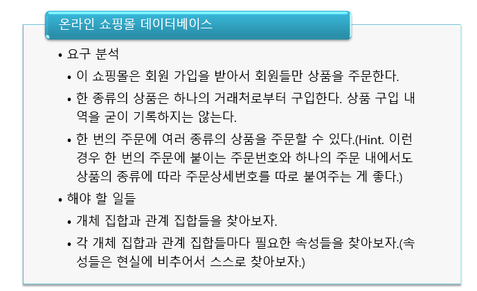
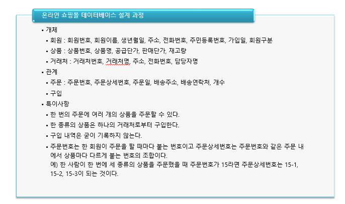
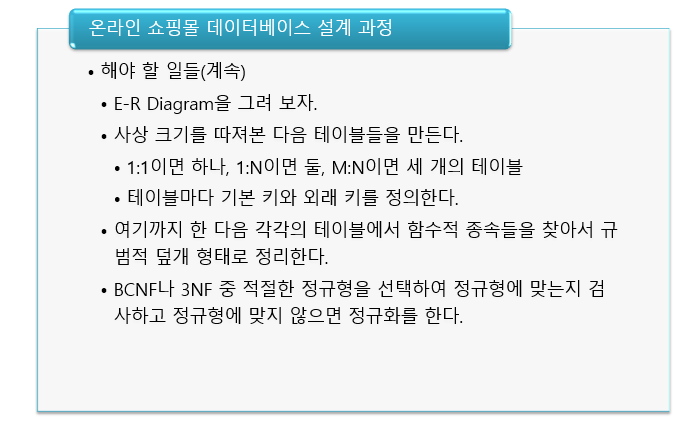
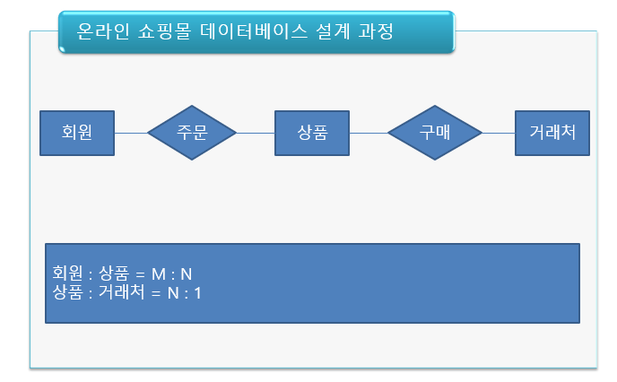
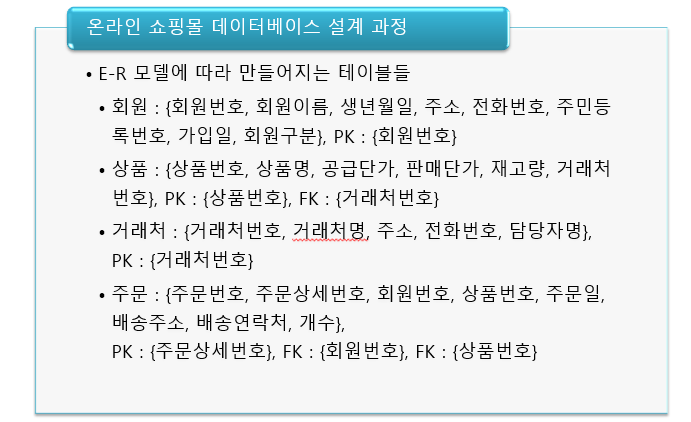
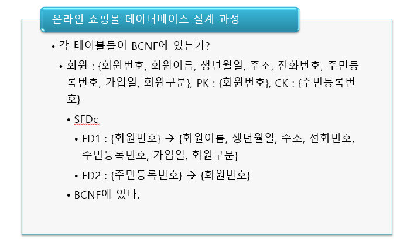
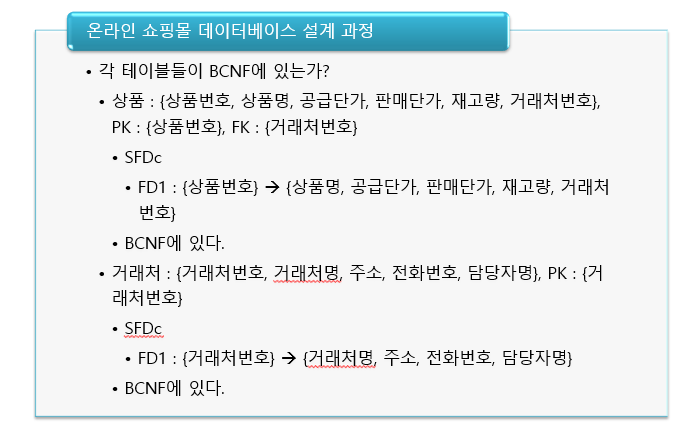
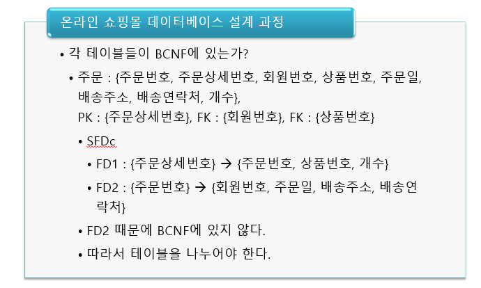
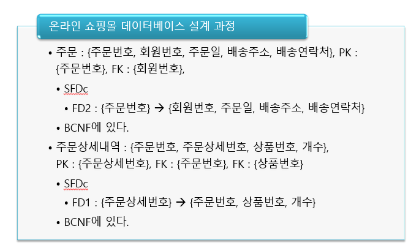
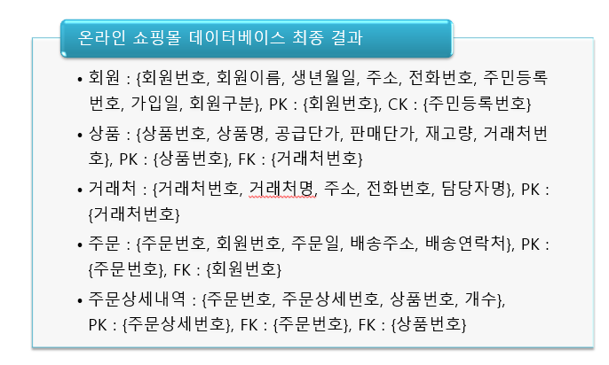

# 관계형 DB 설계과정 전체적인 정리

 

2022.06.07(화) - 13주차의 4번째 강의 내용인데 중요한 내용이라 따로 빼서 문서를 작성한다.

 

## 관계형 데이터베이스 설계 과정

 

1. 개념적 설계
2. 논리적 설계 1단계
3. 논리적 설계 2단계

 

    물리적 단계는 생략

  

**개념적 설계 단계**

 

요구사항 명세에서 주어, 목적어에 해당하는 명사들을 뽑아서 개체와 관계를 찾는다. 이런 속성들을 찾고 개체-관계 모델인 E-R 모델을 이용해서 결과물인 ERD, ER 다이어그램을 만든다. 이 ERD를 가지고 사상 크기를 전부 정의한다.

 

**논리적 설계 1단계**

 

사상크기가 정의된 ERD로부터 매핑룰(Mapping Rule)을 이용하여 테이블들을 만들어낸다. 매핑룰이란 예를 들어, 1:1 일 때는 1개 또는 2개의 테이블, 1:N 일 때는 2개의 테이블인데 1의 기본키가 N의 외래키로 들어가야하는 것, M:N 일 때는 각각의 개체 집합을 가지고 테이블을 만들고 교차 테이블을 한개 더 만들어서 3개 테이블이 되고 교차 테이블에는 개체 테이블에 있는 기본키가 외래키로 추가되어야 한다.

 

**논리적 설계 2단계**

 

매핑룰에 의해 만들어진 테이블들을 가지고 3NF나 BCNF 둘 중 하나를 선택해서 정규화를 진행한다.

  

## 온라인 쇼핑몰 데이터베이스 예제

 

</img>

 

-   개념적 설계 단계
    -   명사, 개체를 뽑아보면 회원, 상품, 거래처, 주문번호, 주문상세번호
    -   쇼핑몰은 굳이 저장해야할 데이터가 아니니까 개체에 포함하지 않았다.
    -   관계를 뽑아보면 주문, 구입 정도가 있다.

 

-   논리적 설계 1단계

</img>

 

-   여기서는 구입은 따로 저장하는 속성은 없다. 관계는 있지만 구입내역 자체는 저장하지 않을 것이라서.
-   특이사항을 이야기 한 이유는 **사상 크기**를 정하기 위해서이다.

 

</img>

 

-   1:1 일 때 1개 혹은 2개 일 수 있지만 편의상 1개로 구한다.

 

</img>

 

-   회원 : 상품 = M : N이니까 3개의 테이블을 만든다. 개체인 회원 테이블, 상품 테이블을 만들고 교차 테이블인 주문 테이블을 만든다. 단, 여기서 교차 테이블인 주문 테이블에는 회원과 상품의 기본키가 외래키로 추가된다.
-   상품 : 거래처 = N : 1이니까 2개의 테이블을 만든다. 상품 테이블, 거래처 테이블. 단, 여기서 1인 거래처 테이블의 기본키인 거래처 번호가 N인 상품 테이블의 외래키로 들어갈 것이다.
-   결과적으로 상품테이블은 중복되니까 4개의 테이블이 만들어진다.

 

</img>

 

-   논리적 설계 2단계

</img>

 

FD1의 a, FD2의 a 모두 슈퍼키니까 이미 BCNF에 있다.

 

</img>

 

</img>

 

</img>

 

</img>

 
