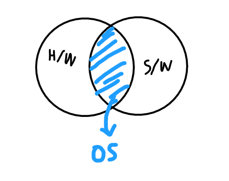
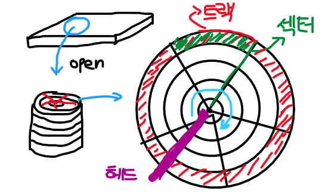
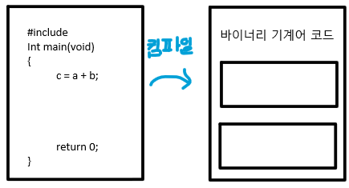
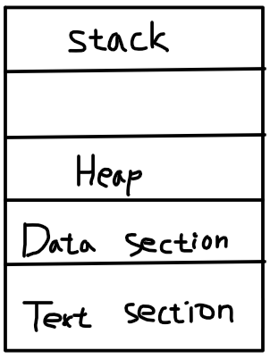
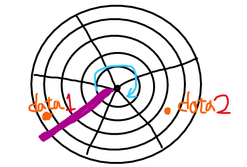
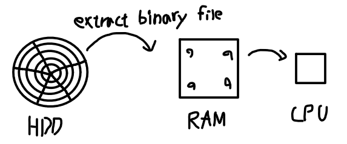
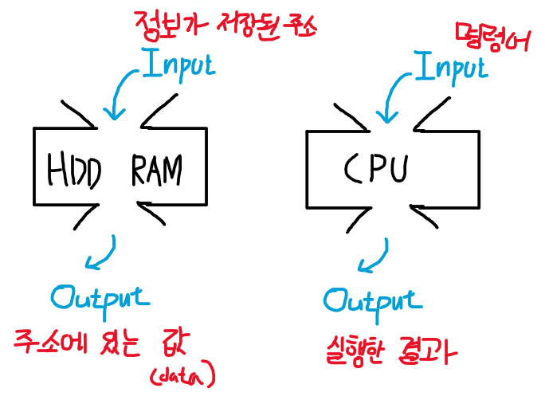

# 2022.03.04(금) - 운영체제 수업

## Operating System(OS) preview

 

OS(Operating System)를 직역하면 **시스템 구동하기**이다. 시스템은 Computer를 의미한다. 컴퓨터 내부는 크게 H/W(하드웨어), S/W(소프트웨어)로 구분할 수 있다. OS는 하드웨어나 소프트웨어로 딱 나누어서 생각할 수 없고 그 중간 어디쯤이다. 운영체제는 펌웨어라고 한다.

 

</img>

 

> (위키백과) [펌웨어의 정의](https://ko.wikipedia.org/wiki/%ED%8E%8C%EC%9B%A8%EC%96%B4)는 컴퓨팅과 공학 분야에서 특정 하드웨어 장치에 포함된 소프트웨어로, 소프트웨어를 읽어 실행하거나, 수정하는 것도 가능한 장치를 뜻한다. 하드웨어의 제어(low-level control)와 구동을 담당하는 일종의 운영체제이다. 펌웨어는 ROM이나 PROM에 저장되며, 하드웨어보다는 교환하기가 쉽지만, 소프트웨어보다는 어렵다.

 

간단하게 말하면, **운영체제는 기존 Application(소프트웨어)을 하드웨어로 올려서 실행시켜주는 것이다.** OS가 구동시키는 녀석은 process이다. Process는 program in execution으로 실행 상태에 있는 프로그램을 의미한다. 프로세스는 RAM에 위치한다.

  

## HDD에 데이터가 저장되는 원리

 

</img>

 

데이터를 저장하는 장소인 HDD(하드 디스크)의 내부를 살펴보겠다. 하나의 구역 전체를 트랙이라고 하고 그 중 한 구역을 섹터라고 한다. 섹터는 트랙의 일정 구간을 나눠놓은 것이다. 원판은 돌아가고 있고 핀 모양의 헤드 부분을 지나면서 핀이 데이터를 저장하고 읽는 역할을 한다.

 

</img>

 

작성된 프로그래밍 코드는 컴파일 과정을 통해 컴퓨터가 이해할 수 있도록 바이너리 기계어 코드로 변환된다. 변환된 기계어 코드는 트랙과 섹터에 저장된다. 전기적인 신호인 1과 0으로 구성되어 있고 이것을 받아 컴퓨터가 작동하는 원리다.

 

- 프로그래밍의 의미

> 추가로, 프로그램(program)과 프로그래밍(programming)의 의미를 살펴보겠다. 프로그램은 한마디로 작업(일)들을 모아놓은 것이다. 프로그래밍은 그러한 작업들을 골고루 분배해서 지시하는 행위이다. 컴퓨터를 실행시킬 수 있는 명령어들을 논리적으로 맞게 배치시키는 것이다. 만약 그렇게 하지 않는다면, 컴퓨터는 올바르게 작동하지 않는다. 예를 들어, 밥을 먹는다는 과정에서 숟가락을 들고 밥을 퍼고 입으로 가져가서 먹는다는 논리적인 순서 과정이 있는데 밥을 펀다는 과정이 없으면 밥을 먹지 않게 되는 것이다.

 

</img>

 

프로그래밍 코드 `c = a + b` 부분을 보면 `c, a, b`와 같은 것을 **오퍼랜드(operand, 피연산자)** 라고 하고 `=, +`와 같은 것을 **오퍼레이터(operator, 연산자)** 라고 한다. 오퍼랜드는 data로 취급되어 Data section에 저장되고 오퍼레이터는 text로 취급되어 text section에 저장된다.

 

</img>

 

Heap은 프로그램이 실행되고 있는 동안 기억해야 할 것 들이 저장되는 공간이다. 실행중인 상태가 아니라고 하여도 이 공간이 사라지지는 않는다.

  

## HDD에서 데이터를 추출하여 읽는 과정

 

HDD에서 데이터를 "추출"한다는 표현을 사용했다. HDD에서 직접 읽지 않고 추출하여 읽는 이유는 데이터를 읽는 속도에 차이가 있기 때문이다.

 

</img>

 

원판이 시계 방향으로 회전한다고 했을 때 data1이 data2보다 먼저 읽힐 것이고 data2는 나중에 읽힐 것이다. 그렇기 때문에 내가 원하는 데이터가 data2라고 하면 시간이 오래 걸리는 불상사가 생긴다. 이 때문에 HDD에서 바이너리 파일을 추출하여 RAM에다가 올린다.

 

</img>

 

RAM에 올리는 이유는 먼저 RAM의 뜻을 봐야한다. RAM은 Random Access Memory의 약자로 의미는 데이터가 어디에 있든 random 하게 읽어도 읽는 속도가 동일하다는 것이다. 그렇기 때문에 HDD보다 속도가 월등히 빠르다. 거기에서 또 더 빠른 CPU로 올려서 데이터를 읽고 실행하는 과정을 거친다. 

 

> 참고로, HDD 같은 저장 매체인 SSD의 경우에는 HDD와는 다르게 데이터에 접근하는 속도가 동일하다. SSD의 속도 자체는 HDD보다는 빠르다고 하나 RAM보다는 한참 느리다. 이해의 편의를 위해서 HDD 읽는 속도와 RAM 읽는 속도에서 데이터에 접근할 때 속도를 예시로 들었지만, SSD의 경우는 이번 수업에서 생각하지 않도록 한다.

  

## HDD, RAM, CPU의 Input과 Output

 

함수의 예시로, Input(입력)이 있으면 Output(출력)이 존재한다.

</img>

 

HDD와 RAM의 입력으로는 해당하는 주소를 넣는다. 그럼 HDD와 RAM의 해당 주소 번지로 찾아가서 값(data)를 읽은 후 출력으로 보내준다.

 

CPU의 입력으로는 실행시킬 명령어를 넣는다. 그러면 CPU가 그 명령어를 실행하여 결과를 반환해준다.
