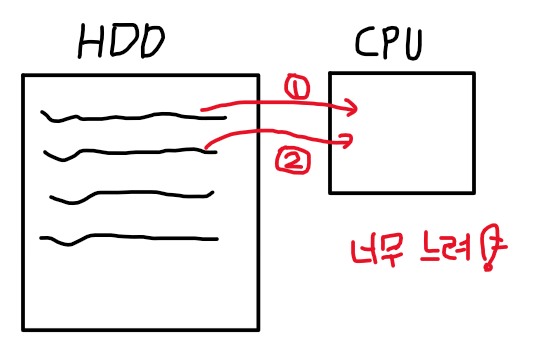
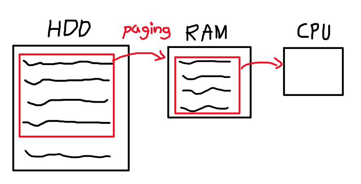
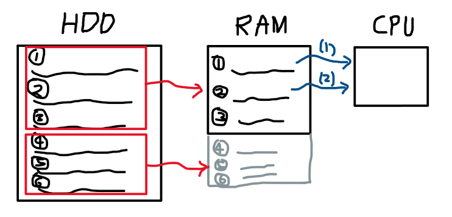
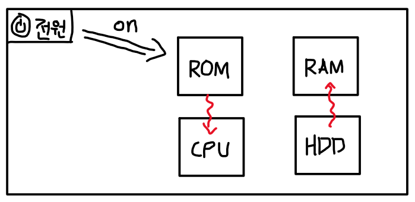
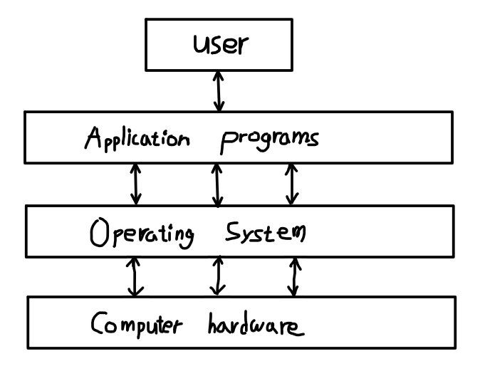
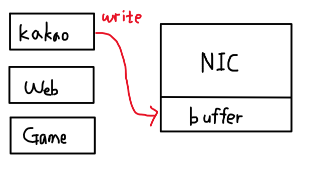
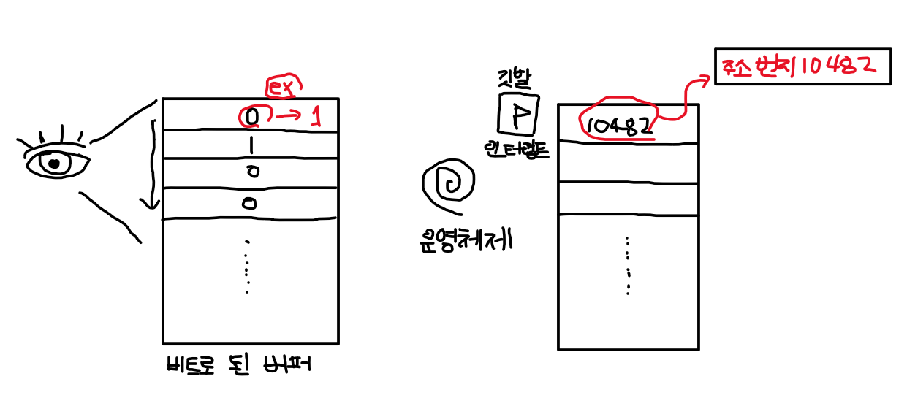

# 2022.03.10(목) - 운영체제 수업

## Computer system's Four components

 

컴퓨터 시스템의 구성요소는 크게 4가지로 분류할 수 있다.

 

### (1) 하드웨어 기반의 컴퓨터 자원들 (computing resources)

 

OS(Operating System), 운영체제는 소프트웨어를 구동시키도록 하드웨어에 올리는 녀석을 의미했다. 즉, 소제목 (1)은 소프트웨어를 구동시키기 위한 하드웨어 자원을 의미한다.

 

CPU, memory(HDD/RAM), I/O devices 정도가 있다. 하드웨어 기반의 컴퓨터 자원들은 이게 전부라고 할 수 있다.

> memory의 RAM은 CPU에 들어가는 명령어들을 버퍼링 시켜준다.

 

</img>

HDD에 컴파일 된 명령어가 저장되어 있는데, 이것을 CPU에 직접 올려서 실행시키는 데는 너무 오래 걸린다.

</img>

따라서, RAM을 거치게 되는데, 이때 HDD에 저장된 소프트웨어 일부를 떼어내서 RAM에 올리는 작업을 한다. 일부를 떼어낼 때 페이지(page) 단위로 작업하기 때문에 이를 페이징 기법(paging) 이라고 한다.

</img>

HDD에 저장된 소프트웨어를 더블클릭하여 실행해서 프로세스 형태로 RAM에 올린다. CPU가 (1), (2)처럼 명령어를 실행하는 동안 I/O devices가 HDD->RAM 으로 계속 올려주는 작업이 동시다발적 (concurrency)으로 일어나고 있다. **따라서, CPU가 보는 RAM은 마치 무한해 보인다.**

 

추가로, HDD -> RAM -> CPU 순서로 갈수록 속도는 빨라지며 용량은 작아진다. 용량이 작아지기 때문에 HDD에 저장된 소프트웨어의 크기가 크다면 페이징 기법으로 쪼개서 넘겨주는 것이다. 

 

**즉, RAM의 용량이 작으면 컴퓨터 실행 속도가 느리다는 것이다. 용량이 작기 때문에 페이지를 잘게 쪼개야 하고, 그렇게 되면 I/O 과정이 너무 많아지면서 느려지는 것이다. 이 말은, RAM 용량이 크다면 페이징을 크게 크게 할 수 있다는 의미이고, RAM은 컴퓨터의 실행 속도에 큰 영향을 끼친다는 뜻이다**

  

### (2) 운영체제 (Operating System)

 

1강에서도 설명했지만, 운영체제는 하드웨어와 소프트웨어 사이의 펌웨어(Firmware)라고 했었다. 하드웨어와 다양한 어플리케이션과 사용자 사이를 제어하고 조절하는 역할을 한다.

 

운영체제가 반드시 실행되어야 컴퓨터가 돌아가는데 그러면 운영체제도 RAM에 올려야 할까? 답은 YES이다. HDD에서 RAM으로 올릴 때 더블클릭해서 실행중인 프로세스 형태로 만들어서 올려야 하는데 우리가 더블클릭 하는 과정 없이 전원만 켜도 운영체제가 RAM에 올라가는 것은 어떤 원리일까?

 

</img>

 

제조사에서는 ROM(Read Only Memory)라는 수정이 불가능하고 읽기만 가능한 것을 만들어 놓는다. 이것을 이용한다.  

- (1) 컴퓨터 전원을 킴
- (2) ROM의 명령어들이 실행
    - (2-1) I/O 하드웨어가 잘 연결되어 있는지 확인
    - (2-2) HDD에 저장되어있는 운영체제를 RAM에 적재하기
- (3) RAM에 올라간 운영체제를 CPU에 밀어넣으면 운영체제가 구동

  

### (3) 응용 프로그램 (Application Programs)

 

Application programs - define the ways in which the system resources are used to solve the computing problems of the users.

 

책에서 위와 같이 정의한다. 유저가 컴퓨터를 사용하는 과정에서 발생하는 다양한 컴퓨팅 문제들을 해결하기 위해 시스템 리소스(자원)들이 사용되는 방식을 정의하는 것이다. 응용 프로그램에는 워드 프로세서, 컴파일러, 웹 브라우저, 데이터베이스 시스템, 게임 등이 이에 속한다.

 

사용자가 사용하는 응용 프로그램은 user level program 이고, OS가 사용하는 것은 system level program이다.

  

### (4) 사용자 (Users)

 

사용자의 입장에서 운영체제가 없다면 GUI(Graphical User Interface)가 없기 때문에 실행하기가 힘들 것이다. 사용자가 편리하게 사용할 수 있도록 입출력 등을 쉽게 하기 위하여 그래픽으로 인터페이스를 제공해주는 것이다.

 

또한, 사용자가 직접적으로 컴퓨터 하드웨어와 통신할 수 없다. 응용 프로그램을 반드시 거쳐야 한다.

 

</img>

  

## 운영체제가 하는 일

 

운영체제는 시스템을 구동시키기 위해 소프트웨어를 하드웨어에 올리고 사용자의 편의를 위해 다양한 일을 한다. 어떤 일을 하는지 조금 더 상세하게 살펴보겠다. 본체에 LAN 카드, 즉, NIC (Network Interface Card)가 있는데, PC나 서버 등의 컴퓨터를 네트워크에 연결시키기 위한 장치이다.

 

</img>

 

응용 프로그램들이 네트워크에 연결되려면 NIC에 있는 buffer에 쓰는 과정을 거쳐야 한다. 최근 하드웨어 자원들은 성능이 좋아져서 동시적으로 concurrency 하게 접근한다. 그런데, 시스템 자원은 한정적 이지만 응용 프로그램은 매우 매우 매우 많다. 이때 여러 응용 프로그램들이 동시적으로 한정적인 시스템 자원인 buffer에 write 하면 어떻게 될까?

 

분명 충돌이 일어나서 옳지 않은 데이터가 buffer에 기록될 것이다. 따라서, 접근 제어하는 과정이 필요하다. **동시에 여러 개의 프로세스가 자원을 공유할 때 하나의 프로세스만 read/write 가능하도록 제어한다.** 이러한 것을 가능하게 하는 것이 바로 **운영체제**이다.

  

## 커널(kernel)과 운영체제(OS)의 차이

 

시스템 프로그래밍 때 배웠던 커널(kernel)이라는 용어가 등장했다. 커널은 운영 체제의 핵심이 되는 컴퓨터 프로그램으로, 시스템의 모든 것을 완전히 통제한다. 운영 체제의 다른 부분 및 응용 프로그램 수행에 필요한 여러 가지 서비스를 제공한다.

 

커널 또한 응용 프로그램과 하드웨어를 연결시키고, 운영체제 또한 응용 프로그램과 하드웨어를 연결시키는 역할을 한다. 비슷한 개념이지만, 설명해보면

- 운영체제 - 이런 일을 해야한다고 **Concepts**을 잡아놓은 것
- 커널 - 이러한 컨셉을 실제로 **구현**한 것

이라고 볼 수 있다. 위에서 설명한 것을 토대로 운영체제가 여러 개의 프로세스가 자원을 공유할 때 하나의 프로세스만 접근 가능하도록 제어한다는 **concepts**을 잡았다면, 커널은 실제로 컴퓨터에서 이러한 일을 구현한 것이다. 왜냐하면, 여러 운영체제 Windows, mac, linux가 있다고 하면 concept은 동일하지만 실제 내부에서 작동하는 방식은 운영체제마다 다를 것이기 때문이다.

  

## 인터럽트(Interrupt)와 폴링

 

위키백과의 정의를 먼저 살펴보겠다.

> 마이크로프로세서에서 인터럽트(interrupt)란 마이크로프로세서(CPU)가 프로그램을 실행하고 있을 때, 입출력 하드웨어 등의 장치에 예외상황이 발생하여 처리가 필요할 경우에 마이크로프로세서에게 알려 처리할 수 있도록 하는 것을 말한다. 
> 
> 폴링(polling)이 대상을 주기적으로 감시하여 상황이 발생하면 해당처리 루틴을 실행해 처리한다면, 인터럽트는 상대가 마이크로프로세서에게 일을 처리해 달라고 요청하는 수단이다. 따라서 폴링과 대비되는 개념이다. 폴링은 주기적으로 마이크로프로세서가 상태를 파악하기 위해 장치의 레지스터를 읽어야 한다. 이 작업이 진행되는 동안은 다른 장치는 체크가 힘들다. 그리고 이런 작업은 장치의 상태를 읽는데 마이크로프로세서의 자원이 낭비된다.

 

수업에서 폴링은 가볍게 설명하고 넘어갔기에 인터럽트 위주로 살펴보겠다. 운영체제는 모든 일을 할 때 인터럽트 기반으로 동작한다. 인터럽트는 쉽게 말해 **어떠한 작업이 완료되었는 지 확인하는 신호**라고 이해한다.

 

CPU가 어떤 작업을 시키고 쉬러 간다. 그럼 다른 하드웨어에서 그 작업이 끝나면 인터럽트 신호를 보내서 CPU를 깨운다는 뜻이다. 쉽게 말해서 인터럽트는 일종의 택배 도착 문자이다. 택배가 도착하는 날에 1시간 마다 택배개 왔는지 문을 열고 확인하는 것보다 택배가 도착했다는 문자가 오면 그때 확인하는 것이 이득이기 때문이다.

 

인터럽트 **사용 목적**은 **여러 개의 프로세스, 여러 개의 하드웨어가 동시다발적으로 실행될 때 이때 신호를 주고 받아서 실행시간을 빠르게 하는 것**이 목적이다. 작업을 시켜놓고 CPU가 멍하니 있는 것보다 자면서 자원을 낭비하지 않는게 이득이기 때문이다.

 

</img>

 

> 인터럽트 벡터(interrupt vector)는 인터럽트가 발생했을 때, 그 인터럽트를 처리할 수 있는 서비스 루틴들의 주소를 가지고 있는 공간이다. 인텔 아키텍처에서는, 가상메모리를 사용하지 않았던 386이전에는 주로 Main Memory의 0번째에 위치하였으나, 이후부터는 IDT(Interrupt descriptor table)의 형태로 바뀌었다.

 

운영체제는 비트로 된 버퍼를 감시한다. 그때 인터럽트가 발생했는 지 확인하고 발생했다면 작업이 끝났다는 것을 알게되는 것이다. 인터럽트가 발생 했을 때 변화를 줘서 알게 해주는 공간을 **인터럽트 벡터**라고 한다. 이는 인터럽트라는 이벤트를 발생시키기 때문에 **event driven 방식**이라고도 한다.

 

> 계속 비트로 된 버퍼를 감시하고 있다면 인터럽트와 폴링의 차이가 없는 것 아니냐고 할 수 있지만, 폴링을 대상을 주기적으로 감시하기 때문에 메모리 낭비가 크지만, 인터럽트는 비트로 된 버퍼를 감시하기 때문에 실행속도에 크게 영향을 끼칠만한 작업이 아니다. 폴링에 비해 굉장히 작은 메모리를 소모한다.