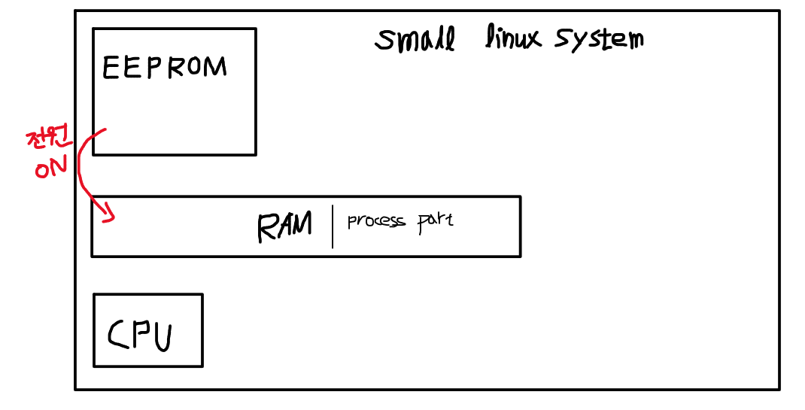

# 2022.03.11(금) - 운영체제 수업

## 발전하고 있는 하드웨어

<br>

최근의 CPU는 갈수록 더 빨라지고 있다. 과거와 변화가 있다면, 과거에는 CPU의 클록 속도가 3GHz, 4GHz 까지도 빨라졌었다고 한다. 그런데, 현대에는 2.8GHz, 3.2GHz 같은 속도가 많다.

<br>

CPU가 컴퓨터의 속도를 높인다고 생각해서 코어 1개만 있는 상태에서 클록 속도를 높였지만 생각보다 성능이 잘 나오지 않았다고 한다. 시간이 흐르고 RAM이 실행속도에 더 크게 영향을 끼친다는 것을 알게 되었고, CPU 코어 하나의 속도를 높이는 것보다 코어를 여러 개 늘리는 것이 낫다는 것을 알게되었다.

<br>

예를 들어, 한 사람이 작업을 빠르게 하는 것과 두 사람이 작업을 어느 정도의 속도로 하는 것을 비교 했을 때 후자가 더 많은 작업을 하는 것이랑 같은 원리이다.

<br>

**하지만, 운영체제 수업에서는 하나의 CPU에서 하나의 코어가 하나의 작업하는 것을 전제로 수업을 진행한다. 이해가 잘되도록 하기 위하여 중간고사 전까지는 그렇게 수업하고 그 이후부터는 쓰레드가 멀티 프로세스 등으로 확장한다.**

<br><br>

## 애플 맥북의 M1 CPU는 왜 빠를까 ?

<br>

지금까지 HDD에서 RAM으로 올리고 다시 CPU로 올리고 이렇게 표현했는데 다양한 하드웨어가 서로 통신한다는 것인데 이렇게 통신하기 위해 공통된 통신 구간이 존재한다. 이를 **시스템 버스**라고 한다.

<br>

원래는 CPU와 RAM이 bus를 통해서 통신을 해왔는데, M1 칩셋은 **보드 하나에 CPU와 RAM을 묶어서 만들고 전용 bus를 만들어서 통신하게 했다.** 이로 인해 미친듯한 성능 향상을 보이게 된 것이다.

<br><br>

## EEPROM이 무엇일까 ?

<br>

이전 수업에서 공장에서 제조될때 바로 데이터가 저장되어 고정된 채 생산되어 데이터를 변경하는 것이 불가능 했던 ROM(Read Only Memory)을 배웠었다. 여기서 나아가 PROM(Programming ROM)이 등장하는데, **PROM은 프로그래밍 가능한 롬**이다. 프로그래밍 가능하다는 것은 내부의 회로를 변경해서 데이터를 수정할 수 있다는 말이다. 그러나 내부의 퓨즈를 끊어서 정보를 저장하는 방식이기 때문에 한번 데이터를 설정하면 그 이후에는 변경하지 못한다.

<br>

여기서 나아가 발전된 것이 EPROM(Erasable PROM)이다. **EPROM은 자외선을 이용해서 정보를 지우며, 여러번 썼다 지웠다** 할 수 있고 여기서 더 발전된 것이 바로 **EEPROM**이다.

<br>

EPROM은 자외선을 이용해서 정보를 다뤘는데, EEPROM은 **전기적으로 지웠다 썼다** 할 수 있기 때문에 쓰는 속도가 매우 빠르고, 전용 롬라이터(롬을 기록할 수 있도록 해주는 장비)가 없어도 손쉽게 다룰 수 있다. 그럼 이를 이용해서 어떤 것이 가능할까?

<br>

예를 들어, 최근의 전기밥솥, 인덕션 등 가전제품은 제조사로부터 펌웨어를 업데이트 받고 다양한 프로그래밍 기능을 한다. 하지만 여기에는 크기가 큰 HDD를 넣을 공간이 부족할 것이다. 근데 생각해보면 HDD가 없어도 프로그래밍적 요소를 포함하고 있는 데 어떻게 가능할까?

<br>

<p align="center"></img></p>

<br>

EEPROM이 있기에 가능하다. 사용자는 기록 못하지만 제조사가 펌웨어를 업데이트 가능하도록 EEPROM을 사용한다. 제품에 전원이 들어오면 RAM의 일부분에 압축을 풀고 기록한다. 즉, 최신 가전제품 안에 작은 리눅스 시스템이 구동 중인 것이다.

<br>

EEPROM은 전기적으로 썼다가 지웠다가 하기 때문에 **휘발성 메모리(volatile memory)**라고 한다.

<br><br>

## 컴퓨터의 실행속도를 높이는 방법

<br>

CPU가 점점 빨라지고 RAM의 용량이 커지면서 컴퓨터의 실행속도가 빨라지고 있다고 잠깐 언급한 적이 있다. 하드웨어적 관점 말고 소프트웨어적 관점에서는 실행속도를 어떻게 높일까?

<br>

최근의 CPU는 명령어가 동시다발적으로 실행할 수 있다면, 그렇게 실행한다. 예를 들어, 아래와 같은 코드가 있다고 하자.

```python
a = 1       # (1)
b = 2       # (1)
c = 3       # (2)

a = a + b   # (1)
c = c * c   # (2)
```

(1)의 명령어들과 (2)의 명령어들은 서로 관련이 없어서 동시에 실행해도 문제가 없다. 이런 명령어를 동시다발적으로 실행한다.

<br>

또, 조건문(if문) 에서 속도를 빠르게 하는 방법도 있다. if문을 실행하면 True 일 때 실행하는 문장과 False 일 때 실행하는 문장이 있으면 이 분기점을 동시에 실행한다. 하나가 끝날 때까지 기다리는 것이 아니라 동시에 실행하고 해당하는 부분 외의 것을 버리면 되기 때문이다.

<br>

컴퓨터에서 실행 속도를 높이는 중요한 방법은 **원래 빠른 녀석을 더 빠르게 하는 것이 아닌 느린 녀석을 더 빠르게 하여 빠른 놈과 느린 놈의 간극을 줄이는 것** 이라고 한다.

<br><br>

## 그 외 이야기

<br>

- HDD와 비슷한 역할을 하지만 크기가 굉장히 작으면서 RAM과 비슷한 역할을 하는 아이. HDD와 RAM의 중간에 위치한 **SSD는 비휘발성 메모리(non-volatile memory)** 이다.

<br>

- 이전 수업에서 CPU의 싱글코어, 멀티코어 등 여러 가지 코어는 고려하지 않는다고 설명했었는데 여러 가지 코어를 잠깐 설명해보자면 CPU의 여러 코어들은 **하나의 RAM을 공유**한다. 그래서 RAM을 **main memory**라고 하는 것이다.
