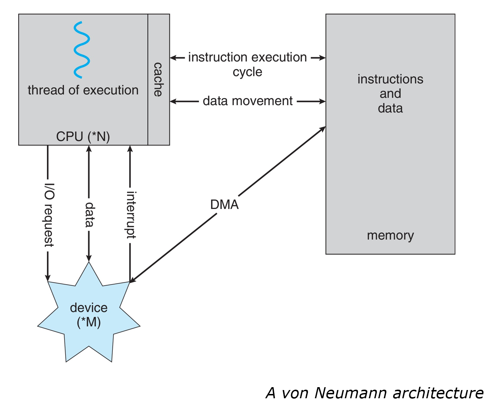
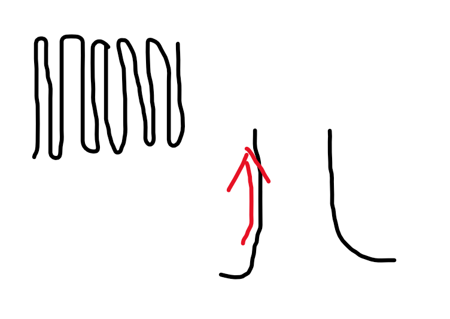
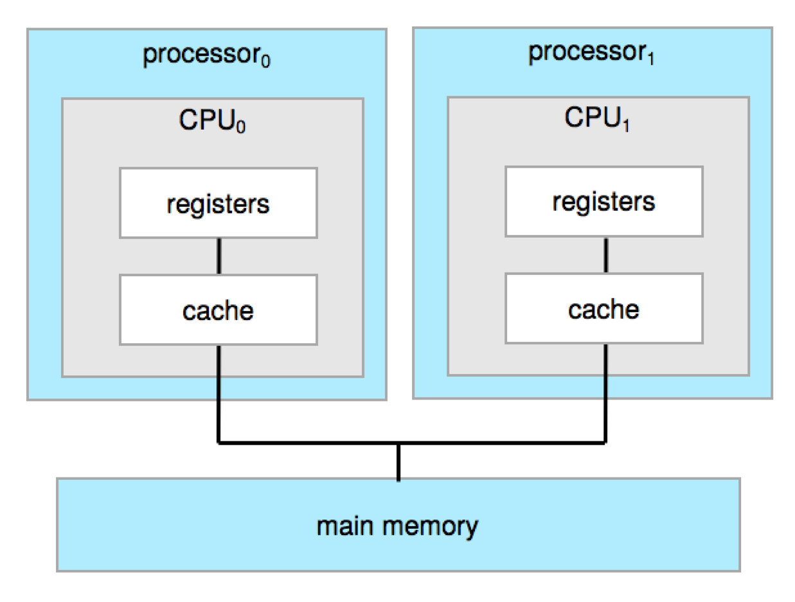
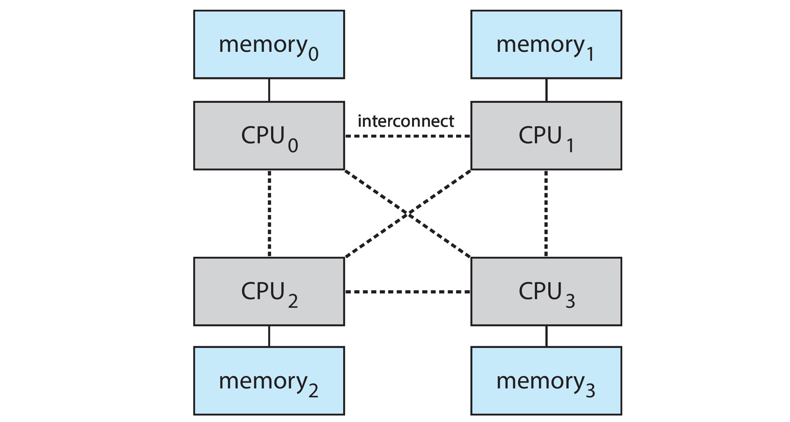
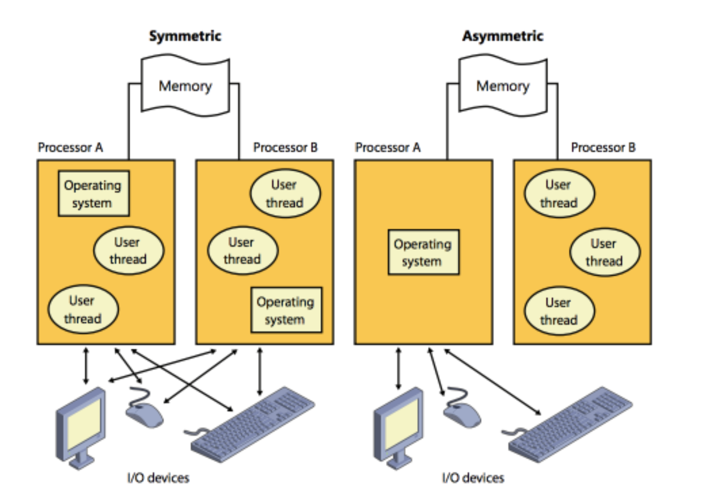
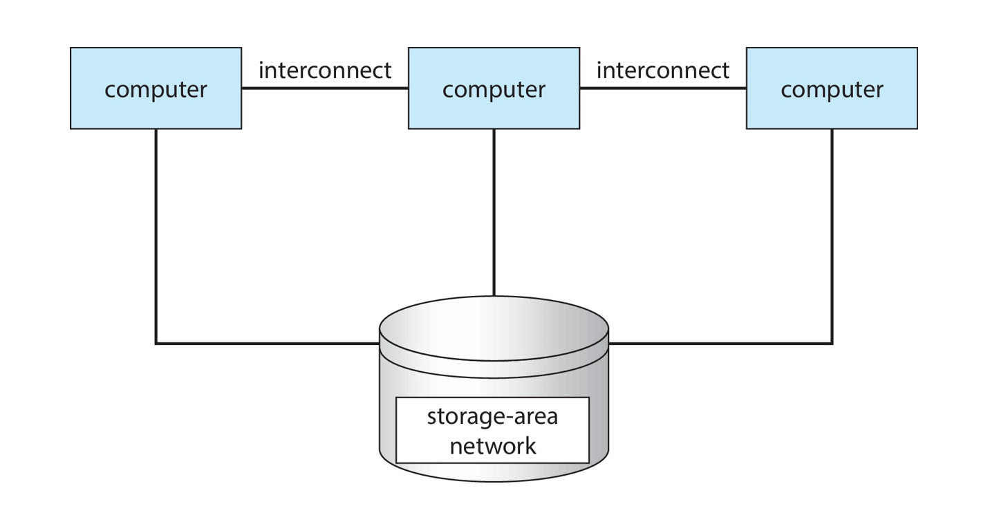
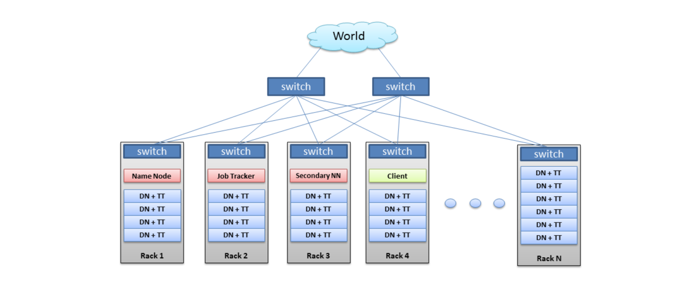
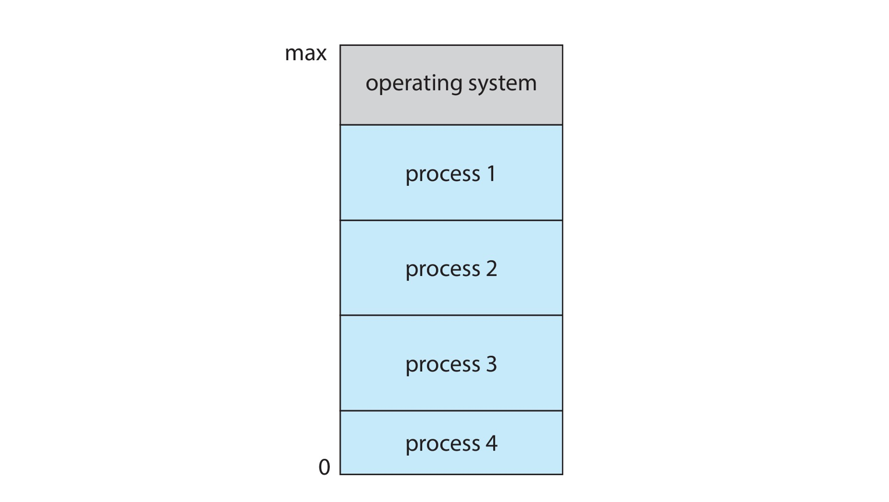
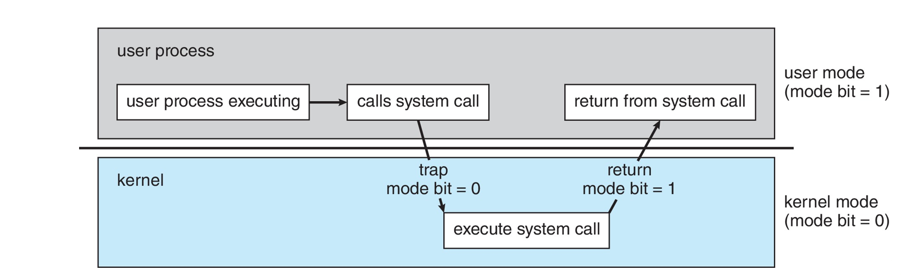

# 2022.03.17(목) - 운영체제 수업

 

## 메모리 계층구조와 같이 구조화하여 나눈 이유는 ?

  

컴퓨터가 명령어를 실행하려면 CPU가 계산하여 실행해야한다. CPU가 명령어를 실행하도록 하려면 메인 메모리(RAM)에서 CPU로 밀어넣어야 한다. 하지만, CPU와 메인 메모리는 성능은 뛰어나지만 용량이 작고 비싸다.

 

    메인 메모리에 데이터가 영구적으로 존재하기를 원하지만, 현실적으로 불가능 한데 여기에는 2가지 이유가 있다.

    1. 메인 메모리의 용량은 너무 작다.
    2. 메인 메모리는 전원이 공급되지 않으면 내용이 날라가는 휘발성 저장장치이다.

 

이러한 이유로 반드시 보조 저장 장치가 필요하게 된다. 대량의 데이터를 저장할 수 있어야 하기에 용량이 커야하고 비휘발성이어야 하는 것이다. 가장 일반적으로 HDD(하드 디스크 드라이브)와 NVM(Non Volatile Memory, 비휘발성 메모리)가 존재한다.

 

</img>

 

메모리 계층 구조에는 **1차 저장 장치**에는 레지스터, 캐시, 메인 메모리가 있고 **2차 저장 장치**에는 NVM(비휘발성 메모리), HDD(하드디스크 드라이브)가 있고 마지막으로 **3차 저장 장치**에는 광학 디스크, 자기 테이프 같은 것이 있다.

 

3차 저장 장치는 다른 장치에 저장된 자료의 백업 사본을 저장하기 위해 특수한 목적으로만 사용해서 매우 느리고 용량이 충분히 크다는 특징을 가지고 있다.

 

    - 휘발성 저장 장치는 보통 "메모리"라고 많이 한다.
    - 비휘발성 저장 장치는 NVS라고 하는데, NVS는 크게 기계적 저장 장치인 HDD, 광 디스크, 홀로그램 저장 장치, 자기 테이프 등이 있고 전기적 저장 장치인 플래시 메모리, FRAM, NRAM, SSD가 있다.
    - 기계적 저장장치는 전기적 저장장치보다 용량이 크고 비용이 저렴하다.
    - 전기적 저장장치는 기계적 저장장치보다 용량이 적고 비싸고 빠르다.

  

## 현대 컴퓨터의 작동 원리, DMA

 

컴퓨터의 I/O에 관하여 생각해보자. 입출력을 제어하는 방식은 크게 4가지가 있다.

 

    1. 프로그램에 의한 I/O (CPU 개입 O)
    2. 인터럽트에 의한 I/O (CPU 개입 O)
    3. DMA에 의한 I/O (CPU 개입 X)
    4. 채널에 의한 I/O (CPU 개입 X)

 

운영체제가 인터럽트에 의해 동작한다는 것을 앞에서 설명했는데, 인터럽트 구동 I/O의 형태는 시스템 버스를 통해 소량의 데이터가 이동하는 원리이다.

 

그런데, NVS(Non Volatile Storage)와 같이 대용량 데이터가 이동할 때 CPU의 개입이 있으면 높은 오버헤드를 유발할 수 있어서 좋지 않다. 이 문제를 해결하기 위하여 **DMA(Direct Memory Access, 직접 메모리 액세스)** 방식을 채택한다.

 

</img>

 

DMA는 장치에 대하여 버퍼, 포인터, I/O 카운트를 세팅하고 Device controller(장치 제어기)는 **CPU의 개입 없이** 메모리 -> 자신의 버퍼 장치 / 버퍼 장치 -> 메모리로 데이터 블록 전체를 전송한다. 한 바이트마다 입터럽트가 발생하는 원리와 다르게 블록 전송이 완료될 때마다 인터럽트가 발생한다. 따라서, device controller가 전송 작업을 수행하고 있는 동안 CPU 역시 다른 작업을 수행할 수 있다.

 

정리하자면, **DMA는 주변 장치(HDD, 그래픽카드 등)가 CPU 개입 없이 메모리에 직접 접근하여 읽거나 쓰도록 할 수 있는 기능**이다. CPU는 상태, 제어정보만을 교환하고 데이터 전송은 I/O 장치와 기억장치(메모리) 간에 직접 교환하는 방식이다. 

  

## 클록 속도 높이기의 한계 -> 멀티 프로세서 등장 배경

 

</img>

 

먼저, CPU에서 명령어가 실행되는 과정을 간략적으로 살펴보면, 이러한 전기 신호에 맞춰서 명령어들이 실행된다. 이때, 클록 속도가 의미하는 바는, 전기적인 신호에 맞추어서 클록 주파수를 딱, 딱, 딱, 딱 맞춰서 보내는 것이다. 클록 스피드가 빨라질수록 명령어 실행 속도가 빨라진다.

 

그러면 왜 클록 스피드를 올리다가 멈춘 것일까? 클록 스피드를 더 빠르게 할 수는 있지만, 만약 매우 빠르게 딱딱딱딱딱딱 보냈다고 치자.

 

</img>

 

전기의 속도에도 한계가 있기 때문에 상승 엣지 동안에 다음 클록이 딱! 신호를 보내버리면 CPU 입장에서는 아직 명령어를 실행한 상태인 건지 안한 상태인지 애매하게 되어버리고 따라가지 못하게 되는 것이다. 추가로, 엄청난 발열, 전력소모 등으로 성능을 향상시키는 것에 한계에 부딪힌 것이다.

 

**그래서, CPU 클록 스피드는 감당할 수 있을 정도 까지만 올리고 차라리 CPU의 코어 수를 늘리게 된 것이다. 이때부터 멀티 코어 프로세스들이 본격적으로 보급되기 시작하였다.**

 

    [ 추가 자료 - 폴락의 법칙 ]

    폴락의 법칙은 성능은 면적(트랜지스터 수) 증가량의 제곱근과 비례한다 의미이다. 
    즉, CPU 성능을 올리면 올릴수록 면적이 제곱으로 증가해서 현실적으로 
    CPU 클록 속도를 높이는 것에 한계가 있다는 의미이다.

  

## CPU, 코어, 프로세서, 멀티 코어, 멀티 프로세서

 

CPU의 클록 스피드를 올리는 것에 한계를 느껴 CPU의 수를 늘려서 ( = 작업하는 사람의 수를 늘려서 ) 성능 향상을 하기로 하였다. 현대에 이르러 제목을 통틀어서 CPU라고 칭하기는 하지만 조금 더 상세하게 용어 정리를 해보겠다.

 

- CPU : 명령을 실행하는 하드웨어, 코어를 포함하며 pc(program counter) 레지스터 등을 다룰 수 있는 것

- 프로세서(processor) : 하나 이상의 CPU를 포함하는 물리적인 칩

- 코어(core) : CPU의 기본 계산 단위, 각 명령어를 실행하기 위한 ALU(Arithmetic Logic Unit), CU(control unit), 레지스터를 가지는 것.

- 다중 코어(multi core) : 동일한 CPU에 여러 컴퓨팅 코어를 포함

- 다중 처리기(multi processor) : 여러 프로세서를 포함

 

보통 컴퓨터 시스템에서 단일 계산 단위를 가리킬 때는 CPU라고 한다. CPU의 하나 이상의 코어를 구체적으로 언급할 때 코어, 다중코어를 말한다.

 

### SMP 시스템

 

</img>

 

멀티 프로세서 시스템은 CPU가 여러 개 있는 시스템을 의미 하는데 이 중 SMP(Symmetric Multi-Processing, 대칭형 멀티 프로세서 시스템)는 하나의 메인 메모리를 여러 CPU가 공유하는 시스템을 의미한다.

 

SMP의 장점은 대칭형이기 때문에 **많은 프로세스를 동시에 실행할 수 있다**는 것이다. N개의 CPU가 있다고 하면 성능을 크게 저하시키지 않고 N개의 프로세스를 실행할 수 있다. 그러나, 여기에서 문제가 발생하는데, CPU 자체는 독립적이기에 하나는 유휴 상태(아무것도 안하고 휴식 중인 상태)이고 다른 하나는 과부하에 걸리는 비효율적인 상황이 발생할 수 있다.

 

### CMP 시스템

 

</img>

 

CMP(Chip level Multi-Processing, 멀티 코어 시스템)는 하나의 CPU에 여러 코어가 붙은 것을 의미한다. 칩 내 통신이 칩 간 통신보다 빨라서, 멀티 코어 시스템은 단일 코어를 가지는 여러 칩보다 효율적일 수 있다. 추가로 멀티 코어를 가지는 하나의 칩은 여러 개의 단일 코어를 가지는 칩보다 훨씬 적은 전력을 사용하는 것도 장점이다.

 

    내가 이해한 바로는 간단하게 CPU라는 하드웨어가 있고 이 CPU의 내부에 
    코어가 여러 개 들어가면 다중 코어라고 하고 CPU를 여러 개 쓰면 
    다중 처리기라고 하는 것이다.

    현대의 컴퓨터는 CPU 각각이 멀티 코어면서 이런 CPU를 여러 개
    사용하는 멀티 프로세스를 겸비하여 멀티 코어 프로세스의 개념이다. 

    멀티 코어, 멀티 프로세서를 너무 복잡하게
    따로 떼어서 생각하지는 말자.

 

    SMP와 CMP의 차이를 간단하게 살펴보면,
    SMP는 명령어를 병렬로 수행
    CMP는 명령어의 마이크로 연산을 병렬로 수행
    정도라고 보면 된다.

 

### NUMA

 

</img>

 

SMP와 같은 멀티 프로세서 시스템에 CPU를 추가하면 컴퓨터의 성능이 향상되는 것은 맞다. 그러나, SMP의 개념은 확장성이 별로 좋지 않다. 왜냐하면, 메인 메모리 하나를 여러 CPU가 공유하기 때문에 CPU를 많이 추가하게 된다면 **시스템 버스에 대한 병목 현상이 일어나서 성능이 저하되기 시작한다.**

 

그래서 나온 개념이 NUMA(Non-Uniform memory access) 개념이다. NUMA는 모든 CPU가 **공유 시스템 연결**로 연결되어 있어서 **모든 CPU가 하나의 물리 주소 공간을 공유한다.** 

 

각각의 CPU는 각각의 메모리를 가지고 있기에 로컬 메모리에 접근할 때 빠르고 시스템 상호 연결에 대한 경합도 존재하지 않는다. 따라서, SMP보다 확장성이 좋다는 장점이 있다.

 

그러나, CPU가 시스템 상호 연결을 통해 원격 메모리에 접근해야 할 때 지연 시간이 증가하여 성능 저하가 발생할 수 있다. 예를 들어, CPU 0가 memory 0(로컬 메모리)에 접근하는 속도와 CPU 0가 memory 1(원격 메모리)에 접근하는 속도에 차이가 있을 수 밖에 없어서 성능이 저하된다는 것이다.

 

운영체제는 정확한 CPU 스케쥴링, 메모리 관리를 통해서 NUMA의 단점을 최소화 할 수 있다. NUMA는 많은 수의 프로세스를 수용할 수 있는 좋은 확장성을 가지고 있어서 고성능 컴퓨팅 시스템, 서버 등 점점 인기를 얻어가고 있다.

 

### ASMP 시스템

 

</img>

 

ASMP(Assymmetric Multi-Processing, 비대칭형 멀티 프로세싱)는 여러 개의 상호 연결된 CPU가 동일하게 취급되는 것이 아닌 멀티 프로세서 시스템이다. 즉 메인인 Master Processor가 있고 여러 Slave Processor가 존재하는 형태이다.SMP 에서는 시스템의 모든 프로세서가 OS에서 작업을 수행하지만, ASMP에서는 메인인 Master Processor 만이 OS에서 작업을 비대칭적으로 수행하는 것이다. 

 

ASMP는 자료 공유의 필요성을 감소시키므로 단순하지만, Master Processor가 Slave Processor에게 작업을 할당할 때까지 Slave Processor는 기다려야하므로, 전체 시스템 성능 저하를 야기시킨다.

 

    ASMP 시스템은 SMP 등장 이전 여러 CPU를 처리하는 유일한 방법이었으나, 명확한 단점으로 이제는 역사 속으로 사라지고 있다.

  

## 클러스터형 시스템

 

앞서, CPU를 여러 개 가지는 멀티 프로세서에 관해 말했는데, 이와 비슷하게 여러 CPU를 가진 시스템의 또다른 유형을 **클러스터형 시스템**이라고 한다. 둘 이상의 독자적인 시스템 or 노드들을 연결하여 구성하는 방식이다. 각각의 노드는 멀티 코어 시스템인 경우가 많은데, 이러한 시스템을 약결합(loosely coupled)으로 간주한다.

 

</img>

 

즉, **클러스터 컴퓨터는 저장장치를 공유하고 근거리 통신망(LAN)이나 InfiniBand 같은 고속의 상호 연결망으로 연결**되는 것이다. 간단하게 여러 컴퓨터가 상호작용하여 연결되는데, 이때 저장 공간을 공유한다고 생각하자. 이때 공유하는 저장공간은 **SAN(Storage-Area Network)** 이다.

 

클러스터형 시스템은 **높은 가용성(High-Availability)을 제공하기 위해 사용한다.** 예를 들어, 한 시스템 컴퓨터가 고장나면 그걸 감시하던 다른 컴퓨터가 하던 일을 이어받는 개념이다. 이렇게 클러스터링 하는 방식에는 대칭형과 비대칭형이 존재한다.

  

### 클러스터링 (clustering)

 

- 비대칭형 클러스터링 (asymmetric clustering)

    다른 컴퓨터들이 응용 프로그램을 실행하는 동안 한 컴퓨터는 **긴급 대기(hot-standby) 모드 상태**를 유지한다. 긴급 대기 모드 컴퓨터는 응용 프로그램을 실행 중인 활성 서버를 감시하는 작업만 수행한다. 활성 서버가 고장나면 긴급 대기 모드 상태의 컴퓨터가 활성 서버로 바뀌면서 고장난 컴퓨터가 수행하던 작업을 이어 받아서 수행한다.

 

- 대칭형 클러스터링 (symmetric clustering)

    대칭형 클러스터링은 **둘 이상의 호스트들이 응용 프로그램을 실행하고 서로를 감시**한다. 따라서, 효율적으로 동작하려면 하나 이상의 응용 프로그램들을 실행하여야 한다. 사용 가능한 하드웨어를 모두 사용하기 때문에, 비대칭형 클러스터링보다 대칭형 클러스터링이 더 효율적이다.

  

### HPC(High Performance Computing)

 

HPC는 클러스터 시스템의 한 형태이다. 한 클러스터가 네트워크로 연결된 다수의 컴퓨터 시스템으로 구성되어서 클러스터는 고성능 계산환경을 제공하도록 사용될 수 있다. 쉽게 슈퍼 컴퓨터를 생각하면 된다.

 

</img>

 

HPC는 클러스터 내의 모든 컴퓨터에서 **병렬 수행**할 수 있어서 단일 마이크로 프로세서나 SMP(Symmetric Multi-Processing) 보다 훨씬 큰 계산 능력을 제공할 수 있다. **응용 프로그램이 반드시 클러스터를 이용할 수 있도록 작성되어야 해서 병렬화 기법을 사용해야 한다.** 이를 통해 프로그램을 컴퓨터의 개별 코어에서 혹은 클러스터의 각 컴퓨터에서 수행되는 분리된 요소로 나누는 작업을 포함한다.

클러스터 시스템이라는 것이 몇 개의 CPU를 모아서 몇 백 개의 랙(Rack) 장비로 만들고 그 랙 장비를 다시 모아서 수 천 개의 CPU를 한 데 모아놓은 것이서 거대한 연산 능력을 가진 컴퓨터라고 생각하면 된다. 

하지만 단순히 커다란 컴퓨터를 생각하면 안 된다. **수 천개의 CPU와 저장 장치가 서로 통신을 하면서 작업을 해야 하고 그 작업을 병렬 및 병행 처리**를 해야 하기 때문에 주의깊은 설계가 필요하다.

  

## 운영체제의 작동

 

1. 부트스트랩 프로그램(bootstrap program)이 실행된다. 부트스트랩 프로그램은 전원을 켜거나 재부팅을 할 때 적재되는 프로그램이다. 일반적으로 펌웨어라고 알려진 ROM 또는 EEPROM에 저장되어 있다. 

2. 부트스트랩 프로그램이 시스템을 모든 측면에서 초기화하며, 운영 체제 커널을 적재하고 실행시킨다.

3. 커널이 실행되는 동안 실행되는 **시스템 데몬**이 되기 위해 부팅할 때 메모리에 적재되는 시스템 프로그램에 의해 커널 외부에서 제공된다.

4. 이후 시스템은 어떤 이벤트가 발생할 때 까지 기다린다.

 

이벤트 발생은 인터럽트가 발생하는 것을 의미하는데, 즉 커널은 interrupt driven 방식이라는 것이다. 인터럽트도 하드웨어 인터럽트와 소프트웨어 인터럽트로 나뉜다.

 

하드웨어 인터럽트 (Hardware interrupt)
- 앞에서 배웠던 인터럽트를 의미한다.
- 하드웨어 장치가 작업을 완료했을 때 보내는 인터럽트

 

소프트웨어 인터럽트 (Hardware interrupt)
- 트랩(trap)이라고도 한다.
- 숫자를 0으로 나눈다던가 하는 이유로 Software Error가 발생하면 보내는 인터럽트
- 유효하지 않은 메모리에 접근할 때 발생하는 인터럽트
- 무한 반복문이 돌아갈 때 발생하는 인터럽트
- 사용자 프로그램의 특정 요청 때문에 발생하는 인터럽트 (이때 특정 요청은 system call 이라는 특수 연산을 실행하여 요청한다. 요청 받은 운영체제는 서비스를 제공해야한다.)

  

### 데몬 (Daemon)

 

    [위키백과] 
    
    멀티태스킹 운영 체제에서 데몬은 사용자가 직접적으로 
    제어하지 않고, 백그라운드에서 돌면서 여러 작업을 하는 프
    로그램을 말한다. 

    시스템 로그를 남기는 syslogd처럼 보통 데몬을 뜻하는 ‘d’를 이름 
    끝에 달고 있으며, 일반적으로 프로세스로 실행된다.

    데몬은 대개 부모 프로세스를 갖지 않으며, 즉 PPID가 1이며, 
    따라서 프로세스 트리에서 init 바로 아래에 위치한다. 

    데몬이 되는 방법은 일반적으로 자식 프로세스를 포크(fork)하여 
    생성하고 자식을 분기한 자신을 죽이면서 init이 고아가 된 
    자식 프로세스를 자기 밑으로 데려가도록 하는 방식이다. 
    이러한 방법을 ‘fork off and die’라 부르기도 한다.

    시스템은 시동할 때 데몬을 시작하는 경우가 많으며, 이런 데몬들은 
    네트워크 요청, 하드웨어 동작, 여타 프로그램에 반응하는 기능을 
    담당하게 된다. 
    
    그 밖에도 몇몇 리눅스에 있는 devfsd처럼 하드웨어 설정이나, 
    cron처럼 주기적인 작업을 실행하는 등 기타 다양한 목적으로 사용된다. 

 

먼저, 프로세스와 데몬의 차이를 설명하겠다.

 

프로세스(Process)

- 실행 중인 프로그램
- 실행 및 종료를 자유롭게 수행

 

데몬(Daemon)

- 항상 수행되고 있는 프로세스
- 사용자가 직접 제어하지 않고 백그라운드에서 수행
- 보통 시스템 시작 시 자동으로 실행되는 프로세스를 지칭

 

데몬은 인터페이스가 없으며 사용자가 제어하지 않고 백그라운드에서 실행되는 녀석이다. 운영체제가 실행되면서 자동으로 실행되고, 이름 뒤에 데몬을 뜻하는 d가 붙게 된다.

 

예를 들어, 리눅스의 경우 시스템을 시작하면 제일 처음 실행되는 것이 init 파일이다. 이 파일의 프로세스 번호는 0번이다. 그 다음 이 0번 프로세스가 다른 프로세스를 시작하게 하면 그 시작된 프로세스들은 자식 프로세스가 된다. 이때 이 0번 프로세스를 데몬 프로세스라고 한다.

 

또, 리눅스의 첫 번째 시스템 프로그램은 "systemed"인데, systemed는 많은 다른 데몬을 시작한다.

  

## 멀티 프로그래밍과 멀티 태스킹

 

</img>

 

멀티 프로그래밍은 여러 개의 프로그램을 동시에 실행한다는 의미이다. 멀티 프로세싱과 거의 비슷한 개념이다. 여러 개의 프로그램이 RAM에 적재되어 있다는 의미이다. RAM에 적재 되어있고 CPU가 하나라면 한번에 하나의 프로그램이 실행될 것이다.

 

자세하게 말하면, 멀티 프로그래밍은 **CPU가 항상 한 개는 실행할 수 있도록 프로그램을 구성**하여 CPU 이용률을 높여 사용자의 만족도를 높이는 것이다. 

 

멀티 태스킹은 멀티 프로그래밍의 논리적 확장인데, 멀티 태스킹에서 **CPU는 여러 프로세스를 전환하며 프로세스를 실행하지만 전환이 자주 발생하도록 하여 사용자에게 빠른 응답시간을 제공**하는 것이다.

 

PPT의 설명을 보면 다음과 같은 구절이 있다.

    "Single user cannot keep CPU and I/O devices busy at all times"

사실 여기서 user라는 단어는 사람, 사용자라고 생각하기 보다는 이 컴퓨터를 사용하는 대상, application으로 보면 된다. 뭐, 예를 들어 CPU가 매우 바쁘다고 RAM도 똑같이 바쁠 것인가? 아니다. 바쁠 수도 있고 아닐 수도 있다.

  

## 이중모드와 다중모드 운용

 

</img>

 

쉽게 말해서 O/S는 **커널 모드**로 돌고 우리 사용자는 **사용자 모드**로 돈다는 것이다.

 

**모드 비트**라고 하는 비트가 현재의 모드를 나타내기 위에 컴퓨터의 하드웨어에 추가되는데, 이 비트의 값이 0이면 커널모드, 1이면 사용자 모드이다.

 

시스템 부트 시, 하드웨어는 기본적으로 커널 모드에서 시작한다. 이후 운영체제가 적재되고 사용자 모드에서 사용자 프로세스가 시작된다. 트랩이나 인터럽트가 발생할 때 마다 하드웨어는 모드 비트를 0으로 변경하여 사용자 모드에서 커널 모드로 전환한다. 이후 system call을 실행하고 모드 비트를 다시 1로 변경하여 시스템은 사용자 프로그램에게 제어를 넘긴다.

 

이런 이중 모드는 잘못된 사용자로부터 운영체제나 사용자를 보호해준다. 예를 들어, 악영향을 끼칠 수 있다고 생각하는 명령을 **특권 명령**으로 지정한다. 하드웨어는 특권 명령이 커널 모드에서만 수행되도록 허용하는데, 만약 사용자 모드에서 특권 명령을 수행하려고 시도하면, 하드웨어는 이를 시행하지 않고 악영향을 끼치는 명령으로 간주하여 운영체제에 트랩을 건다.
