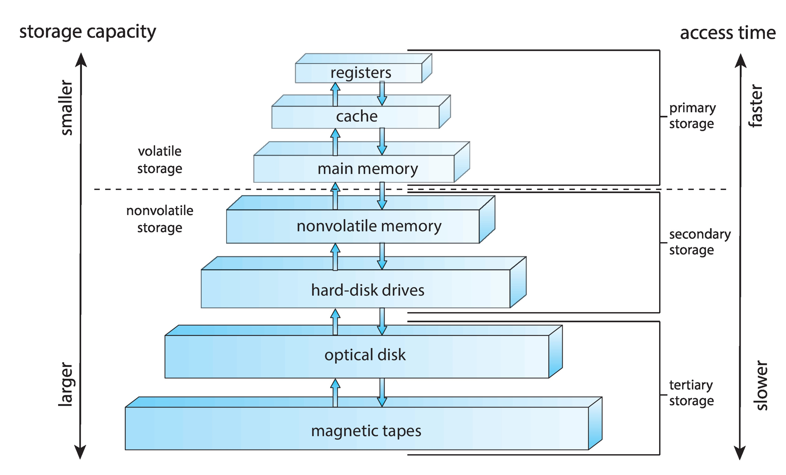
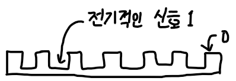
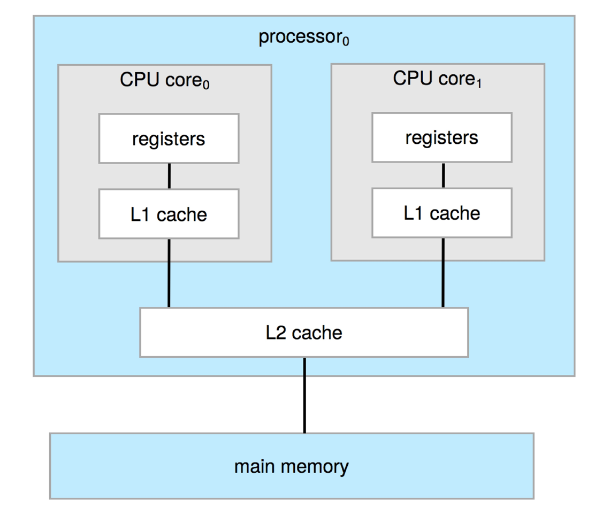

# 2022.03.17(목) - 운영체제 수업

 

## 메모리 계층구조와 같이 구조화하여 나눈 이유는 ?

  

컴퓨터가 명령어를 실행하려면 CPU가 계산하여 실행해야한다. CPU가 명령어를 실행하도록 하려면 메인 메모리(RAM)에서 CPU로 밀어넣어야 한다. 하지만, CPU와 메인 메모리는 성능은 뛰어나지만 용량이 작고 비싸다.

 

    메인 메모리에 데이터가 영구적으로 존재하기를 원하지만, 현실적으로 불가능 한데 여기에는 2가지 이유가 있다.

    1. 메인 메모리의 용량은 너무 작다.
    2. 메인 메모리는 전원이 공급되지 않으면 내용이 날라가는 휘발성 저장장치이다.

 

이러한 이유로 반드시 보조 저장 장치가 필요하게 된다. 대량의 데이터를 저장할 수 있어야 하기에 용량이 커야하고 비휘발성이어야 하는 것이다. 가장 일반적으로 HDD(하드 디스크 드라이브)와 NVM(Non Volatile Memory, 비휘발성 메모리)가 존재한다.

 

</img>

 

메모리 계층 구조에는 **1차 저장 장치**에는 레지스터, 캐시, 메인 메모리가 있고 **2차 저장 장치**에는 NVM(비휘발성 메모리), HDD(하드디스크 드라이브)가 있고 마지막으로 **3차 저장 장치**에는 광학 디스크, 자기 테이프 같은 것이 있다.

 

3차 저장 장치는 다른 장치에 저장된 자료의 백업 사본을 저장하기 위해 특수한 목저으로만 사용해서 매우 느리고 충분히 크다는 특징을 가지고 있다.

 

    - 휘발성 저장 장치는 보통 "메모리"라고 많이 한다.
    - 

## 클록 속도를 높이면 어떻게 되는가

  

</img>

 

먼저, CPU에서 명령어가 실행되는 과정을 간략적으로 살펴보면, 이러한 전기 신호에 맞춰서 명령어들이 실행된다. 이때, 클록 속도가 의미하는 바는, 전기적인 신호에 맞추어서 클록 주파수를 딱, 딱, 딱, 딱 맞춰서 보내는 것이다. 클록 스피드가 빨라질수록 명령어 실행 속도가 빨라진다.

 

그러면 왜 클록 스피드를 올리다가 멈춘 것일까? 클록 스피드를 더 빠르게 할 수는 있지만, 만약 매우 빠르게 딱딱딱딱딱딱 보냈다고 치자.

 

</img>

 

전기의 속도에도 한계가 있기 때문에 상승 엣지 동안에 다음 클록이 딱! 신호를 보내버리면 CPU 입장에서는 아직 명령어를 실행한 상태인 건지 안한 상태인지 애매하게 되어버리고 따라가지 못하게 되는 것이다. 추가로, 엄청난 발열, 전력소모 등으로 성능을 향상시키는 것에 한계에 부딪힌 것이다.

 

**그래서, CPU 클록 스피드는 감당할 수 있을 정도 까지만 올리고 차라리 CPU의 코어 수를 늘리게 된 것이다. 이때부터 멀티 코어 프로세스들이 본격적으로 보급되기 시작하였다.**

 

    [ 추가 자료 ]

    이는 폴락의 법칙 때문이다. 폴락의 법칙은 성능은 면적(트랜지스터 수) 증가량의 제곱근과 비례한다는 의미이다. 즉, CPU 성능을 올리면 올릴수록 면적이 제곱으로 증가해서 현실적으로 CPU 클록 속도를 높이는 것에 한계가 있다는 의미이다.