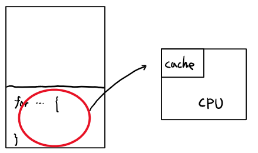

# 2022.03.18(금) - 운영체제 수업

## Caching, Locality

  

[Caching(캐싱)](https://m.blog.naver.com/complusblog/221204759836)이란, Cache(캐시)라고 하는 조금 더 빠른 메모리 영역으로 데이터를 가져와서 접근하는 방식을 뜻한다. 예를 들어, HDD -> 메모리로 데이터를 옮기는 과정은 "데이터를 메모리에 캐싱한다"라고 한다. 메모리 상에 있는 데이터 연산을 위하여 메모리 -> CPU의 캐시로 옮기는 방식 또한 캐싱이라고 한다.

 

캐싱은 데이터의 Locality(지역성) 특징을 이용하여 성능 향상을 이뤄낸다. 지역성에는 **시간 지역성**과 **공간 지역성**이 존재한다. 

    공간 지역성 : 한 번 접근한 데이터의 인근에 저장되어 있는 데이터가 다시 접근될 가능성이 높은 특성

    시간 지역성 : 한 번 접근된 데이터가 가까운 시간 내에 다시 접근될 가능성이 높은 특성

 

</img>

 

반복문 코드를 사용했다고 하면, 저 코드를 재사용 할 확률이 높으면 RAM에서 불러오지 않고 CPU의 cache에서 바로 불러오도록 하여 system speed를 빠르게 한다.