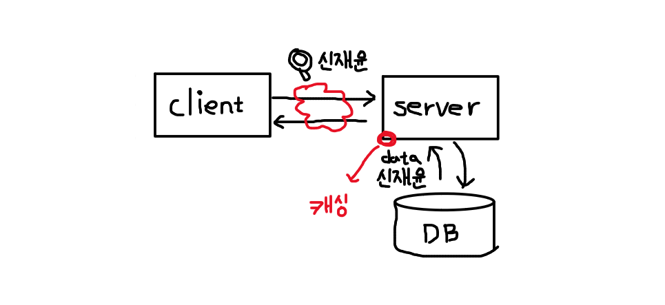
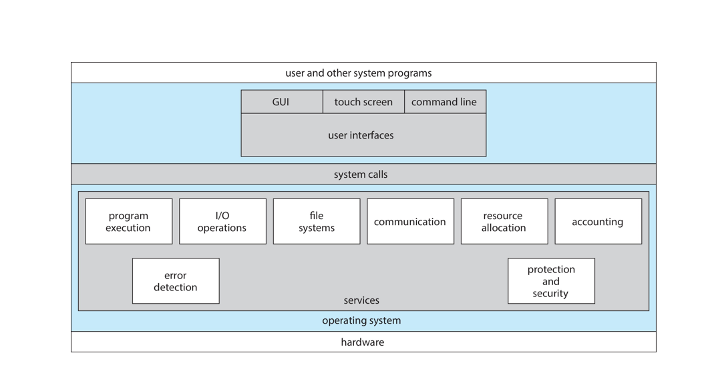
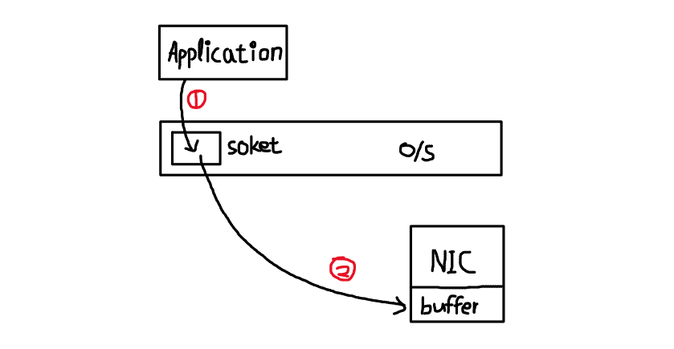
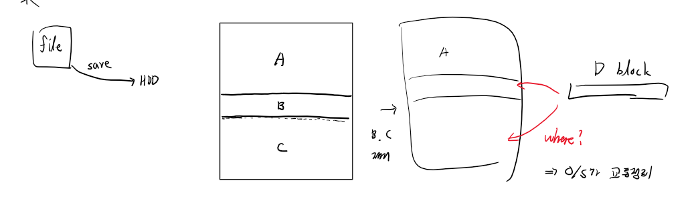
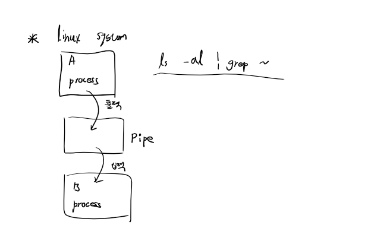

# 2022.03.18(금) - 운영체제 수업

 

## Caching, Locality

 

[Caching(캐싱)](https://m.blog.naver.com/complusblog/221204759836)이란, Cache(캐시)라고 하는 조금 더 빠른 메모리 영역으로 데이터를 가져와서 접근하는 방식을 뜻한다. 예를 들어, HDD -> 메모리로 데이터를 옮기는 과정은 "데이터를 메모리에 캐싱한다"라고 한다. 메모리 상에 있는 데이터 연산을 위하여 메모리 -> CPU의 캐시로 옮기는 방식 또한 캐싱이라고 한다.

 

저장장치의 계층 구조에서 정보 이동은 하드웨어 설계 / 운영체제에 따라 이루어진다. 예를 들어, 캐시 -> CPU 및 레지스터로의 데이터 전송은 통상 **운영체제의 간섭 없이 하드웨어적**으로 이루어지고 디스크와 메모리 간의 데이터 전송은 통상 **운영체제에 의해 제어**된다.

 

캐싱은 데이터의 Locality(지역성) 특징을 이용하여 성능 향상을 이뤄낸다. 지역성에는 **시간 지역성**과 **공간 지역성**이 존재한다. 

    공간 지역성 : 한 번 접근한 데이터의 인근에 저장되어 있는 데이터가 다시 접근될 가능성이 높은 특성

    시간 지역성 : 한 번 접근된 데이터가 가까운 시간 내에 다시 접근될 가능성이 높은 특성

 

</img>

 

반복문 코드를 사용했다고 하면, 저 코드를 재사용 할 확률이 높으면 RAM에서 불러오지 않고 CPU의 cache에서 바로 불러오도록 하여 system speed를 빠르게 한다.

 

## Caching example

 

### Web Caching (웹 캐싱)

</img>

웹 환경에서 이루어지는 캐싱을 **웹 캐싱**이라고 한다. 클라이언트가 웹 서버에 "신재윤"이라는 정보를 요청하면 서버는 DB로부터 data를 받아온다. 만약 위와 같이 빠른 시간 내에 정보를 요청받으면 서버의 캐시에서 바로 client에게 보내주게 된다.

 

### CDN (Content delivery network / Content distribution network)

 

인터넷으로 그래픽과 비디오 등 용량이 큰 웹 콘텐츠를 전송하면 트래픽이 폭주할 때처럼 네트워크 혼잡 문제가 발생할 수 있다. 이러한 문제를 해결하기 위하여 개발된 것이 바로 CDN 서비스이다.

 

CDN은 콘텐츠 전송 네트워크로, **지리적으로 분산된 여러 개의 서버**이다. 웹과 관련된 콘텐츠를 사용자와 가까운 곳에서 전송하여 전송 속도를 높인다. 전세계의 데이터센터는 파일 복사본을 임시로 저장하는 프로세스인 **캐싱**을 사용한다.

 

따라서, 사용자는 가까운 서버를 통해 웹 활성화 디바이스 또는 브라우저에서 인터넷 콘텐츠에 빠르게 접속할 수 있다. CDN은 웹 페이지, 이미지, 비디오 등의 콘텐츠를 사용자의 **물리적 위치와 가까운 프록시 서버에 캐싱**한다. 이렇게 하면 콘텐츠가 로딩될 때까지 기다릴 필요 없이 영화 감상, 소프트웨어 다운로드, 은행 잔고 확인, 소셜 미디어 포스팅, 구매 등의 작업을 할 수 있게 된다.

  

## Cache coherency (캐시 일관성)

 

Cache coherency(캐시 일관성)이란, 공유 메모리 시스템에서 각 클라이언트(혹은 프로세서)가 가진 로컬 캐시 간의 일관성을 의미한다. 

 

</img>

 

메모리의 계층 구조에서, 동일한 데이터가 서로 다른 수준의 저장장치 시스템에 나타난다. 예를 들어, 위와 같은 그림에서 디스크에 파일이 있는데, 이 파일 안의 변수 A의 값을 1 증가하려고 한다. 이 과정에서 A의 복사본이 여러 곳에 존재하게 된다.

 

어떤 시간에 오직 하나의 프로세스만 실행하는 환경에서는 문제가 없지만, **CPU가 여러 개의 프로세스 사이에서 이리저리 전환되는 멀티 태스킹 환경에서는 변수 A에 접근하기를 원할 때 주의를 기울여야 한다.** 멀티 태스킹 환경이 아닌 멀티 프로세서 환경에서는 상황이 더 복잡해진다. **여러 개의 CPU가 모두 동시에 실행될 수 있어서, 변수 A가 갱신되는 경우 A가 존재하는 모든 곳에 즉각적으로 반영되어야 한다.** 

 

이러한 상황을 **캐시 일관성 문제**라고 하고 이것은 일반적으로 운영체제보다 아래의 수준에서 처리되는 **하드웨어적 문제**이다.

  

## 운영체제 서비스 (Operating-System Services)

 

</img>

운영체제는 프로그램 실행 환경을 제공하며, 프로그램과 사용자에게 특정 서비스를 제공한다. 운영체제의 이러한 서비스는 프로그래머가 프로그래밍 작업을 더 쉽게 수행할 수 있도록 해준다.

 

**Operating-System Services**

 

For Users
- UI
- **program in execution**
- I/O operations
- file system manipulation
- communication
- error detection

 

For Systems
- resource allocation
- logging
- protection and security

 

### UI (사용자 인터페이스)

거의 모든 운영체제는 **사용자 인터페이스(UI)** 를 제공한다. 가장 일반적으로 **GUI(그래픽 사용자 인터페이스)** 가 사용된다. 태블릿과 모바일 같은 시스템은 **touch screen interface**를 제공하며, 또 다른 옵션으로는 **CLI(명령어 라인 인터페이스)** 가 있다.

 

### Program in execution (프로그램 실행)

프로그램 수행 (program execution)이 중요한데, 프로그램을 메모리에 적재해 실행할 수 있도록 하는 것을 운영체제 서비스가 제공한다. 단, 이때 **프로그램이 정상적이든(normally) 혹은 비정상적이든(abnormally) 실행을 끝낼 수 있어야 한다.** 비정상적인 프로그램은 오류 표시를 해서라도 실행을 끝낸다.

 

### I/O operations (입출력 연산)

 

</img>

입출력 연산(I/O operations)의 기능도 제공한다. 이 과정에서 발생하는 인터럽트를 다시 한번 복습하겠다.

 

1. 1번 동그라미 과정은 만약, 어플리케이션이 네트워크로 전송하기를 원한다면 soket에 file을 쓰고 O/S에 인터럽트를 보낸다. 이 과정에서 발생하는 인터럽트는 **소프트웨어 인터럽트**이다.

 

2. 다음으로 soket에서 NIC의 buffer에 보내고 soket이 CPU에 인터럽트를 보낸다. 이 과정에서 발생하는 인터럽트는 **하드웨어 인터럽트**이다.

 

### File system manipulation (파일 시스템 조작)

또 O/S의 역할 중에 파일 시스템 조작(file system manipulation)도 있다. 파일의 교통정리 역할도 한다는 의미이다.

</img>

HDD에 저장되어 있는 file에서 B와 C 부분을 제거했다고 하자. file의 크기가 다르기 때문에 저 빈 공간의 크기는 다를 것이다. 그때 새로운 D block을 저장하고자 할 때, B와 C 부분 둘 중 어디에 저장하는 것이 효율적일까? 그때 바로 O/S가 교통정리를 해준다.

 

### Communication (통신)

 

한 프로세스가 다른 프로세스와 정보를 교환해야 하는 상황이 있는데, 이때 보통 두 가지 방법이 있다. 하나는 **동일한 컴퓨터에서 수행중인 프로세스들 사이**에, 하나는 **네트워크에 의해 묶여 있는 서로 다른 컴퓨터 시스템 상에서 수행되는 프로세스들 사이**에서 이루어진다.

 

</img>

 

대표적인 예시로 파이프(pipe) 통신이 있다. 파이프 통신은 프로세스간 통신할 때 사용하는 커뮤니케이션의 한 방법이다. 이때 이 파이프는 프로세스에 속하는 자원이 아니다. 이 말은 운영체제가 마련해주는 메모리 공간이라는 것이다.

 

### Error detection (오류 탐지)

 

운영체제는 많은 오류를 항상 의식하고 있다. 대표적인 오류로 **Segmentation Fault**가 있는데, 이는 컴퓨터 소프트웨어의 실행 중에 일어날 수 있는 특수한 오류이다. 프로그램이 허용되지 않은 메모리 영역에 접근을 시도하거나, 허용되지 않은 방법으로 메모리 영역에 접근을 시도할 경우 발생한다. 예를 들어, 읽기 전용 영역에 어떤 내용을 쓰려고 시도하거나, 운영 체제에서 사용하는 영역에 다른 내용을 덮어쓰려 하는 경우가 있다.

 

지금까지는 사용자에게 도움을 주는 것이 목적이었고 아래부터는 시스템 자체의 효율적인 동작을 보장하기 위한 운영체제의 서비스들이다.

 

### Resource allocation (자원 할당)

 

다수의 프로세스나 작업이 **동시에** 실행 될 때 각각에 자원을 할당해주는 것이다. 

 

### Logging (기록 작성)

 

어떤 프로그램이 어떤 종류의 컴퓨터 자원을 얼마나 많이 사용하는 지를 추적하도록 기록 하는 서비스도 제공한다. 또, 프로세스가 죽으면서 왜 죽었는지 이유를 남기는 것도 있다.

 

### Protection and Security (보호와 보안)