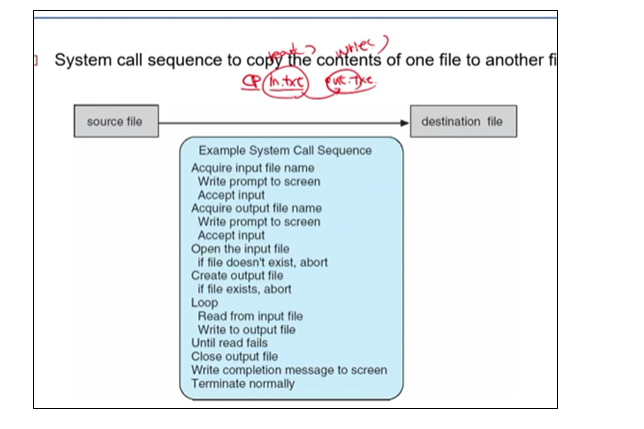
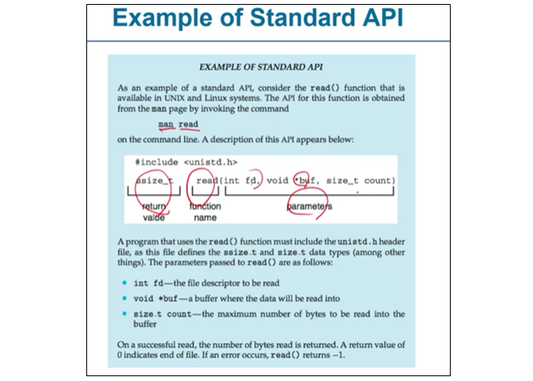
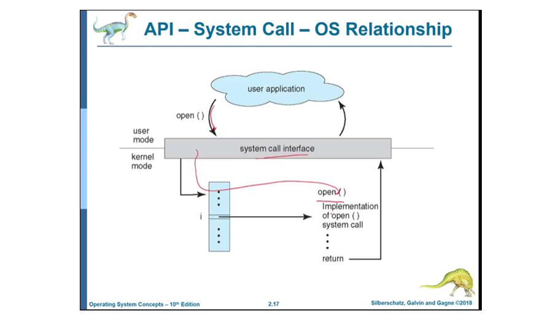
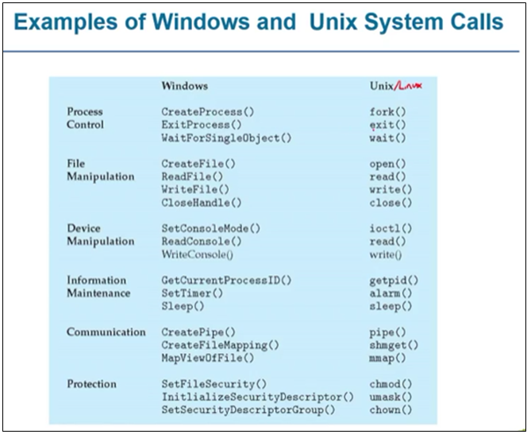
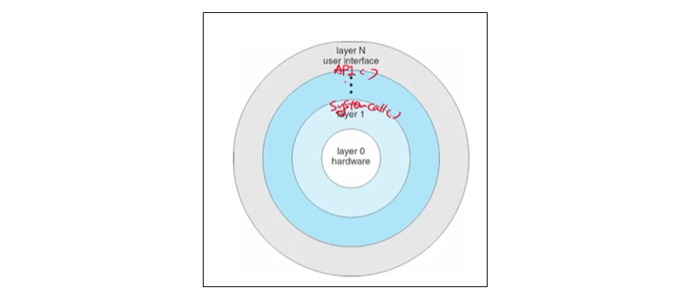
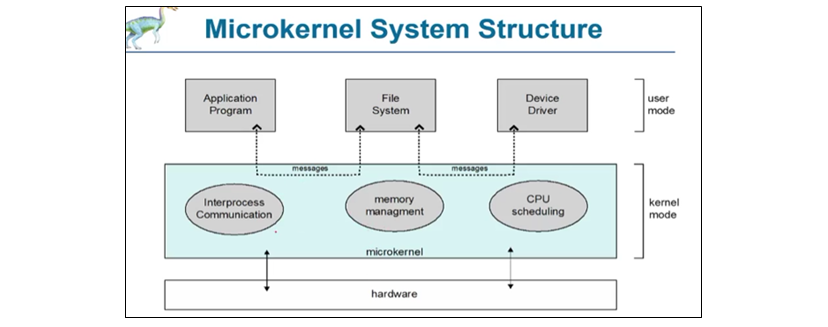
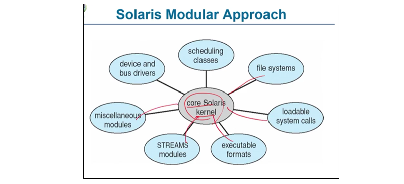

# 2022.03.24(목) - 운영체제 수업

 

## System Calls

 

**시스템 호출**은 운영체제에 의해 사용할 수 있게 된 서비스에 대한 인터페이스를 제공한다. 하드웨어에 직접 접근해야 하는 저수준 작업은 어셈블리 명령으로 작성되어야 하더라도 시스템 호출은 C와 C++ 언어로 작성된 **함수 형태**로 제공 된다.

 

API(Application Programming Interface)는 사용자가 프로그래밍할 때 사용하는 함수이다. 예를 들어, write() 함수를 사용하면 write() 함수가 구현된 쉘 라이브러리에 가고, 거기에서 system call을 하는 write() 함수가 또 있다. API는 보통 라이브러리(library) 형태로 제공된다.

 

    프로그래밍할 때 사용한 write()는 system call이 아닌 API이다.
    쉘 라이브러리에 있는 wirte()가 진짜 system call이다.
    이 system call은 운영체제에서 제공하는 것이다.

 

 

</img>

윈도우와 리눅스의 system call은 당연히 다를 것이다. 이때, 사용자로부터 입력 받아서 각각의 운영체제에 맞는 system call을 하게 해주는 API가 있다. 이것이 바로 **POSIX API**이다.

</img>

Java API도 있는데, JVM을 통해 입력받은 것을 해석하고 리눅스, 우니도우 어디에서든 소스 코드가 실행될 수 있도록 적절한 system call을 한다. 이식성이 굉장히 좋지만, 인터프리터라서 해석해야 하기에 속도가 매우 느리다는 단점이 있다.

 

</img>

CP in.txt out.txt는 in.txt를 read() 해서 복사하고 out.txt로 write() 하라는 아주 간단한 명령이다. 그런데, system call 내부를 보면 간단한 작업이 아니다.

 

## 연속된 시스템 호출의 예

 

1. 입력 파일 이름 획득, 화면에 프롬포트 출력, 입력 받아들임
2. 출력 파일 이름 획득, 화면에 프롬포트 출력, 입력 받아들임
3. 입력 파일 열기, 파일 존재하지 않을 경우 비정상적으로 종료
4. 출력 파일 생성, 파일이 존재할 경우 비정상적으로 종료
5. 루프, 입력 파일로부터 읽어 들임, 출력 파일에 씀, 읽기가 실패할 때까지
6. 출력 파일 닫기
7. 화면에 완료 메시지 출력
8. 정상적으로 종료

 

</img>

 

</img>

 

운영체제에 따라 시스템 호출은 달라질 수 있다. 그러면, 시스템 호출할 때 운영체제에 파라미터를 어떻게 전달하나? 일반적인 세 가지 방법이 있다.

-   가장 간단하게, 매개변수를 레지스터 내에 전달
-   레지스터보다 더 많은 매개변수가 있으면, 매개변수는 메모리 내의 블록이나 테이블에 저장되고, 블록의 주소가 레지스터 내에 매개변수로 전달
-   매개변수는 프로그램에 의해 스택(stack)에 넣어질(push) 수 있고 운영체제에 의해 꺼내지(pop off)는 스택 방법을 쓸 수도 있다.

 

## 시스템 호출의 유형

-   <strong>프로세스 제어(Process Control)</strong>
    -   프로세스 생성, 프로세스 종료
    -   끝내기(end), 중지(abort)
    -   적재(load), 실행(execution)
    -   프로세스 속성 획득(get), 프로세스 속성 설정(set)
        (프로세스 중요도를 설정해서 인터럽트 받지 않게! 한 번 실행되면 중지하지 못하게)
    -   시간을 기다림
    -   이벤트를 기다림(wait event), 이벤트를 알림(signal event)
    -   메모리 할당 및 자유화
    -   오류가 발생하면 문제가 발생한 상태의 메모리 값을 Dump 해서 남겨놓는다.
    -   버그를 파악하기 위해 한 단계씩 실행하는 디버거
    -   프로세스가 자원을 공유할 때, 사용하고 있으면 다른 쪽이 사용하지 못하게 잠금장치
-   <strong>파일 조작(File Management)</strong>
    -   파일 생성(create file), 파일 삭제(delete file)
    -   열기(open), 닫기(close)
    -   읽기, 쓰기, 위치 변경(reposition)
    -   파일 속성 획득 및 설정
-   <strong>장치 관리(Device Management)</strong>
    -   장치를 요구(request devices), 장치를 방출(release devices, 장치 다 썼다고 알려줌)
    -   읽기, 쓰기, 위치 변경(reposition)
    -   장치 속성 획득 및 설정
    -   장치의 논리적 부착(attach) 또는 분리(detach)
-   <strong>정보 유지(Information maintenance)</strong>
    -   시간과 날짜의 설정과 획득
    -   시스템 데이터의 설정과 획득
    -   프로세스, 파일, 장치 속성의 획득
    -   프로세스, 파일, 장치 속성의 설정
-   <strong>통신(Communication)</strong>
    -   통신 연결의 생성, 제거
    -   메시지의 송신, 수신
    -   상태 정보 전달
    -   원격 장치의 부착(attach) 및 분리(detach)
-   <strong>보호(Protection)</strong>
    -   get file permissions
    -   set file permissions

 

</img>

 

</img>

 

## 시스템 서비스, 시스템 프로그램, 데몬(디먼)

 

<strong>시스템 프로그램</strong>은 프로그램의 개발이나 실행을 편리하게 하기 위한 것이다. 이게 무슨 말이냐면, 시스템 호출은 사용자 프로그램의 “요청이 있을 때” 실행되는 것이었다. 시스템 프로그램인 운영체제는 컴퓨터에 전원이 들어온 순간부터 실행되고 있다.

 

<strong>데몬(디먼)</strong>이 하는 것은 운영체제 내에 존재하면서 항상 실행되는 프로그램이다. 인터페이스가 없으며 사용자가 제어하지 않고 백그라운드에서 실행되는 녀석이다. 운영체제가 실행되면서 자동으로 실행되고, 이름 뒤에 데몬을 뜻하는 d가 붙게 된다.

 

<strong>시스템 서비스</strong>는 파일 관리(조작), 상태 정보, 파일 변경, 프로그래밍 언어 지원, 프로그램 적재와 수행, 통신, 백그라운드 서비스 등 운영체제가 실행되면서 사용자 프로그램이 잘 돌아갈 수 있게 해주는 운영체제의 똘마니이다.

-   파일 관리 : 파일과 디렉터리를 생성, 삭제, 복사, 개명, 인쇄, 열거, 조작
-   상태 정보 : 시스템 상태에 관한 정보 알려줌, 성능, 로그, 디버깅 등
-   파일 변경 : 문장 편집기(text editor)를 사용 가능
-   프로그래밍 언어 지원 : 컴파일러, 어셈블러, 디버거, 인터프리터
-   프로그램 적재와 수행 : 프로그램이 어셈블되거나 컴파일된 후, 그것이 수행되려면 반드시 메모리에 적재되어야 함. 시스템은 절대 로더(absolute loader), 재배치 가능 로더, 링키지 에디터, 중첩 로더 등을 제공 가능. 고급어나 기계어를 위한 디버깅 시스템도 필요.
-   통신 : 프로세스, 사용자, 컴퓨터 간 통신 가능하게
-   백그라운드 서비스 : 우리가 볼 수 없는 운영체제 이면에서 실행되는 것이다. 컴퓨터에 전원이 들어와서 실행되기 시작하면 같이 실행되는 프로그램이다. 서비스(services), 서브 시스템(subsystems), 디먼(daemons)로 알려져 있다.
-   응용 프로그램 : 원래 응용 프로그램은 시스템 프로그램이 아니고 사용자에 의해 실행된다. 그런데 만약, 사용자가 운영체제에 컴퓨터에 전원이 들어오면 그때 실행해주세요! 하는 것이다. 그러면 운영체제도 아니고 사용자가 실시간으로 시작하는 것도 아닌 경우 이는 시스템 프로그램에 해당하기도 한다.

 

## 운영체제 구현과 디자인

 

-   운영체제는 어떤 문제를 해결하기 위한 프로그램이 아니다. 이미 검증된 데이터로 시스템에 공평성을 제공하기 위한 프로그램이다.
-   운영체제의 종류는 매우 많다. 목적이나 스펙은 각각 다르다.
-   운영체제는 목적과 사용되는 기기의 환경에 따라 달라진다.

 

    사용자 목적(User goals)
    - 사용하기 쉽고 믿을 수 있고 안전하고 신속하고

    시스템 목적(System goals)

    - 오류가 없도록 해야하고 효율적이어야 한다.
    - 운영체제는 정책(policy, 무엇을 해야 하는지), 기법(mechanism, 어떻게 구현할 것인지)이 중요하다.
    - 운영체제를 만든다는 것은 소프트웨어 공학에서도 아주 창조적인 작업이다.

 

### 구현

초기 운영체제는 보통 어셈블리어로 작성되었다. 최근에 운영체제는 C나 C++로 작성한다. 가장 낮은 계층은 어셈블리어, 메인 본체는 C로 작성한다. C로 작성하게 되면 CPU나 다른 하드웨어에 따라서 <strong>포팅(porting)</strong>을 하게 된다. 포팅 과정을 거쳐서 그 CPU에 맞도록 실행이 되게 재 컴파일 하는 경우가 있다.

 

<strong>에뮬레이션(Emulation)</strong>은 VirtualBox, VMware와 같이 리눅스에서 윈도우를 실행할 수 있게 해주는 소프트웨어다.

 

    이식(移植) 또는 포팅(porting)은 컴퓨터 과학에서
    실행 가능한 프로그램이 원래 설계된 바와 다른 컴퓨팅 환경
    (이를테면 CPU, 운영체제, 서드 파티 라이브러리 등)
    에서 동작할 수 있도록 하는 과정을 가리킨다.

 

### 구조, 디자인

 

-   운영체제의 정의를 정확하게 말 할 수 없다.
-   초기에 MS-DOS가 있었고 UNIX가 나오고 Layered, Mach(마이크로 커널)이 나왔다.

 

-   MS-DOS : MS-DOS의 목적은 다양한 기능을 제공하는 것이었다. 기능이 분리된 것이 없었고 MS-DOS device drivers에 모든 것이 다 들어갔다. 구조가 아예 없는 것이다. 이를 모놀리식 구조라고 한다.

 

-   UNIX : MS-DOS처럼 한 덩어리로 크게 나눈 것이 아니라 계층별로 나누게 되었다.

 

</img>

 

-   계층적 접근(Layered Approach) : 계층적 접근 방식은 단지 자신의 하위층들의 서비스와 기능만을 사용하도록 선택되어 구현과 디버깅의 간단함에 있다. 그러나, 운영체제가 너무 크다. 너무 많은 서비스를 구현해야 한다.

 

</img>

 

-   마이크로 커널(Mach) : 중요하지 않은 구성 요소를 빼버린 것이다. 중요하지 않은 기능들을 없앤 것은 아니고 별도의 메모리 주소 공간에 존재하는 사용자 수준의 프로그램을 구현하여 필요할 때마다 사용하도록 한 것이다. 상황에 따라 기능을 붙였다 떼었다 할 수 있도록 커널의 크기를 줄이되, 그 기능을 메모리나 HDD 일부에 저장해놓자는 것이다.

 

-   마이크로 커널의 장점으로 확장성, 이식성이 높아지고 크기가 작을수록 안정되고 안전하다. 가장 잘 알려진 실례는 macOS, IOS 운영체제의 커널 구성요소인 Darwin이다.

 

</img>

 

-   message passing : 메모리에 있는 프로그램 간 통신을 하려면 message를 이용해야 한다. 예전에는 프로그램까지 커널 하나였으니까 통신이 필요 없었지만, 마이크로 커널로 오면서는 그게 아니라 통신이 필요해졌다. 통신의 오버헤드가 크다.

 

-   모듈(Modules) : 마이크로 커널의 단점도 있다. 서비스가 메모리에 상주하지 않는 경우가 있다. 그래서, 적재 가능 커널 모듈(loadable kernel modules)이 있는데 아예 기능들을 떼서 실시간으로 동작하는 커널에 동적으로 붙였다 떼었다 할 수 있는 것이다. 앞의 방식은 공간이 따로 커널 공간, 서비스 공간으로 떨어져 있다. 이때 서비스 공간은 실제로 사용자 모드는 아니지만, 거의 사용자 모드처럼 동작한다. 마이크로 커널은 통신했지만, 모듈은 통신이 아니라 링크를 사용한다. 아예 나의 커널에 붙이라는 의미이다. 모듈에서 각각 컴포넌트들은 분리되어있다. 인터페이스로 동작하고 커널에 필요로 하는 모듈이라면 링크해서 실행된다.

 

</img>

 

-   하이브리드 시스템 : 상황에 따라 모놀리식 구조, 마이크로 커널을 사용하는 것이다. 윈도우는 보통 모놀리식이다. 전통적인 운영체제는 모놀리식보다 모듈이다.

 

-   macOS 구조

 

</img>

 

-   Android : Dalvik이라는 VM을 쓰지만, 문제가 많다. JVM이 느리다고 앞에서 말했다. 원래라면 사용자가 더블클릭해서 메모리에 공간을 할당받고 거기에 적재한다. 그러면 느리니까 메모리 공간의 특정 부분을 미리 할당한다. 그러면, 사용자가 더블 클릭하면 할당받은 메모리 공간에 바로 적재한다. 문제가 악성코드도 할당받은 메모리 공간에 같이 적재되는 것이 문제다.

 

</img>

 

## 운영체제 디버깅

 

-   디버깅은 버그를 찾는 것이다. 로그 파일을 만들어서 오류에 관한 정보를 기록한다.
-   성능 문제는 버그로 간주하므로 시스템에서 처리 중에 발생하는 병목 현상을 제거하여 성능을 향상하게 시키려는 성능 조정(performance tuning)도 디버깅에 포함된다. 리눅스에서는 “top”이라는 프로그램으로 컴퓨터 자원들이 어떻게 동작하는지 보여준다.
-   DTrace는 IBM에서 만든 프로그램이다. 디버깅을 위한 편리한 도구를 제공한다.
