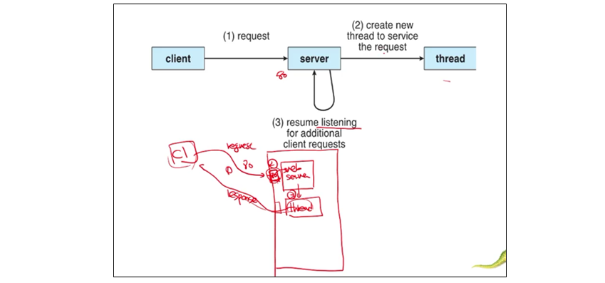
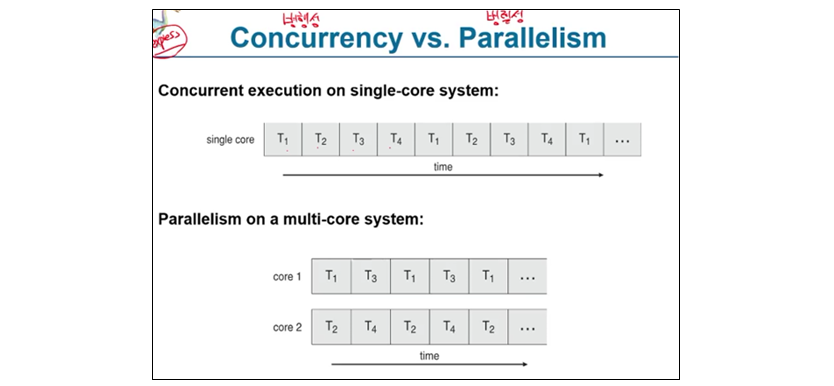
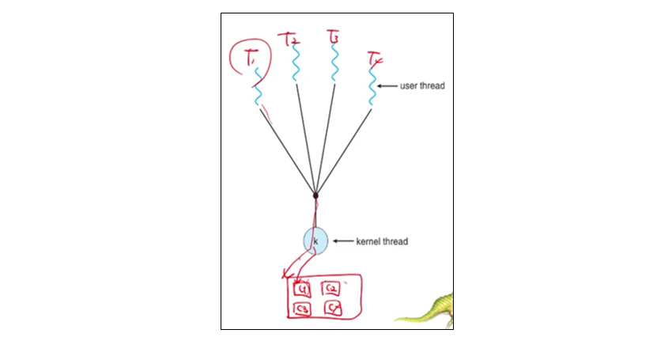
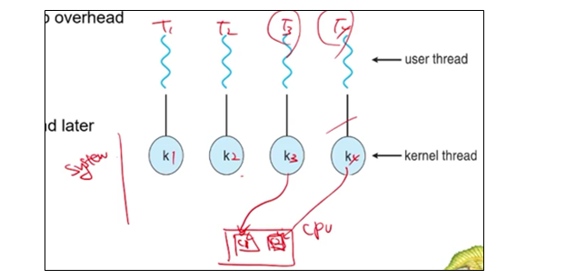
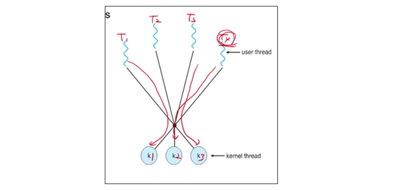

# 2022.04.07(목) - 운영체제 수업

 

## 동기 (Motivation)

 

-   현대 소프트웨어들을 멀티 스레드 방식을 많이 사용한다.
-   프로그래머가 명시적으로 하지 않아도 묵시적으로 운영체제가 멀티 스레딩을 지원한다.

 

## 다중 스레드 서버 구조 (Multithreaded Server Architecture)

 

웹 서버를 예시로 80번 포트는 클라이언트의 request를 듣기만 한다. 그러면 서버는 스레드를 하나 만들고 그 스레드가 클라이언트에게 response를 보낸다.

 

</img>

 

## 스레드를 통해 얻을 수 있는 이익

 

1. 응답성 : 프로세스가 막히지 않고 실행이 계속될 수 있다. 사용자 인터페이스를 설계하는 데 있어서 특히 유용하다.

2. 자원공유 : 하나의 프로세스는 여러 개의 스레드를 가질 수 있다. 이 스레드들은 프로세스에 할당받은 자원을 공유할 수 있다.

3. 경제성 : 이미 프로세스에 자원을 할당받았으니 스레드에 자원을 할당할 필요가 없다. 프로세스 간 문맥 교환과 스레드 간 문맥 교환을 비교해보면 스레드가 훨씬 간단하다. 스레드 간 문맥 교환에는 비용이 거의 들지 않는다.

4. 규모 적응성 : 멀티 프로세서 구조에서 스레드를 통해 더 많은 작업을 처리할 수 있다.

 

## 다중 코어 프로그래밍

 

</img>

 

컴퓨터 프로그램은 여러 개의 스레드를 마치 동시에 실행하는 것처럼 보이기 위하여 적절한 time slice(slot)만큼 실행하고 다음 스레드로 넘겨준다. 다중 코어 시스템에서는 코어1, 코어2가 동시에 실행할 수 있다.

 

멀티 코어나 멀티 프로세서 시스템에서는 프로그래머에게 엄청난 부담감을 안겨준다. 왜 이러한 부담감을 가져다 주는 지는 아래의 <strong>프로그래밍 도전 과제</strong>를 보면 알 수 있다.

 

1. 작업을 어떻게 나눠야 하나. 이상적인 건 작업이 서로 독립적이고 개별 코어에서 병렬실행
2. 균형 : 작업별로 균형을 맞춰야 한다. (작업의 양이 다르니까)
3. 데이터 분리 : 독립된 작업으로 나누어지는 것처럼, 조작하는 데이터 또한 개별 코어에서 사용할 수 있도록 나누어져야 한다.
4. 데이터 종속성 : 작업 간 종속성 고려
5. 시험 및 디버깅 : 어떻게 테스트하고 디버깅할 것이냐

 

## 다중 코어 프로그래밍의 종류

 

데이터 병렬실행 : 하나의 소스 코드를 나눠서 코어에 할당한다. 그때 그 기준을 데이터가 겹치지 않는 애들끼리 동시에 수행할 수 있지 않을까? 하는 것이다.

 

태스크 병렬실행 : 작업(태스크, 스레드)을 기준으로 나누는 것이다. 각 스레드는 고유의 연산을 실행한다. 다른 스레드들이 동일한 데이터에 대해 연산을 실행할 수 있고 서루 다른 데이터에 연산을 실행할 수도 있다.

    CPU의 코어는 하드웨어 스레드라고 한다.

 

## 단일 및 다중 스레드 프로세스

 

</img>

 

-   단일 스레드 프로세스 : 프로세스 안에 스레드가 1개 존재하는 것.
-   다중 스레드 프로세스 : 프로세스 안에 여러 스레드가 존재하는 것. 각각의 스레드는 CPU가 따로, 따로 실행할 수 있도록 병행성(Concurrency)을 가지게 된다. (병렬성이 아니라 병행성!!)

 

</img>

 

스레드 간 문맥 교환은 뭐 RAM에서 들어내고 자시고 할 것도 없이 레지스터의 정보만 바꿔주면 된다. 세부적으로는 스택도 저장한다.

 

## 암달의 법칙

 

다중 코어가 있을 때 (병렬실행이 아닌) 순차 실행 구성 요소와 병렬실행 구성 요소로 이루어진 것에 계산 코어를 더했을 때 성능이 얼마만큼 향상이 될 수 있는가를 수치로 계산한 것이다.

 

</img>

 

책에서는 75% 병렬, 25% 순차라고 했다. 그러면 S=0.25가 된다. 계산해보면 1에서 2로 바꿀 때 성능 향상이 1.6배 일어난다.

 

## 사용자 스레드와 커널 스레드

 

사용자 스레드는 사용자 수준의 라이브러리를 통해서 제공된다. 아래 셋 모두 API로 제공

1. POSIX Pthreads
2. Windows threads
3. Java threads

 

커널 스레드는 커널에서 제공하는 스레드이다.

 

## 다중 스레드 모델

 

-   다대일 모델 : 다대일 모델에서 다(Many)는 사용자 스레드이고 일(One)은 커널 스레드다. 사용자 수준 스레드가 여러 개, 커널 수준 스레드가 1개이다.
-   일대일 모델 : 사용자 수준 스레드가 커널 수준 스레드에 1개씩 일대일로 맵핑된다.
-   다대다 모델 : 사용자 수준 스레드, 커널 수준 스레드 모두 여러 개이다.

 

</img>

 

다대일 모델이다. 여러 사용자 수준 스레드를 커널 수준 스레드에 맵핑한다. 이 때문에 단점이 생기는데, 만약 CPU 코어가 여러 개 있어도 스레드 4개를 병렬적으로 실행하지 못한다. 왜냐하면, 커널 수준 스레드에 맵핑 되어있기 때문이다. 그래서 현시대에 다대일 모델은 거의 사용하지 않는다.

 

</img>

 

일대일 모델이다. 다대일 모델보다 병행성이 훨씬 뛰어나다. 여기서는 사용자 수준 스레드를 1개 만들 때마다 커널 수준 스레드를 1개 같이 만들어 준다. 이 때문에 운영체제와 CPU가 매우 바빠진다. 왜냐하면, 사용자 수준 스레드는 직접적으로 CPU에 접근 못 하니까 그때마다 커널 수준 스레드를 만들어줘야 한다. 최근 CPU가 너무 좋아져서 하드웨어의 발전이 빨라 대부분 운영체제는 일대일 모델을 사용한다.

 

</img>

 

다대다 모델이다. 최근 휴대폰 같은 곳에서 많이 사용하는데, 사용자 수준 스레드 여러 개, 커널 수준 스레드 여러 개 있으면 일대일 모델처럼 하고 하나가 끝나면 남는 곳에 사용자 수준 스레드를 거기 빈 자리에 넣는다.

    다대다 모델과 비슷한 두 수준 모델도 있다.
