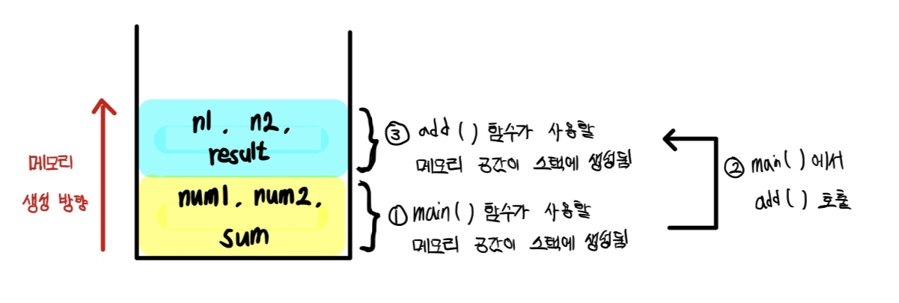
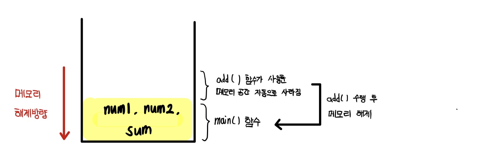
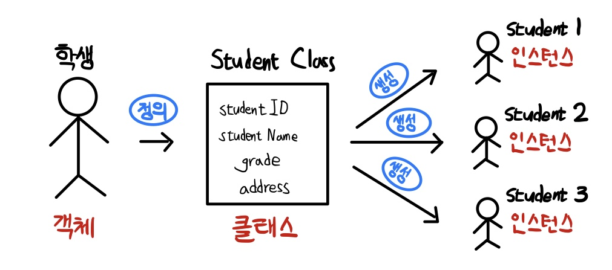
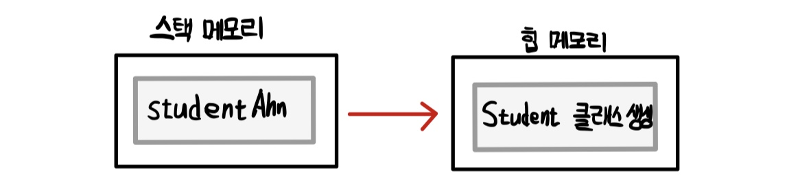
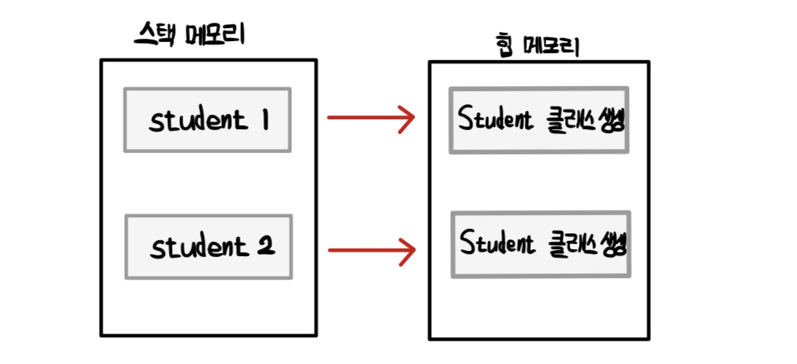

# Chapter 05 - 자바의 객체 지향 프로그래밍

<br>

|용어|설명|
|:--:|:--:|
|객체|객체 지향 프로그램의 대상, 생성된 인스턴스|
|클래스|객체를 프로그래밍하기 위해 코드로 만든 상태|
|인스턴스|클래스가 메모리에 생성된 상태|
|멤버 변수|클래스의 속성, 특성|
|메서드|멤버 변수를 이용하여 클래스의 기능을 구현|
|참조 변수|메모리에 생성된 인스턴스를 가리키는 변수|
|참조 값|생성된 인스턴스의 메모리 주소 값|

<br>

## 클래스와 객체

### 객체 지향 프로그래밍 기본 컨셉

- 절차 지향 프로그래밍 : 일어나는 일을 시간 순서으로 프로그래밍
- 객체 지향 프로그래밍 : 객체를 만들고 객체 사이에 일어나는 일을 구현하는 프로그래밍

<br>

### 클래스 (Class)

- 객체 지향 프로그램은 클래스를 기반으로 프로그래밍
- 클래스 : 객체의 속성과 기능을 구현
- 클래스를 정의한다 : 객체를 클래스로 구현한다
- 멤버 변수 : 객체의 속성
- 메서드 : 객체의 기능

<br>

Student 클래스를 생각했을 때, 학번, 이름, 학년, 사는 곳 등 선언하는 클래스의 속성을 **멤버 변수**라고 한다.

```java
(접근 제어자) class 클래스 이름 {
    멤버 변수;
    메서드;
}

public class Student {
    int studentID;
    String studentName;
    int grade;
    String address;
}
```

    접근 제어자가 public인 경우
    클래스 이름 = 자바 파일 이름
    이어야 한다.

클래스 외부에는 package 선언, import 문장 외에 아무 것도 선언 X <br>
클래스 코딩 컨벤션 : 클래스 이름은 대문자로 시작

<br>

## 클래스 살펴보기

### 멤버 변수

- 멤버 변수(member variable) = 속성(property) = 특성(attribute)
- 클래스형 = 객체 자료형 = 참조 자료형

<br>

변수의 자료형 = 기본 자료형 + 참조 자료형
- 기본 자료형 : int, long, float, double 등
- 참조 자료형 : JDK에서 제공하는 String, Date 혹은 내가 만든 Student 등

<br>

### 메서드

- 메서드(method) = 멤버 함수(member function)

```java
package classpart;

public class Student {
    // 멤버 변수 - 클래스의 속성
    int studentID;
    String studentName;
    int grade;
    String address;

    // 메서드 - 클래스의 기능
    public void showStudentInfo() {
        System.out.println(studentName + "," + address);
    }
}
```

<br>

### 패키지

- 패키지 : 클래스 파일의 묶음, 계층 구조 가질 수 있음
- 계층 구조를 잘 구성해야 소스코드 관리, 유지 보수 수월

```java
package domain.student.view;

public class StudentView {

}
```
위 코드에서 `클래스 이름 = StudentView` 이지만, `클래스 전체 이름 = domain.student.view.StudentView`이다. **클래스 이름이 같아도 패키지 이름이 다르면 클래스 전체 이름이 다른 것이므로 다른 클래스이다.**

<br>

## 메서드 (method)

- 메서드는 함수(function)의 한 종류

### 함수란?

- **하나의 기능**을 수행하는 일련의 코드
- 함수는 어떤 **기능**을 수행하도록 미리 구현해 놓고 필요할 때마다 호출해서 사용

### 함수의 입력과 반환

- 함수는 이름, 입력 값, 결과 값을 가짐
- Input이 있으면 Output이 있다는 말
- 매개변수(parameter) : 함수의 **입력**으로 받는 변수
- 반환 값 : 입력의 결과로 반환해주는 함수의 결과

### 함수 정의하기

```java
int add(int num1, int num2) {
    int result;
    result = num1 + num2;
    return reslt;
}
```
- `int` : 함수 반환형
- `add` : 함수 이름
- `(int num1, int num2)` : 매개변수

<br>

매개변수가 필요 없는 함수도 있음. 함수 실행하면 함수를 수행한 결과 값만 있음

```java
int getTenTotal() {
    int i;
    int total = 0;
    for (i = 1; i <= 10; i++) {
        total += i;
    }
    return total;
}
```

<br>

반환 값 없는 함수
- 반환 값 없어도 위치 비우지말고 return은 쓰기
- 반환형에 **void** 표시
- return은 함수 수행을 종료하는 명령어로 이해

```java
void printGreeting(String name) {
    System.out.println(name + "님 안녕하세요");
    return; // 반환 값 없음
}
```

<br>

### 함후 호출과 스택 메모리

- 스택(stack) : 함수를 호출하면 그 함수만을 위하여 할당되는 메모리 공간
    - 자료가 상자처럼 쌓임, LIFO(Last In First Out)

<p align="center"></img></p>

<p align="center"></img></p>

- 지역변수 : num1, num2 혹은 n1, n2 같이 함수 내부에서만 사용하는 변수
    - 지역변수는 스택 메모리에 생성

<br>

### 함수의 장점

1. 기능을 나누어 코드를 효율적으로 구현
2. 기능별로 함수 구현해 놓으면 같은 기능 매번 코드로 안짜고 함수 호출하면 됨
3. **오류 수정 디버깅 작업 편함**, 하나의 기능이 함수로 구현되어 있으니까 오류가 난 기능만 찾아서 수정하면 됨

하나의 함수에 여러 기능이 섞여 있으면, 함수의 장점을 활용할 수 없음. **이름에 맞는 하나의 기능을 구현하는 함수를 작성하자.**

<br>

### 메서드는 클래스 기능을 구현

위에서 설명한건 프로그래밍 언어적인 면에서 함수의 기능이다. 자바의 클래스 내부에는 클래스의 속성인 멤버 변수, 클래스의 기능인 멤버 함수(메서드)가 있다.

<br>

    메서드는 함수에 객체지향 개념이 포함된 용어

<br>

```java
package classpart;

public class Student {
    int studentID;
    String studentName;
    int grade;
    String address;

    public String getStudentName() {
        return studentName;
    }

    public void setStudentName(String name) {
        studentName = name;
    }
}
```

- `getStudentName()` : 학생 이름 반환하는 메서드
- `setStudentName()` : 학생 이름을 멤버 변수에 대입하는 메서드

setStudentName() 메서드는 Student 클래스를 사용하는 다른 코드에서 학생 이름을 새로 지정하거나 바꿔준다. **studentName 값을 지정하는 set 기능을 제공하는 것이다.**

<br>

## 클래스와 인스턴스

### 클래스 사용과 main() 함수

<br>

**프로그램을 시작하는 main() 함수** <br>

`main() 함수` : 자바 가상 머신(JVM)이 프로그램을 시작하기 위해 호출하는 함수, 클래스 내부에 만들지만, 클래스의 메서드는 아니다.

<br>

main() 함수에서 클래스 사용하는 방법
- 만든 클래스 내부에 main() 함수 만들기
- 외부에 테스트용 클래스 만들어서 사용

<br>

**Student 클래스 내부에 main() 만들어서 사용**
```java
package chapter05;

public class Student {
    int studentID;
    String studentName;
    int grade;
    String address;

    public String getStudentName() {
        return studentName;
    }

    public static void main(String[] args) {
        Student studentAhn = new Student(); // Student 클래스 생성
        studentAhn.studentName = "안연수";

        System.out.println(studentAhn.studentName);
        System.out.println(studentAhn.getStudentName());
    }
}

// 안연수
// 안연수
```

- 클래스 내부에 main() 함수를 만들면 이 클래스가 프로그램의 시작 클래스
- 클래스가 제대로 수행되는지 알아보기 위해 클래스 내부에 main() 함수 만들고 직접 실행할 수 있음
- 하지만, 이렇게 모든 클래스 내부에 main()을 포함시키지는 않음. 귀찮으니까

<br>

**main() 함수를 포함한 실행 클래스 따로 만들기**

```java
package chapter05;

public class StudentTest {
    public static void main(String[] args) {
        Student studentAhn = new Student(); // Student 클래스 생성
        studentAhn.studentName = "안승연";

        System.out.println(studentAhn.studentName);
        System.out.println(studentAhn.getStudentName());
    }
}

// 안연수
// 안연수
```

- Student 클래스를 만들지 않은 것이 아니다. 같은 패키지 내부에 아까 Student 클래스를 만들어놨으니 당연히 불러와서 사용할 수 있는 것
- 이 말은 패키지가 다르다면, 사용할 수 없다는 말이다. 그럴때는 **import문을 사용해서 함께 사용하기를 원하는 클래스를 불러와야 한다.**

<br>

### new 예약어로 클래스 생성

- 클래스를 사용하려면 클래스를 생성해야 함
- 클래스가 생성된다는 것 = 클래스를 실제 사용할 수 있도록 **메모리 공간(힙 메모리)에 올린다는 의미**
- 인스턴스 : 실제로 사용할 수 있도록 생성된 클래스
- 참조 변수 : 인스턴스를 가리키는 클래스형 변수

```java
클래스형 변수이름 = new 생성자;
Student studentAhn = new Student();
```

1. `Student` 클래스 자료형으로
2. `studentAhn` 변수를 선언하고
3. `new Student();`로 Student 클래스를 생성하여
4. `studentAhn`에 대입한다

    - studentAhn = 참조 변수
    - studentAhn이 생성된 인스턴스를 가리킴

<br>

### 인스턴스와 참조 변수

- 객체 : 의사나 행위가 미치는 대상
- 클래스 : 객체를 코드로 구현한 것
- 인스턴스 : 클래스가 메모리 공간(힙 공간)에 생성된 상태

<br>

    생성된 클래스의 인스턴스도 객체라고 함

<br>

<p align="center"></img></p>

<br>

**인스턴스 여러 개 생성**

```java
package chapter05

public class StudentTest1 {
    public static void main(String[] args) {
        Student student1 = new Student();   // 첫 번째 학생 생성
        student1.studentName = "안연수";
        System.out.println(student1.getStudentName());
        Student student2 = new Student();   // 두 번째 학생 생성
        student2.studentName = "안승연";
        System.out.println(student2.getStudentName());
    }
}

// 안연수
// 안승연
```

<br>

**참조 변수 사용하기**

- 참조 변수를 사용하여, 인스턴스의 멤버 변수와 메서드 참조가능
- 이때, `도트(.)` 연산자 사용

```java
studentAhn.studentName = "안연수";  // 멤버 변수 사용
System.out.println(studentAhn.getStudentName()); // 메서드 사용
```

<br>

### 인스턴스와 힙 메모리

- 인스턴스가 가지고 있는 멤버 변수를 **힙 메모리**에 저장
- 클래스 생성자를 하나 호출하면 인스턴스가 힙 메모리에 생성됨

```java
Student studentAhn = new Student();
```

<p align="center"></img></p>

- studentAhn 변수는 **지역 변수**, 따라서 **스택 메모리에 저장**
- 지역 변수인 studentAhn에 생성된 인스턴스를 대입하는 것 = studentAhn에 인스턴스가 생성된 힙 메모리의 주소를 대입한다.

<br>

```java
Student student1 = new Student();
Student student2 = new Student();
```

<p align="center"></img></p>

- 생성된 다른 인스턴스는 당연히 다른 힙 메모리 공간을 차지
- 클래스가 생성될 때마다 인스턴스는 다른 힙 메모리 공간 차지
- **즉, 멤버 변수를 저장하는 공간이 매번 따로 생긴다는 의미**
- 따라서, 클래스에 선언한 멤버 변수를 다른 말로 **인스턴스 변수**라고 부름

<br>

**힙 메모리**

<br>

힙(heap)은 동적 메모리(dynamic memory) 공간이다. 객체가 생성될 때 사용하는 공간이 힙이다. 힙은 동적으로 할당되고 사용이 끝나면 메모리를 해제해 줘야 한다. 자바는 가비지 컬렉터(garbage collector)가 자동으로 메모리를 해제해 준다.

<br>

**참조 변수와 참조 값**

<br>

참조 변수(ex.student1, student2)는 힙 메모리에 생성된 인스턴스(ex.Student 클래스)를 가리킨다. 참조 변수에 실제로 어떤 내용이 있는지 출력하겠다.

```java
package chapter05;

public class StudentTest2 {
    public static void main(String[] args) {
        Student student1 = new Student();
        student1.studentName = "안연수";

        Student student2 = new Student();
        student2.studentName = "안승연";

        System.out.println(student1);
        System.out.println(student2);
    }
}

// chapter05.Student@1b6d3586
// chapter05.Student@4554617c
```

- 힙 메모리에 생성된 **인스턴스의 메모리 주소**는 **참조 변수**에 저장 됨
- `클래스 이름@주소 값`
- `주소 값` = `해시 코드(hash code) 값`
- 해시 코드 값은 자바 가상 머신(JVM)에서 객체가 생성되었을 때, **생성된 객체에 할당하는 가상 주소 값**
- 즉, `student1`이 참조 변수, `주소 값`이 참조 값