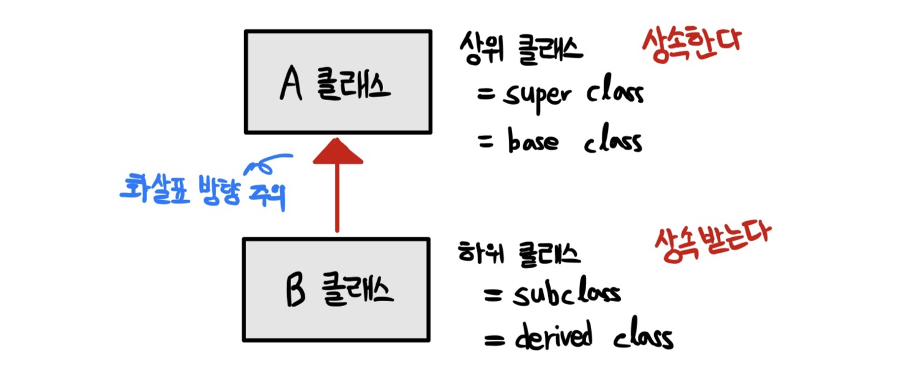
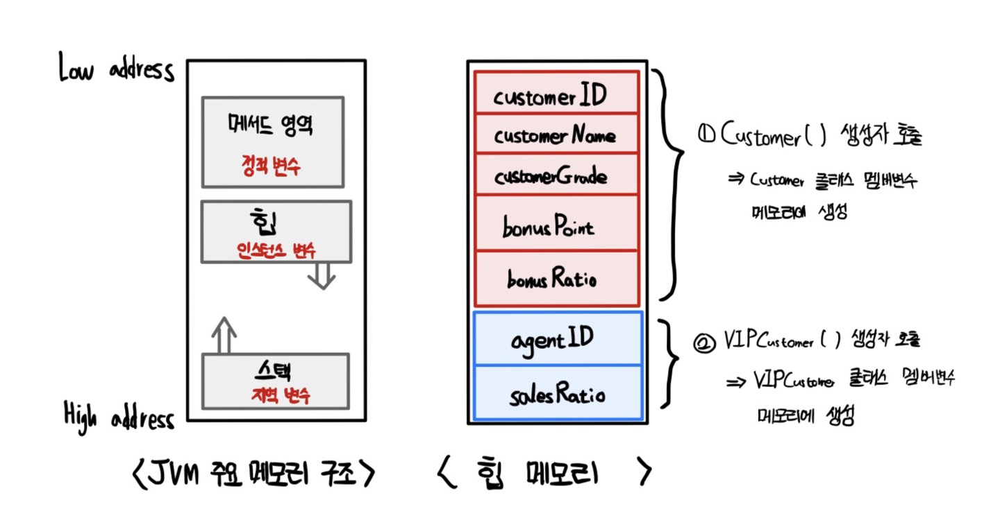
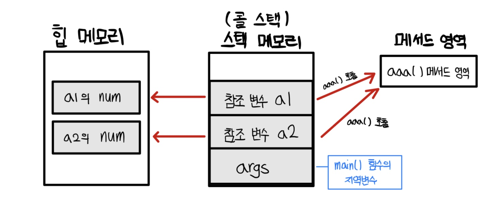
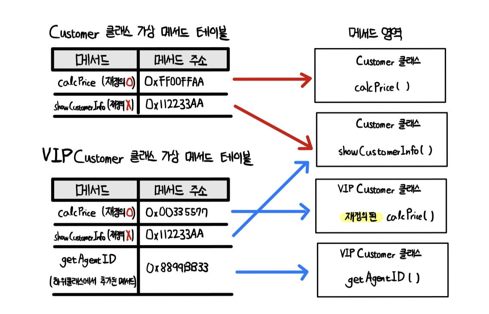
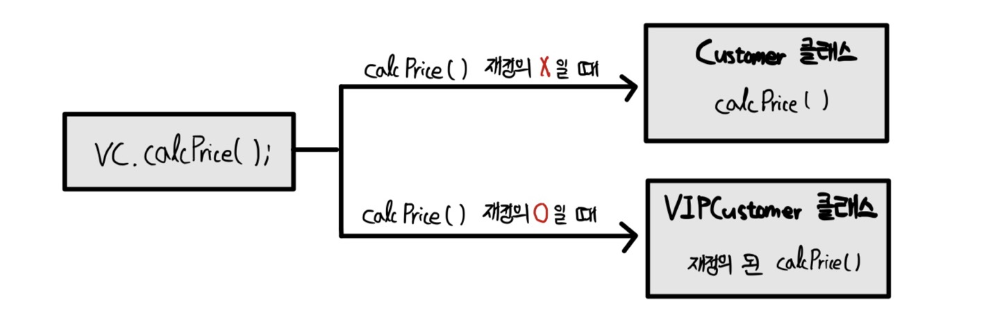
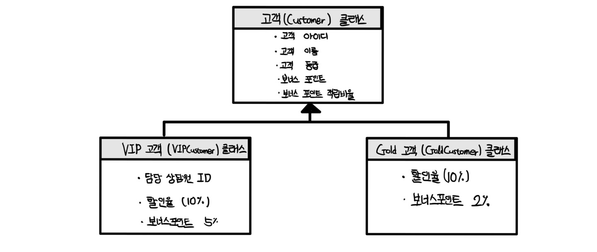

# Chapter 08 - 상속과 다형성

## 상속이란?

- 객체 지향 프로그래밍의 중요한 특징인 상속(inheritance)
- B클래스가 A클래스를 상속받으면 B클래스는 A클래스의 멤버 변수, 메서드 사용 가능
- 유지 보수, 프로그램 수정, 새로운 내용 추가에 굉장히 유연한데 그것이 상속 덕분 !

### 클래스의 상속

<p align="center"></img></p>

- (상위 클래스) A 클래스
    - A 클래스가 B 클래스에게 상속한다.
- (하위 클래스) B 클래스
    - B 클래스가 A 클래스를 상속받는다.
- **화살표 방향**
    - `상속받는 클래스` -> `상속하는 클래스`
    - `하위 클래스` -> `상위 클래스`
    - `자식 클래스` -> `부모 클래스`

<br>

**클래스 상속 문법**

```java
class B extends A {

}
```

- A가 가지고 있는 속성이나 기능을 추가로 **확장**하여 B 클래스 구현
- 일반적인 클래스 A에서 더 구체적인 클래스 B가 구현된다.

<br>

### 상속을 사용하여 고객 관리 프로그램 구현

- Customer 클래스
```java
package Chapter08;

public class Customer {
    private int customerID;         // 고객 아이디
    private String customerName;    // 고객 이름
    private String customerGrade;   // 고객 등급
    int bonusPoint;                 // 적립 포인트
    double bonusRatio;              // 적립 비율
    
    public Customer() {
        customerGrade = "SILVER";
        bonusRatio = 0.01;
    }
    
    public int calcPrice(int price) {
        bonusPoint += price * bonusRatio;
        return price;
    }
    
    public String getCustomerInfo() {
        return customerName + " 님의 등급은 " + customerGrade + "이며, 보너스 포인트는 " + bonusPoint + "입니다.";
    }
}
```

**Customer 클래스 설명**

|멤버 변수|설명|
|:------:|----|
|customerID|고객 아이디|
|customerName|고객 이름|
|customerGrade|고객 등급<br>기본 생성자에서 지정되는 기본 등급은 Silver|
|bonusPoint|&nbsp;고객의 보너스 포인트<br>- 고객이 제품을 구매할 경우 누적되는 보너스 포인트|
|bonusRatio|&nbsp;보너스 포인트 적립 비율<br>- 고객이 제품을 구매할 때 구매 금액의 일정 비율이 보너스 포인트로 적립됨. 이때 계산되는 적립 비율<br>- 기본 생성자에서 지정되는 적립 비율은 1%이다. 즉, 10,000원 짜리를 사면 100원이 적립|

- 모든 멤버 변수 private으로 선언 안해도 됨
- 외부에 노출하고 싶지 않은 멤버 변수나 메서드만 private으로 생성 !

<br>

|메서드|설명|
|:----:|----|
|Customer()|기본 생성자. 고객 한 명이 새로 생성되면 등급은 실버, 적립 비율 1%|
|calcPrice(int price)|제품에 대해 지불해야 하는 금액 계산 후 반환. 할인되지 않으면 가격 그대로 반환. 가격에 대한 보너스 포인트 비율을 적용하여 보너스 포인트 적립|
|getCustomerInfo()|고객 정보 출력. 고객 이름/등급/적립된 포인트|

<br>

지금까지는 단순한 객체 지향 프로그램. 여기서 특별한 상황 부여

<br>

> 예제 시나리오
>> 고객이 점점 늘어나고 파내가 많아져서 단골 고객 생김. 단골 고객은 회사 매출에 큰 기여를 하는 우수 고객이라 좋은 혜택을 주고 싶음. 우수 고객 등급은 VIP이고 아래와 같은 혜택 제공
>> - 제품 살 때 항상 10% 할인
>> - 보너스 포인트 5% 적립
>> - 담당 전문 상담원 배정

<br>

기존의 Customer 클래스에 VIP 고객 추가로 구현해도 됨. 그러나, 단점
1. Customer 클래스 코드 복잡해짐
2. 일반 고객 인스턴스 생성할 때도 불편
3. 한마디로 낭비가 발생

따라서, VIPCustomer 클래스를 따로 구현하기로 결정. 대신, Customer 클래스와 겹치는 부분이 있을 것임 (예를 들어, 멤버 변수 customerID, customerGrade, bonusPoint, bonusRatio) 겹치는 부분은 상속 받아서 구현하는게 훨씬 편할 것 !!

<br>

**그러나, 상속 시 문제점**

1. Customer 클래스의 멤버 변수를 private으로 선언해놔서 외부 클래스에서 접근 불가
2. VIP 고객에게 제공하는 혜택인 할인율과 세일 가격을 어떻게 적용할지?
    - 두 번째 문제는 [메서드 오버라이딩](#메서드-오버라이딩)에서 해결

<br>

**첫 번째 문제 해결 - proteted**

<br>

이전에 [Chapter05 - 정보은닉](https://github.com/Shin-Jae-Yoon/TIL/tree/master/Language/Java/do_it_java/Chapter05#%EC%A0%95%EB%B3%B4-%EC%9D%80%EB%8B%89)에서 배운 접근제어자 protected를 이용하자. protected 예약어는 상위 클래스에 작성한 멤버 변수, 메서드 중 외브 클래스에서 사용할 수는 없지만 (private의 기능) 하위 클래스에서는 사용할 수 있도록 하는 것 ! 따라서, Customer 클래스의 private을 protected로 바꾸면 VIPCustomer 클래스에서 사용할 수 있고, 추가로 외부 클래스에서 사용할 수 있도록 get(), set() 메서드를 구현해놓으면 VIPCustomer 클래스도 자연스레 상속받는다.

- Customer 클래스
```java
package Chapter08;

public class Customer {
    protected int customerID;         // 고객 아이디
    protected String customerName;    // 고객 이름
    protected String customerGrade;   // 고객 등급
    int bonusPoint;                 // 적립 포인트
    double bonusRatio;              // 적립 비율

    public Customer() {
        customerGrade = "SILVER";
        bonusRatio = 0.01;
    }

    public int calcPrice(int price) {
        bonusPoint += price * bonusRatio;
        return price;
    }

    public String showCustomerInfo() {
        return customerName + " 님의 등급은 " + customerGrade + "이며, 보너스 포인트는 " + bonusPoint + "입니다.";
    }

    public int getCustomerID() {
        return customerID;
    }

    public void setCustomerID(int customerID) {
        this.customerID = customerID;
    }

    public String getCustomerName() {
        return customerName;
    }

    public void setCustomerName(String customerName) {
        this.customerName = customerName;
    }

    public String getCustomerGrade() {
        return customerGrade;
    }

    public void setCustomerGrade(String customerGrade) {
        this.customerGrade = customerGrade;
    }
}
```

- VIPCustomer 클래스
```java
package Chapter08;

// VIPCustomer 클래스는 Customer 클래스를 상속 받음
public class VIPCustomer extends Customer {
    private int agentID;    // VIP 고객 상담원 ID
    double saleRatio;       // VIP 할인율

    public VIPCustomer() {
        customerGrade = "VIP";
        bonusRatio = 0.05;
        saleRatio = 0.1;
    }

    public int getAgentID() {
        return agentID;
    }
}
```

- CustomerTest 클래스
```java
package Chapter08;

public class CustomerTest {
    public static void main(String[] args) {
        Customer customerLee = new Customer();
        customerLee.setCustomerID(10010);
        customerLee.setCustomerName("이순신");
        customerLee.bonusPoint = 1000;
        System.out.println(customerLee.showCustomerInfo());

        VIPCustomer customerKim = new VIPCustomer();
        customerKim.setCustomerID(10020);
        customerKim.setCustomerName("김유신");
        customerKim.bonusPoint = 10000;
        System.out.println(customerKim.showCustomerInfo());
    }
}

// 이순신 님의 등급은 SILVER이며, 보너스 포인트는 1000입니다.
// 김유신 님의 등급은 VIP이며, 보너스 포인트는 10000입니다.
```

<br>

## 상속에서 클래스 생성과 형 변환

- 하위 클래스 생성 시 상위 클래스의 생성자가 **먼저 호출**

### 하위 클래스가 생성되는 과정

<p align="center"></img></p>


- 단순히 생각해보면, 하위 클래스에서 상위 클래스의 변수나 메서드를 사용할 수 있다는 것은 이미 저장하고 있는 메모리가 존재한다는 말이다.
- 이를 테스트 해보고 싶으면, 각 클래스 생성자에 출력문 찍어보고 테스트
```java
    public Customer() {
        customerGrade = "SILVER";
        bonusRatio = 0.01;
        System.out.println("Customer() 생성자 호출");
    }
```
```java
    public VIPCustomer() {
        customerGrade = "VIP";
        bonusRatio = 0.05;
        saleRatio = 0.1;
        System.out.println("VIPCustomer() 생성자 호출");
    }
```
```java
// Customer() 생성자 호출
// VIPCustomer() 생성자 호출
// 김유신 님의 등급은 VIP이며, 보너스 포인트는 10000입니다.
```

### super - 부모를 부르는 예약어

- super는 하위 클래스에서 상위 클래스로 접근할 때 사용
- 하위 클래스는 상위 클래스의 주소(참조 값)를 알고 있음.
- 상위 클래스의 생성자를 호출할 때도 super를 사용
- this : 자기 자신의 참조 값 보유
- super : 부모의 참조 값 보유

생성자 호출이 궁금하다면? [여기로](https://github.com/Shin-Jae-Yoon/TIL/tree/master/Language/Java/do_it_java/Chapter06#%EC%83%9D%EC%84%B1%EC%9E%90%EC%97%90%EC%84%9C-%EB%8B%A4%EB%A5%B8-%EC%83%9D%EC%84%B1%EC%9E%90%EB%A5%BC-%ED%98%B8%EC%B6%9C%ED%95%98%EB%8A%94-this)

<br>

**상위 클래스 생성자 호출**

<br>

바로 위에 VIPCustomer() 생성자 호출한거 보면 Customer() 생성자도 같이 불러와졌는데, 이는 하위 클래스 생성자에서 `super();`가 디폴트로 설정되어 있어서 컴파일러에서 자동으로 불러온다.

<br>

**super로 매개변수 있는 생성자 호출**

- super는 상위 클래스의 **매개변수 없는 디폴트 생성자**를 받아온다.
- 만약, 묵시적으로 호출될 디폴트 생성자가 상위 클래스에 정의되어있지 않다면, 오류가 발생한다.
- 따라서, 반드시 명시적으로 다른 생성자를 호출해야한다.

```java
    public Customer() {
        customerGrade = "SILVER";
        bonusRatio = 0.01;
        System.out.println("Customer() 생성자 호출");
    }
```
Customer 클래스에 위와 같이 정의되어 있으면 VIPCustomer 클래스에서 super()가 디폴트 생성자를 묵시적으로 불러와줌. 그러나, 디폴트 생성자가 없다면?

```java
    public Customer(int customerID, String customerName) {
        this.customerID = customerID;
        this.customerName = customerName;
        customerGrade = "SILVER";
        bonusRatio = 0.01;
        System.out.println("Customer(int, String) 생성자 호출");
    }
```
```java
    public VIPCustomer(int customerID, String customerName, int agentID) {
        super(customerID, customerName);
        customerGrade = "VIP";
        bonusRatio = 0.05;
        saleRatio = 0.1;
        System.out.println("VIPCustomer(int, String) 생성자 호출");
    }
```
이런식으로 `super(매개변수)`라고 명시적으로 적어서 VIPCustomer 생성자를 실행하면, Customer 생성자를 실행하도록 해야 한다.

<br>

**상위 클래스의 멤버 변수나 메서드를 참조하는 super**

- VIPCustomer 클래스에서 상속받은 Customer 클래스의 showCustomerInfo() 메서드를 그냥 사용할 수 있지만, `showCustomerInfo() 메서드 기능 + 추가적인 기능`를 구현하고 싶다면?

```java
// VIPCustomer 클래스에 구현

    public String showVIPInfo() {
        return super.showCustomerInfo() + " VIP전용 담당 상담원 아이디는 " + agentID + "입니다.";
    }
```
```java
// Customer 클래스 출력 비교
System.out.println(customerLee.showCustomerInfo());
System.out.println(customerKim.showVIPInfo());

// 이순신 님의 등급은 SILVER이며, 보너스 포인트는 1000입니다.
// 김유신 님의 등급은 VIP이며, 보너스 포인트는 10000입니다. VIP전용 담당 상담원 아이디는 1입니다.
```

- 굳이 super를 쓰는건 여기서는 super를 안써도 상위 클래스의 메서드 호출이 잘 되지만, **하위 클래스가 상위 클래스와 동일한 이름의 메서드를 구현하는 경우**라면 어떤가? super가 무조건 필요하겠지
- 이는 나중에 배울 [메서드 오버라이딩](#메서드-오버라이딩) 관련된 내용!

<br>

### 상위 클래스로 묵시적 클래스 형 변환 (업캐스팅)

- 상속 공부할 때, 자료형 형 변환처럼 **클래스 간 형 변환 개념**이 매우 중요!
- Customer는 일반적인 개념
- VIPCustomer는 일반적인 개념 + 더 많은 기능
- 따라서, VIPCustomer는 VIPCustomer형 이면서, 동시에 Customer형!
- VIPCustomer 클래스로 인스턴스 생성할 때, 인스턴스의 자료형을 **Customer형으로 클래스 형 변환하여 선언 가능**

```java
Customer vc = new VIPCustomer();
```
- `Customer` : 선언된 클래스형 (상위 클래스형)
- `VIPCustomer()` : 생성된 인스턴스의 클래스형 (하위 클래스형)

<br>

**최종 정리**
- 하위 클래스 자료형 (더 많은 기능) -> 상위 클래스 자료형 (일반적인 기능) O
- 상위 클래스 자료형 (일반적인 기능) -> 하위 클래스 자료형 (더 많은 기능) X

<p align="center"></img></p>

다시 이 그림을 보자. 위에서 `VIPCustomer()`로 VIPCustomer의 생성자를 이용하여 만들었다고 해도 `Customer`로 자료형을 선언했기에, 사용가능한 기능은 1번의 기능인 `Customer 클래스의 기능`만 사용 가능하다.

<br>

이렇게 클래스 형 변환 사용하는 이유 -> [메서드 오버라이딩](#메서드-오버라이딩)과 [다형성](#다형성) 때문 <br>
vc 참조 변수를 다시 VIPCustomer형으로 변환하는 것은 [다운 캐스팅](#다운-캐스팅과-instanceof)

<br>

## 메서드 오버라이딩

### 상위 클래스 메서드 재정의

VIPCustomer 클래스가 Customer 클래스 상속받을 시 언급했던 두 번째 문제점
- VIP 고객에게 제공하는 혜택인 할인율과 세일 가격을 어떻게 적용할지?
- 문제가 되는 이유 : 상속받은 메서드 calcPrice()가 일반 고객과 VIP 고객에게 다르게 적용되어야 함
- 따로 vip를 위한 계산을 구현하기에는 리소스 낭비. 10% 할인만 적용하면 되니까
- 따라서, 상위 클래스의 메서드를 하위 클래스 입맛에 맞게 메서드를 재정의해보자
- 이를 **메서드 오버라이딩**이라고 함
- **오버라이딩 조건 : 반환형/메서드 이름/매개변수 개수/매개변수 자료형 반드시 동일**

```java
// Customer 클래스의 calcPrice 메서드
public int calcPrice(int price) {
    bonusPoint += price * bonusRatio;
    return price;
}
```

```java
// VIPCustomer 클래스의 calcPrice 메서드
@Override
public int calcPrice(int price) {
    bonusPoint += price * bonusRatio;
    // 할인된 가격을 계산하여 반환
    return price - (int)(price * saleRatio);
}
```

`@Override 애노테이션`은 "이 메서드는 재정의된 메서드입니다."라고 컴파일러에게 명확하게 알려주기 위함!

<br>

> 애노테이션(Annotation) ?
>> 애노테이션은 해석해보면 "주석"이다. '@애노테이션 이름'으로 표현 <br>
>> 자바의 애노테이션은 컴파일러에게 특정한 정보를 제공 <br>
>> 미리 정의되어 있는 애노테이션을 표준 애니테이션이라고 함 <br>

|애노테이션|설명|
|:--------|:----|
|@Override|재정의된 메서드라는 정보 제공|
|@FunctionalInterface|함수형 인터페이스라는 정보 제공|
|@Deprecated|이후 버전에서 사용되지 않을 수 있는 변수, 메서드에 사용됨|
|@SuppressWarnings|특정 경고가 나타나지 않도록 함|

<br>

### 묵시적 클래스 형 변환과 메서드 재정의


```java
Customer vc = new VIPCustomer(10030, "나몰라", 2000);
vc.calcPrice(10000);
```

해당 코드는 묵시적 형 변환에 의해 VIPCustomer형이 Customer형으로 변환됨. 이 경우 calcPrice() 메서드는 오버라이딩 된 메서드인데, 어떤 클래스의 메서드를 호출하겠는가? Customer 클래스라면 지불해야하는 금액은 10000원, VIPCustomer 클래스라면 지불해야하는 금액은 9000원이다. 웃기게도.. VIPCustomer 결과가 나온다.

```java
package Chapter08;

public class OverridingTest {
    public static void main(String[] args) {
        Customer vc = new VIPCustomer(10030, "나몰라", 2000);
        vc.bonusPoint = 1000;

        System.out.println(vc.getCustomerName() + " 님이 지불해야하는 금액은 " + vc.calcPrice(10000) + "원입니다.");
    }
}

// 나몰라 님이 지불해야하는 금액은 9000원입니다.
```

- 멤버 변수와 메서드 : 선언한 클래스형에 따라 호출
- 상속에서 상위와 하위에 같은 이름의 메서드가 존재할 때 : 인스턴스에 따라 결정

메서드 오버라이딩을 한 경우에는 선언한 클래스 형이 아닌 **생성된 인스턴스의 메서드를 호출**한다. 이렇게 인스턴스의 메서드가 호출되는 기술을 **가상 메서드(virtual method)** 라고 한다.

<br>

### 가상 메서드

- 자바의 클래스는 멤버 변수와 메서드로 이루어짐
- 인스턴스 변수는 힙 메모리에 위치하는거 이제 기억하지?
- 변수는 인스턴스가 생성될 때마다 힙 메모리에 새로 생성
- 메서드는 실행해야 할 명령 집합이라서 **인스턴스가 달라도 같은 로직 수행**
- 즉, 인스턴스 여러 개 생성한다고 해도 메서드도 여러 개 생성되지는 않음. 또 애초에 메서드와 관련된 지역 변수와 매개 변수는 스택 메모리에 할당받고 메서드 끝나면 해제하잖아!
- 메서드의 명령 집합은 **메서드 영역**에 위치함

<br>

    자바의 모든 메서드는 가상 메서드이다.

<br>

```java
package Chapter08;

public class TestA {
    int num;

    void aaa() {
        System.out.println("aaa() 출력");
    }

    public static void main(String[] args) {
        TestA a1 = new TestA();
        a1.aaa();
        TestA a2 = new TestA();
        a2.aaa();
    }
}

// aaa() 출력
// aaa() 출력
```

<p align="center"></img></p>

- main() 함수가 실행되면 지역 변수 스택에 위치
- 참조 변수 a1, a2가 가리키는 인스턴스 힙 메모리에 생성
- 메서드 aaa()의 명령 집합 메서드 영역에 생성
- 메서드 호출하면 콜 스택에서 메서드 영역의 주소를 참조하여 명령 실행
- **따라서, 인스턴스 달라도 동일한 메서드 호출**

<br>

**가상 메서드의 원리**

<br>

일반적으로 메서드를 호출한다는 것
- 메서드를 호출 한다 = 메서드의 명령 집합이 있는 메모리 위치를 참조하여 명령 실행

가상 메서드의 경우 (**자바의 모든 메서드는 가상 메서드**)
- **가상 메서드 테이블**이 생성됨
- 각 메서드 이름, 실제 메모리 주소가 짝을 이룸
- 따라서, 어떤 메서드가 호출되면 가상 메서드 테이블에서 주소 값을 찾아서 해당 메서드의 명령을 수행

<p align="center"></img></p>

- calcPrice() 메서드와 같이 재정의 된 메소드
    - 실제 인스턴스에 해당하는 메서드가 호출
- showCustomerInfo() 메서드와 같이 재정의 되지 않은 메소드
    - 메서드 주소가 같으며 상위 클래스의 메서드가 호출

**최종 정리**

```java
package Chapter08;

public class OverridingTest2 {
    public static void main(String[] args) {
        int price = 10000;

        Customer customerLee = new Customer(10010, "이순신");
        System.out.println(customerLee.getCustomerName() + " 님이 지불해야하는 금액은 " + 
        customerLee.calcPrice(price) + "입니다.");

        VIPCustomer customerKim = new VIPCustomer(10020, "김유신", 12345);
        System.out.println(customerKim.getCustomerName() + " 님이 지불해야하는 금액은 " + 
        customerKim.calcPrice(price) + "입니다.");

        Customer vc = new VIPCustomer(10030, "나몰라", 2000);
        System.out.println(vc.getCustomerName() + " 님이 지불해야하는 금액은 " + 
        vc.calcPrice(price) + "입니다.");
    }
}

// 10000원
// 9000원
// 9000원
```

1. Customer 형으로 선언하고 Customer 인스턴스 생성 -> Customer의 메서드 호출
2. VIPCustomer 형으로 선언하고 VIPCustomer 인스턴스 생성 -> VIPCustomer의 메서드 호출
3. Customer 형으로 선언하고 VIPCustomer 인스턴스 생성 -> 원래라면 Customer형 메서드가 호출되는 것이 맞지만, **가상 메서드 방식에 의해 VIPCustomer의 인스턴스의 메서드가 호출**

<p align="center"></img></p>

<br>

## 다형성

### 다형성이란?

묵시적 클래스 형 변환 + 가상 메서드를 바탕으로 다형성을 이해해보자.

<br>

다형성(polymorphism) : 하나의 코드가 여러 자료형으로 구현되어 실행되는 것
- 쉽게 말해서, 같은 코드에서 여러 실행결과가 나옴

Animal 클래스를 상속받는 Human, Tiger, Eagle 클래스가 있다고 가정

```java
package Chapter08.polymorphism;

class Animal {
    public void move() {
        System.out.println("동물이 움직입니다.");
    }
}

class Human extends Animal {
    public void move() {
        System.out.println("사람이 두 발로 걷습니다.");
    }
}

class Tiger extends Animal {
    public void move() {
        System.out.println("호랑이가 네 발로 뜁니다.");
    }
}

class Eagle extends Animal {
    public void move() {
        System.out.println("독수리가 하늘을 납니다.");
    }
}

public class AnimalTest1 {
    public static void main(String[] args) {
        AnimalTest aTest = new AnimalTest();
        aTest.moveAnimal(new Human());
        aTest.moveAnimal(new Tiger());
        aTest.moveAnimal(new Eagle());
    }
}
```
```java
package Chapter08.polymorphism;

public class AnimalTest {
    public void moveAnimal(Animal animal) {
        animal.move();
    }
}
```

- AnimalTest 클래스의 moveAnimal() 메서드는 어떤 인스턴스가 매개변수로 넘어와도 모두 Animal 형으로 형 변환 됨 (디테일한 하위 클래스 -> 일반적인 상위 클래스 이니까)
- 예를 들어, 매개 변수가 전잘되는 부분에 Human 인스턴스가 전달되었다면, Animal 형으로 선언한 곳에 Human 인스턴스가 들어온 것이니까 아래와 같다.

```java
Animal animal = new Human();
```
- 가상 메서드 원리에 따라, `animal.move()` 메서드가 호출하는 메서드는 매개변수로 넘어온 **실제 인스턴스의 메서드를 호출함**.
- 그래서 Animal의 move가 아닌 Human, Tiger, Eagle의 move를 호출하는 것

**최종 정리** <br>

1. Animal의 `move()` 메서드를 Human, Tiger, Eagle에서 메서드 오버라이딩 함
2. AnimalTest 클래스의 `moveAnimal()` 메서드의 매개 변수를 Animal 형으로 선언
3. 따라서, 매개변수로 들어오는 Human, Tiger, Eagle은 Anmial 형으로 묵시적 형 변환 일어남
4. 묵시적 형 변환이 일어났지만, **가상 메서드의 원리**에 의하여 `animal.move()` 메서드가 호출하는 메서드는 실제 인스턴스의 메서드를 호출
5. 결과적으로 `animal.move()` 코드는 변함이 없지만, **어떤 매개변수가 넘어왔느냐에 따라 결과가 달라짐**
6. 하나의 코드가 여러 자료형으로 구현되어 실행됨. 이것이 다형성

<br>

### 다형성의 장점

다른 동물이 새로 추가되어도, Animal 클래스를 상속받아 구현하면, **모든 클래스를 Animal 자료형 하나로 쉽게 관리할 수 있을 것이다.** 어차피, AnimalTest 클래스를 인스턴스 생성하고 AnimalTest의 메서드를 실행하는데 그 메서드는 매개변수로 Animal 자료형을 받기 때문이다.

<br>

각 자료형에 따라 코드를 다르게 구현한 것보다 코드가 훨씬 간단해지고 유지보수가 수월해진다. 자 그러면 느껴봐야지?

<br>

**다형성을 활용해 VIP 고객 클래스 리팩토링**

<br>

- Customer.java
```java
package Chapter08.polymorphism;

public class Customer {
    protected int customerID;
    protected String customerName;
    protected String customerGrade;
    int bonusPoint;
    double bonusRatio;

    public Customer() {
        initCustomer();
    }

    public Customer(int customerID, String customerName) {
        this.customerID = customerID;
        this.customerName = customerName;
        initCustomer();
    }

    // 생성자에서만 호출하는 메서드니까 private으로 선언
    private void initCustomer() {
        customerGrade = "SILVER";
        bonusRatio = 0.01;
    }

    public int calcPrice(int price) {
        bonusPoint += price * bonusRatio;
        return price;
    }

    public String showCustomerInfo() {
        return customerName + "님의 등급은 " + customerGrade + "이며, 보너스 포인트는 " + bonusPoint + "입니다.";
    }
    public int getCustomerID() {
        return customerID;
    }

    public void setCustomerID(int customerID) {
        this.customerID = customerID;
    }

    public String getCustomerName() {
        return customerName;
    }

    public void setCustomerName(String customerName) {
        this.customerName = customerName;
    }

    public String getCustomerGrade() {
        return customerGrade;
    }

    public void setCustomerGrade(String customerGrade) {
        this.customerGrade = customerGrade;
    }
}
```

- VIPCustomer.java
```java
package Chapter08.polymorphism;

public class VIPCustomer extends Customer {
    private int agentID;
    double saleRatio;

    public VIPCustomer(int customerID, String customerName, int agentID) {
        super(customerID, customerName);
        customerGrade = "VIP";
        bonusRatio = 0.05;
        saleRatio = 0.1;
        this.agentID = agentID;
    }

    public int calcPrice(int price) {
        bonusPoint += price * bonusRatio;
        return price - (int)(price * saleRatio);
    }

    public String showCustomerInfo() {
        return super.showCustomerInfo() + " 담당 상담원 번호는 " + agentID + "입니다.";
    }

    public int getAgentID() {
        return agentID;
    }
}
```

- CustomerTest.java
```java
package Chapter08.polymorphism;

public class CustomerTest {
    public static void main(String[] args) {
        Customer customerLee = new Customer(10010, "이순신");
        customerLee.bonusPoint = 1000;
        System.out.println(customerLee.showCustomerInfo());

        Customer customerKim = new VIPCustomer(10020, "김유신", 12345);
        customerKim.bonusPoint = 10000;
        System.out.println(customerKim.showCustomerInfo());

        System.out.println("===== 할인율과 보너스 포인트 계산 =====");

        int price = 10000;
        int leePrice = customerLee.calcPrice(price);
        int kimPrice = customerKim.calcPrice(price);

        System.out.println(customerLee.getCustomerName() + "님이 " + leePrice + "원 지불하셨습니다.");
        System.out.println(customerLee.showCustomerInfo());
        System.out.println(customerKim.getCustomerName() + "님이 " + kimPrice + "원 지불하셨습니다.");
        System.out.println(customerKim.showCustomerInfo());
    }
}
```

핵심은 Customer 자료형 하나로 관리하는 모습이다. 자료형은 Customer 형으로 동일하지만, 할인율과 보너스 포인트는 각 인스턴스의 메서드에 맞게 계산했다. 재정의된 메서드는 각각 호출되고 서로 다른 역할을 구현하기 떄문이다. 다형성을 적절하게 이용했다.

<br>

## 다형성 활용하기

### 새로운 상황 부여 ver 01

> 예제 시나리오
>> 고객이 늘어 VIP 고객까진 아니고 GOLD 등급 하나 추가하려함 <br>
>> - 제품을 살 때는 항상 10% 할인 (VIP랑 동일)
>> - 보너스 포인트를 2% 적립 (SILVER는 1%, VIP는 5%)
>> - 담당 전문 상담원 없음

<p align="center"></img></p>

```java
package Chapter08.polymorphism;

public class GoldCustomer extends Customer {
    double saleRatio;

    public GoldCustomer(int customerID, String customerName) {
        super(customerID, customerName);
        customerGrade = "GOLD";
        bonusRatio = 0.02;
        saleRatio = 0.1;
    }

    @Override
    public int calcPrice(int price) {
        bonusPoint += price * bonusRatio;
        return price - (int)(price * saleRatio);
    }
}
```

**배열로 고객 5명 구현하기**

```java
package Chapter08.polymorphism;
import java.util.ArrayList;

public class CustomerTest2 {
    public static void main(String[] args) {
        ArrayList<Customer> customerList = new ArrayList<Customer>();

        Customer customerLee = new Customer(10010, "이순신");
        Customer customerShin = new Customer(10020, "신사임당");
        Customer customerHong = new GoldCustomer(10030, "홍길동");
        Customer customerYoul = new GoldCustomer(10040, "이율곡");
        Customer customerKim = new VIPCustomer(10050, "김유신", 12345);

        customerList.add(customerLee);
        customerList.add(customerShin);
        customerList.add(customerHong);
        customerList.add(customerYoul);
        customerList.add(customerKim);

        System.out.println("===== 고객 정보 출력 =====");
        for (Customer customer : customerList) {
            System.out.println(customer.showCustomerInfo());
        }

        System.out.println();

        System.out.println("===== 할인율과 보너스 포인트 계산 =====");
        int price = 10000;
        for(Customer customer : customerList) {
            int cost = customer.calcPrice(price);
            System.out.println(customer.getCustomerName() + "님이 " + cost + "원 지불하셨습니다.");
            System.out.println(customer.getCustomerName() + "님의 현재 보너스 포인트는 " + customer.bonusPoint + "점 입니다.");
        }
    }
}
```

- **Customer 형**으로 객체 배열 ArrayList 선언
- **Customer 형**으로 선언하고 Customer, GoldCustomer, VIPCustomer 인스턴스 생성해서, 각 인스턴스 (하위) -> Custmer (상위)로 묵시적 형 변환
- 가상 메서드 원리에 의하여 **Customer 형**임에도 calcPrice() 메서드 호출 시 각 인스턴스의 메서드 호출하여 실행
- 배열의 요소를 **Customer 형** 변수에 넣음
- 이것이 바로 다형성 ~

만약, 재정의한 (오버라이딩한) 메서드가 가상 메서드 방식에 의해 자동으로 호출되지 않는다면? -> if/else-if로 각 자료형에 적합한 코드를 하나하나 따로 구현해야함 -> 코드 길어짐, 유지보수 힘듬

<br>

### 상속은 언제 사용?

상속을 사용하여 이미 Customer 클래스가 있는 상태에서 (기본 뼈대) 추가적인 내용만 따로 구현 가능했다. 만약 상속을 사용하지 않는다면? 아래처럼 답 없이 짜야함

```java
if (customerGrade == "VIP") {
    // 할인해주고, 적립도 많이해주고
} else if (customerGrade == "GOLD") {
    // 할인해주고, 적립 적당히
} else if (customerGrade == "SILVER") {
    // 할인 없음, 적립만
}
```

<br>

**그렇다면, 상속을 항상 사용하는 것이 좋은가?**

- 아니다. 상속은 **IS-A 관계(is a relationship; inheritance)** 처럼 일반적인 개념과 구체적인 개념의 관계에서 사용하는 것이 가장 효율적이다.
- 일반 클래스를 점차 구체화하는 상황에서 사용하는 것이지 상속을 사용하면 **하위 클래스가 상위 클래스형에 종속되기 때문에** 이질적인 클래스 간에는 상속을 사용하지 않는 것이 좋다.

예를 들어, 과목을 나타내는 Subject 클래스와 학생을 나타내는 Student 클래스가 있다고 하자. 모든 학생은 전공 과목(Subject)을 가지고 있으니까 Subject 클래스에서 제공하는 여러 메서드를 활용하면 좋을 것 같아서 상속받으면 될까?

<br>

Subject가 Student를 **포괄**하는 개념이 **아니기** 때문에 좋지 않다. 이런 경우에는 IS-A 관계가 아닌 **HAS-A 관계(has a relationship; association)** 로 표현한다. HAS-A 관계는 **한 클래스가 다른 클래스를 소유한 관계**이다.

- 학생이 과목을 가지고 있다. HAS-A 관계
- Subject는 Student에 포함되어 Student의 멤버 변수로 사용하는 것이 적절
```java
class Student {
    Subject majorSubject;
}
```

**최종 정리**

- 상속은 무조건적인 코드 재사용 개념이 아니다.
- 상속을 사용하면 클래스 간의 결합도가 높아져서, 상위 클래스의 변화가 하위 클래스에 미치는 영향이 커진다.
- 일반적인 클래스와 구체적인(확장되는) 클래스, IS-A 관계에서 구현하는 것이 맞다.

<br>

### 자바에는 다중 상속이 없어요

다중 상속 : 한 클래스가 여러 클래스를 상속 받는 것
- 다중 상속에서 오는 장점이 있겠지만, 다중 상속으로 인한 모호성 때문에 자바에서는 다중 상속 지원 X
- ex) 두 개 이상의 상위 클래스에 같은 이름의 메서드가 정의되어 있다면, 다중 상속을 받는 하위 클래스는 어떤 메서드를 상속받을지 모호해짐
- 객체 지향에서 다중 상속의 모호성에 대한 문제가 **다이아몬드 문제(diamond problem)**
- 따라서, extends 예약어 뒤에 오는 클래스는 무조건 한 개

<br>

## 다운 캐스팅과 instanceof

### 하위 클래스로 형 변환, 다운 캐스팅

상위 클래스(일반적인 개념) -> 하위 클래스(구체적인 개념)으로 형 변환 되는 과정

<br>

```java
Animal ani = new Human();
```

- 생성된 인스턴스 Human은 Anmial 자료형
- 업 캐스팅(하위->상위) 된 경우에는 상위 클래스에서 선언한 메서드나 멤버 변수만 사용 가능
- 다시 말해, Human 클래스에 더 많은 메서드, 다양한 멤버 변수가 있어도 Animal 클래스의 메서드와 멤버 변수만 사용 가능
- 필요에 따라 원래 인스턴스의 자료형(여기서 Human형)으로 되돌아가야하는 경우가 있음
- 이때 쓰는 것을 다운 캐스팅(down casting)

<br>

### instanceof

예를 들어, 상속 관계에서 모든 인간은 동물이지만, 모든 동물은 인간이 아니다. 따라서, 변환에서 생기는 오류를 막기 위하여, 다운 캐스팅 전 하위 클래스 -> 상위 클래스로 형 변환된 **인스턴스의 원래 자료형을 확인하는 예약어가 instanceof** 이다.

```java
Animal hAnimal = new Human();
if(hAnimal instanceof Human) {
    Human human = (Human)hAnimal;
}
```
- `hAnimal instanceof Human` : hAnimal 인스턴스의 원래 자료형이 Human 형 이라면
- `Human human = (Human)hAnimal` : 인스턴스 hAnimal을 Human형으로 다운 캐스팅

```java
Animal ani = new Tiger();
Human h = (Human)ani;
```
- 이렇게 코딩해도 컴파일 에러는 안남. 왜? Human형으로 자료형이 같으니까
- 대신 실행오류가 발생함

```java
package Chapter08.polymorphism;

import java.util.ArrayList;

class Animal {
    public void move() {
        System.out.println("동물이 움직입니다.");
    }
}

class Human extends Animal {
    public void move() {
        System.out.println("사람이 두 발로 걷습니다.");
    }

    public void readBook() {
        System.out.println("사람이 책을 읽습니다.");
    }
}

class Tiger extends Animal {
    public void move() {
        System.out.println("호랑이가 네 발로 뜁니다.");
    }

    public void hunting() {
        System.out.println("호랑이가 사냥을 합니다.");
    }
}

class Eagle extends Animal {
    public void move() {
        System.out.println("독수리가 하늘을 납니다.");
    }

    public void flying() {
        System.out.println("독수리가 날개를 쭉 펴고 멀리 날아갑니다.");
    }
}

public class AnimalTest {
    ArrayList<Animal> aniList = new ArrayList<Animal>();

    public static void main(String[] args) {
        AnimalTest aTest = new AnimalTest();
        aTest.addAnimal();
        System.out.println("원래 형으로 다운 캐스팅");
        aTest.testCasting();
    }

    public void addAnimal() {
        aniList.add(new Human());
        aniList.add(new Tiger());
        aniList.add(new Eagle());

        for (Animal ani : aniList) {
            ani.move();
        }
    }

    public void testCasting() {
        for (int i = 0; i < aniList.size(); i++) {
            Animal ani = aniList.get(i);

            if (ani instanceof Human) {
                Human h = (Human) ani;
                h.readBook();
            } else if (ani instanceof Tiger) {
                Tiger t = (Tiger) ani;
                t.hunting();
            } else if (ani instanceof Eagle) {
                Eagle e = (Eagle) ani;
                e.flying();
            } else {
                System.out.println("지원되지 않는 형입니다.");
            }
        }
    }
}

// 사람이 두 발로 걷습니다.
// 호랑이가 네 발로 뜁니다.
// 독수리가 하늘을 납니다.
// 원래 형으로 다운 캐스팅
// 사람이 책을 읽습니다.
// 호랑이가 사냥을 합니다.
// 독수리가 날개를 쭉 펴고 멀리 날아갑니다.
```
- 배열 요소가 Animal 형이라서 각 인스턴스에서 제공하는 구체적인 메서드를 사용할 수 없음
- 따라서, 사용하려면 원래 자료형으로 다운캐스팅 되어야 함