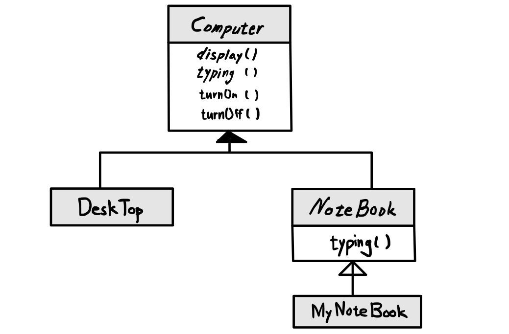

# Chapter 09 - 추상 클래스

## 추상 클래스

-   추상 클래스는 완전하지 않은 클래스
-   부족하다는 뜻도 있지만,
-   다른 한 편으로 **가능성이 남아 있다는 의미**, 즉, 확장이 가능하다

### 추상 클래스란?

-   추상적이다 = 구체적이지 않고 막연하다
-   어떤 클래스가 추상적이다 = 구체적이지 않은 클래스
-   추상 클래스 (abstract class)
-   추상 클래스가 아닌 클래스 (concrete class), 지금까지 해온 모든 클래스가 이거

**추상 클래스는 항상 추상 메서드를 포함한다.** 추상 메서드는 구현 코드가 없다. 즉, **함수 몸체가 없다**. 아래와 같이 `{}` 안의 내용이 함수 몸체이다.

```java
int add(int x, int y) {
    return x + y;
}
```

-   중괄호 `{}`로 감싼 부분 = 함수의 구현부(implementation)
-   함수의 구현부가 없는 함수 = 추상 함수(abstract function)
-   자바에서는 이를 **추상 메서드(abstract method)** 라고 한다.
-   추상 메서드는 선언만 하며 abstract 예약어 사용

```java
abstract int add(int x, int y);
```

아래는 중괄호 `{}`가 있으니까 추상 메서드 아님. `{}`안에 코드만 없을 뿐 `{}`를 구현은 한 것이다.

```java
int add(int x, int y) {}
```

<br>

**메서드 선언의 의미** <br>

변수를 선언하고 제어문을 사용하여 로직을 만들고 기능을 구현하는 것도 물론 중요하지만, 로직을 구현하는 것보다 중요한 것이 **어떻게 구현할지를 결정하는 것**이다.

```java
int add(int num1, int num2);
```

위 코드만 봐도 두 개의 정수를 입력받고 더해서 반환한다는 것을 유추할 수 있다.

-   **메서드의 선언부(declaration)만 봐도 어떤 일을 하는 메서드인지 유추할 수 있다.**
-   선언부에 해당하는 반환 값(리턴), 함수 이름, 매개변수를 정의한다는 것이 **함수의 역할이 무엇인지, 어떻게 구현해야 하는지를 정의한다**는 의미다.
-   어떤 의미로는, **함수 몸체를 구현하는 것보다 함수 선언부 작성이 더 중요하다는 말이다.**

<br>

### 추상 클래스 구현

-   클래스 다이어그램에서 일반 클래스는 똑바로 쓰는데 **추상 클래스는 기울임 꼴**로 작성

<p align="center"></img></p>

**Computer 클래스**

```java
package chapter09.abstractex;

public abstract class Computer {
    public abstract void display();
    public abstract void typing();
    public void turnOn() {
        System.out.println("전원을 켭니다.");
    }
    public void turnOff() {
        System.out.println("전원을 끕니다.");
    }
}
```

-   추상화 하고자 하는 메서드(몸체, 구현부 `{}` 없는)에 abstract 안붙히면 오류
-   추상 메서드가 들어있는 클래스에 abstract 안붙히면 오류
-   Computer 클래스를 상속받는 클래스 중 `turnOn()`과 `turnOff()` 구현 코드는 공통
-   하지만, 추상 메서드인 `display()`와 `typing()`은 하위 클래스에 따라 달라질 수 있음
-   추상 메서드는 **이 메서드는 Computer 클래스에서 구현하지 않고, 구현에 대한 책임을 상속 받는 클래스에 위임한다**라는 의미

<br>

**최종 정리**

-   상위 클래스에서 하위 클래스도 공통으로 사용할 메서드 구현
-   하위 클래스마다 다르게 구현할 메서드는 추상 메서드로 선언

<br>

**DeskTop 클래스**

```java
package chapter09.abstractex;

public class DeskTop extends Computer{

}
```

-   이렇게 하면 오류 발생
-   Computer 클래스가 추상 클래스니까, 추상 클래스를 상속받는 클래스는 **추상 메서드를 상속받음**
-   해결방법 01. DeskTop도 추상 클래스로 만들기
-   해결방법 02. DeskTop에서 Computer에서 구현되지 않았던 추상 메서드를 구현하기, 대신 모든 추상 메서드를 모두 구현해야함. 하나라도 추상 메서드 있으면 추상 클래스니까

아래에서 해결방법 02를 사용했다.

```java
package chapter09.abstractex;

public class DeskTop extends Computer{

    @Override
    public void display() {
        System.out.println("DeskTop display()");
    }

    @Override
    public void typing() {
        System.out.println("DeskTop typing()");
    }
}
```

<br>

**NoteBook 클래스**

```java
package chapter09.abstractex;

public abstract class NoteBook extends Computer{
    @Override
    public void display() {
        System.out.println("NoteBook display()");
    }
}
```

-   추상 메서드 `display()`와 `typing()`중 `display()`만 구현했으니 추상 클래스라고 해주는 `abstract`를 붙혀야함

<br>

**MyNoteBook 클래스**

```java
package chapter09.abstractex;

public class MyNoteBook extends NoteBook {
    @Override
    public void typing() {
        System.out.println("MyNoteBook typing()");
    }
}
```

<br>

**모든 추상 메서드를 구현하고도 클래스에 abstract 사용하면?**

```java
public abstract class AbstractTV {
    public void turnOn() {
        System.out.println("전원을 켭니다.");
    }

    public void turnOff() {
        System.out.println("전원을 끕니다.");
    }
}
```

-   모든 추상 메서드를 구현했어도, 완벽하게 TV의 기능이 구현된 것은 아니고 TV의 **공통 기능만 구현해놓은 것**이다.
-   이 클래스는 사용할 목적이 아닌 **상속만을 위해 만든 추상 클래스**이다.
-   이런 경우 **new 예약어로 인스턴스 생성 불가**

추상 클래스 연습한거는 [Car](https://github.com/Shin-Jae-Yoon/do-it-java/blob/master/src/chapter09/abstractex/alone/Car.java), [Bus](https://github.com/Shin-Jae-Yoon/do-it-java/blob/master/src/chapter09/abstractex/alone/Bus.java), [AutoCar](https://github.com/Shin-Jae-Yoon/do-it-java/blob/master/src/chapter09/abstractex/alone/AutoCar.java), [CarTest](https://github.com/Shin-Jae-Yoon/do-it-java/blob/master/src/chapter09/abstractex/alone/CarTest.java)

<br>

### 추상 클래스를 만드는 이유

<br>

**추상 클래스는 인스턴스로 생성할 수 없다.**

-   추상 클래스는 모든 메서드가 구현된 것은 아니므로, 인스턴스로 생성 불가
-   추상 메서드를 호출했을 때 구현된 코드가 없으므로 수행할 수 있는 내용 없으니까.

<br>

**추상 클래스에서 구현하는 메서드**

-   생성할 수 없는 추상 클래스를 어디에 씀? -> 추상 클래스는 상속을 하기 위해 만든 클래스
-   추상 클래스에서 구현하는 메서드 : 하위 클래스에서도 사용할, 하위 클래스에서도 구현 내용을 공유할 메서드를 구현
-   하위 클래스에서 내용을 각각 다르게 구현해야 하면, 구현 내용을 추상 메서드로 남겨 두고 하위 클래스에 구현을 위임

| 구현된 메서드 | 하위 클래스에서 공통으로 사용할 구현 코드. 하위 클래스에서 재정의 할 수도 있음 |
| :------------ | :----------------------------------------------------------------------------- |
| 추상 메서드   | 하위 클래스가 어떤 클래스냐에 따라 구현 코드가 달라짐                          |

<br>

예를 들어, `turnOn()`, `turnOff()`의 구현은 하위 클래스에서 공유할 수 있다. 하지만, `display()`와 `typing()`의 구현내용은 NoteBook인지 DeskTop인지에 따라 달라지니까 Computer 클래스에서 구현 안했던 것

<br>

**추상 클래스와 프레임워크**

-   추상 클래스는 많은 프레임워크에서 사용하고 있는 구현 방식
-   ex) 안드로이드 앱 만들 때 안드로이드 라이브러리에서 제공하는 많은 클래스 사용. 모두 구현된 클래스도 있지만, 일부만 구현되어 있어서 상속 받고 그 뒤에 구현하는 경우도 많음
-   구현을 미루어 놓은 메서드(추상 메서드)는 앱을 어떻게 만드냐에 따라 다르게 구현해야할 내용으로 앱에서 구현하도록 **선언**만 해둔 것

<br>

## 템플릿 메서드

### 추상 클래스와 템플릿 메서드

-   템플릿 메서드는 추상 클래스를 활용한 예
-   템플릿(template)는 사전적 의미로 틀이나 견본을 의미
-   즉, 템플릿 메서드 = 틀이 있는 메서드
-   싱글톤 패턴과 같은 디자인 패턴

<br>

**Car 클래스**

```java
package chapter09.template;

public abstract class Car {
    public abstract void drive();
    public abstract void stop();

    public void startCar() {
        System.out.println("시동을 켭니다.");
    }

    public void turnOff() {
        System.out.println("시동을 끕니다.");
    }

    final public void run() {
        startCar();
        drive();
        stop();
        turnOff();
    }
}
```

-   `final`이 부분이 템플릿 메서드
-   시동을 켜고 끄는 방법은 비슷비슷 하니까 `startCar()`, `turnOff()`는 미리 구현해놈
-   `drive()`, `stop()`은 차종에 따라 다를 수 있으니까 추상 메서드로 선언
-   `run()`은 템플릿 메서드인데, 자동차가 달리는 방법을 순서대로 구현해뒀음. 시동 키고 -> 달리고 -> 브레이크로 멈추고 -> 시동 끔

<br>

**AICar 클래스**

```java
package chapter09.template;

public class AICar extends Car {
    @Override
    public void drive() {
        System.out.println("자율 주행합니다.");
        System.out.println("자동차가 알아서 방향을 전환합니다.");
    }

    @Override
    public void stop() {
        System.out.println("스스로 멈춥니다.");
    }
}
```

<br>

**ManualCar 클래스**

```java
package chapter09.template;

public class ManualCar extends Car {
    @Override
    public void drive() {
        System.out.println("사람이 운전합니다.");
        System.out.println("사람이 핸들을 조작합니다.");
    }

    @Override
    public void stop() {
        System.out.println("브레이크로 정지합니다.");
    }
}
```

<br>

**CarTest 클래스**

```java
package chapter09.template;

public class CarTest {
    public static void main(String[] args) {
        System.out.println("=== 자율 주행하는 자동차 ===");
        Car myCar = new AICar();
        myCar.run();

        System.out.println();
        System.out.println("=== 사람이 운전하는 자동차 ===");
        Car hisCar = new ManualCar();
        hisCar.run();
    }
}

// === 자율 주행하는 자동차 ===
// 시동을 켭니다.
// 자율 주행합니다.
// 자동차가 알아서 방향을 전환합니다.
// 스스로 멈춥니다.
// 시동을 끕니다.

// === 사람이 운전하는 자동차 ===
// 시동을 켭니다.
// 사람이 운전합니다.
// 사람이 핸들을 조작합니다.
// 브레이크로 정지합니다.
// 시동을 끕니다.
```

<br>

### 템플릿 메서드 역할

-   템플릿 메서드는 **메서드 실행 순서와 시나리오를 정의**하는 것
-   시나리오를 정의한 메서드라서 바꾸면 안됨
-   `final` 예약어를 사용하면 상속받은 하위 클래스가 메서드를 재정의 할 수 없음
    -   상수를 선언할 때 `final` 썼잖음 그거
-   템플릿 메서드는 로직 흐름이 이미 정해져 있는 프레임워크에서 많이 사용하는 기본 구현 방법

<br>

## 템플릿 메서드 응용하기

> 예제 시나리오
>
> > Player가 게임을 한다. 게임에서 Player가 가지는 레벨에 따라 할 수 있는 세 가지 기능이 있다. 이 기능은 run(), jump(), turn()이다.
> >
> > -   초보자 레벨 : 천천히 달릴(run) 수 있음
> > -   중급자 레벨 : 빠르게 달리고(run) 점프(jump)할 수 있음
> > -   고급자 레벨 : 엄청 빠르게 달리고(run) 점프하고(jump) 턴(turn)할 수 있음
> >
> > <br>
> > 모든 레벨에서 Player가 사용할 수 있는 필살기 go(int count) 메서드 제공 <br>
> > go() 메서드는 한 번 run하고, 매개변수로 전달된 count만큼 jump하고, 한 번 turn 함 <br>
> > 그 레벨에서 불가능한 기능을 요청하면 할 수 없다는 메세지 출력

<br>

### 클래스 설계하기

<p align="center"></img></p>

-   Player 클래스와 PlayerLevel 클래스는 포함(HAS-A) 관계
    -   게임에서 모든 플레이어는 레벨이 있으니까, 플레이어가 레벨을 멤버 변수로 갖는 것
-   모든 레벨에서 공통으로 수행하는 기능은 구현
-   레벨마다 달라지는 기능은 추상 메서드로 선언만

<br>

**Player 클래스**

```java
package chapter09.gameLevel;

public class Player {
    private PlayerLevel level;

    public Player() {
        level = new BeginnerLevel();
        level.showLevelMessage();
    }

    public PlayerLevel getLevel() {
        return level;
    }

    public void upgradeLevel(PlayerLevel level) {
        this.level = level;
        level.showLevelMessage();
    }

    public void play(int count) {
        level.go(count);
    }
}
```

-   Player가 가지는 level 변수 선언
-   디폴트 생성자로 처음 생성되었을 때 초보자 레벨로 시작하게
-   레벨 변경 메서드는 현재 자신의 level을 매개변수로 받은 level로 변경
    -   이때, 매개변수 자료형을 모든 레벨로 변환 가능하게 PlayerLevel 형으로 선언
-   PlayerLevel의 템플릿 메서드 go 호출

<br>

**PlayerLevel 클래스**

```java
package chapter09.gameLevel;

public abstract class PlayerLevel {
    public abstract void run();
    public abstract void jump();
    public abstract void turn();
    public abstract void showLevelMessage();

    final public void go(int count) {
        run();
        for(int i = 0; i < count; i++) {
            jump();
        }
        turn();
    }
}
```

-   레벨마다 다른 기능인 `run(), jump(), turn(), showLevelMessage()`는 추상 메서드로 선언만
-   템플릿 메서드인 `go()`는 예약어 `final`써서 순서 마음대로 못바꾸게
-   count에 따라 점프 횟수 바뀌니까 반복문으로

<br>

**BeginnerLevel 클래스**

```java
package chapter09.gameLevel;

public class BeginnerLevel extends PlayerLevel {
    @Override
    public void run() {
        System.out.println("천천히 달립니다.");
    }

    @Override
    public void jump() {
        System.out.println("Jump 할 줄 모르지롱. 레벨 올려오셈");
    }

    @Override
    public void turn() {
        System.out.println("Turn 할 줄 모르지롱. 레벨 올려오셈");
    }

    @Override
    public void showLevelMessage() {
        System.out.println("****** 초보자 레벨입니다. ******");
    }
}
```

**AdvancedLevel 클래스**

```java
package chapter09.gameLevel;

public class AdvancedLevel extends PlayerLevel {
    @Override
    public void run() {
        System.out.println("빨리 달립니다.");
    }

    @Override
    public void jump() {
        System.out.println("높이 점프합니다.");
    }

    @Override
    public void turn() {
        System.out.println("Turn 할 줄 모르지롱. 레벨 올려오셈");
    }

    @Override
    public void showLevelMessage() {
        System.out.println("****** 중급자 레벨입니다. ******");
    }
}
```

**SuperLevel 클래스**

```java
package chapter09.gameLevel;

public class SuperLevel extends PlayerLevel {
    @Override
    public void run() {
        System.out.println("엄청 빨리 달립니다.");
    }

    @Override
    public void jump() {
        System.out.println("아주 높이 점프합니다.");
    }

    @Override
    public void turn() {
        System.out.println("한 바퀴 돕니다.");
    }

    @Override
    public void showLevelMessage() {
        System.out.println("****** 고급자 레벨입니다. ******");
    }
}
```

**MainBoard 클래스**

```java
package chapter09.gameLevel;

public class MainBoard {
    public static void main(String[] args) {
        Player player = new Player();
        player.play(1);

        AdvancedLevel aLevel = new AdvancedLevel();
        player.upgradeLevel(aLevel);
        player.play(2);

        SuperLevel sLevel = new SuperLevel();
        player.upgradeLevel(sLevel);
        player.play(3);
    }
}

//****** 초보자 레벨입니다. ******
//천천히 달립니다.
//Jump 할 줄 모르지롱. 레벨 올려오셈
//Turn 할 줄 모르지롱. 레벨 올려오셈
//****** 중급자 레벨입니다. ******
//빨리 달립니다.
//높이 점프합니다.
//높이 점프합니다.
//Turn 할 줄 모르지롱. 레벨 올려오셈
//****** 고급자 레벨입니다. ******
//엄청 빨리 달립니다.
//아주 높이 점프합니다.
//아주 높이 점프합니다.
//아주 높이 점프합니다.
//한 바퀴 돕니다.
```

-   당연히, 이번 실습에서도 다형성이 사용됨을 확인 가능
-   Player가 가질 수 있는 여러 레벨을 **PlayerLevel**로 관리함
-   레벨 변경하는 upgradeLevel() 메서드의 매개변수 자료형도 **PlayerLevel**
-   **하나의 코드가 다양한 자료형을 대상으로 동작하는 다형성을 활용한 것**

<br>

## final 예약어

| 사용 위치 |                    설명                    |
| :-------: | :----------------------------------------: |
|   변수    |          final 변수는 상수를 의미          |
|  메서드   | final 메서드는 하위 클래스에서 재정의 불가 |
|  클래스   |       final 클래스는 상속할 수 없음        |

<br>

### final 변수

```java
package chapter09.finalex;

public class Constant {
    int num = 10;
    final int NUM = 100;

    public static void main(String[] args) {
        Constant cons = new Constant();
        cons.num = 50;
        cons.NUM = 200;

        System.out.println(cons.num);
        System.out.println(cons.NUM);
    }
}

// 오류
```

-   변수 이름은 소문자와 대문자 구분해서 `num`이랑 `NUM`은 다른거임
-   `final`로 선언한 `NUM`에 값을 넣으려고 하면 오류 발생

<br>

**여러 자바 파일에서 공유하는 상수 값 정의**

<br>

-   하나의 자바 파일에서만 사용하는 상수 값은 그냥 파일 안에서 final 정의하고 쓰면 됨
-   ex) 최솟값(MIN), 최댓값(MAX), 과목 코드 값 등 이런 값들은 여러 파일에서 공유하면서 써야하는 상수
-   여러 파일에서 공유하는 상수 값은 **한 파일에 모아 `public static final`로 선언하여 사용하면 좋음**

```java
package chapter09.finalex;

public class Define {
    public static final int MIN = 1;
    public static final int MAX = 99999;
    public static final int ENG = 1001;
    public static final int MATH = 2001;
    public static final double PI = 3.14;
    public static final String GOOD_MORNING = "Good Morning!";
}
```

-   상수를 모두 `public` 예약어로 선언해서 외부에서 사용 가능
-   상수를 모두 `static` 예약어로 선언해서 인스턴스 안만들고 클래스 이름으로 참조해서 사용 가능

```java
package chapter09.finalex;

public class UsingDefine {
    public static void main(String[] args) {
        System.out.println(Define.GOOD_MORNING);
        System.out.println("최솟값은 " + Define.MIN + "입니다.");
        System.out.println("최댓값은 " + Define.MAX + "입니다.");
        System.out.println("수학 과목 코드 값은 " + Define.MATH + "입니다.");
        System.out.println("영어 과목 코드 값은 " + Define.ENG + "입니다.");
    }
}
```

<br>

### final 메서드

final 메서드는 위에서 배웠던 하위 클래스에서 재정의 불가능한 [템플릿 메서드](#템플릿-메서드)

<br>

### final 클래스

클래스를 final로 선언하면 상속 불가능.

-   상속하면 변수나 메서드 재정의할 수 있게되니까 그러면 클래스가 가지고 있는 기능에 오류 생길 수 있음
-   보안과 관련, 기반 클래스가 변하면 안되는 경우 => final로 선언
-   대표적으로 JDK에서 제공하는 클래스인 문자열을 나타내는 `String 클래스`, 정수 값을 나타내는 `Integer 클래스`가 final로 선언되었음.

<br>

### 프로그램을 잘 구현하는 또 다른 방법

-   테스트 코드(최종 실행 파일)부터 만들기

위에서는 MainBoard 클래스 -> 각 레벨 클래스 -> PlayerLevel 클래스 -> Player 클래스 순으로 개발했다. 이제는 반대로 MainBoard 클래스부터 구현해보자.

```java
package chapter09.gameLevel;

public class MainBoard {
    public static void main(String[] args) {
        Player player = new Player(); // 오류 발생
        player.play(1);

        AdvancedLevel aLevel = new AdvancedLevel();
        player.upgradeLevel(aLevel); // 오류 발생
        player.play(2);

        SuperLevel sLevel = new SuperLevel();
        player.upgradeLevel(sLevel); // 오류 발생
        player.play(3);
    }
}
```

-   정의되어있지 않은 클래스를 인스턴스로 생성하려니 많은 오류가 뜰 것
-   이 오류들을 없애기 위하여 **MainBoard.java (테스트 코드)** 가 제대로 실행되게 하나씩 고쳐나가는 것

<br>

이렇게 테스트 코드를 먼저 개발하는 방법론을 **테스트 주도 개발(Test Driven Development; TDD)** 라고 한다. 테스트 코드를 만들 수 있다는 것은 이미 구현 코드가 머릿속에 있다는 의미이기도 하다.
