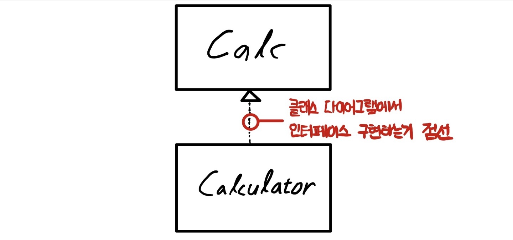
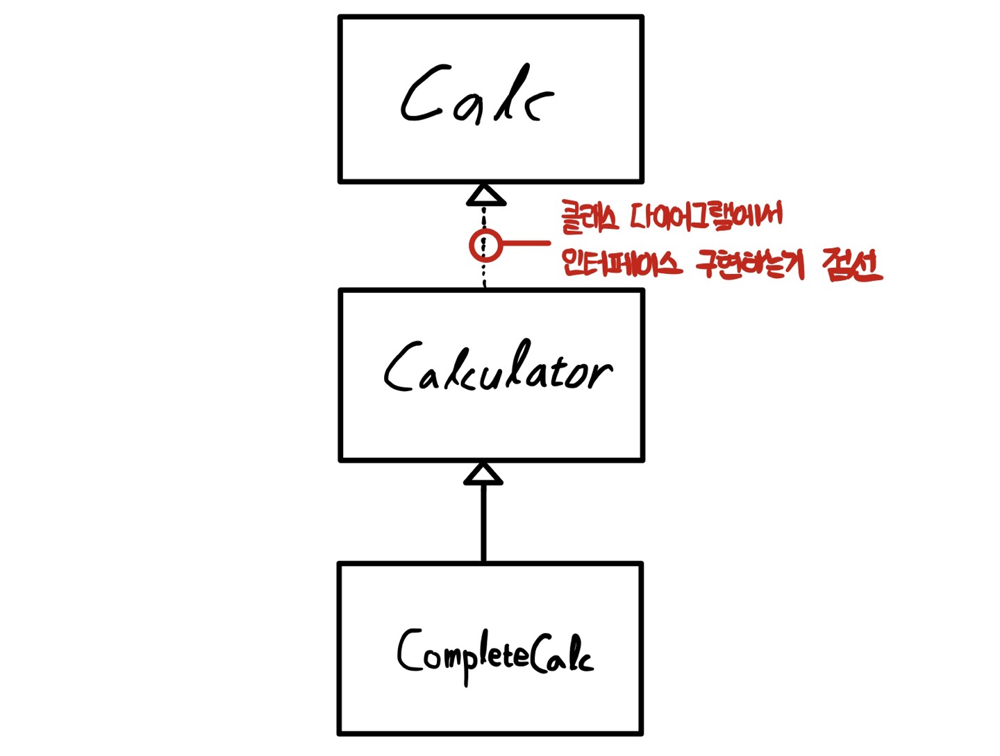

# Chapter 10 - 인터페이스

## 인터페이스란?

-   인터페이스(interface) : 모든 메서드가 추상 메서드로만 이루어져있음

### 구현 코드가 없는 인터페이스

-   인터페이스는 클래스 혹은 프로그램이 제공하는 기능을 **명시적으로 선언하는 역할**
-   인터페이스는 **추상 메서드와 상수로만 이루어짐**

<br>

**인터페이스 만들기**, 인텔리제이는 new - java class에서 interfaces 클릭하면 됨

```java
package chapter10.interfaceex;

public interface Calc {
    double PI = 3.14;
    int ERROR = -999999999;

    int add(int num1, int num2);
    int substract(int num1, int num2);
    int times(int num1, int num2);
    int divide(int num1, int num2);
}
```

-   파일 생성 시 인터페이스로 생성했기 때문에 `public abstract` 예약어를 명시적으로 쓰지 않아도 컴파일 과정에서 **자동으로 추상메서드로 변환**됨
-   인터페이스에서 **선언한 변수**는 모두 컴파일 과정에서 값이 변하지 않는 **상수로 자동 변환됨**. `public static final` 예약어를 쓰지 않아도 무조건 상수로 인식!

<br>

### 클래스에서 인터페이스 구현

클래스에서 인터페이스를 구현한다 (implements) = 인터페이스를 클래스가 사용하는 것

<p align="center"></img></p>

    [클래스 다이어그램]
    점선 : 인터페이스 구현
    마름모 : 챕터9에서 했는데 복습하려고, 포함(HAS-A) 관계 의미

```java
package chapter10.interfaceex;

public abstract class Calculator implements Calc {
    @Override
    public int add(int num1, int num2) {
        return num1 + num2;
    }

    @Override
    public int substract(int num1, int num2) {
        return num1 - num2;
    }
}
```

생각해보면, 인터페이스 자체가 추상 메서드만으로 이루어져있으니, 그걸 `implements`하면 클래스인 Calculator는 추상 메서드 4개를 포함하는 상태이니까 이걸 구현하지 않으면 Calculator 클래스도 추상 클래스가 되는 것. **추상 메서드 4개 다 구현하던가~** 혹은 **추상 클래스로 만들던가~**

<br>

여기서는 add하고 substract만 구현했으니까 abstract class로 만든 것

<br>

<p align="center"></img></p>

```java
package chapter10.interfaceex;

public class CompleteCalc extends Calculator {
    @Override
    public int times(int num1, int num2) {
        return num1 * num2;
    }

    @Override
    public int divide(int num1, int num2) {
        if (num2 != 0) {
            return num1 / num2;
        } else {
            return Calc.ERROR;
        }
    }

    public void showInfo() {
        System.out.println("Calc 인터페이스를 구현하였습니다.");
    }
}
```

```java
package chapter10.interfaceex;

public class CalculatorTest {
    public static void main(String[] args) {
        int num1 = 10;
        int num2 = 5;

        CompleteCalc calc = new CompleteCalc();
        System.out.println(calc.add(num1, num2));
        System.out.println(calc.substract(num1, num2));
        System.out.println(calc.times(num1, num2));
        System.out.println(calc.divide(num1, num2));
        calc.showInfo();
    }
}
```

-   Calculator 클래스는 추상 클래스 => 인스턴스 생성 불가
-   그래서 CompleteCalc를 인스턴스 생성한거임

<br>

### 인터페이스 구현과 형 변환

```java
// 이렇게 가능
Calc calc = new CompleteCalc();
```

-   인터페이스도 마찬가지로 하위 클래스 => 상위 클래스로 묵시적 형 변환 가능
-   CompleteCalc 클래스는 상위 클래스인 Calculator형이면서 Calc형이기도 함
-   이렇게하면, `showInfo()` 메서드는 CompleteCalc에서 선언한 메서드니까 `showInfo()`메서드 사용 불가능하겠군.

<br>
