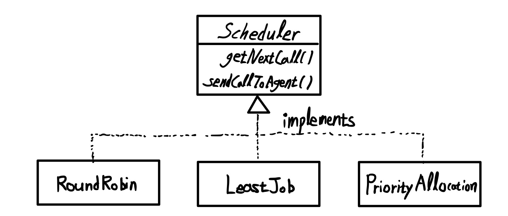
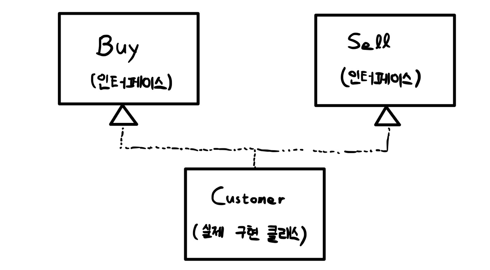
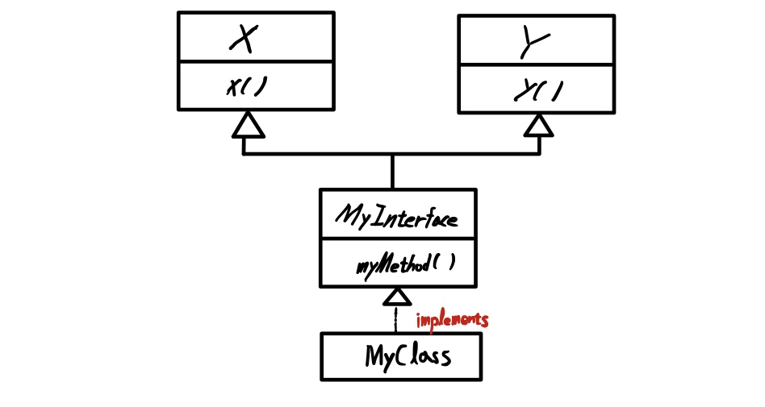
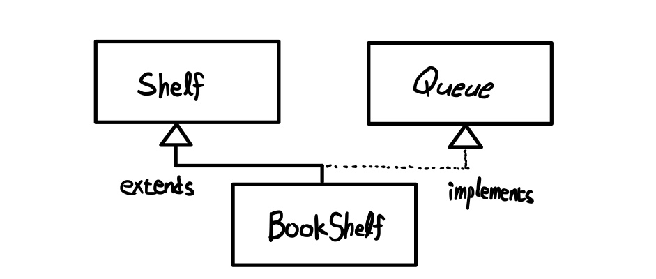
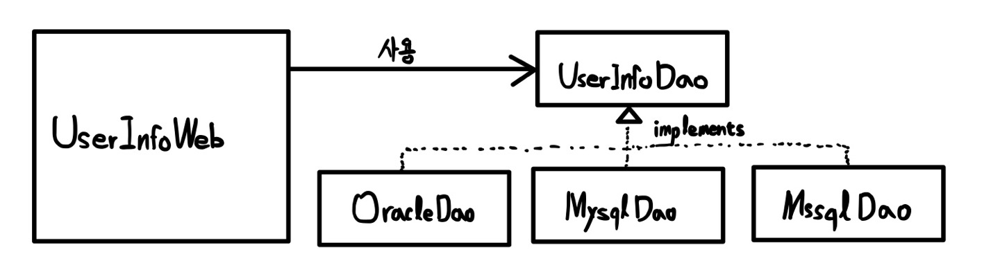

# Chapter 10 - 인터페이스

## 인터페이스란?

-   인터페이스(interface) : 모든 메서드가 추상 메서드로만 이루어져있음

### 구현 코드가 없는 인터페이스

-   인터페이스는 클래스 혹은 프로그램이 제공하는 기능을 **명시적으로 선언하는 역할**
-   인터페이스는 **추상 메서드와 상수로만 이루어짐**

<br>

**인터페이스 만들기**, 인텔리제이는 new - java class에서 interfaces 클릭하면 됨

```java
package chapter10.interfaceex;

public interface Calc {
    double PI = 3.14;
    int ERROR = -999999999;

    int add(int num1, int num2);
    int substract(int num1, int num2);
    int times(int num1, int num2);
    int divide(int num1, int num2);
}
```

-   파일 생성 시 인터페이스로 생성했기 때문에 `public abstract` 예약어를 명시적으로 쓰지 않아도 컴파일 과정에서 **자동으로 추상메서드로 변환**됨
-   인터페이스에서 **선언한 변수**는 모두 컴파일 과정에서 값이 변하지 않는 **상수로 자동 변환됨**. `public static final` 예약어를 쓰지 않아도 무조건 상수로 인식!

<br>

### 클래스에서 인터페이스 구현

클래스에서 인터페이스를 구현한다 (implements) = 인터페이스를 클래스가 사용하는 것

<p align="center"></img></p>

    [클래스 다이어그램]
    점선 : 인터페이스 구현
    마름모 : 챕터9에서 했는데 복습하려고, 포함(HAS-A) 관계 의미

```java
package chapter10.interfaceex;

public abstract class Calculator implements Calc {
    @Override
    public int add(int num1, int num2) {
        return num1 + num2;
    }

    @Override
    public int substract(int num1, int num2) {
        return num1 - num2;
    }
}
```

생각해보면, 인터페이스 자체가 추상 메서드만으로 이루어져있으니, 그걸 `implements`하면 클래스인 Calculator는 추상 메서드 4개를 포함하는 상태이니까 이걸 구현하지 않으면 Calculator 클래스도 추상 클래스가 되는 것. **추상 메서드 4개 다 구현하던가~** 혹은 **추상 클래스로 만들던가~**

<br>

여기서는 add하고 substract만 구현했으니까 abstract class로 만든 것

<br>

<p align="center"></img></p>

```java
package chapter10.interfaceex;

public class CompleteCalc extends Calculator {
    @Override
    public int times(int num1, int num2) {
        return num1 * num2;
    }

    @Override
    public int divide(int num1, int num2) {
        if (num2 != 0) {
            return num1 / num2;
        } else {
            return Calc.ERROR;
        }
    }

    public void showInfo() {
        System.out.println("Calc 인터페이스를 구현하였습니다.");
    }
}
```

```java
package chapter10.interfaceex;

public class CalculatorTest {
    public static void main(String[] args) {
        int num1 = 10;
        int num2 = 5;

        CompleteCalc calc = new CompleteCalc();
        System.out.println(calc.add(num1, num2));
        System.out.println(calc.substract(num1, num2));
        System.out.println(calc.times(num1, num2));
        System.out.println(calc.divide(num1, num2));
        calc.showInfo();
    }
}
```

-   Calculator 클래스는 추상 클래스 => 인스턴스 생성 불가
-   그래서 CompleteCalc를 인스턴스 생성한거임

<br>

### 인터페이스 구현과 형 변환

```java
// 이렇게 가능
Calc calc = new CompleteCalc();
```

-   인터페이스도 마찬가지로 하위 클래스 => 상위 클래스로 묵시적 형 변환 가능
-   CompleteCalc 클래스는 상위 클래스인 Calculator형이면서 Calc형이기도 함
-   이렇게하면, `showInfo()` 메서드는 CompleteCalc에서 선언한 메서드니까 `showInfo()`메서드 사용 불가능하겠군.

<br>

## 인터페이스와 다형성

### 인터페이스의 역할

자바 8에서 새롭게 추가된 [디폴트 메서드](#디폴트-메서드), [정적 메서드 구현부](#정적-메서드)가 없다면, 인터페이스는 그야말로 껍데기이다. 메서드 구현부(implementation part)가 없고 메서드 선언부(declaration part)만 있는 인터페이스를 왜 사용할까?

- 인터페이스는 클라이언트 프로그램에 어떤 메서드를 제공하는지 미리 알려주는 **명세(specification) 혹은 약속**의 역할

<br>

예를 들어, Abc 인터페이스, 이를 구현한 A 클래스, 이 클래스를 사용하는 Z 프로그램이 있다고 하면, **Z 프로그램에서 A 클래스의 구현 코드 전체를 살펴보지 않고 Abc 인터페이스의 선언부만 봐도 이 A 클래스를 어떻게 사용할지 알 수 있는 것**이다.

<br>

프로그램에서 클래스를 사용할 때 클래스에서 구현한 내용을 몰라도 **인터페이스에서 선언한 메서드의 매개변수 자료형과 반환 값만 알면** 인터페이스를 구현한 어떤 클래스든 사용할 수 있다.

<br>

**최종 정리**
- 인터페이스의 역할 : 인터페이스를 구현한 클래스가 어떤 기능의 메서드를 제공하는지 명시하는 것
- 클라이언트 프로그램은 인터페이스에서 약속한 명세대로 구현한 클래스를 생성해서 사용하면 됨

<br>

### 인터페이스와 다형성

- 인터페이스 사용하면 다형성 구현해서 확장성 있는 프로그램 만들 수 있음
- 이는 클라이언트 프로그램을 많이 수정하지 않고 **기능을 추가하거나 다른 기능을 사용할 수 있음**을 의미한다.

> 예제 시나리오
>> 고객 센터에 전화 상담하는 상담원들이 있음. 센터로 전화가 오면 대기열에 저장됨. 상담원이 지정되기 전까지 대기 상태가 됨. 각 전화를 상담원에게 배분하는 정책은 여러 방식으로 구현 가능
>> - 순서대로 배분
>> - 짧은 대기열 찾아 배분
>> - 우선순위에 따라 배분
>>
>> 1. 순서대로 배분하기 : 모든 상담원이 동일한 상담 건수를 처리하도록, 들어오는 전화 순서대로 상담원에게 하나씩 배분
>> 2. 짧은 대기열 찾아 배분 : 고객 대기 시간을 줄이기 위해 상담을 하지 않는 상담원이나 가장 짧은 대기열을 보유한 상담원에게 배분
>> 3. 우선순위에 따라 배분 : 고객 등급에 따라 등급이 높은 고객의 전화를 우선 가져와서 업무 능력이 좋은 상담원에게 우선 배분

<p align="center"></img></p>

<br>

Scheduler 인터페이스를 구현하는 RoundRobin(순서대로), LeastJob(짧은 대기열 먼저), PriorityAllocation(우선순위에 따라) 클래스를 구현

<br>

**Scheduler 인터페이스**

```java
package chapter10.scheduler;

public interface Scheduler {
    public void getNextCall();
    public void sendCallToAgent();
}
```

<br>

**RoundRobin 클래스**

```java
package chapter10.scheduler;

public class RoundRobin implements Scheduler {
    @Override
    public void getNextCall() {
        System.out.println("상담 전화를 순서대로 대기열에서 가져옵니다.");
    }

    @Override
    public void sendCallToAgent() {
        System.out.println("다음 순서 상담원에게 배분합니다.");
    }
}
```

<br>

**LeastJob 클래스**

```java
package chapter10.scheduler;

public class LeastJob implements Scheduler {
    @Override
    public void getNextCall() {
        System.out.println("상담 전화를 순서대로 대기열에서 가져옵니다.");
    }

    @Override
    public void sendCallToAgent() {
        System.out.println("현재 상담 업무가 없거나 대기가 가장 적은 상담원에게 할당합니다.");
    }
}
```

<br>

**PriorityAllocation 클래스**

```java
package chapter10.scheduler;

public class PriorityAllocation implements Scheduler {
    @Override
    public void getNextCall() {
        System.out.println("고객 등급이 높은 고객의 전화를 먼저 가져옵니다.");
    }

    @Override
    public void sendCallToAgent() {
        System.out.println("업무 skill 값이 높은 상담원에게 우선적으로 배분합니다.");
    }
}
```

<br>

**SchedulerTest 클래스**

```java
package chapter10.scheduler;

import java.io.IOException;

public class SchedulerTest {
    public static void main(String[] args) throws IOException {
        System.out.println("전화 상담 할당 방식을 선택하세요.");
        System.out.println("R : 한명씩 차례로 할당 ");
        System.out.println("L : 쉬고 있거나 대기가 가장 적은 상담원에게 할당 ");
        System.out.println("P : 우선순위가 높은 고객 먼저 할당 ");

        int ch = System.in.read();
        Scheduler scheduler = null;

        if(ch == 'R' || ch == 'r') {
           scheduler = new RoundRobin();
        }
        else if(ch == 'L' || ch == 'l') {
            scheduler = new LeastJob();
        }
        else if(ch == 'P' || ch == 'p') {
            scheduler = new PriorityAllocation();
        }
        else {
            System.out.println("지원되지 않는 기능입니다.");
            return;
        }

        scheduler.getNextCall();
        scheduler.sendCallToAgent();
    }
}
```

- 문자를 입력받는 `System.in.read()`를 사용하려면 IOException에서 오류를 처리해야 한다.
- 마지막에 Scheduler 자료형으로 선언한 scheduler 참조변수를 이용하여, 어떤 클래스를 호출하든가와 상관없이 **인터페이스에 선언한 메서드 호출**

<br>

### 클라이언트가 클래스를 사용하는 방법

간단하다. 인터페이스를 통해 구현해야 할 메서드를 선언해놨으니까, 약속한 명세대로 클래스를 만들어서 사용하면 된다.

> 예를 들어, 상담 전화 할당 방식이 아닌 상담원이 본인이 필요할 때 가져오는 정책을 추가해보자. getNextCall() 호출되면 "상담원이 다음 전화 요청" 출력, sendCallToAgent() 호출되면 "상담원이 전화를 가져갔습니다" 출력, 추가된 정책은 A나 a 입력하면 선택되게

```java
package chapter10.scheduler;

public class AgentGetCall implements Scheduler {
    @Override
    public void getNextCall() {
        System.out.println("상담원이 다음 전화 요청");
    }

    @Override
    public void sendCallToAgent() {
        System.out.println("상담원이 전화 상담을 가져갔습니다.");
    }
}
```

<br>

## 인터페이스 요소 살펴보기

### 인터페이스 상수

- 인터페이스는 추상 메서드로 이루어짐, 인스턴스 생성 불가, 멤버 변수 사용 불가
- 하지만, 인터페이스에 아래와 같이 선언해도 오류 발생 X

```java
public interface Calc {
    double PI = 3.14;
    int ERROR = -9999999;
}
```
- 인터페이스에 선언한 변수를 컴파일하면 상수로 변환되기 때문 !
- 인터페이스의 `PI`를 컴파일하면 `public static final double PI = 3.14` 즉, 상수 3.14로 변환된다. ERROR도 마찬가지로 `public static final`로 변환!

<br>

### 디폴트 메서드와 정적 메서드

- 자바 7까지는 인터페이스에서 추상 메서드, 상수만 선언 가능했음
    - 이렇게 하면 불편한 점이 인터페이스에서 코드를 구현할 수 없으므로, **여러 클래스에서 사용할 메서드가 클래스마다 같은 기능을 제공하는 경우, 클래스마다 반복해서 구현해야 했음**

- 자바 8부터는 디폴트 메서드, 정적 메서드 기능 제공
    - 디폴트 메서드 : 인터페이스에서 구현 코드까지 작성한 메서드, 인터페이스를 구현한 클래스에 기본적으로 제공할 메서드
    - 정적 메서드 : 인스턴스 생성과 상관없이 사용할 수 있는 메서드

- But, 디폴트 메서드나 정적 메서드가 추가되었다고 해도 인터페이스가 인스턴스를 생성할 수 있는 것은 아님

<br>

### 디폴트 메서드

- 기본으로 제공되는 메서드
- 인터페이스에서 디폴트 메서드 구현
- 인터페이스를 구현한 클래스가 생성되면, 그 클래스에서 사용할 기본 기능
- `default` 예악어 사용해서 디폴트 메서드 선언
- 클래스 입장에서 구현이 강제되지 않는다 !

<br>

**Calc 인터페이스에 코드 추가**

```java
package chapter10.interfaceex;

public interface Calc {
    default void description() {
        System.out.println("정수 계산기를 구현합니다.");
    }
}
```

이후, Calculator 클래스, CompleteCalc 클래스에 별다른 코드를 추가 안해도 CalculatorTest 클래스에서 디폴트 메서드 그냥 호출하면 됨

<br>

**CalculatorTest 클래스**

```java
package chapter10.interfaceex;

public class CalculatorTest {
    public static void main(String[] args) {
        CompleteCalc calc = new CompleteCalc();
        calc.description();
    }
}
```

<br>

**디폴트 메서드 재정의하기**

- 이미 인터페이스에서 구현된 디폴트 메서드가 **새로 생성한 클래스에서 원하는 기능이 아니라면, 하위 클래스에서 디폴트 메서드를 재정의 가능**

```java
package chapter10.interfaceex;

public interface Calc {
    default void description() {
        System.out.println("정수 계산기를 구현합니다.");
    }
}
```

```java
package chapter10.interfaceex;

public class CompleteCalc extends Calculator {
    @Override
    public void description() {
        System.out.println("디폴트 메서드를 재정의");
    }
}
```

```java
package chapter10.interfaceex;

public class CalculatorTest {
    public static void main(String[] args) {
        CompleteCalc calc = new CompleteCalc();
        calc.description();
    }
}

// 디폴트 메서드를 재정의
```

<br>

### 정적 메서드

- 정적 메서드는 `static` 예약어를 사용하여 선언
- 클래스 생성과 무관하게 사용 가능
- 인터페이스 이름으로 직접 참조하여 사용
- 클래스 입장에서 구현이 강제되지 않는다 !

<br>

**Calc 인터페이스**
- `total()` : 매개변수로 전달된 배열의 모든 요소 값을 더하는 정적 메서드

```java
package chapter10.interfaceex;

public interface Calc { 
    static int total(int[] arr) {
        int total = 0;
        
        for (int i : arr) {
            total += i;
        }
        return total;
    }
}
```

```java
package chapter10.interfaceex;

public class CalculatorTest {
    public static void main(String[] args) {
        CompleteCalc calc = new CompleteCalc();

        int[] arr = {1, 2, 3, 4, 5};
        System.out.println(Calc.total(arr));
    }
}
// 15
```

- CompleteCalc를 참조한 calc를 쓴 것이 아님
- System.out.println을 보면 **Calc 인터페이스를 직접 참조**했음

<br>

### private 메서드

- 자바 9부터 인터페이스에 private 메서드 구현 가능
- private 메서드는 인터페이스를 구현한 클래스에서 사용하거나 재정의 불가

기존에 구현된 코드를 변경하지 않고, **인터페이스를 구현한 클래스에서 공통으로 사용하는 경우에 private 메서드로 구현하면 코드 재사용성을 높일 수 있다.**

<br>

추가로, 클라이언트 프로그램에 제공할 기본 기능을 private 메서드로 구현하기도 한다.

<br>

**private 메서드는 코드를 모두 구현**해야 하므로, **추상 메서드에 private 예약어를 사용할 수 없음**. 하지만, **static 예약어는 사용 가능**하다. **private static 메서드는 정적 메서드에서 호출하여 사용**한다.

```java
package chapter10.interfaceex;

public interface Calc {
    default void description() {
        System.out.println("정수 계산기를 구현합니다.");
        myMethod();
    }

    static int total(int[] arr) {
        int total = 0;

        for (int i : arr) {
            total += i;
        }
        myStaticMethod();
        return total;
    }

    private void myMethod() {
        System.out.println("private 메서드입니다.");
    }

    private static void myStaticMethod() {
        System.out.println("private static 메서드입니다.");
    }
}
```
- 디폴트 메서드에서 private 메서드 호출
- 정적 메서드에서 private static 메서드 호출

<br>

## 인터페이스 활용

### 한 클래스가 여러 인터페이스를 구현하는 경우

- 한 클래스가 여러 클래스를 상속받으면, 호출이 모호해져서 자바에서는 다중 상속을 막았었음
- 하지만, 인터페이스는 한 클래스가 여러 인터페이스 구현 가능

<p align="center"></img></p>

**한 클래스에서 인터페이스 여러 개 구현 가능한 이유**

- 인터페이스는 구현 코드나 멤버 변수를 가지지 않음
    - 따라서 여러 개 동시에 구현 가능
- 두 인터페이스에 이름이 같은 메서드가 선언되었다고 해도 **구현은 클래스에서 이루어지니까, 어떤 메서드를 호출해야 하는지 모호하지 않은 것!**
- Diamond problem(다이아몬드 문제) 발생 안함!

<br>

**Buy 인터페이스**

```java
package interfaceex;

public interface Buy {
    void buy();
}
```

**Sell 인터페이스**

```java
package interfaceex;

public interface Sell {
    void sell();
}
```

**Customer 클래스**

```java
package chapter10.interfaceex;

public class Customer implements Buy, Sell {
    @Override
    public void sell() {
        System.out.println("판매하기");
    }

    @Override
    public void buy() {
        System.out.println("구매하기");
    }
}
```

**CustomerTest 클래스**

```java
package chapter10.interfaceex;

public class CustomerTest {
    public static void main(String[] args) {
        Customer customer = new Customer();

        Buy buyer = customer;
        buyer.buy();

        Sell seller = customer;
        seller.sell();

        if (seller instanceof Customer) {
            Customer customer2 = (Customer) seller;
            customer2.buy();
            customer2.sell();
        }
    }
}
// 구매하기
// 판매하기
// 구매하기
// 판매하기
```

- 두 인터페이스를 구현한 Customer 클래스는 Buy형이자, Sell형
- `Buy buyer = customer;`는 customer를 Buy 인터페이스형 변수에 대입하여 형 변환 일어남. 따라서, Buy 인터페이스에 선언한 메서드만 호출 가능
- 상속에서처럼 원래의 인스턴스 자료형으로 다운 캐스팅 하려면 **instanceof** 사용

<br>

### 두 인터페이스의 정적 메서드가 중복되는 경우

- 정적 메서드는 인스턴스 생성과 상관없이 사용 가능
- Buy 인터페이스, Sell 인터페이스 각각에 `pay()` 정적 메서드가 있다고 가정
    - 인스턴스 생성 없이 `Buy.pay()`, `Sell.pay()`와 같이 특정해서 호출하기 때문에 정적 메서드는 중복되어도 상관없음

<br>

### 두 인터페이스의 디폴트 메서드가 중복되는 경우

- 디폴트 메서드는 인스턴스를 생성해야 호출할 수 있는 메서드
- 이름이 같은 디폴트 메서드가 두 인터페이스에 있으면 문제가 됨
    - Diamond problem(다이아몬드 문제) 발생!

<br>

**Buy 인터페이스**

```java
package interfaceex;

public interface Buy {
    void buy();

    default void order() {
        System.out.println("구매 주문");
    }
}
```

**Sell 인터페이스**

```java
package interfaceex;

public interface Sell {
    void sell();

    default void order() {
        System.out.println("판매 주문");
    }
}
```

<br>

- Buy, Sell 인터페이스 중 `어떤 디폴트 메서드 order()`를 불러올 지 모호해진다.
- 따라서, 이를 구현한 Customer 클래스에서 `order()`를 재정의하면 재정의된 메서드가 호출되어서 문제가 해결된다.

```java
package interfaceex;

public class Customer implements Buy, Sell {
    public void order() {
        System.out.println("고객 판매 주문");
    }
}
```

```java
package chapter10.interfaceex;

public class CustomerTest {
    public static void main(String[] args) {
        Customer customer = new Customer();

        Buy buyer = customer;
        buyer.buy();
        buyer.order();

        Sell seller = customer;
        seller.sell();
        seller.order();

        if (seller instanceof Customer) {
            Customer customer2 = (Customer) seller;
            customer2.buy();
            customer2.sell();
        }
        customer.order();
    }
}
// 구매하기
// 고객 판매 주문
// 판매하기
// 고객 판매 주문
// 구매하기
// 판매하기
// 고객 판매 주문
```

- `buyer.order()` 혹은 `seller.order()`를 해도 Customer 클래스에 재정의된 메서드가 호출된다. [가상 메서드](https://github.com/Shin-Jae-Yoon/TIL/tree/master/Language/Java/do_it_java/Chapter08#%EA%B0%80%EC%83%81-%EB%A9%94%EC%84%9C%EB%93%9C) 원리 안까먹었지!?

<br>

### 인터페이스 상속하기

- 인터페이스 간에도 상속 가능
- 인터페이스 간 상속은 구현 코드를 통해 **기능을 상속하는 것이 아니**므로, **형 상속(type inheritance)** 라고 부른다.
- 클래스의 경우 - 하나의 클래스만 상속
- 인터페이스의 경우 - 여러 인터페이스 동시에 상속 가능
- **상속받은 인터페이스는 상위 인터페이스에 선언한 추상 메서드 모두 가지게 됨**

<p align="center"></img></p>

- Myinterface 인터페이스는 X, Y 인터페이스 상속 받음
- MyClass는 MyInterface 인터페이스를 구현
- MyClass가 구현애햐 하는 추상 메서드는 총 3개

<br>

**X 인터페이스**

```java
package chapter10.interfaceex;

public interface X {
    void x();
}
```

<br>

**Y 인터페이스**

```java
package chapter10.interfaceex;

public interface Y {
    void y();
}
```

<br>

**MyInterface 인터페이스**

```java
package chapter10.interfaceex;

public interface MyInterface extends X, Y {
    void myMethod();
}
```

<br>

**MyClass 클래스**

```java
package chapter10.interfaceex;

public class MyClass implements MyInterface {
    @Override
    public void x() {
        System.out.println("x()");
    }

    @Override
    public void y() {
        System.out.println("y()");
    }

    @Override
    public void myMethod() {
        System.out.println("myMethod()");
    }
}
```

<br>

**MyClassTest 클래스**

```java
package chapter10.interfaceex;

public class MyClassTest {
    public static void main(String[] args) {
        MyClass mClass = new MyClass();

        X xClass = mClass;
        xClass.x();

        Y yClass = mClass;
        yClass.y();

        MyInterface iClass = mClass;
        iClass.myMethod();
        iClass.x();
        iClass.y();
    }
}

// x()
// y()
// myMethod()
// x()
// y()
```

- 생성한 클래스는 상위 인터페이스형으로 변환 가능
    - 상위 인터페이스로 형 변환 하면 **상위 인터페이스에 선언한 메서드만 호출 가능**

<br>

**최종 정리**
- 인터페이스 간 상속은, **인터페이스를 정의할 때 기능상 계층 구조가 필요한 경우에 상속을 사용하기도 함**

<br>

### 인터페이스 구현과 클래스 상속 함께 쓰기

- 한 클래스에서 클래스 상속, 인터페이스 구현 모두 가능

<p align="center"></img></p>

<br>

**Shelf 클래스**

```java
package chapter10.bookshelf;
import java.util.ArrayList;

public class Shelf {
    protected ArrayList<String> shelf;

    public Shelf() {
        shelf = new ArrayList<String>();
    }

    public ArrayList<String> getShelf() {
        return shelf;
    }

    public int getCount() {
        return shelf.size();
    }
}
```

- 자료를 순서대로 저장할 배열 객체 선언 (이름을 저장하게 자료형은 String)
- 디폴트 생성자로 Shelf 클래스 생성 시 ArrayList 생성

<br>

**Queue 인터페이스**

```java
package chapter10.bookshelf;

public interface Queue {
    void enQueue(String title);  // 배열의 맨 마지막에 추가
    String deQueue();            // 배열의 맨 처음 항목 반환
    int getSize();               // 현재 Queue에 있는 개수 반환
}
```

<p align="center"></img></p>

<br>

**BookShelf 클래스**

```java
package chapter10.bookshelf;

public class BookShelf extends Shelf implements Queue {
    @Override
    public void enQueue(String title) {
        shelf.add(title);
    }

    @Override
    public String deQueue() {
        return shelf.remove(0);
    }

    @Override
    public int getSize() {
        return getCount();
    }
}
```
- `enQueue()` : 배열에 요소 추가
- `deQueue()` : 맨 처음 요소 배열에서 삭제하고 반환
- `getSize()` : 배열 요소 개수 반환

<br>

**BookShelfTest 클래스**

```java
package chapter10.bookshelf;

public class BookShelfTest {
    public static void main(String[] args) {
        Queue shelfQueue = new BookShelf();
        shelfQueue.enQueue("태백산맥 1");
        shelfQueue.enQueue("태백산맥 2");
        shelfQueue.enQueue("태백산맥 3");

        System.out.println(shelfQueue.deQueue());
        System.out.println(shelfQueue.deQueue());
        System.out.println(shelfQueue.deQueue());
    }
}
// 태백산맥 1
// 태백산맥 2
// 태백산맥 3
```

<br>

### 실무에서 인터페이스를 사용하는 경우

- 인터페이스는 클래스가 제공할 기능을 선언하고 설계하는 것
- 여러 클래스가 같은 메서드를 서로 다르게 구현하는 경우
    - 우선, 인터페이스에 메서드 선언
    - 다음, 인터페이스를 구현한 각 클래스에서 같은 메서드에 대해 다양한 기능 구현
    - 이것이 인터페이스를 이용한 다형성의 구현

<br>

예를 들어, SI 회사에서 시스템 개발했음. 이 시스템이 자료 저장할 때 DB 사용하는데 회사마다 MySQL, 오라클 DB, MS-SQL 이런식으로 DB가 제각각이라고 하자. 단, 웹 페이지나 모바일 페이지는 DB와 관계없이 수행 된다.

<br>

이런 경우 **데이터베이스 기능을 수행할 인터페이스를 정의**. 그리고 인터페이스 정의에 맞게 여러 데이터베이스 관련 모듈을 개발하면 됨.

<br>

<p align="center"></img></p>

- 사용자 정보를 DB에 입력, 업데이트, 삭제하는 기능을 UserInfoDao 인터페이스에서 정의
- 여러 DB에 맞게 구현하는 것은 각 클래스가 담당

<br>

**JDBC와 인터페이스**

- JDBC는 Java DataBase Connectivity
- 자바와 데이터베이스를 연결해 주는 역할
- 자바와 데이터베이스를 연결하려면 여러 기능 수행해야함. 그 중 대표적인 것이 **Connection을 생성하고 연결**하는 것
- 자바에서 DB를 어떻게 사용할 것인지를 기술한 명세, 즉, 약속

<br>

Connection : 자바와 DB를 연결하기 위해 사용하는 인터페이스
- 여기에 여러 메서드들이 미리 구현되어 있음
