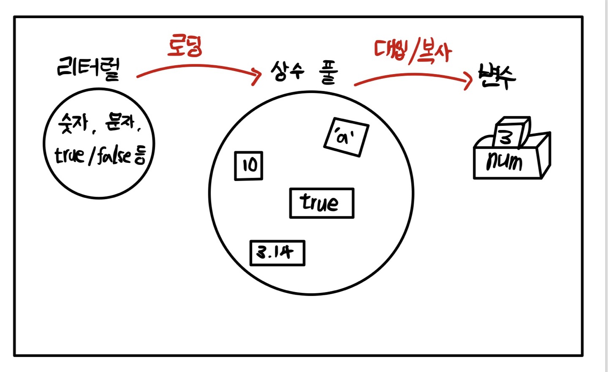

# Do it! Java 프로그래밍 입문 교재

2022.09.09 ~

> 급하게 스프링으로 프로젝트를 진행하게 되어 빠르게 책을 훑을 것
> 눈으로 빠르게 읽으면서 코드를 진행하며 흐름 파악
> 목표기간 일주일 이내

<br>

## Java settings

1. https://www.oracle.com/java/technologies/downloads/ 에서 Java 8에 Java SE Development Kit 8u341를 windows x64 다운로드 받기
2. 환경 변수 설정은 이대로 https://suzxc2468.tistory.com/141
3. 인텔리제이 pro버전 다운로드 체크는 전부 다 체크하고 맨 밑에 association만 java파일 연관 체크

<br><br>

## Java 특징

<br>

1. 플랫폼(프로그램이 실행되는 환경)에 영향을 받지 않음

    **한 번 작성하면, 어디서든 돌아간다. write once, run anywhere** <br>
    자바 소스 코드 (`.java`) -> 자바 컴파일러 -> 바이트 코드 (`.class`) -> 자바 가상머신 (JVM) -> 각 운영체제에서 실행

<br>

- 자바 가상 머신 (Java Virtual Machine, JVM)은 자바 프로그램 실행 환경을 만들어주는 소프트웨어
- 자바 코드를 **컴파일**하여 `.class` 바이트 코드로 만들면 바이트 코드가 JVM에서 실행
- 현재 사용하는 컴퓨터의 OS에 맞는 자바 실행 환경 (Java Runtime Environment, JRE)이 설치되어 있으면 JVM이 설치되어 있는 것
- JIT(Just In Time) 컴파일러는 실행 시점에 기계어 코드를 생성하는데, 같은 코드가 반복되면 매번 기계어 코드를 새로 생성하지 않고 이전에 만든 기계어를 재사용함.
- JIT 컴파일러는 운영체제에 맞게 바이트 실행 코드로 한 번에 변환하여 실행해서 이전의 자바 해석기(Java Interpreter) 방식보다 성능이 10~20배 좋음

<br>

2. 객체지향 언어라서 유지보수가 쉽고 확장성이 좋음

    객체지향프로그래밍은 일의 순서대로 프로그래밍 하는 것 X, **여러 객체의 협력을 통해 프로그램을 구현하는 것, 각 객체의 상호 관계를 이용하여 프로그래밍 하는 것이다.**. 쇼핑몰 사이트 예시에서 회원, 상품, 주문, 배송 등이 객체. 

<br>

3. 프로그램이 안정적임

    C, C++과는 다르게 포인터를 사용하지 않아서, 메모리 직접 제어 불가능. 메모리를 직접 제어할 경우 위험할 수 있지만, 그렇지 않으니까 안정적임.

    동적 메모리 수거를 프로그래머가 하지 않고 **가비지 컬렉터(Garbage Collector)** 이용하여 메모리 효율적으로 관리

    가비지 컬렉터란, 이름 그대로 쓰레기를 수집하는 기능. 여기서 쓰레기란 더이상 사용하지 않는 메모리를 의미한다. C, C++에서는 필요 없는 메모리 사용 해제를 프로그래머가 직접 하지만, 자바는 가비지 컬렉터가 사용하지 않는 동적 메모리를 주기적으로 수거

<br>

4. 풍부한 기능을 제공하는 오픈소스

    특정 기능을 대부분 개발자가 직접 개발하여 사용하는 기존의 다른 언어와는 달리 자바는 기본 기능을 제공하는 클래스, 뿐만 아니라 자료구조, 네트워크, 입출력, 예외 처리 등에 최적화 된 **알고리즘 라이브러리를 제공하는 자바 개발 키트(Java Development Kit, JDK)가 있음**.

<br><br>

## Hello Java

<br>

이클립스든 인텔리제이이든 `new project`로 project 생성을 한다. 그러면서 워크스페이스를 지정하는 것이다.

- 프로젝트(project) : 개발자가 만드는 하나의 프로그램 단위
- 클래스(class) : 객체를 소스 코드로 나타낸 것
- 패키지(package) : 프로그램 소스의 묶음으로 클래스를 만드는 데 만드시 필요, 패키지 이름은 항상 소문자로 쓴다.

<br>

src 폴더 -> package 생성 -> class 생성의 순서로 만든다. 이때 

```java
package hello;

public class HelloJava {
    public static void main(String[] args) {
        System.out.println("Hello, JAVA");
    }
}
```

<br><br>

## Java 변수, 자료형

<br>

### Java 변수 선언, 초기화

- 초기화 : 변수의 선언과 동시에 값을 대입

```java
package chapter2;

public class Variable1 {
    public static void main(String[] args) {
        int level; // 변수 선언
        level = 10; // 변수에 값 대입
        System.out.println(level);

        int level2 = 10; // 초기화
        System.out.println(level2);
    }
}
```

<br>

- 변수 이름 정하기

|제약사항|예시|
|------|---|
|영문자, 숫자 사용 <br> 특수문자는 `$`, `_`만| g_level (O), count100 (O)<br> _master (O), $won (O)|
|숫자로 시작 불가|27day (X), 1abc (X)|
|예약어 사용 불가|while, int, break, ... |

<br>

- 변수를 선언한다 = 선언한 변수 이름으로 어떤 위치에 있는 메모리를 얼마만큼의 크기로 사용하겠다.
- 1byte = 8bits

|   |정수형|문자형|실수형|논리형|
|:---:|:-----:|:-----:|:-----:|:-----:|
|1바이트|byte|-|-|boolean|
|2바이트|short|char|-|-|
|4바이트|int|-|float|-|
|8바이트|long|-|double|-|

<br>

### Java 자료형 - 정수형

- **자바에서 정수 값 연산 시 4바이트를 기본 단위로 사용. 모든 정수 값을 기본으로 int형으로 처리.** 따라서 다른 자료형이라면 그를 표시해야함.

```java
int num1 = 12345678900;
long num2 = 12345678900;

// num1은 int 범위 벗어나서 오류
// num2도 오류. java는 정수를 int로 처리하니까

long num3 = 12345678900L;
// long 자료형으로 처리하라고 컴파일러에게 알려주는
// 식별자 L이나 l을 사용하여 알려줘서 오류 X
```

<br>

### Java 자료형 - 문자형

- **자바의 기본 인코딩 방식은 모든 문자를 2바이트로 표현하는 UTF-16** 
- 자바에서는 따옴표(`''`)와 쌍따옴표(`""`) 구분하자. 따옴표가 **문자형, char**, 쌍따옴표가 **문자열, string**인 듯 하다.
- 아스키 코드 : 영문자, 소문자, 특수 문자 등을 나타내는 문자 세트, 1바이트만 사용
- 유니코드(unicode) : 영어 이외에 한글이나 다른 언어 문자는 복잡하고 다양해서 2바이트 이상을 사용하게 됨. 그래서 각 언어의 표준 인코딩을 정의해놓은 것. 유니코드의 1바이트는 아스키 코드 값과 호환되면서 그 밖의 문자를 2바이트나 그 이상의 조합으로 표현. **자바는 유니코드에 기반하여 문자를 표현. 따라서, 자바의 문자 자료형인 char형은 2바이트 사용**

```java
char myChar = 'A';
// 문자 그대로 저장되는 것이 아니라
// 문자에 해당하는 정수 값(아스키 코드 값)이 저장
```

<br>

유니코드를 표현하는 인코딩 방법은 **UTF-8**, **UTF-16**이 있음 <br>
**자바의 기본 인코딩 방식은 모든 문자를 2바이트로 표현하는 UTF-16** <br><br>

모두 2바이트로 표현하니까 알파벳 같은 자료(1바이트 자료)를 저장하는 경우 낭비가 있을 수 있음. 반면에, UTF-8은 각 문자마다 1바이트에서 4바이트를 사용하여 문자를 나타내는 방식임. 따라서, UTF-8은 UTF-16에 비해 메모리 낭비가 적고 전송 속도가 빠름. 이러한 특성으로 인터넷에서 많이 사용 (예를 들어, HTML emmet 해보면 UTF-8로 나옴)

<br>

### Java 자료형 - 실수형

- 부동 소수점 방식 사용
- `0.1`은 `1.0 X 10^-1`로 표현 가능. 1.0이 가수, 10이 밑수, 제곱수가 지수
- **자바에서 실수는 double형을 기본으로 사용**
- 기본이 double이니까 float 사용하면 식별자 `F` 또는 `f`를 붙혀야함

<br>

- float형 : 부호 1비트, 지수부 8비트, 가수부 23비트 = 총 32비트(4바이트)
- double형 : 부호 1비트, 지수부 3비트, 가수부 52비트 = 총 64비트(8바이트)

```java
public class DoubleEx2 {
    public static void main(String[] args) {
        double dnum = 1;

        for (int i = 0; i < 10000; i++) {
            dnum = dnum + 0.1;
        }
        System.out.println(dnum);
    }
}

// 1001.000000000159
```

정확하게 1001로 떨어지지 않는 이유는 순환소수 문제이다. 다음 [링크](https://github.com/Shin-Jae-Yoon/TIL/tree/master/Language/JavaScript/lecture/codding_apple/LEVEL2#%EB%B6%80%EB%8F%99%EC%86%8C%EC%88%98%EC%A0%90-%EB%B6%80%EA%B0%80-%EC%84%A4%EB%AA%85)를 참고하도록 하자.

<br> 

### Java 자료형 - 논리형

- `boolean 변수명`
- boolean형 변수는 1바이트 값으로 저장, true / false만 가짐

<br>

### Java 자료형 추론

- 자바 10부터 생긴 문법
- 자바스크립트에 var 같은 거임. 자료형을 정확히 명시 안하고도 변수를 사용가능한 것
- **지역 변수 자료형 추론(local variable type inference)** 라고 한다. 변수에 대입되는 자료를 보고 컴파일러가 추측 가능

<br>

단, 자바스크립트의 var과는 다르다. 자바스크립트의 var는 재선언, 재할당 모두 가능했지만, **자바의 var는 재선언이 불가능**하다. 추가로, var로 자료형 없이 변수를 선언하려면 **지역 변수만 가능**하다. 지역 변수는 프로그램의 `{}`의 내에서 사용할 수 있는 변수이다. 즉, 자바스크립트의 var은 function 스코프였는데, 자바의 var는 block 스코프이다.

```java
var i = 10;          // int i = 10으로 컴파일
var j = 10.0;        // double j = 10.0으로 컴파일
var str = "hello";   // String str = "hello"로 컴파일
```

<br>

### Java 상수

- 자바스크립트에서는 const 썼는데, **자바에서는 final 예약어 사용**
- 재선언, 재할당 당연히 불가. 처음에 할당 안하고 써도 오류

```java
final double PI = 3.14;
final int MAX_NUM = 100;
```

```java
package chapter2;

public class Constant {
    public static void main(String[] args) {
        final int MAX_NUM = 100;
        final int MIN_NUM;

        MIN_NUM = 0; // 사용하기 전에 초기화 한 것, 초기화 안하면 오류 발생

        System.out.println(MAX_NUM);
        System.out.println(MIN_NUM);
    }
}
```

<br>

### Java 리터럴

- 리터럴(literal)은 프로그램에서 사용하는 모든 숫자, 문자, 논리값을 일컫는 말
- 리터럴 혹은 리터럴 상수라고 함

리터럴은 **프로그램이 시작할 때 시스템에 같이 로딩되어 특정 메모리 공간인 상수 풀(constant pool)에 놓인다.** 예를 들어, `int num = 3;`에서 값인 3이 메모리 공간 어딘가에 존재해야, num 변수에 그 값을 복사할 수 있다. **즉, 숫자가 변수에 대입되는 과정은 일단 숫자 값이 어딘가 메모리에 써져 있어야 하고, 이 값이 다시 변수 메모리에 복사되는 것이다.**

<p align="center"></img></p>

<br>

long형에서 식별자 L을 사용해주는 이유가 이때문이다. 자바에서 정수를 표현하는 메모리의 기본 크기는 4바이트인데, 상수 풀에서도 마찬가지다. 리터럴은 int형으로 처리되는데 long형은 4바이트 크기에 들어갈 수 없어서 8바이트로 처리하라고 컴파일러에게 알려주어야 한다. 이 때문에 **이 리터럴은 long형으로 저장되어야 한다는 의미로 리터럴 뒤에 식별자 L 이나 l을 붙혀주는 것**이다.