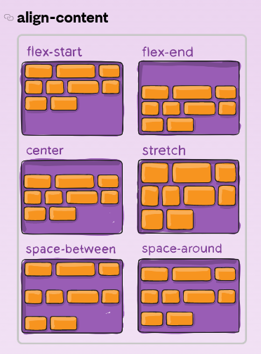

## 코딩애플 HTML_CSS 강좌 필기 (중급모듈)

<br>

### 폰트 설정법

<br>

-   `font-family : '폰트'` 형식으로 설정한다.
-   버그 없이 사용하려면 폰트의 영문명 사용
-   폰트를 여러개 설정하는 이유는 안정석 확보를 위해서이다. 왼쪽부터 적용된다.
-   아래 예시에서 gulim이 없어서 적용 안된다면 gothic으로 적용한다는 의미
-   웹사이트 이용자의 컴퓨터에 설치가 된 폰트들을 적용할 수 있다.

```css
body {
    font-family: 'gulim', 'gothic';
}
```

<br>

**사용자의 컴퓨터에 설치되지 않은 폰트를 사이트에서 이용하는 방법**

-   css 최상단에 `@font-face`로 적용할 폰트의 경로와 이름 작성
-   웹 폰트용으로 나온 **woff**파일은 ttf에 비해 용량의 3분의 1 수준

```css
@font-face {
    font-family: '폰트이름';
    src: url(폰트 저장 주소);
}
```

<br>

**Google Fonts 사용**

-   폰트 파일 없이, 구글 폰트를 직접 링크하는 방식
-   구글이 호스팅해주는 폰트가 미리 정의된 css 파일을 가져다 사용하는 방식이다.
-   **내 사이트의 트래픽 절약 가능**
-   크롬 브라우저가 이미 방문한 사이트는 캐싱해주기 때문에 많은 사람들이 이용할수록 더 빠르게 폰트를 이용 가능
-   html 적용 - `<link>` 부분
-   css 적용 - `@import` 부분

<br>

### 폰트 Anti-aliasing

<br>

-   폰트 앤티앨리어싱은 폰트를 부드럽게 보여주는 기술
-   픽셀의 각진 부분을 부드럽게 바꾸는 방법
-   mac은 자동으로 앤티앨리어싱 해주지만, window는 아님
-   글자에 각도를 주고 살짝 돌리면 됨

```css
p,
h4,
h3,
h2,
h1,
span,
button {
    transform: rotate(0.03deg);
}
```

<br>

### flex

<br>

-   가로 배치, 혹은 여러 배치에서 자주 사용할 flex 속성이다.
-   부모 태그에 `display : flex;` 설정한다.
-   `justify-content: flex-start;` 좌측 정렬
-   `justify-content: flex-end;` 우측 정렬
-   `justify-content: flex-center;` 가운데 정렬
-   `justify-content: space-between;` 사이 사이 떨어뜨리게 꽉차게
-   세로 배치 원하면, `flex-direction: column;`

```css
.flex-container {
    display: flex;
    justify-content: flex-start;
}

.flex-item {
    width: 100px;
    height: 100px;
    background-color: gray;
    margin: 5px;
}
```

-   flex에서 600px를 줬다고 하면, 실제 크기가 600px 되는 것이 아니라, 최대한 거기까지 키운다는 의미
-   width가 커서 밑으로 보내고 싶다면 `flex-wrap: wrap;` 속성 이용
-   flex 이용 시 상하 정렬은 `align-item: center;` 속성 이용

```css
/* 궁극적인 상하좌우 정렬 */

.flex-container {
    display: flex;
    height: 500px;
    align-items: center;
    justify-content: center;
}
```

-   flex에서는 박스 크기를 px 말고 **비율**로 설정 가능하다.
-   `flex-grow` 속성은 몇 배수를 의미한다.
-   아래의 예시는 1:2:1이다.

```html
<div class="flex-container">
    <div class="flex-item" style="flex-grow: 1">1</div>
    <div class="flex-item" style="flex-grow: 2">2</div>
    <div class="flex-item" style="flex-grow: 1">3</div>
</div>
```

-   navbar 디자인 하고싶을 때 가운데를 붕 띄우고 싶으면 가운데만 비율주고 띄운다.

```html
<div class="flex-container">
    <div class="flex-item">1</div>
    <div class="flex-item" style="flex-grow: 1">2</div>
    <div class="flex-item">3</div>
</div>
```

<br>

<p align="center"></img></p>

<br>

### HTML head 태그

<br>

-   head 태그에는 사이트 내에서 눈에 보이지 않는 중요한 정보들

<br>

1. css 파일 첨부

    - link 태그 이용
    - 상대경로 방식, 절대경로 방식

<br>

2. 스타일 태그
    - css 파일과 유사하게 동작
    - body 태그 안에 있어도 동작하지만 html 파일 코드는 위에서 아래로 읽어나가는 방식이라서 body 태그에 뒀을 때 사이트 로딩 시 스타일이 깨질 수 있음

<br>

3. 사이트 제목
    - 브라우저 탭에 뜨는 이름

<br>

4. **meta 태그**

```html
<head>
    <meta charset="UTF-8" />
    <meta name="description" content="백엔드 마스터 신재윤입니다." />
    <meta name="keywords" content="백엔드, backend, 개발자, 신재윤" />
    <meta name="viewport" content="width=device-width, initial-scale=1.0" />
</head>
```

-   4-1 : 사이트 인코딩 형식 지정 방법
-   4-2 : 사이트 검색 결과 화면에 뜨는 글귀
-   4-3 : 검색에 도움을 주는 키워드
-   description은 구글 검색 시 파란 제목으로 뜨는 글귀
-   keywords는 검색에 도움을 주는 키워드
-   4-4 : 사이트 초기 줌 레벨이나 폭을 지정해주는 것
-   `width=device-width`는 모바일 기기의 실제 폭으로 렌더링 해주는 것
-   실제 접속 시 스마트폰 기기의 실제 가로폭을 보고 렌더링하라는 명령어
-   `initial-scale=1`은 접속시의 화면 줌 레벨 설정

<br>

5. open graph

```html
<head>
    <meta property="og:image" content="/이미지경로.jpg" />
    <meta property="og:description" content="사이트설명" />
    <meta property="og:title" content="사이트제목" />
</head>
```

-   og 메타 태그는 facebook이 만든 태그
-   카카오톡, 페이스북 같은 sns에 링크를 공유했을 때 뜨는 박스
-   그 박스에 보이는 이미지, 사이트 제목, 사이트 설명

<p align="center"></img></p>

<br>

6. Favicon

```html
<head>
    <link rel="icon" href="아이콘경로.ico" type="image/s-icon" />
</head>
```

-   상단 탭 웹사이트 제목 옆에 뜨는 이미지 아이콘
-   ico 형식 대신 png도 가능, 하지만 ico가 호환성 best
-   32 x 32 사이즈가 보편적
-   웹 사이트를 바탕화면에 바로가기 추가했을 경우 뜨는 아이콘도 커스터마이징 가능
-   `rel="apple-touch-icon-precomposed"` 이렇게 rel 속성을 조정
-   OS마다 요구하는 rel 속성이 달라지니까 그때그때 찾아서 적용
-   혹은 favicon generator 검색하면 OS별로 알아서 만들어줌

<br>

### **반응형 웹**

<br>

vw (viewport width)

-   브라우저 폭에 비례

<br>

vh (viewport height)

-   브라우저 높이에 비례

<br>

**rem (기본 폰트사이즈에 비례)**

-   보통 html 태그 폰트 사이즈는 기본 16px로 설정되어있다.
-   10rem이라고 하면 160px이 되는 것이다.
-   버튼이든 패딩이든 마진이든 전부 rem으로 크기지정하면 기본 font-size가 커져도 모든게 같이 커진다는 장점이 있다.
-   요즘은 컨트롤 누르고 마우스휠 올리면... 다 같이 커지기는 한다

<br>

em (내 폰트 사이즈의 몇배)

-   만약 내 폰트 사이즈가 15px, width가 20em이면 300px이 되는 것이다.

<br><br>

반응형 웹사이트를 만들 때, html head 태그에 meta 태그를 반드시 추가해야한다. 느낌표 emmet 하면 들어가있기는 하다.

```html
<meta name="viewport" content="width=device-width, initial-scale=1.0" />
```

기본적인 원리는 media query 문법이다. 아래 코드는 현재 브라우저 폭이 1200px 이하인 경우 저 내용을 적용해라는 의미이다.

```css
@media screen and (max-width: 1200px) {
    .main-title {
        font-size: 30px;
    }
}
```

반응형 웹에서 breakpoint 기준은 **1200px, 992px, 768px, 576px** 단위를 많이 사용한다. 보통 1200px 부터 태블릿, 768px부터 모바일 이런식으로 많이 사용한다. breakpoint는 4개 이상으로 넘어가면 복잡해진다.

<br><br>

### 크롬 개발자 도구 (디버깅)

<br>

-   css 스타일링을 바꿨는데 바뀌지 않는 오류가 있다면, 파일을 찾기보다 크롬 개발자 도구를 사용하자
-   **우선 적용중인 스타일을 맨 위에서 보여준다**
-   html의 style 속성 (1000점)
-   css의 id 속성 (100점)
-   css의 class 속성 (10점)

<br><br>

### Font Awesome

<br>

평소에 자주 사용하던 폰트어썸 사이트, 간단한 아이콘을 폰트 취급하여 사용

<br>

사용방법

1. 웹 Kit 방식 : 폰트 어썸 사이트에서 kit 생성하고 html head 파일에 삽입하는 방식. 서버 용량이 많지 않거나 귀찮을때 그냥 사용한다. 간단한 프로젝트에서 보통 많이 사용함.

<br>

2. CDN 방식 : Content Delivery Network (콘텐츠 전송 네트워크) 방식으로 폰트 어썸이 호스팅하는 서버에서 아이콘들을 받아와서 사용하는 방식이다.

<br>

    사실 kit 방식과 cdn 방식이 어떤 차이인지 모르겠다.
    kit 방식은 회원가입 후 발급받은 킷을 이용했고
    cdn 방식은 구글에 fontawesome cdn 검색해서 나오는
    cdnjs 사이트에서 그 링크를 이용했다.

    cdnjs에서 가져온 링크는 로그인 할 필요도 없이 바로
    사용할 수 있었다.

<br>

3. css 파일 다운로드 : 위의 두 방식은 폰트어썸 측의 서버가 다운되면 나에게도 영향이 끼친다는 의미이다. 이를 방지하고자 css 파일을 다운로드 받고 사용하는 방식이 있다. 강의에서는 다운받은 zip 파일에서 css 폴더의 `all.css`, `all.min.css`, `webfonts 폴더` 빼고 모두 지웠다. 그리고 웹폰트 폴더에서도 용량이 적은 woff만 사용했다.

<br>

Font Awesome 사용할 때 css 파일에서 font-size를 조절 혹은 html의 style 속성에서 font-size를 조절하곤 했는데, 간단한 약어로 아이콘 크기 조정, 회전, 애니메이션 효과, 아이콘 끼리 중첩 등이 가능했다. 보통 크기 조절은 간단하게 `<i class="fa-solid fa-cart-shopping fa-3x"></i>`와 같이 `fa-1x` 부터 `fa-5x`까지 되는 것 같았다.

<br>

-   [FontAwesome 스타일링 간단 사용법](https://nuknukhan.tistory.com/38)
-   [FontAwesome DOCS](https://fontawesome.com/docs/web/style/styling)

<br><br>

### 애니메이션 만드는 원리

<br>

one-way 애니메이션 만드는 방법 <br>

1. 시작스타일 만들기
2. 최종스타일 만들기
3. 언제 최종스타일로 변하는지 (ex. 마우스로 올렸을 때)
4. transition으로 애니메이션 속성 주기

<br>
transition 세부 속성

```css
.box {
    transition-delay: 1s; /* 시작 전 딜레이 */
    transition-duration: 0.5s; /* transition 작동 속도 */
    transition-property: opacity; /* 어떤 속성에 transition 입힐 지 */
    transition-timing-function: ease-in; /* 동작 속도 그래프 조정 */
}
```

<br>

[애니메이션 실습 예제는 hw_responsive 파일에 있음](https://github.com/Shin-Jae-Yoon/TIL/blob/master/Language/html_css/lecture/codding_apple/%EC%A4%91%EA%B8%89%EB%AA%A8%EB%93%88/hw_responsive.css)

<br>

[애니메이션 숙제 예제 hw2_animation](https://github.com/Shin-Jae-Yoon/TIL/blob/master/Language/html_css/lecture/codding_apple/%EC%A4%91%EA%B8%89%EB%AA%A8%EB%93%88/hw2_animation.css)

<br>

흘러넘치는거 숨겨주는 `overflow: hidden` 속성 까먹지 말자. overflow 속성은 박스의 폭이나 높이를 초과하는 내부요소를 처리하기 위한 속성이다. 만약 `overflow: visible`하면 넘치는 부분 보여주고 `overflow: scroll`하면 넘치는 요소를 보기 위한 스크롤 바가 생성된다.

<br>

추가로 다른 사이트에서 애니메이션 작동원리 보려면 크롬 개발자 도구에서 마우스로 찍은 후에 점 세개 눌러서 more tools에서 animations 탭을 보면 어떤 속성이 어느 정도의 시간에 거쳐서 변화하는지 보여준다.

<br>

### Bootstrap

<br>

-   html, css 개발 속도를 빠르게 해주는 것
-   css와 js cdn을 복사해서 붙혀넣기 하면 사용할 수 있다. css는 head 태그, js는 body 태그
-   유용한 키워드 : Navbar, Card, Carousel, Modal, Badge, Media Object, Shadow

<br>

개발시간 단축하는 Utility class가 제공된다.

-   container 클래스를 사용하면 여백 가진 박스가 생성된다.
-   margin-top 같은 경우 `mt-3`이라고 하면 margin-top이 3정도 들어간다. 1~5까지 있다.
-   padding-left와 right의 경우 `ps-5`, `pe-5`라고 한다. start와 end의 약자이다.
-   가운데 정렬은 `text-center`하면 된다.
-   폰트 사이즈는 `fs-3`로 하면된다. 1~6까지 있다.
-   width는 `w-50`으로 하면 된다. %수치라서 100%까지 된다.
-   부트스트랩 홈페이지에서 Utilities에서 유틸리티 클래스 명을 찾을 수 있다.

```html
<div class="container">카드 같은거 ~</div>
<h5 class="card-title mt-3">Card title</h5>
<h5 class="card-title text-center">Card title</h5>
<h5 class="card-title fs-5">Card title</h5>
```
