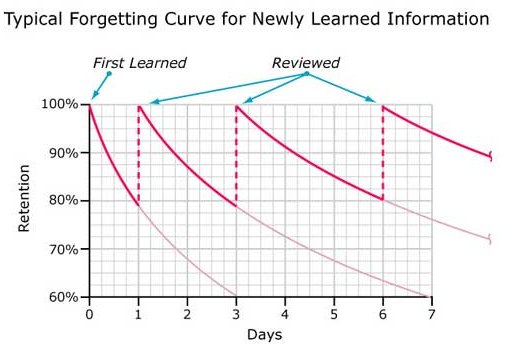

# Today I Learned
### 기억의 활성화, 망각 곡선 이겨내기

 

</img>

* 에빙하우스의 **망각 곡선**은 시간이 지날수록 학습한 내용을 잊어버리는 것에 대한 그래프
* TIL 작성을 통한 기억의 활성화를 이용하여 단기 기억을 장기 기억으로 전환하고 망각의 극복을 이루어낸다.

[namjunemy](https://github.com/namjunemy)님, [박우빈](https://github.com/wbluke)님의 Github TIL을 참조하여, 많은 도움을 받았습니다.

  

## 참고사항

* 강의로 배운 것 이외에도 검색을 통해서 배운 모든 내용을 작성했습니다.
* 추가적인 검색의 비용이 들지 않게 자세하게 작성했습니다.
* 내용이 깊어, 칼럼화 한 내용은 [개발 블로그](https://jae-yoon.tistory.com/)에 작성했습니다.

  

## 목차

### Computer Science

* Computer Architecture
  - [1장 컴퓨터구조 Overview](https://github.com/Shin-Jae-Yoon/TIL/blob/master/Computer%20Science/Computer%20Architecture/01_Computer_Architecture_Overview.md)
* Data structure
* Database
* Operating System

 

### Language

* Python
  - [1장 파이썬에 대한 이해 - Anaconda, Jupyter notebook, Pycharm](https://github.com/Shin-Jae-Yoon/TIL/tree/master/Language/Python/lecture/01_Python_intro.md)
  - [2장 파이썬 데이터 타입, 변수, 그리고 출력](https://github.com/Shin-Jae-Yoon/TIL/tree/master/Language/Python/lecture/02_Python_data_variable_print.md)
  - [3장 파이썬 문자열 자료형 기본](https://github.com/Shin-Jae-Yoon/TIL/tree/master/Language/Python/lecture/03_Python_string.md)
  - [4장 파이썬 리스트 자료형 기본](https://github.com/Shin-Jae-Yoon/TIL/tree/master/Language/Python/lecture/04_Python_list.md)
  - [5장 파이썬 튜플 자료형 기본](https://github.com/Shin-Jae-Yoon/TIL/tree/master/Language/Python/lecture/05_Python_tuple.md)
  - [6장 파이썬 딕셔너리 자료형 기본](ttps://github.com/Shin-Jae-Yoon/TIL/tree/master/Language/Python/lecture/06_Python_dictionary.md)
* Java
* JavaScript
