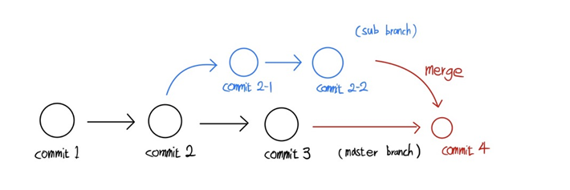
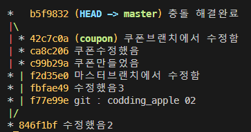
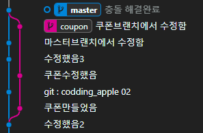
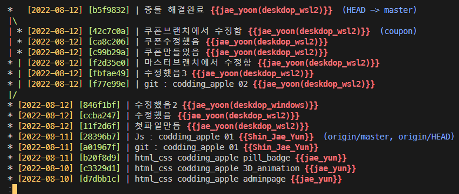
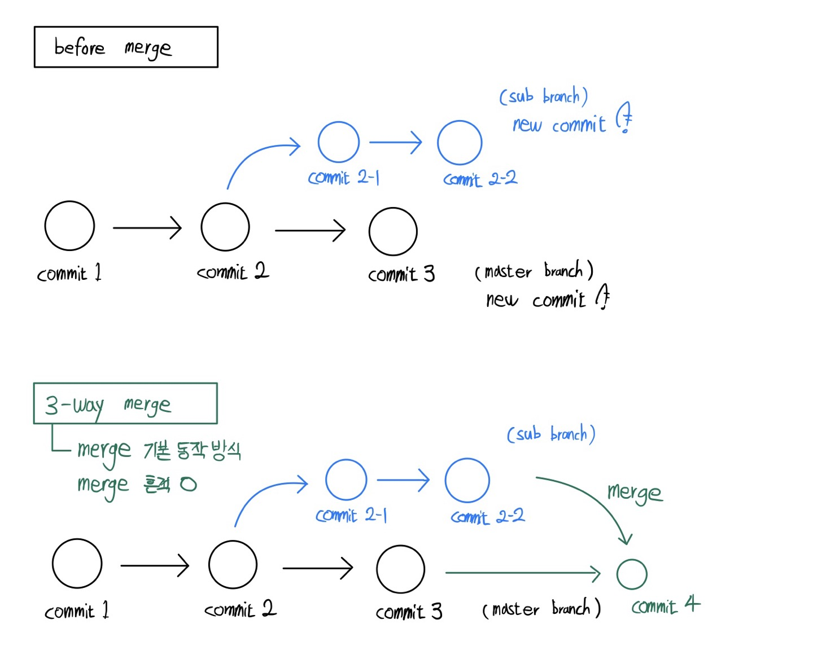
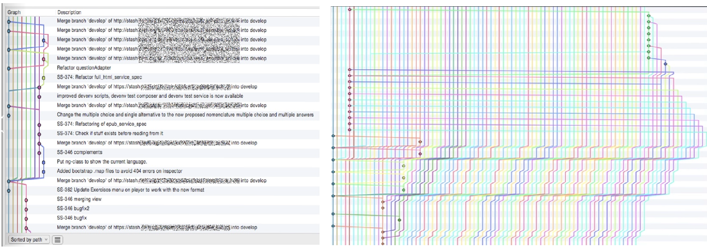
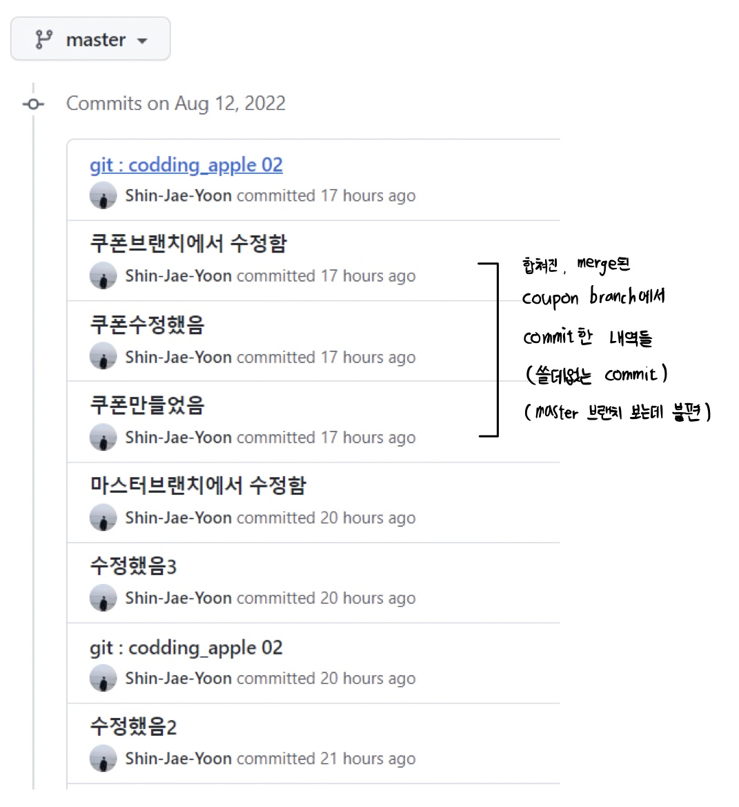
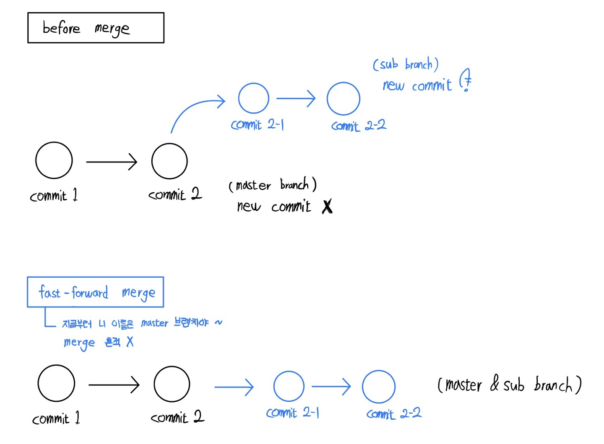
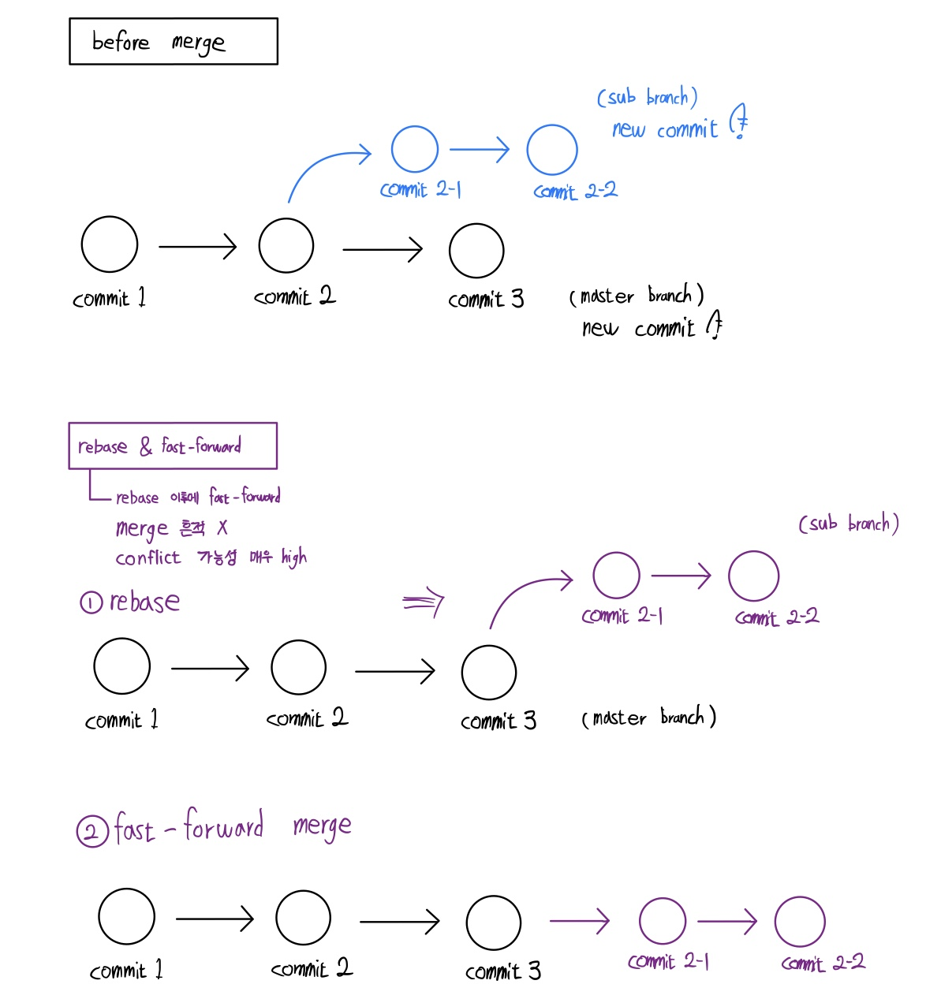
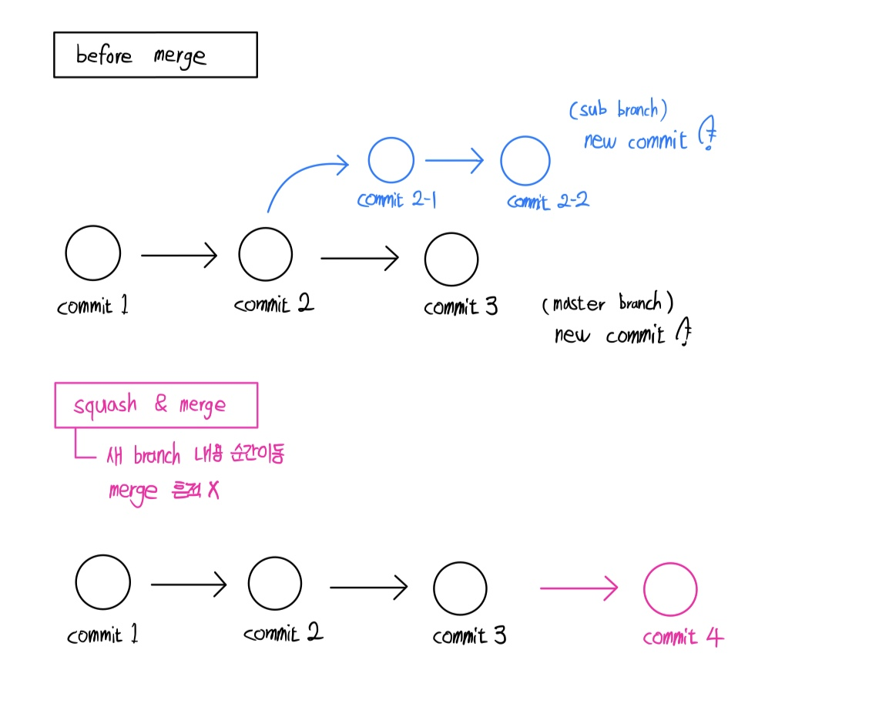

## git 사용법

<br>

### git 설치법 (windows)

<br>

1. 구글에 git windows 검색 후 다운
2. 설치 과정에서 `Use Visual Studio Code as Git's default editor` 체크
3. 설치 과정에서 `Override the default branch` 체크하고 원하는 branch 명
   현재, 깃과 깃허브 기본 브랜치를 **master**로 설정해놨음
4. 설치 과정에서 기본 에디터 체크 안했다면 `git config --global core.editor "code --wait"`

<br>

### git 설치법 (Mac)

<br>

1. 구글에 Homebrew 검색 후 설치
2. 터미널에 `brew install git` 입력 후 깃 설치
3. `git config --global init.defaultBranch master` 기본 브랜치 master로 설정
4. `git config --global core.editor "code --wait"` 기본 에디터 vscode로 설정

<br>

### git 초기 세팅

<br>

```bash
git config --global init.defaultBranch master
git config --global core.editor "code --wait"
git config --global user.email "github 아이디"
git config --global user.name "이름"
git config --global core.autocrlf true   # windows
git config --global core.autocrlf input  # mac
```

<br>

### git init, add, commit, status, log

<br>

<p align="center"></img></p>

```bash
git init                 # 초기 폴더를 git 사용할 수 있게
git add file_name        # 작업 폴더 -> staging area
git commit -m "memo"     # staging area -> repository
git status               # staging area 목록 확인
git log --all --oneline  # commit 내역 한 줄로 조회
```

작업 폴더에서 staging area로 올릴 파일을 고르는 행위를 **스테이징 한다** 라고 함

<br>

### git diff

<br>

-   `git diff` : 최근 commit과 현재 파일의 차이점 보여줌
    -   j, k로 스크롤바 조작 / q로 종료
-   diff가 엔터키 하나, 스페이스바 하나만 했다고 해도 차이점으로 보여주기 때문에 좀 쓰레기 같음
-   `git difftool` : vi 에디터 형태로 비교해서 편하게 보여줌
    -   vi에디터 기본 동작키 h, j, k, l, `:q` 이런거 사용
-   `git difftool 커밋아이디` : 현재 파일과 특정커밋 비교 가능
-   사실 difftool도 쓰레기라... 그냥 vscode로 설정하고 보자
-   vscode extensions에서 git graph 다운받으면

<br>

```bash
git config --global diff.tool vscode
git config --global difftool.vscode.cmd 'code --wait --diff $LOCAL $REMOTE'
git difftool
```

<br>

### VScode 이용한 git 사용

<p align="center"></img></p>

1. 1번 버튼 누르면 사용 가능
2. 플러스 모양 눌러서 `작업폴더 -> staging area`
3. 마이너스 모양 눌러서 `staging area -> 작업폴더`
4. 체크 모양 눌러서 `staging area -> repository`
5. 그래프 모양 눌러서 브랜치 별 커밋 내용들, 각 파일 눌러서 diff 모두 확인 가능

<br>

### git branch

<br>

<p align="center"></img></p>

<br>

```bash
git branch 브랜치명     # 브랜치 생성
git switch 브랜치명     # 브랜치로 이동
git log --all --oneline --graph # branch 그래프 모양도 같이 보기

git merge 브랜치명      # 현재 위치(HEAD)에 브랜치명을 병합
```

<br>

<p align="center"></img></p>

<br>

-   충돌이 났을 때, 어떤 것을 적용할 지 선택하고 꼭 git add, git commit 해주자.
-   merge는 현재 위치(HEAD)에 브랜치를 병합하는 과정이다. 따라서 switch로 브랜치 이동을 꼭 해주고 병합하자.
-   과거에는 checkout을 주로 썼는데, checkout은 만능인 반면 switch는 정말 브랜치 이동만 한다. 무지성 checkout 하는걸 염려해서 브랜치 이동은 `switch`, 스테이징 취소는 `git restore --staged <file>` 명확하게 나눠서 사용하는 추세인 듯 하다.

<br>

<left></left> <right></right>

-   git graph로 보면 시간 순서가 완벽하게 되어있는데, git log는 그래보이진 않음

<br>

```bash
git branch      # 브랜치 목록 확인 (로컬)
git branch -r   # 브랜치 목록 확인 (원격 ex.github)
git branch -a   # 브랜치 목록 확인 (전체)
git branch -d 브랜치명              # 브랜치 삭제 (로컬저장소)
git push origin --delete 브랜치명   # 브랜치 삭제 (원격저장소)
```

```bash
git branch -d 브랜치명  # merge 완료된 브랜치 삭제
git branch -D 브랜치명  # merge 안한 브랜치 삭제
```

<br>

### git hist

<br>

`git hist`는 실제로는 없는 명령어이다. 매번 `git log --all --oneline --graph` 이런식으로 작성하기 귀찮으니까 `alias` 기능으로 만든 것이다. 일종의 커스텀 기능이다. 원래 oneline만 하면 날짜나 누가 커밋했는지는 안나와서, 내가 커스텀 한 것은 아래와 같다.

```bash
git config --global alias.hist "log --graph --all --pretty=format:'%C(yellow)[%ad]%C(reset) %C(green)[%h]%C(reset) | %C(white)%s %C(bold red){{%an}}%C(reset) %C(blue)%d%C(reset)' --date=short"
```

<p align="center"></img></p>

<br>

-   날짜, 커밋명 간단히, 커밋내용, 커밋작성자, 브랜치 다 보인다.
-   보면 git config user name을 수정했었는데, `origin/master`, `orign/HEAD` 저기까지가 깃허브에 git push로 올렸던 커밋들이다. 그 이후 user name을 저렇게 수정했었다. 아직은 push 하지 않은 상태라 브랜치가 coupon, HEAD -> master 이렇게 되어있는 모습이다.
-   vim 환경이기 때문에 j가 아래 방향키, k가 위 방향키로 잘먹는다.

<br> 

### git merge 방법론

<br>

#### 3-way merge

<br>

<p align="center"></img></p>

- 신규 브랜치, merge 하고자 하는 중심 브랜치 각각에 새로운 commit이 있을 때 merge하면 두 브랜치의 코드를 합쳐서 새로운 commit을 자동으로 생성
- 3-way merge 방식은 merge 했다는 흔적이 남게 된다.
- 3-way 방식이 싫은 경우 강제로 [rebase하여 fast-forward 방식](#rebase-and-merge)을 사용하거나 [squash and merge 방식](#squash-and-merge)을 사용한다.

<br>

모든 브랜치를 3-way merge 해버리면 나중에 참사가 일어날 수 있다.

<p align="center"></img></p>

- 3-way merge 되면, 흔적이 남아서 매우 복잡하게 보인다.

<p align="center"></img></p>

- master branch의 git log를 출력해보면 3-way merge 된 branch들의 commit 내역도 다 같이 출력되어서 보기 더럽다. (ex. 깃허브에서 커밋 내역 볼 때)

이러한 참사를 해결하기 위하여 [squash and merge 방식](#squash-and-merge)을 사용하곤 한다.

<br>

#### fast-forward merge

<br>

<p align="center"></img></p>

- 신규 브랜치에만 새로운 commit이 있고 merge 하고자 하는 브랜치에는 새로운 commit이 없는 경우 사용하는 merge 방식
- 그냥 신규 브랜치보고 지금부터 너의 이름은 master 브랜치야! 라고 한다.
- 그래서 merge한 흔적이 남지 않는다.
- fast-forward merge가 싫은 경우 강제로 `git merge --no --ff 브랜치명`으로 강제로 3-way merge 할 수 있다.

<br>

#### rebase and merge

<br>

<p align="center"></img></p>

- rebase는 브랜치의 시작점을 다른 commit으로 옮겨주는 것
- 신규 브랜치, merge 하고자 하는 중심 브랜치 각각에 새로운 commit이 있을 때 신규 브랜치의 시작점을 merge 하고자 하는 중심 브랜치의 가장 최근 commit으로 옮기고 fast-forward 방식으로 merge 한다.
- 3-way merge가 싫을 때 사용할 수 있다.
- 역시나 merge한 흔적이 남지 않는다.
- 단, rebase를 사용했기 때문에 master branch의 새로운 커밋과 **conflict 할 가능성이 매우 높아진다.**

<br>

rebase and merge 사용법

1. rebase 할, 시작점 바꾸고 싶은 브랜치로 이동
2. `git rebase merge할 브랜치명` 
3. 그 다음 이동하여 fast-forward merge

```bash
git switch sub
git rebase master

git switch master
git merge sub
```

<br>

#### squash and merge

<br>

<p align="center"></img></p>

- 3-way merge가 너무 많아서 git log 보기 힘들까봐 주로 사용
- merge 흔적이 남지 않음
- 브랜치에서 만들어놨던 많은 commit을 모두 합쳐서 하나의 commit으로 master 브랜치에 생성해줌

<br>

squash and merge 사용법

```bash
git switch master
git merge --squash 브랜치명
git commit -m "메세지"
```

<br>

#### 그래서 어떤 방식으로 merge?

<br>

- 프로젝트 마다, 팀마다 branching/merge 가이드가 존재
- 예를 들어, 안중요한 잔챙이 브랜치는 **squash**하세요.
- feature/develop 브랜치는 **3-way merge**하세요.
- 혼자서 할 때는 대충 쓰세요.